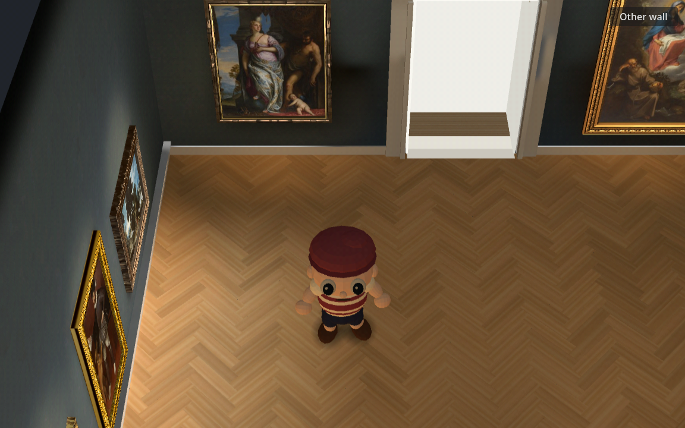

# Broader parquet material sampling

**Selected:** shader-only commit `3b63602`, based on integrated prototype `a2ccb4c`. The room keeps its original herringbone geometry, warm baked light and Muse source texture. Each modeled plank now samples a narrower vertical texture span, reducing the several painted board bands that were compressed into one plank. Independent blind review preferred this result at both embedded sizes.

| Control | Selected broader sampling |
|---|---|
|  |  |

See the actual embedded [1600 control](browser/control-1600-warm.png) / [candidate](browser/broad-1600-warm.png), [720 control](browser/control-720-warm.png) / [candidate](browser/broad-720-warm.png), and matched [control motion](browser/control-720-warm.webm) / [candidate motion](browser/broad-720-warm.webm).

## One bounded change

The existing 2048×1024 oak source contains many horizontal wood/board bands. Each physical plank is 0.84×0.18m and maps one full source length and one third of its height. The selected material maps `v` to `.5+(v-.5)*.25`: each plank spans 1/12 of the source height, using its central quarter. This broadens the painted pattern fourfold across the plank while preserving its horizontal sampling. It reduces source-region variety and some fine grain; the independent reviewer noticed slight blockiness at 1600 but no loss of useful material detail.

The shader retains the same 60% grain mix, ground tone, one texture sample, 2× derivative footprint, original COLOR shading, matte response and doorway clipping. Mipmap derivatives are taken from the remapped UVs. No source pixels, generated textures, lightmaps, probes, geometry, camera, character, animation or display filter were edited. [Preserved hashes](preserved.json) verify the important unchanged files. Runtime Light3D count remains zero.

The only production change is `oak.gdshader`. Isolated diagnostic/tooling commit `2e4dbac` adds the comparison command and capture programs; **it is not required for the production change and should not be cherry-picked with it**. The A/B export was `a2ccb4c-dirty`; final normal-page export uses the same shader with selected uniform default 0.25 instead of 1.0. The A/B commands explicitly selected both values.

## Independent visual decision

The [Astra verdict](blind-review.md) was sealed before the [key](blind-key.json) was read: **Y**, which decodes to B/broad sampling; X is A/control. The reviewer preferred Y in warm and art views at both 1600/720. It preserved the warm pool and shadow transition, quieted dense internal stripes, and gave paintings more visual priority. Entry showed a smaller gain. The verdict explicitly covers still images, not continuous playback or temporal certification.

## Movement and performance

The actual Chrome capture used `ANGLE (Microsoft Corporation, D3D12 (NVIDIA GeForce RTX 4070 SUPER), OpenGL ES 3.1)`, with software-renderer rejection enabled. All 12 recordings completed 480 simulation ticks; every one of 479 common recorded ticks has identical camera, position, room and visitor phase/time/yaw/bone-pose hash between variants. The real viewport material and its uniform were read back. All 23 paintings remained in the scene. [Summary](browser-summary.json), [compressed full traces](browser-traces.json.gz), [browser log](browser.log).

Four held floor masks have zero changed pixels. Some full held gallery crops contain 2–3 changed character-edge pixels, including control captures; those are recorded rather than counted as stable floor. The material has no time function or changing UV offset.

A separate native Compatibility run rendered 34 frames of walking with two fixed world-space floor patches. Actual Camera3D projections register the patches back to frame 0; no feature fitting or shader arithmetic supplies the result. Both patches were visually checked as unobstructed floor, and invalid screen-edge samples are excluded. The final displayed RGB residual includes raster sampling, quantization and bilinear registration, so zero is not expected:

| Fixed-world patch | Control mean absolute RGB-byte error | Broad sampling |
|---|---:|---:|
| Left, lit floor |1.010|0.981|
| Right floor |1.138|1.114|

Camera/position match exactly across all 17 frames per mode. The candidate adds no registered drift relative to the control. [All frames/projections](motion/projection.json), [registration measurements](motion/registered-summary.json), [native motion log](motion.log). Sampled actual 720 browser walking frames also show coherent plank travel without an obvious new ripple. This is bounded moving-surface evidence, **not a claim that every possible camera motion or fine perceptual flicker has been certified**.

Godot post-draw intervals during instrumented browser recording:

| Size / scene | Control median / p95 ms | Broad median / p95 ms |
|---|---:|---:|
|1600 entry|24.70 /30.23|24.80 /29.21|
|1600 warm|25.10 /30.31|24.30 /28.70|
|1600 art|20.40 /26.41|20.90 /27.41|
|720 entry|18.50 /21.41|17.20 /19.62|
|720 warm|18.50 /22.20|18.30 /21.51|
|720 art|18.20 /21.11|18.30 /21.00|

The maximum p95 increase is 3.79%, below the 10% comparison gate. These are Godot post-draw intervals during QA/video recording, not GPU times. They do not establish an optimization.

The final **normal page without QA** passed all six Chrome interaction checks: entrance, drag/no accidental pick, both horizontal-wheel directions, both wall directions, camera and lighting controls. Standing/walking/turning browser rAF median was 16.7 ms, p95 16.7–16.8 ms. This is a separate measurement from Godot recording times. [Result](production.json), [log](production.log), [1600 screenshot](production-1600.png), [720 screenshot](production-720.png). Hardware is the verified RTX path, not a Mac M3 certification.

## Functional checks and reproduction

`scripts/check.sh` passed ([log](check.log)); `git diff --check` passed. Existing navigation and artwork harnesses ran with the candidate uniform default overridden **in memory** before their ordinary logic, without changing their assertions: [navigation 0 failures](navigation.log), [23/23 artworks and 0 failures](artworks.log). The override is equivalent to the subsequently selected shader default. Native sample reported one floor material user, 23 paintings and 0 runtime lights ([log](native.log)). Logs retain the existing arrow-cursor metadata, unsupported 2D-MSAA, favicon 404 and ObjectDB shutdown diagnostics.

To reproduce the isolated experiment, use branch `Reid-Surmeier/gallery-floor-frequency` at diagnostic commit `2e4dbac` (the production shader-only tree intentionally omits these research commands):

```bash
source /home/reidsurmeier/promo-lab/gpu-env.sh
godot --rendering-method gl_compatibility --path . --script res://modules/shell/prototype/gallery_walk4/floor_motion_shot.gd
python3 scripts/gallery-floor-register.py /tmp/gallery-floor-motion
scripts/export-web.sh
PRODUCER_BROWSER_GPU_MODE=hardware node scripts/gallery-floor-compare.cjs EXPORTED_URL /tmp/gallery-floor-browser control,broad
```

The motion script uses the host's existing OpenCV and NumPy for registration. Full raw browser media were `/tmp/gallery-floor-browser` during this session; selected recordings and all compressed traces are preserved here. [SHA-256 manifest](sha256.json). No paid generation occurred.
