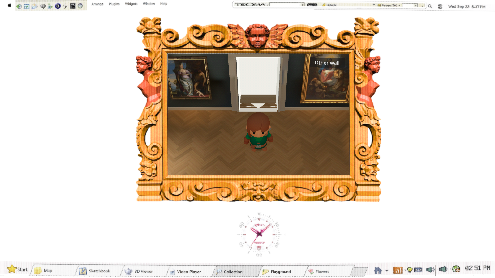
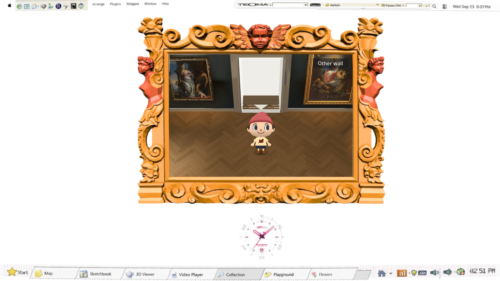
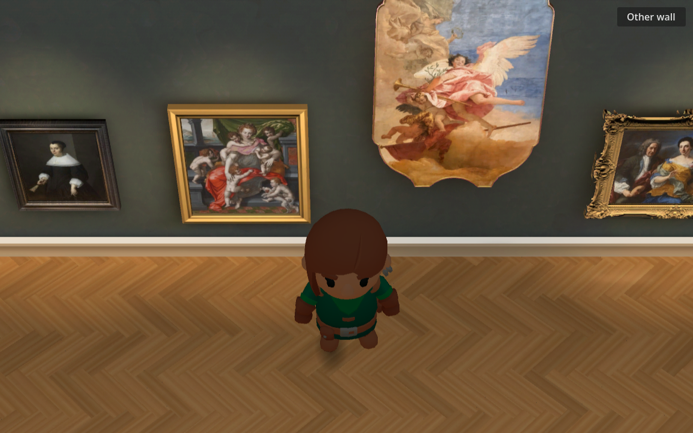
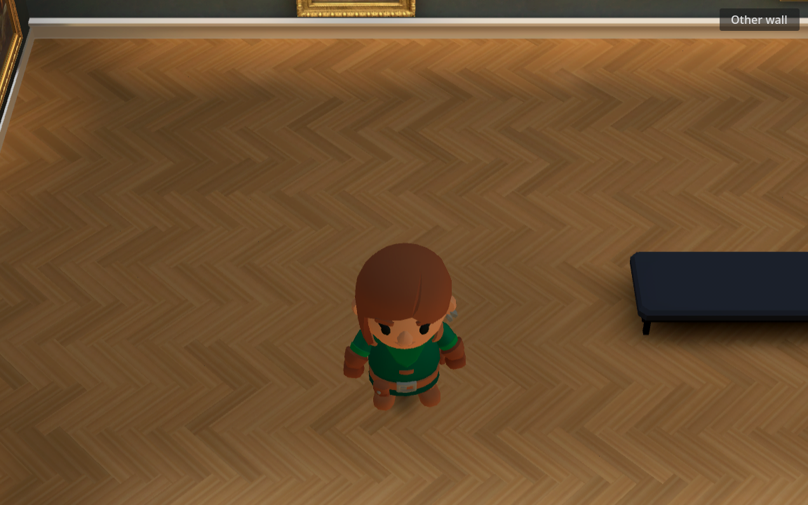
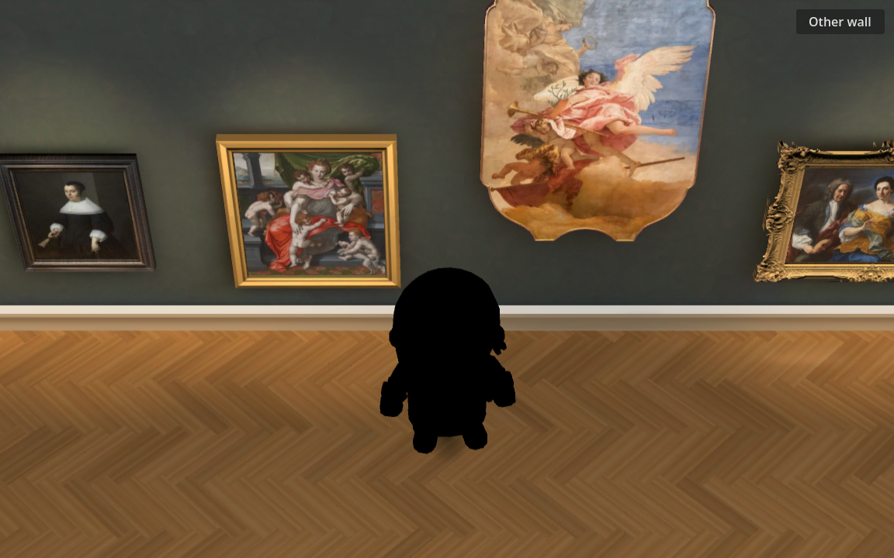
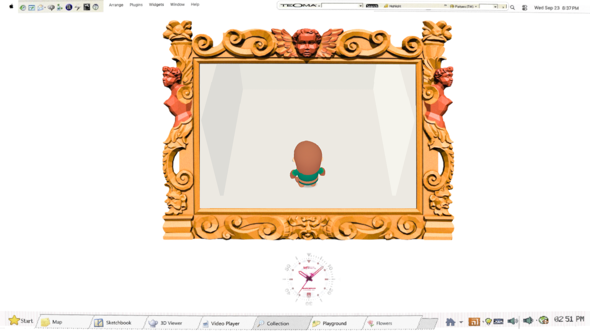
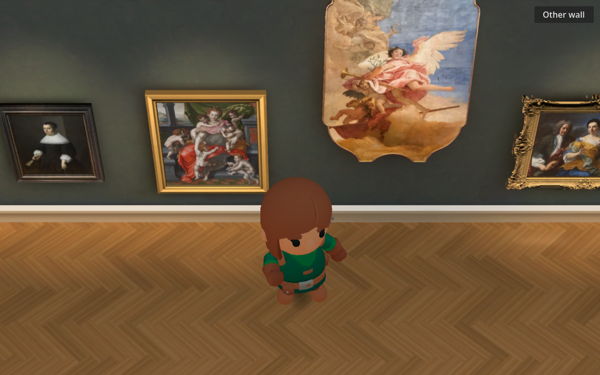
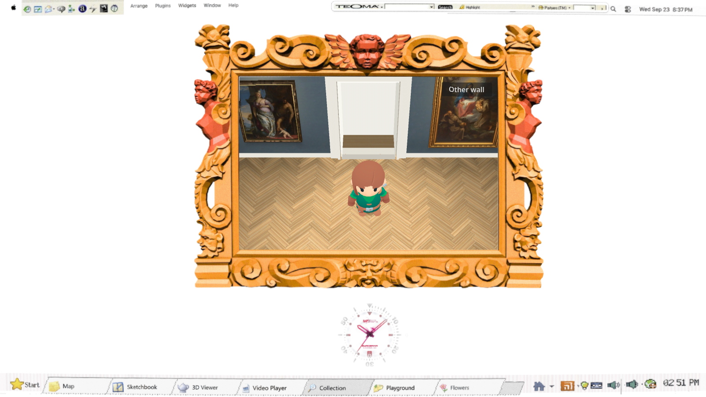

# Grounded 3D visitor — #139

The visitor is now a real lit, skinned mesh with world-space foot contact and continuous rotation. This is a motion/lighting prototype, not the finished Animal Crossing-inspired character identity. KayKit Rogue has a green tunic, brown hair, belt and boots; its face, head shape and outfit differ substantially from the red-cap reference. No generation or new spend.





## Lighting and grounding








The actual Compatibility renderer samples different indirect light as the mesh moves. One fixed head sample was RGB (0.2471, 0.1137, 0.0588) at raw exposure, (0.4157, 0.2039, 0.1176) with the chosen albedo gain of 1.6, and (0.3529, 0.1569, 0.0667) at the other location. Disabling GI makes that sample black. The filename `cool` labels a comparison position; it does not imply a calibrated color temperature. The gain preserves spatial response but is an art-direction adjustment. Probes supply indirect illumination; direct lamp pools and real-time shadows are not reconstructed. White navigation rooms use a separate offline probe field; gallery capture is disabled there.



World-space stance drift stays below 0.000001 units through straight/diagonal walking, reversal, 24 stopping phases and an idle 180-degree pivot. The independently skinned boot vertices penetrate at most 0.00480 units (4.8 mm), below the 0.01 acceptance limit. A copied-source negative control disabling only the contact solver fails with 0.335-unit pivot drift and 0.144-unit penetration; no production test switch was added. Old sprite comparison has no Skeleton3D, while the derivative has 41 bones and three native clips. Decorative floor and threshold top faces are flush with the y=0 walking plane in white test rooms.

At stable initial browser idle, manually identified image bounds give approximately 32.1% character height and 80.4% sole baseline, versus the house reference's 32.9% and 80.4%. These are screenshot estimates, approximately ±1 pixel. The isolated native side-facing idle pose measures 33.19% height and 81.25% baseline; orientation and stance change the silhouette. The visible body remains on the ground while its navigation anchor sits 0.18 units forward of its footprint.




The supplied Interact clip moves the upper body and hand; it is not an exact greeting-wave recreation. Head turning is bone-driven and motion cancels gestures. Stationary turns step in place rather than dragging two locked idle feet. Footstep cues fire on contact; blocked idle emits none. The `lighting=original` comparison disables the gallery capture and supplies neutral environment ambient energy 0.6 so the real mesh remains visible. That control is a flat ambient comparison, not position-dependent room lighting; baked mode retains zero ambient so the probe-disabled negative control remains meaningful. Original sprite routes remain `?character=sprite` and `?character=original`.



## Reproduction and evidence

From the candidate worktree, with the host's RTX environment:

```bash
source /home/reidsurmeier/promo-lab/gpu-env.sh
scripts/check.sh
scripts/check-gallery.sh /tmp/gallery-rig-final-clean
scripts/export-web.sh
node scripts/gallery-browser-check.cjs <served-build-url> candidate-rig /tmp/baseline-final.json
node modules/shell/prototype/gallery_walk4/rig/browser_check.cjs <served-build-url> /tmp/gallery-rig-browser
```

`native-check.log` records the full Compatibility suite: real geometry contact, probe negative control, both white-room round trips, all 23 artwork targets, input/cancellation, camera variants, and 300 navigation fuzz walks. `browser.json` records actual exported controls and portal transitions. `motion.webm` captures actual browser input transitions; no synthesized frames. The author inspected 20 gallery crops at 4 fps and the native fixed-pose captures; those samples show continuous volumetric turns without an obvious hover or abrupt body flip, but do not certify every frame or footstep sound. Independent blind visual review follows integration. `frame-budget.json` records Chrome RTX 4070 SUPER frame pacing. The older core browser baseline is runtime 84604cb; the closer cold-load control is exported runtime 670e820 in the cde21b9-era source tree, not a literal cde21b9 export.

The trimmed CC0 derivative is 364,020 bytes, 4,263 triangles, one mesh/material, 41 bones, three clips. Two Blender 4.0.2 executions produced identical bytes. [Source and hashes](../../../modules/shell/prototype/gallery_walk4/rig/SOURCE.md) and the included CC0 license retain original provenance. Museum art and generated sprite provenance remain intact.

The full application's transferred bytes were 160,001,150 versus 159,697,296 in the 670e820 control, an increase of 303,854 bytes (0.19%). Cache-disabled local-browser game-shown was 15.12 seconds (15.56 seconds before the white-floor correction) versus 15.92–16.21 seconds in two prior control runs; these are individual local measurements, not an internet-load guarantee or a statistically established speed improvement. Frame medians are 16.7 ms for standing/walking/turning; p95 is 16.8/16.7/16.7 ms. This branch does not include the sibling pack-pruning or display work.

## Limits and audit

The source identity and indirect-only lamp response remain open visual work. No claim of exact Animal Crossing likeness, console rendering, physical trackpad validation, or final human acceptance. Native source checks and actual browser input cover different failure modes. The dedicated rig test examines skinned vertices rather than sprite-frame changes; the disabled solver and disabled probes are meaningful negative controls. Browser logs still contain the pre-existing `arrow_cursor` missing-meta messages, 2D-MSAA warning and favicon 404, also present in the old baseline; no new rig script/runtime error was observed. After the full native/browser run, the original-lighting UI fallback received its own native pixel assertion and actual Chrome route screenshot. Default baked lighting was unchanged. Sound contact timing is structurally checked; no listening certification is claimed.
