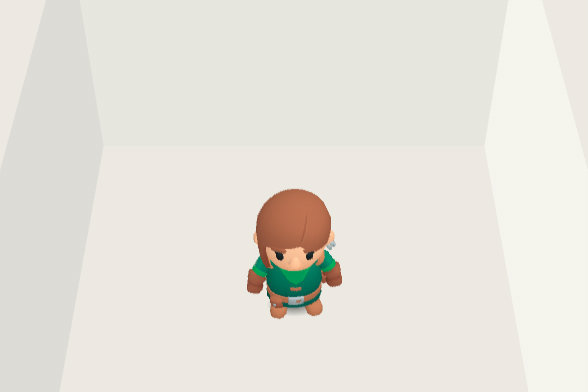
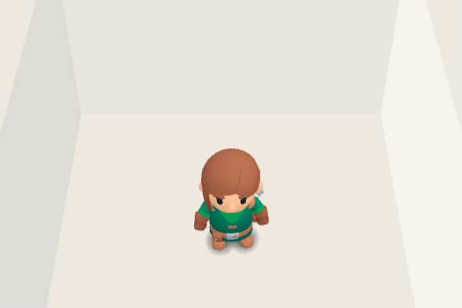
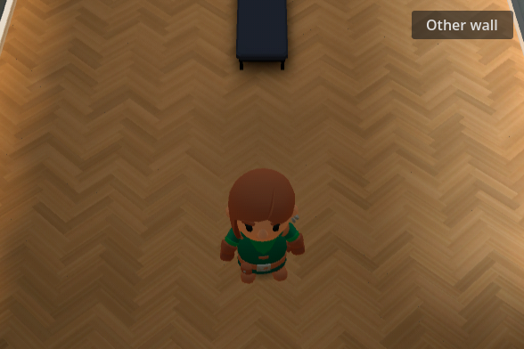
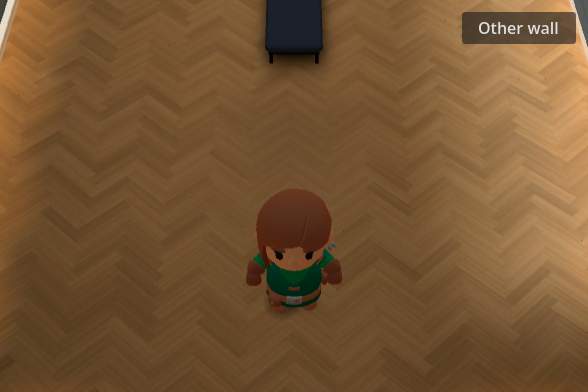
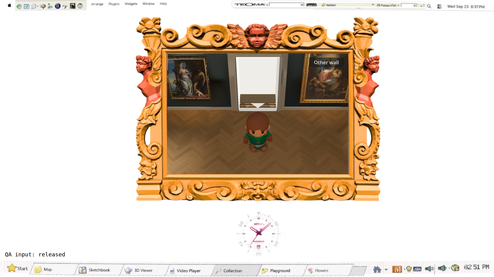
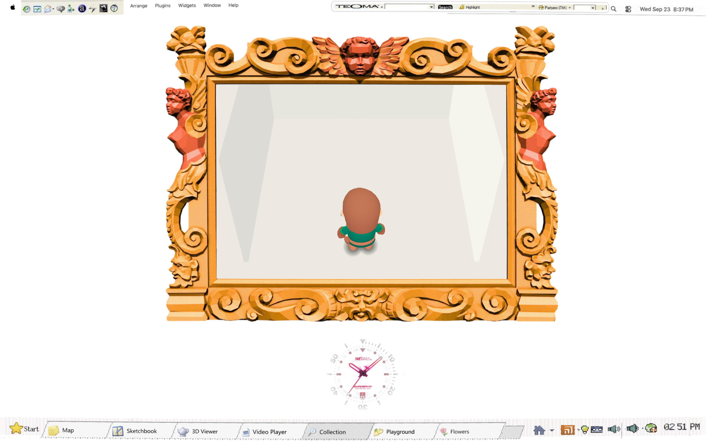

# Sole contact refinement — #139

The two supporting boot contacts are more legible at the embedded viewer size. Each soft patch follows the actual posed sole in world space and stays on the floor. A planted foot receives the stronger patch; the raised foot's patch is weaker and fades further with height. The diffuse body patch is weaker and centered between the soles. This adds two unshaded floor quads, with no Light3D or real-time shadow map. Camera, avatar geometry, materials and contact solver are unchanged.

White-room comparison at the actual 588 × 392 embedded scene size:





The prior shadow is reconstructed only inside the review harness using its original gradient opacity and footprint position, with the new foot patches hidden. Both images use the same pose, camera and room. On parquet, the change deliberately stays subtler:






## Verification

`rig/contact_check.gd` renders front, side, back, stride and white-room poses at 1152 × 720 and 588 × 392. It measures visible floor darkening adjacent to the actual planted soles, with all shadows hidden as the pixel control. Neutral views must improve over the previous body-only cue; the stride must retain its visible support. A physically occluded rear sole in a side view is not required to be visible through the nearer boot. Displacing the contact patches one metre produces zero adjacent contact pixels and fails the visibility criterion. This protects a visible sole/floor relationship, rather than merely checking node positions or opacity constants.

The embedded stride had 11 readable adjacent pixels versus 10 previously; neutral views improved more. White idle measured 64 versus 53 summed adjacent pixels; back idle measured 137 versus 38. These are renderer-specific backstops, not a replacement for looking at the result. `contact-check.log` records all cases; failures: 0. Existing independent skinned-vertex grounding checks still pass: maximum boot penetration 0.00480 units, maximum planted drift below 0.000001 units. Repository baseline and diff checks pass.

Actual Chrome controls were recorded at browser sizes 1600 × 900 and 2880 × 1800, with straight walking, key changes through a turn, release/stop, and entry into the white room. The larger browser presents the gallery at approximately native review size; the small browser uses the embedded scene. A QA-only DOM label records received key-down/key-up in the recordings; it is not part of the application. `browser.json` records both runs and the pre-existing missing-cursor/MSAA/favicon messages; no new script error was observed.

The author inspected the stills and 36 foot crops at 12 fps from each browser recording. Support patches remain on the floor, are darker beneath planted feet, and do not form an obvious detached second shadow under a lifted boot in those samples. This is sampled visual inspection, not every-frame or sound certification. The camera still hides some of the far-side foot and face; that separate blind-review limitation remains pending the final identity review.





Recordings: [embedded](embedded-motion.webm), [larger](large-motion.webm).

```bash
source /home/reidsurmeier/promo-lab/gpu-env.sh
godot --rendering-method gl_compatibility --path . --script res://modules/shell/prototype/gallery_walk4/rig/contact_check.gd -- --out-dir=/tmp/gallery-contact
godot --headless --rendering-method gl_compatibility --path . --script res://modules/shell/prototype/gallery_walk4/rig/check.gd
node modules/shell/prototype/gallery_walk4/rig/contact_browser_check.cjs <served-build-url> /tmp/gallery-contact-browser
scripts/check.sh
```

The contact check is included in `scripts/check-gallery.sh`. No asset generation or spend. This refinement addresses the contact-readability finding; it does not certify final character likeness, camera presentation or exact reference matching.
