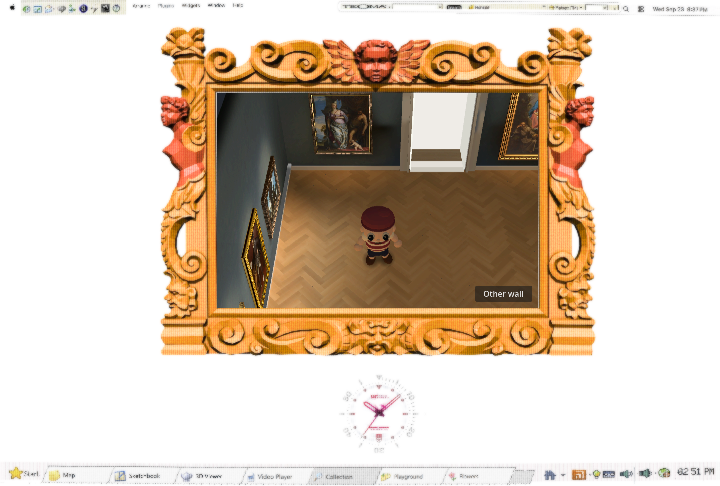
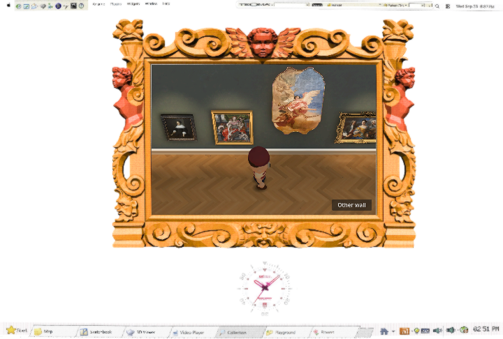
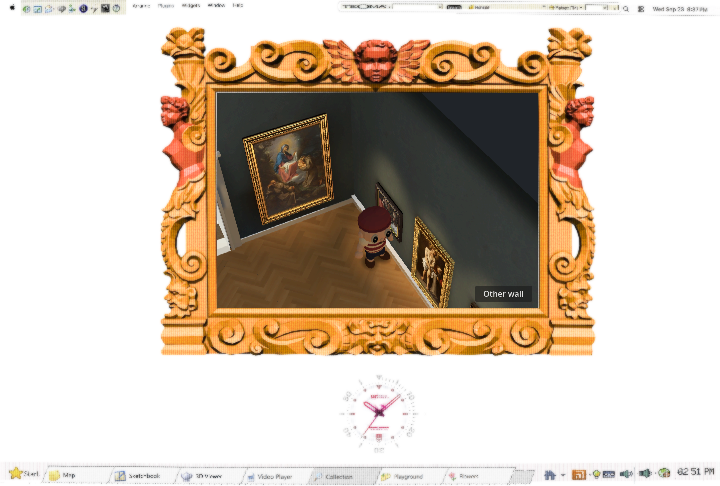
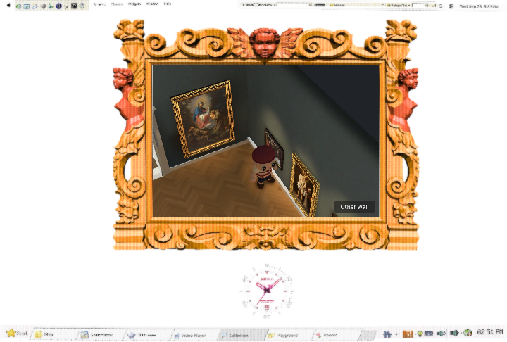
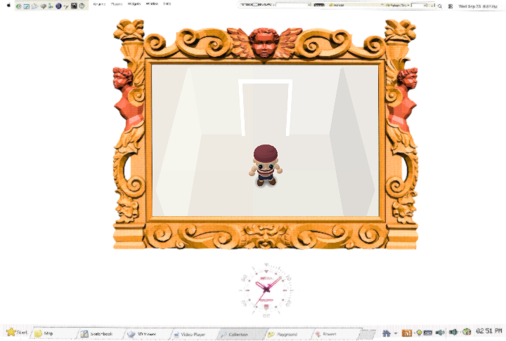

# Gallery wall albedo — rejected trial

Baseline `105551c`; isolated branch `Reid-Surmeier/gallery-cutaway-triangle`. No production material change has been made. The independent blind reviewer selected **NONE**: the measured wall lift did not deliver a meaningful visual improvement at720px. Retain the current material; no further brightness iteration was performed. This evidence-only experiment tests one neutral albedo multiplier on the existing baked gallery walls.

## Cause and intervention

`walk4.gd::_wall_ps()` assigns the generated `wall-muse.webp` texture at one repeat per four metres, with white material tint. `_build_room()`, `_arch_end()` and `_far_end()` create the wall surfaces. `_partition_surfaces()` and `_merge_static()` retain their cutaway layers. Offline `bake/prepare.gd` converts those shader materials to StandardMaterial3D, preserving texture/UV scale; it strips the old procedural vertex-light multiplier on non-floor surfaces. The runtime loads those materials and the existing LightmapGI bake from `baked/room.tscn`.

The wall image itself is dark: average source sRGB bytes **89.45/102.12/112.51**, range **81–98 / 93–110 / 102–123**. Its mean standard-sRGB-decoded linear reflectance is approximately **.101/.133/.164**. That reflectance multiplies the room's baked irradiance. This explains why even the lit walls remain much darker than the oak floor. It does not establish that the bake is wrong or that a brighter wall is automatically better.

The single candidate changes only the four gallery wall material instances whose texture path ends in `/textures/wall-muse.webp`, from white albedo multiplier to **Color(1.12,1.12,1.12)**. With standard sRGB decoding that is nominally a **1.295× linear factor**; the maximum texture-times-factor diffuse value is **.257**, below1. The source pixels, texture filtering/UVs, lightmap, probes, artwork, trims, floor, visitor, camera and background are unchanged. This is a post-bake material look-development trial; it does not recompute indirect bounces.

Source texture SHA256: `f3191776008e78ab6a3306fa164bf10b91af1a4ed43a2ac621e1cc95f8b68f36`.

## Actual 720-pixel comparisons

| Pose | Control | Candidate |
| --- | --- | --- |
| Warm |  |  |
| Art |  |  |
| Corner |  |  |
| White |  |  |

Both sides use the same camera/pose on the actual Compatibility renderer (RTX4070SUPER via D3D12). The wall light gradients and local warm pools remain. The apparent lift is modest. Representative rendered wall samples change from RGB57/60/57 to64/68/64 in the warm pose, and59/61/56 to67/68/64 in the art pose. The existing exposed-background corner remains; this change does not fix that separate camera composition problem.

The white-room full-RGB images have **zero differing pixels**. Logs record four affected wall meshes, identical camera transforms and zero runtime Light3D nodes. No claim is made about motion, browser delivery, exact Nintendo appearance or frame-time improvement from these native stills.

## Cost and reproducibility

Paid cost: **$0**. No generated assets, texture bytes, geometry or shader passes were added. The proposed material value would not add draw calls or texture samples; this is a structural inference, not a measured frame-time result. Diagnostic material duplication exists only in the evidence harness. No native/API acceptance tests were modified.

```bash
source /home/reidsurmeier/promo-lab/gpu-env.sh
godot --rendering-method gl_compatibility --path . --script res://docs/evidence/gallery-wall-albedo/trial.gd
```

The harness writes `/tmp/gallery-wall-albedo`. The anonymous review packet was prepared from these exact images. After the verdict was sealed, the key was opened: **X=candidate lift, Y=current control**. See [the preserved blind chat verdict](blind-review.md) and [key](blind-key.json). The candidate failed this visual gate, so no production edit, bake-authoring change, browser/motion benchmark or integration was performed. `git diff --check` passes.
