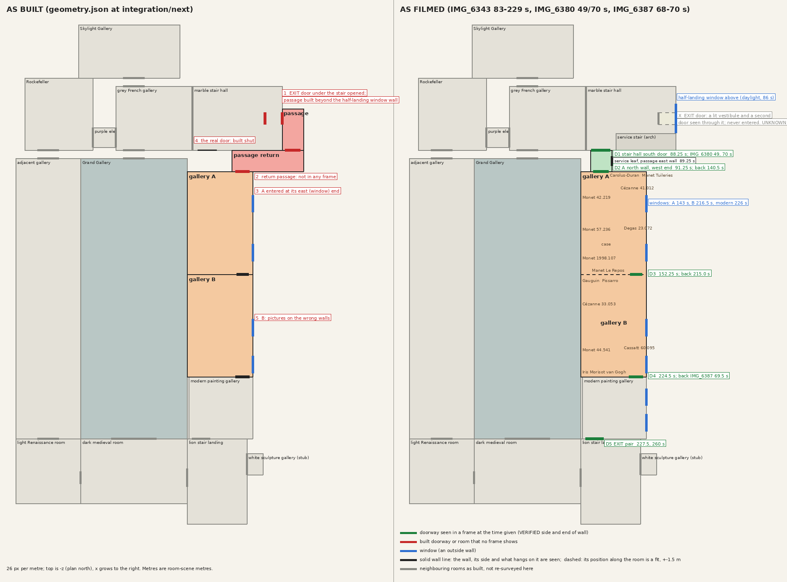
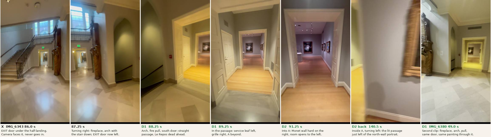
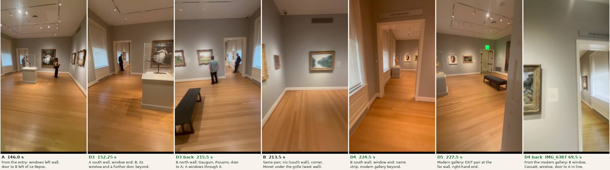

# Impressionist rooms: the plan as filmed against the plan as built

Research only, 8 October 2026, branch `research/impressionist-plan` off `integration/next` at `8ee6f25a`. No game source is changed here. The owner wrote after playing the build: "you made a major artheciiual mishap with the floorplan and the impressionist room placment. look back at that."

## The answer

The build enters the Impressionist rooms through the wrong door.

- **Filmed:** the visitor comes through the columns into the marble stair hall, turns right, and goes through the cased doorway in the hall's **south** wall, beside the fire alarm pull and the arch with the stair going down. A short straight passage leads into gallery A with Manet's *Le Repos* dead ahead.
- **Built:** the **EXIT door under the stair's half-landing** was opened instead. A passage was added beyond the half-landing's window wall, then a second "return" passage to bring the visitor back west into gallery A. Neither passage is in any frame. The real doorway is still built shut (`PassageDoorClosed` in `marble_hall_additions.gd`).

Galleries A and B themselves are on the correct side of the correct neighbours, the right way round, with their windows on the correct wall. Two further things are wrong inside them: A's entry is at the wrong end of its north wall, and B's pictures are on the wrong walls.

Top of the picture is plan -z, 26 px per metre, the scale and orientation of the orchestrator's `plan-as-built.png`. Redraw with `python3 docs/evidence/impressionist-plan/plan.py`.

## What I watched

| Clip | How much | What it gives |
| --- | --- | --- |
| `IMG_6343.MOV` (SDR) | All 264 s at 1 fps; 83–92.75, 127–133.5, 139.5–146, 150.5–153.75, 174–180.5, 211.5–218, 222.5–229 s at 2–4 fps | The only clip that walks the route: grey gallery, stair hall, passage, A, B, modern gallery |
| `IMG_6380` survey frames | 49.0, 70.0, 71.0, 73.5 s upright; contact sheets | The stair hall's south door from the stair hall, with the gallery beyond |
| `IMG_6387` survey frames | 51.0, 68.0, 69.0, 69.5 s upright; contact sheets | The modern gallery's north door looking back into B |
| `IMG_6381` survey frames | 1.5, 90.5 s upright; contact sheets | Stair hall from the west and from the stair |
| `IMG_6344.MOV` | 3 of 8 one-per-second sheets | Lion landing, medieval room, Main Hall long walls |
| `IMG_6378`, `6379`, `6382`–`6386` | Not re-watched | Per `docs/playtest/census-2026-10-08-rooms.md` these are the auditorium, the Skylight Gallery, the medieval and Renaissance rooms and the adjacent gallery. INFERRED that none shows the Impressionist rooms |

Times are seconds in the named clip. Frames were pulled with ffmpeg into the session scratchpad; only the two sheets and the plan in this folder are committed. Footage is reference only.

## The route, doorway by doorway

| Door | Time | Turn before | Seen through it before crossing | Turn after | Looking back |
| --- | --- | --- | --- | --- | --- |
| **X** EXIT door under the half-landing, stair hall east | faced at 84.5–86.5 s, **not crossed** | none; the camera walks east from the columns | A yellow-lit vestibule about one door deep, then a second opening with a dark glazed leaf | The camera turns right, away from it | Not filmed |
| **D1** stair hall south wall → passage | 88.25–89.5 s | One continuous right turn of about 90°, 86.5–88.25 s: EXIT door, fireplace (RISD 83.152), olive arch with a handrail going down, red fire pull, white cased doorway | Grey stone sill, oak floor, a white six-panel leaf on the left wall, a second cased doorway, *Le Repos* centred at the far end, three Monets edge-on at the right, a case at the left | None; straight on | Not filmed from the passage. `IMG_6380` 49.0 and 70.0 s show the same doorway from the hall with the gallery beyond |
| **D2** passage → A, north wall, west end | 91.0–91.75 s | None | As D1; panelled leaves folded into both reveals | Slight right to the Monet wall (92–96 s), then one left turn round the whole room, 96–141 s | 140.5 s from inside A: the lit passage and its low grille, immediately left of the north-wall portrait; 141.0 s: the first Monet on the west wall |
| **D3** A south wall, east end → B north wall, east end | crossed between 155 and 176 s with the camera pointed at the floor | At 164–175 s a panelled window apron and floor grille pass beside the feet | 152.25 s: door at the corner beside A's second window; B's window and a further doorway beyond, in line | Not seen. First frame in B is 177 s, facing its north-west corner | 215.5 s from B: Gauguin, Pissarro, then the door in the same wall at its east end, with A's two windows and the Degas through it |
| **D4** B south wall, east end → modern gallery north wall, east end | 224.5–226.5 s | Right pan along B's window wall: window, Cassatt, window (216.5–223.5 s) | Name strip above the casing (reads approximately "JEAN DI BONA GALLERY", not sharp); window on the left wall; gilt figure in a case on the left; oval painting, still life and an EXIT pair on the far wall | Right pan of about 60° to the large painting on the west wall (227–229 s) | `IMG_6387` 68–69.5 s from the modern gallery: B's window, Cassatt, window and the door to A on one line |
| **D5** modern gallery south wall, west end | 227.5, 240, 260–263 s, not crossed | — | Double fire doors with push bars and an exit sign; at 260–263 s open, a grey stone floor and more white doors | — | The clip ends at 263 s |

D3's crossing itself is INFERRED from the frames either side of it. Everything else in the table is VERIFIED from frames.

## Fixed anchors

1. **Windows.** A: two, on the left wall as you enter (143, 149–151 s). B: two, same side (216.5–218 s). Modern gallery: same side again (226 s; `IMG_6387` 51.0 s). One straight outside wall runs past all three rooms, and D3 and D4 are both at the window end of their walls, so the three rooms form a line with the doors in a row along the windows. VERIFIED.
2. **Stair hall half-landing window.** Three lights with a brick building outside, above the EXIT door (85–87 s). The built passage runs outside this wall at floor level.
3. **Service stair.** Behind the olive arch, going down (87.25 s; `IMG_6380` 73.5 s). It lies between the fireplace and the south doorway. The passage's left-hand service leaf (89.25 s) is on the wall toward it.
4. **Exit signs.** Over the EXIT door under the half-landing (86.0 s) and over the modern gallery's fire doors (227.5 s). None over D1–D4.
5. **Seen from two rooms.** *Le Repos* from the stair hall (88.25 s; `IMG_6380` 49.0 s) and in A (115 s). A's windows from B through D3 (215.5 s). B's Cassatt from the modern gallery through D4 (`IMG_6387` 69.5 s).
6. **No lift** appears between the stair hall and the modern gallery.

## Differences, worst first

| # | As built | As filmed | Status |
| --- | --- | --- | --- |
| 1 | The route leaves the stair hall by the EXIT door under the half-landing (`marble stair hall` `openings.east [-2.51, -1.41]`, x 17.85 and 19.45) | It leaves by the cased doorway in the **south** wall next to the columns. The EXIT door is a different door, faced and not entered | **VERIFIED** (6343 83.0–89.75 s continuous; 6380 49.0, 70.0 s) |
| 2 | `Impressionist passage` [19.45, 21.45, -2.86, 1.04]: 2 m wide, 3.9 m long, beyond the half-landing window wall | Nothing filmed there. Through the EXIT door there is a small lit vestibule and a second door | Passage not in footage: **VERIFIED**. What is really there: **UNKNOWN** |
| 3 | `Impressionist passage return` [14.75, 21.45, 1.04, 3.04]: 6.7 m of corridor running back west, with the service leaf and grilles moved onto it | Does not exist. The passage is straight, about 2 m long and about 2 m wide, and *Le Repos* is visible from the stair hall through both doorways | **VERIFIED**. The first agent's own record marks it `passage_elbow_inferred: true` |
| 4 | The real doorway is built shut: `PassageDoorClosed`, centre x 12.43 on z 1.04 | Open, leaves folded into the reveal, grey stone sill | **VERIFIED** |
| 5 | A's entry is at the **east** (window) end of its north wall, `openings.north [15.10, 16.40]` | At the **west** end, next to the Monet wall. From east to west the north wall reads: corner, Manet *Tuileries*, Carolus-Duran portrait, door, corner | **VERIFIED** (91.25–92.75, 135–141 s) |
| 6 | B's pictures (bare positions in `WORKS-NEEDED.md`, and Monet 44.541 hung): west = Pissarro, Gauguin; south = Cézanne 33.053, Monet 44.541; east = iris, Morisot, van Gogh, Cassatt | North = Gauguin, Pissarro, door. West = Cézanne 33.053, Monet 44.541 under the long grille. South = iris, Morisot, van Gogh, door. East = window, Cassatt, window, nothing else | **VERIFIED** (one unbroken right pan, 211.5–218 s; 213.5 and 215.5 s) |
| 7 | Passage, A and B fitted to a 24.26 m run with `longitudinal_residual_m: 3.86` | Measured from the real door the run is z 1.04 to 22.30 = 21.26 m, against the first agent's 2.0 + 9.6 + 8.8 = 20.4 ± 2.4 m. It closes with no elbow | **INFERRED** (their depths, my door) |
| 8 | B is 9.60 m deep | Its window wall reads corner, window, Cassatt pier, window, corner, about 6.5–7.5 m by counting. A is about 9 m by the end wall's width in the 146.0 s frame | **INFERRED**, rough; B probably 1–3 m too deep. Not measured to survey standard |
| 9 | A and B share the Main Hall's east wall line, x 10.55 | The south door (centre 12.43) and A's entry line up if A's west wall is near x 10.5, so the rooms sit about where built | **INFERRED**. What is behind the Monet wall is **UNKNOWN** from footage |

## The lead's questions, plainly

1. **Correct side of the correct neighbour?** Yes. South of the stair hall, north of the modern gallery, windows on the plan's east. VERIFIED for order and side; INFERRED for the shared wall with the Main Hall.
2. **Long axis in the right direction?** Yes: north–south, along the window wall. VERIFIED.
3. **Doors on the right walls?** A's exit to B, B's two doors and the modern gallery's door: yes, right wall and right end. A's entry: right wall, **wrong end**. The stair hall's door: **wrong wall**.
4. **Connected to the right rooms?** The rooms are right, the stair hall connection is not: it should be the south doorway.
5. **Is the passage real?** A passage is real: one straight piece about 2 × 2 m. The built pair, 3.9 m and 6.7 m with two turns, is an invention to make a plan close from the wrong door.
6. **Does anything sit where the footage shows something else?** The built passage sits beyond the stair hall's half-landing window wall, where the footage shows a vestibule and a second door at most. The return passage sits south of the service stair where nothing was filmed. The opened EXIT door replaces a door the footage shows as a separate way out. A and B overlap nothing filmed.

## Public information

I found no published floor plan to settle item 9. `risdmuseum.org/visit/museum-map` returned HTTP 403 to the fetch tool, two web searches returned no plan of this floor, and a third-party page describing the museum's visitor guide failed to load. The collection pages cited in `impressionist-277/WORKS-NEEDED.md` name the works but not the rooms' positions. Nothing here rests on memory of the building.

## Proposal: the smallest change to `prepare_remodel.py`'s room list

Room-scene metres, bounds as [x0, x1, z0, z1]. No other room moves.

1. **Delete** `Impressionist passage` [19.45, 21.45, -2.86, 1.04] and `Impressionist passage return` [14.75, 21.45, 1.04, 3.04], with their trials `impressionist_stair_inner`, `_stair_outer`, `_passage_return`, `_return_A` and route legs 00–04.
2. **Marble stair hall:** remove `openings.east [-2.51, -1.41]` and its 2.47 head; add `openings.south [11.55, 13.31]`, head 2.60. That is the existing closed leaf pair (centre 12.43, two 0.86 m leaves). In `marble_hall_additions.gd` `inner_walls()`: put back the closed EXIT leaves and the single obstruction behind them as they were before #277, and replace `PassageDoorClosed` with the open doorway, leaves folded into the reveal. The vent above it and the fire pull stay.
3. **Add** `Impressionist passage` [11.45, 13.45, 1.04, 3.04], height 3.2. Openings: north [11.55, 13.31] head 2.60; south [11.75, 13.15] head 2.74. Grey stone floor for z 1.04–1.64, oak beyond. East wall: the 0.85 m six-panel service leaf centred near z 2.0, high grille above. West wall: low grille near the A end. Width 2.0 ± 0.3, length 2.0 ± 0.4 (89.25–89.75 s).
4. **Gallery A:** bounds unchanged, [10.55, 16.70, 3.04, 12.70]. Move `openings.north` from [15.10, 16.40] to **[11.75, 13.15]**. South opening unchanged, [15.20, 16.30]. Re-lay the north wall east of the door: Carolus-Duran 2007.68 centred about x 14.2, Manet *Tuileries* 42.190 about x 15.6. Order VERIFIED, metres estimated ± 0.4.
5. **Gallery B:** bounds and both openings unchanged. Move the picture positions to the walls in row 6 above; Monet 44.541 goes from the south wall to the west wall, about 1.9 m from the south-west corner, under the grille. Order VERIFIED, metres estimated.
6. **Route:** (12.43, 0.30) → (12.43, 1.60) → (12.45, 2.60) → (12.45, 3.85) → (13.6, 6.2) → (14.85, 9.2) → (15.75, 11.85), then the existing legs through B to (15.75, 23.25). Door trials: stair hall ↔ passage (12.43, 0.30) ↔ (12.43, 1.70); passage ↔ A (12.45, 2.30) ↔ (12.45, 3.85).
7. **`impressionist_fit`:** `fixed_stair_door` becomes [12.43, 1.04]; `longitudinal_residual_m` about 0.86; drop `passage_return_m`; `passage_elbow_inferred` false.

`main_build_walk.gd` `JOINED` and `FAR_ROOMS` lose `Impressionist passage return`. Lamps (#274) and the trim kit are untouched. B's depth (row 8) is left alone: shortening it means moving the modern gallery, which is a larger change than the footage here supports.

## Not determined

1. What lies behind the EXIT door under the half-landing, beyond a vestibule and a second door.
2. What is on the other side of A's Monet wall. The footage cannot show it; the plan only says the Main Hall fits there.
3. B's depth to better than about ± 1.5 m.
4. Whether the owner's "mishap" is the door and passage alone.

**One question for the owner:** "In the Manet room, facing *Le Repos*, what is behind the wall on your right with the three Monets: the big blue Grand Gallery, or something else?" That fixes the one placement the footage cannot, and his answer will also show whether the door is what he meant.
