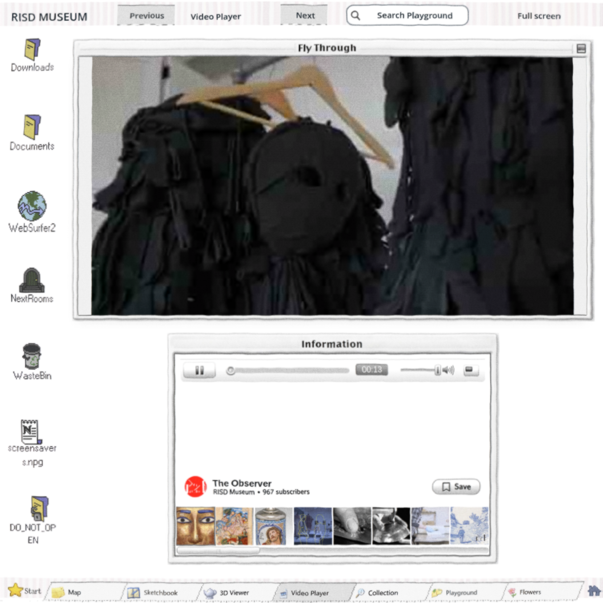
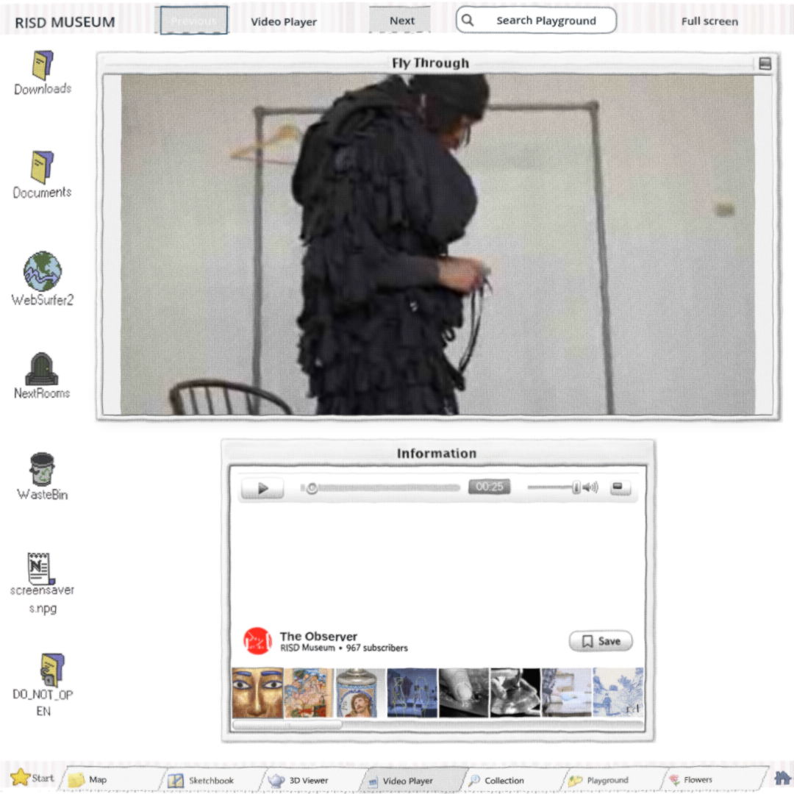

# Mouse Shell focus correction —206 / map149 / review162

Exact runtime63a1d94d (three-line internal Shell correction), September30. After a mouse Video selection, Right traversed Shell button focus rather than seeking; three Rights then fullscreen/Space opened Flowers. The shared _button helper now releases focus only for a left mouse press. Keyboard focus mode/indicator, actual Tab navigation and Space/Enter activation remain intact.

## Evidence first





[Complete private63a build](https://windows-wsl.taile06c45.ts.net/risd-focus-current-01a0f078/).

## Checks and limits

Native real input: RED16observations/two failures (retained focus/missed5sseek); GREEN18observations/zero failures including added Right/Left after fullscreen. Exact exported browser old6bRED fails15sseek;63aGREEN actual Space pause/resume/held position, Right15s/Left5s, F/F/post-return RightLeftSpace, paused hide/return, Tab/Space and Tab/Enter PASS errors[]. Each keyboard activation reaches Previous after three actual Tab presses. First browser check's assumed firstTab=Previous was rejected, retained under rejected-first-tab-assumption; runtime unchanged between failed assumption and corrected navigation check.

All18 current browser windows/grips plus painting/X/Escape/center/fullscreen/tab/drawing/movement/release/Hair36/23paintings/F8F9 PASS; seven Tabs/four main+hover scans/four Playground states/six gallery poses/five fits PASS errors[]. Native focus and browser windows are separate18-count checks.

Repository scripts/check.sh PASS with13 existing ObjectDB shutdown warnings; whitespace PASS. Owning frozen legacy Shell playtest FAIL in old dummy-tenant timing/layout checks (raw log retained); unchanged baseline reproduces these under187, docs/evidence/warm-room-187/shell-baseline.log. That fixture does not instantiate SquareChrome. No all-checks or whole-map ship claim. Export completed, with headless renderer/resource shutdown leak errors retained in export.log; actual browser errors[] and HTTPS hashes match.

[Independent focused source review](source-review.md): Standards/Ponytail no findings; Spec's post-fullscreen-seek proof gap fixed. [Fresh independent Video blind review](video-blind-review.md): chrome/content/progression PASS; fullscreen/window movie proportions FAIL, now scoped208; continuous temporal quality NEEDS-EVIDENCE. No approval inferred.206 stays open pending remaining visual evidence;149/162/173/174/177/final owner gate and automation remain open.

HTML/boot/game/wasm gzip HTTPS match export-integrity.json; game gzip35256e45bcd7836fca2f87104158aa2804cc4fe3fc77bd9b7ef3170fd08934db. source-integrity.json proves four scans/scene/EXR/LMBake match, with only square_chrome.gd changed since1a54d278. No art replacement, bake/provider/generation/spend; private delivery only. Square173 original edits preserved.

## Run

```bash
DISPLAY=:99 godot --path . --script docs/evidence/keyboard-focus-206/focus_check.gd -- --out-dir=/tmp/risd-focus-check
source /home/reidsurmeier/promo-lab/gpu-env.sh
node docs/evidence/keyboard-focus-206/browser_check.cjs https://windows-wsl.taile06c45.ts.net/risd-focus-current-01a0f078/63a1d94d.html /tmp/risd-focus-web
```
