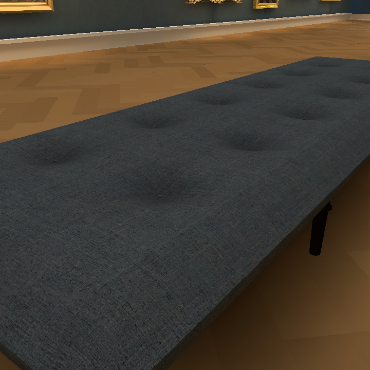
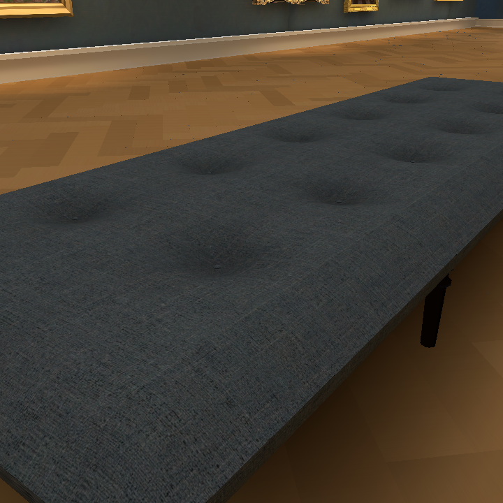
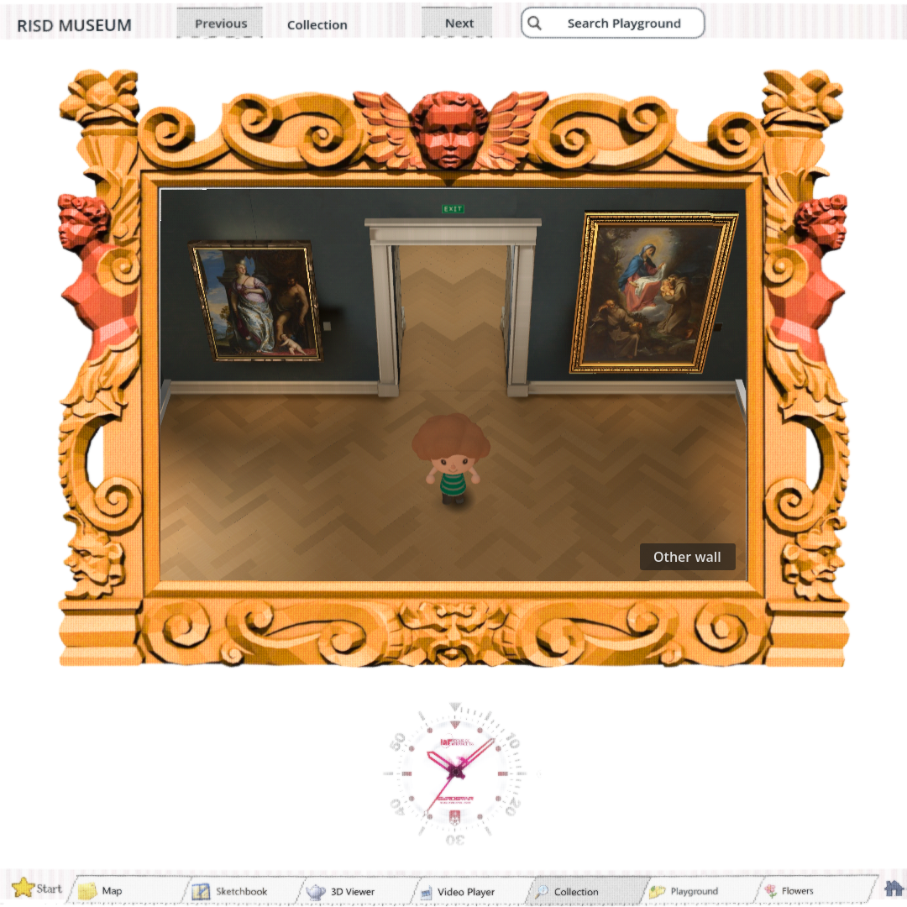

# Owner-selected couch and room — #177

The owner supplied this exact image from #167, source6bdf721c, owner-repairs/bake8/browser-12.png. SHA-25624b88e74f55d557735c31b0df77f67ecba369539fac48ebbf6d1a96acbbeb969 matches the upload byte for byte. This selection supersedes the later agent preference for the #168 pale floor/matte walls and #176 fuller cushion.

Candidate restores the recorded floor geometry/material and wall texture, and the selected lower cushion crown/underframe. It retains the corrected side UV span and level rounded corners, intermediate turned supports, current portal joins/cutaway, open skylight, Hair36 character and square Shell. The final integrated owner gate remains open.

No new generation or spend. Source textures already recorded in shell PROVENANCE.

## Resumed build — 2026-09-29

Runtime `ea542bc2` restores the selected appearance in the complete application. Later portal joins, cutaway, skylight, visitor and square containment remain. Only Collection world assets changed; the 3D Viewer is untouched.

https://windows-wsl.taile06c45.ts.net/risd-restored-room-01a0ee18/

The exported game gzip SHA-256 is `789410b7a6aabeb22ca5235ad9a14bfc2ff2b1929dcacd99ae3e9a72de6c302f`.

The new bake completed in 343.89 seconds with 137 lightmap users on CPU llvmpipe. It retained the prior editor cleanup errors; native rendered geometry, camera/cushion, cutaway and navigation checks pass, including all 23 paintings. Repository checks pass with the existing ObjectDB exit warning. Full export logged one `split.size() < 9` editor error; runtime checks, rather than export exit alone, determine whether the export is usable.

Native close-up inspection confirms the selected parquet, wall treatment and lower tufted cushion. Later correctly mapped cushion sides and intermediate supports remain, so this is not a pixel-identical rollback. Fine dark floor speckling remains visible in the exported close-ups. Final hands-on owner approval remains open.

## GPU diagnosis

The RTX 4070 SUPER is present (12 GB VRAM), but Linux Vulkan enumerates only llvmpipe even with `LIBGL_ALWAYS_SOFTWARE` removed. Forcing the installed NVIDIA ICD returns `ERROR_INITIALIZATION_FAILED`. No Dozen/dzn Vulkan driver is installed. CUDA visibility through `nvidia-smi` does not establish a working Vulkan renderer.

A portable matching Windows Godot 4.7.2 was installed at `C:/Temp/risd-godot-tools`. Windows interop works with the live `/run/WSL/1699_interop` socket on this boot; the default socket failed. Windows Godot selects the RTX 4070 SUPER with Vulkan, then fails swapchain creation (-2) in this launch context. GPU baking is therefore **not verified or fixed**. Do not repeat a software bake silently; verify the actual rendering device before the next bake. Native Linux supports GPU baking; this is a host graphics/session setup problem.

Browser verification uses SwiftShader; the full-app detail/input checks load at 800×600 then resize to 1080×1080 for capture, while the containment matrix starts at 1080×1080. The EGL software path timed out after 240 seconds. The first isolated detail export used the application startup scene in error; the corrected detail export temporarily selects the prototype main scene and stock HTML shell, then restores both project files. Failed captures are replaced only after rerunning the corrected export.

Matched browser close-ups at 720 and 1600 pass with zero page/resource errors. Both images were inspected; the warmer floor and slimmer cushion match the selected treatment, with retained support/UV fixes.

The full-app five-shape containment matrix passes (1080×1080, 1920×1080, 1080×1920, 720×486, 486×720). Square and narrow-portrait captures were visually inspected.

GPU follow-up: [#184](https://github.com/Reid-Surmeier/risd-godot/issues/184).

Full-app seven framed detail views and actual key-input checks pass with zero page errors. Key movement changes position, release stops motion, FOV and Hair36 identity remain fixed, and all 23 paintings remain. Exact scripts, captures and JSON are in `integrated/`.
