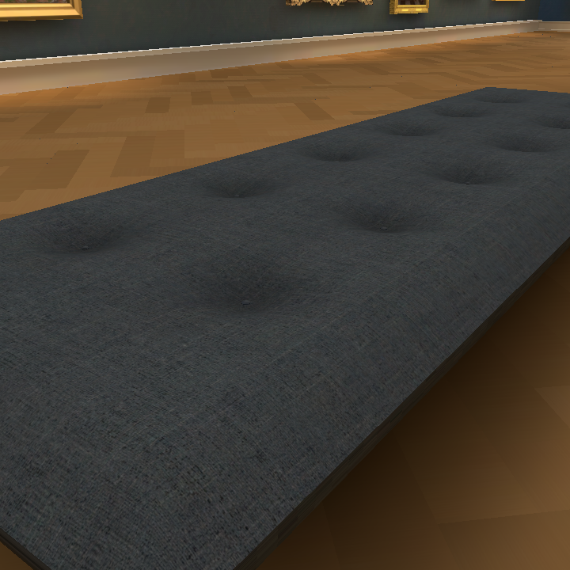

# Owner-selected couch and room — #177

The owner supplied this exact image from #167, source6bdf721c, owner-repairs/bake8/browser-12.png. SHA-25624b88e74f55d557735c31b0df77f67ecba369539fac48ebbf6d1a96acbbeb969 matches the upload byte for byte. This selection supersedes the later agent preference for the #168 pale floor/matte walls and #176 fuller cushion.

Candidate restores the recorded floor geometry/material and wall texture, and the selected lower cushion crown/underframe. It retains the corrected side UV span and level rounded corners, intermediate turned supports, current portal joins/cutaway, open skylight, Hair36 character and square Shell. The final integrated owner gate remains open.

No new generation or spend. Source textures already recorded in shell PROVENANCE.
