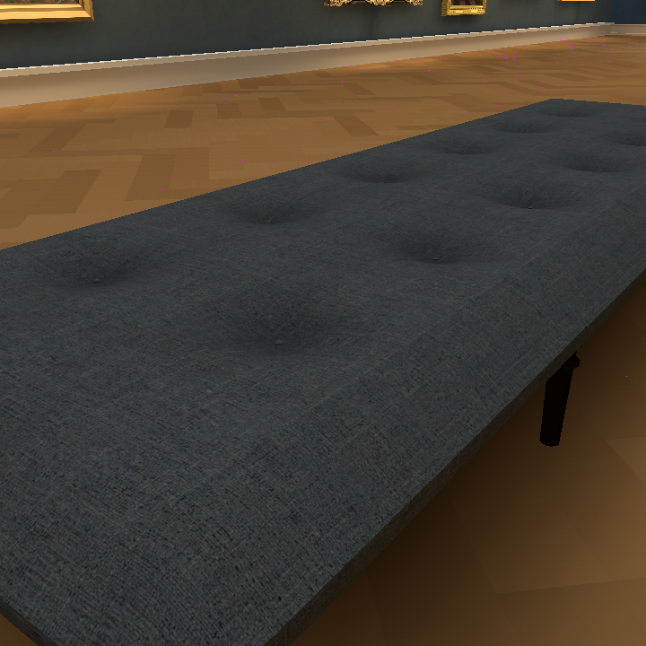

# Browser floor repair — #177 / #162

The black speckles were background showing through plank T-junctions, not texture or lighting noise. With only the preview background changed to magenta, the same 11 crop pixels became magenta. The corrected mesh has zero; the normal browser capture also has zero isolated dark crop pixels (native/reference had one).

Each plank edge is split at its neighbor corners. Vertices share canonical lattice coordinates; attributes and lighting UVs are interpolated. Only the saved floor mesh changed, with the same lightmap and source materials. No rebake or generation/spend.

`godot --headless --path . --script modules/shell/prototype/gallery_walk4/floor_edges_check.gd` reports 6062 unmatched interior edges on the old saved mesh and zero after repair. `python3 docs/evidence/owner-world-177/floor-repair/speckle-check.py <720-view-12.png>` fails the old browser image and passes the new one. Pixel counts supplement visual review.

## Independent image review

GPT-6 Astra medium, fresh reviewer, reference `../selected.png` plus native/browser720 and1600 candidates only. No code, rationale or earlier verdicts.

**PASS** for floor, wall and couch material appearance in all four candidates. Warm brown parquet and lighting retained; dark floor specks absent. Wall/baseboard/upholstery, tufting and buttons match. Browser and native agree at both sizes without visible holes, broken patches or texture seams. Candidates retain a dark couch leg beneath the right edge absent from the reference; appearance is not an exact silhouette rollback. Stills do not verify motion stability.

Repository checks pass with existing 13 ObjectDB shutdown warnings. Source geometry/cushion/camera checks pass. The full-app checks below follow this focused review. Final owner approval remains open.

## Integrated build verification — September 29, 18:30 UTC continuation

Runtime `05fd1a282d409ea02adffda1309a2a20509016b4` is on `build/v0.1.0`. The durable export lives at `build/floor-05fd1a28`.

https://windows-wsl.taile06c45.ts.net/risd-floor-repaired-01a0ee53/

Open Collection to inspect the restored warm room, or 3D Viewer for the retained four scans. This is a private Tailnet build.

- `integrated/matrix/browser.json`: all five required viewport fits pass, with an empty errors array. Square and portrait screenshots were inspected.
- `integrated/input/input.json`: real browser key input moves the visitor from z=-4 to -4.804 while held, then stops at z=-5.093 after release; FOV and Hair36 identity remain fixed, with 23 paintings. Both endpoint screenshots were inspected.
- `baseline.log`: repository checks pass; 13 existing ObjectDB shutdown warnings remain. Native world, owner, navigation and rendered cutaway logs are preserved here.
- `export.json`: HTTPS game archive SHA256 reverified as `f8fde56074c8ff585607cb86eba6102be0c34e3af2933b4c2a3ff06037fa351f`, matching the exact export.
- The Viewer module has no diff from verified correction `4a7127a4`; all four current scan GLBs match the recorded hashes in `viewer-157/source-integrity.json`. Verified metadata is preserved.

Reproduce the browser checks with the copied `integrated/*.cjs` scripts, passing the shared `05fd1a28.html` URL and an output directory. These use the existing host Chrome/Puppeteer installation. This is functional/visual evidence, not a performance benchmark or final owner acceptance. #141, #162 and the owner's hands-on gate remain open; no paid call or rebake was performed for this repair.

### Remaining passage-floor finding

The seven-view browser capture completed with `errors: []` in `integrated/details/states.json`. Inspection of bench, floor and portal views confirms the selected warm floor/couch and retained portal. **The portal view still shows isolated dark speckles on the passage floor** (`integrated/details/portal.png`); therefore this packet does not establish a globally speckle-free floor or close #177.

The main-room repair/test covers `Surface000` and interior z<−0.5. The passage is generated separately by `_portal_floor` in `walk4.gd` and does not pass through `_conform_floor_edges`. This is a follow-up hypothesis, not a proved cause. Next: reuse the background-color/flat-material diagnostic on the passage, confirm its saved mesh identity, then repair only after a matching red/green check. Preserve lightmap and textures; do not rebake silently while #184 remains unresolved.
