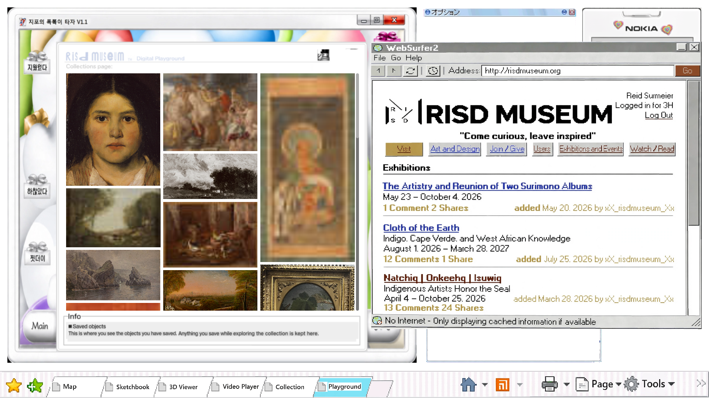
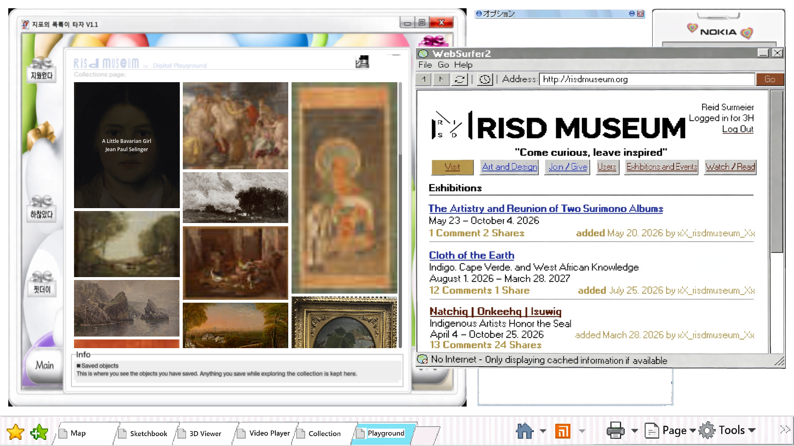
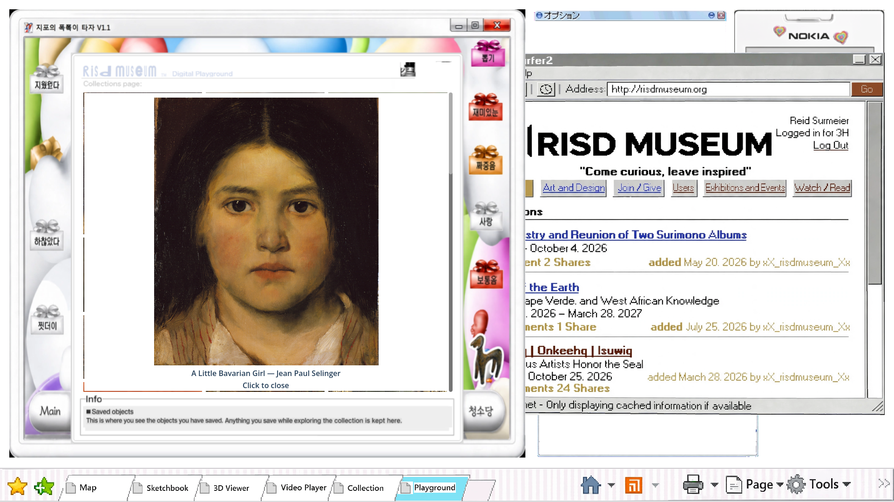
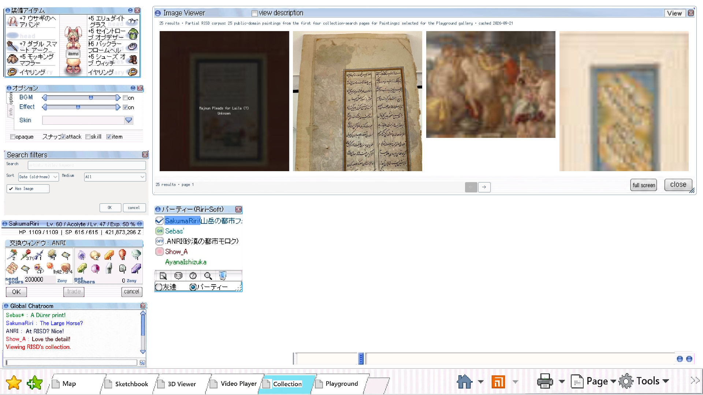
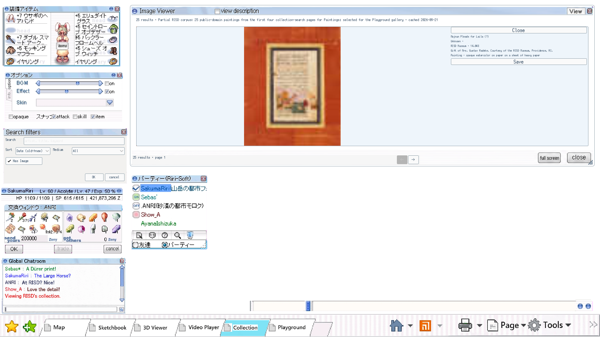

# Verified RISD painting route

The Playground's colorful PostPet window now fills its existing white body with an
Are.na-style masonry channel. The 25 works came from the RISD collection search for Paintings;
each was confirmed as type Paintings and Public Domain on its official object
page. `official-paintings-2026-09-21.json` preserves the official API metadata,
`painting-images.json` records the corresponding Picturepark URL and byte hash,
and `corpus.json` is the validated same-origin search corpus used by the game.

`painting-images.json` records each object page, carousel ID, Picturepark URL,
downloaded hash, MIME and dimensions. Artwork rights remain unknown because the
official API says `publicDomain=null`; the public-domain finding applies to each
verified image manifest.

The corpus is explicitly partial: 25 public-domain paintings selected from the
first four collection-search pages. Set `RISD_COLLECTION_EVIDENCE` to this
directory when serving the main demo; the default two-work fixture remains
unchanged for its frozen acceptance test.
