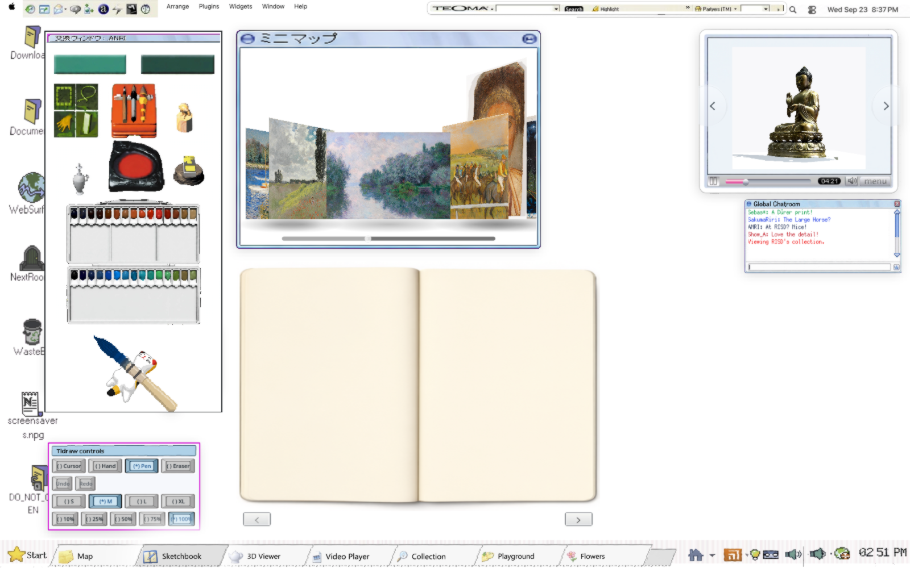
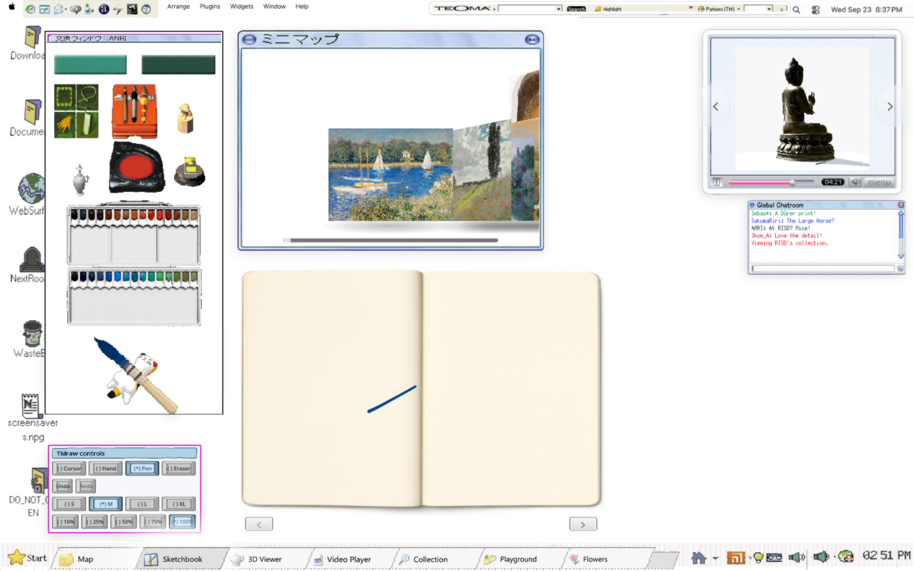
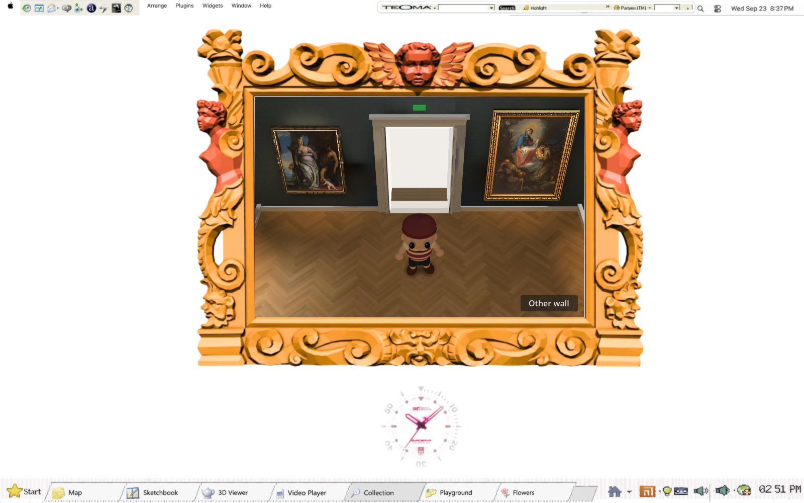

# Consolidated build verification — September 27, 2026

The existing version branch now combines the latest Sketchbook with the retained gallery. This is preservation/integration evidence for #143, not approval of the gallery's character or finish.







Tested Web game commit: **407828a**. The same-origin server includes **9505c16**, the #144 MIME allowlist correction. Subsequent documentation and evidence commits do not alter the tested game. The first browser run caught an OGV 404; the server fix was regression-tested and the unchanged browser journey then passed through the tailnet URL.

| Check | Result |
| --- | --- |
| `scripts/check.sh` | Passed; existing ObjectDB exit-leak warnings remain |
| `npm run test:collection` | 6/6, including exact bytes/MIME for GLB, OGV, SWF, text and explicit gzip downloads |
| `scripts/check-gallery.sh` | Exit 0 on NVIDIA RTX 4070 SUPER; render, motion, rig, floor clearance, navigation and dollhouse checks report zero failures; 300 navigation trials passed |
| Unchanged `modules/sketchbook/playtest/coverflow.mjs` | Passed: animated loader, seven tabs, six paintings, frameless book, pointer/keyboard/wheel/scrubber, drag/resize, drawing, page turns retaining ink, stacking and hidden-tab freeze/resume |
| Git history recovery | Pre-consolidation bundle cloned into temporary RAM storage; `git fsck --full` passed, 251 refs recovered |

Browser screenshots were inspected directly. This run verifies retained behavior and layout; it is not an M3 performance measurement or visual acceptance of the rejected character, wall/door/floor details or retro shader strength. Asset backups are tracked separately in the preservation receipts; a passing game check does not authorize cleanup.

Export SHA-256:

```text
HTML      88f9deebc177d16139792004ab2f09a27f042c80f61ed81384100e5c00edc80e
Boot PCK  7f55d67691e7a6d5f4bd46ff20fcce7408f6ee15707ce98b6b29a28ebc03b78a
Game PCK  8393bb3029010394b4e5fca21e7da6c0640c848bbe501d789393b9c6e1d6a51e
```

The served HTML hash matches the local export. Browser state/check details are in `result.json`; command output is alongside this file. `preserved-dirty-refs.json` maps the four other dirty source snapshots to archival Git commits. The previous version checkout's journal study is separately preserved at `84dd741`.

For paths, backup coverage, restore instructions and cleanup conditions, see [Project home](../../project-home.md). No source directory was moved or deleted in this consolidation.
