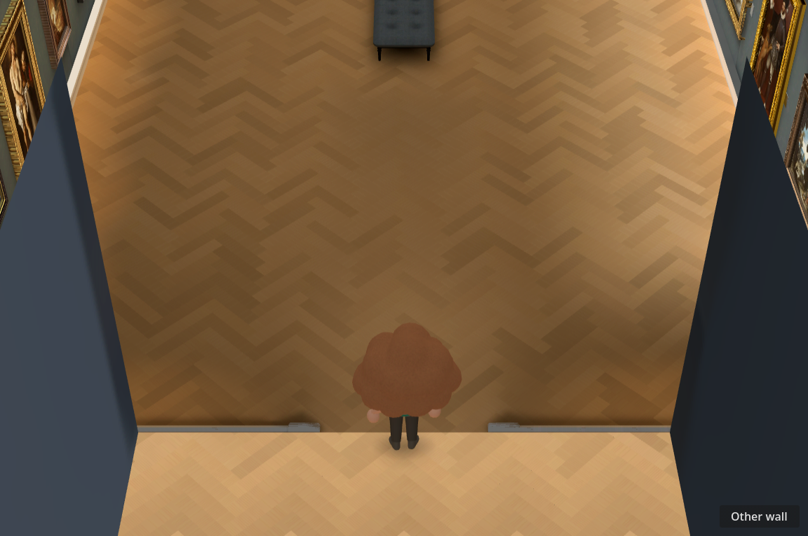
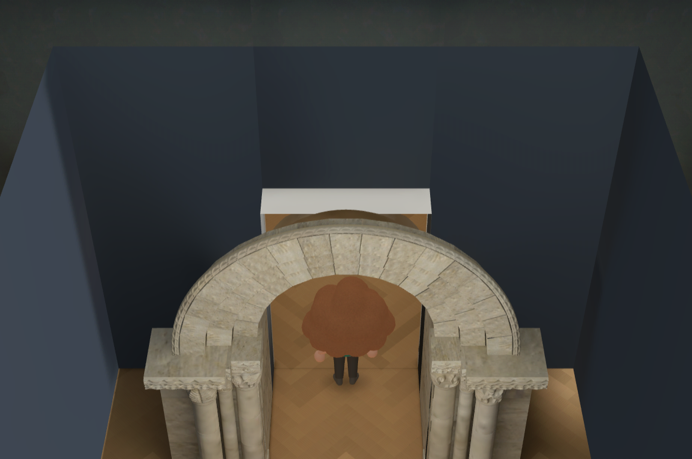

# Doorway pop diagnosis — #185

Reproduced on bbf60c39 with `DISPLAY=:99 godot --path . --rendering-method gl_compatibility --script docs/evidence/room-transition-185/probe.gd`. The probe intentionally verifies the defect exists; it is not a passing fix acceptance test.

A move from z=-0.02 to +0.02 changes room state gallery→arch and mask23→15, with cover opacity0, unchanged23° FOV, and only0.04m camera translation. Reversing the viewing direction flips masks15→23 instead. Inspected before/after images reproduce the owner's exposed stone arch/back-wall symptom. `_process` calls `_enter_space` at z=0; the arch branch changes state without a cover, and `_update_camera` reverses the end-wall cutaway rule. Holding/reversing near that zero-width threshold has no latched transition or rearm zone.

The far doorway follows a different path: it changes room/position/camera before starting a white flash. Changing the flash color alone would not hide the preceding switch. This diagnosis does not establish that all passage-floor defects have the same cause; the separate passage mesh finding remains.

[Animal Crossing primary-source findings and proposed transition](../../research/animal-crossing-room-transitions.md): commit doorway → suspend normal movement → cover the Collection viewport completely → atomically set destination, cutaway, camera, visitor position/facing and smoothing → reveal → rearm outside the trigger. GameCube museum doors use a white fade; black is an optional art-direction choice, not a historical claim. Real connected-room topology remains #181/#182 work.

No runtime transition change, rebake, paid generation, or 3D Viewer change in this report.
