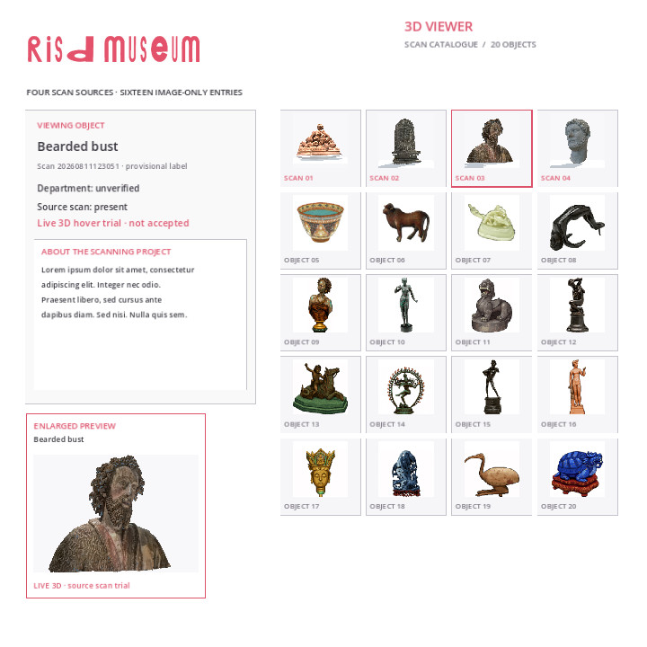
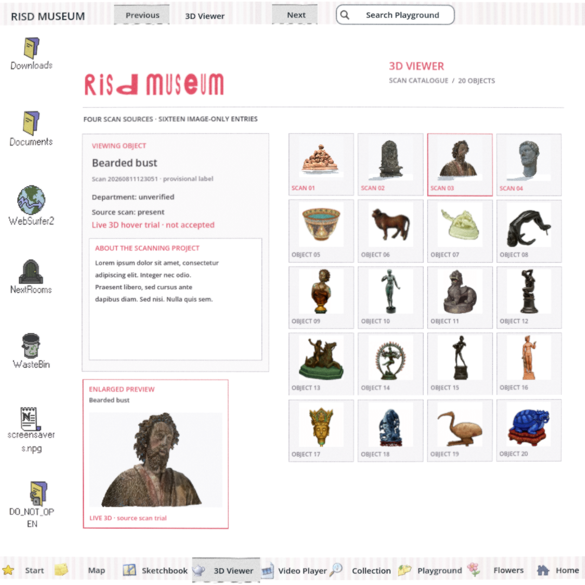

# #157 aspect-preserving scan preview

28 September 2026. Isolated branch `Reid-Surmeier/scan-aspect-157`, based on `6afdf2d0`. This is a scoped presentation repair to the one-scan prototype, not live-asset acceptance or closure of #154/#157.

The preview previously stretched its 550×392 render texture into a square. The two-line correction in `catalogue.gd::_draw_hover` supplies the texture's actual aspect to the existing fit calculation. The full texture now fits inside the same lower-left preview area without compression. Camera, lighting, material, scan geometry, texture pixels, thumbnail layout and unavailable states are unchanged. No new dependency, interface, error type or frozen acceptance test was added.






## Verification

Fresh external GPT-6 Astra medium image-only verdict: **PASS — presentation-only fix**. The [exact review](blind-review.md) finds source-consistent proportions at all six supplied Web angles, native/Web agreement in the supplied front/back views, and three distinct correctly labeled fallback states. The reviewer received only images, with no code, logs, report or previous verdict. Its stated scope does not establish continuous rotation or independent review of every native angle.

The source hair gaps remain visible and are not repaired or hidden by this change. The existing preview remains explicitly labeled “trial · not accepted”; three other source cards retain “3D preview unavailable.” The reviewer explicitly does not accept the bearded live scan or four complete scans.

| Platform/width | Before displayed/source silhouette aspect | After | Cards and three held states |
| --- | ---: | ---: | --- |
| Native 720 | 0.7089 | 0.9925 | Unchanged |
| Web 720 | 0.7089 | 0.9925 | Unchanged |
| Native 1600 | 0.7126 | 0.9988 | Unchanged |
| Web 1600 | 0.7126 | 0.9988 | Unchanged |

The [runnable pixel check](../../../modules/sculpture_viewer/prototype_157/check_aspect.py) compares the dark object silhouette in the displayed preview against the original SubViewport texture captured at the same yaw. It rejects a discrepancy above 3%, verifies the old screenshots reproduce a discrepancy above 20%, and compares the card region and three held-state frames to the immutable #154 baseline. This tests displayed proportions, not museum-object completeness. [Full results](aspect-check.json).

Both native runs capture six angles plus three held states. Both Web runs additionally drive **20 real card clicks**, hover the bearded card, confirm changing yaw, leave the card, and assert renderer disable plus retained click selection. [Browser results](browser/result.json) contain zero page errors at 720 and 1600. The Web harness is an isolated catalogue export; the complete native module playtest separately passed seven Tabs, 20 selections, hover, hidden input/freeze and return. Its existing Python verifier passed geometry, metadata, interaction and pixel checks; [native log](playtest/godot.log) includes the existing GLES fallback/MSAA warnings.

`scripts/check.sh` and `git diff --check` passed; the repository check retains its ObjectDB exit warning. All twelve source OBJ/MTL/JPG hashes and four chosen GLB hashes still pass `check_sources.py`. No paid action; USD 0. No build branch changed.

## Packet and provenance

`native/` and `browser/` use indexes 00–05 for yaw 0°, 60°, 120°, 180°, 240°, 300°; 06/07/08 are group/relief/pale static unavailable states. Both contain 720 and 1600 square captures. The two native `*-reference.png` files are direct 550×392 SubViewport images used by the proportion check. Browser hover/leave frames record actual pointer interaction. [SHA-256 manifest](screenshots.sha256) pins all evidence images.

| File | SHA-256 |
| --- | --- |
| Bearded candidate GLB, unchanged | `faaece8dd2b1b25f6d2a7d96671db37ea810ede3bdc5441099f18f96ffc50d74` |
| Corrected catalogue | `5e22db61d1c7110959fe2031dc99f5895fb924175d0353758994e516b18da789` |
| Capture harness | `f6e6f4fe38d6d225fe480212ebfa040fda936632ce8e2f4a626834973b87aac7` |
| Diagnostic Web pack | `73ad4cbd9c46dad82211cf3346fe35ea1344b5fa99041aaeade7879ce475369e` |

The pack uses Godot 4.7.2 Compatibility, Chrome SwiftShader for Web and Mesa llvmpipe for native. Pixels are engine screenshots, with no generated or repainted scan content. All original source triplets stay in the owner's Proton ingestion folder; the source hash audit and earlier failed live-asset review remain in [#154's checkpoint](../../research/scan-fallback-154/README.md).

## Reproduce

Use the small-project preparation commands in the [#154 record](../../research/scan-fallback-154/README.md), from this worktree so the copied catalogue and capture script include this correction. Capture native into a fresh folder at 720 and 1600. Run `aspect_browser.mjs` instead of the older `browser.mjs` against the resulting Web export to include real interaction checks.

```bash
python3 docs/research/scan-fallback-154/check_sources.py
python3 modules/sculpture_viewer/prototype_157/check_aspect.py docs/research/scan-fallback-154 docs/evidence/scan-aspect-157
scripts/playtest.sh sculpture_viewer /tmp/scan157-fresh-playtest
scripts/check.sh
git diff --check
```

Coordinate native/Web rendering with the other agents. The tested export does not establish full-Shell Web startup timing or large-view zoom behavior. Missing source hair geometry remains a separate failed gate; do not promote the bearded candidate to accepted LIVE on the strength of this aspect repair.
