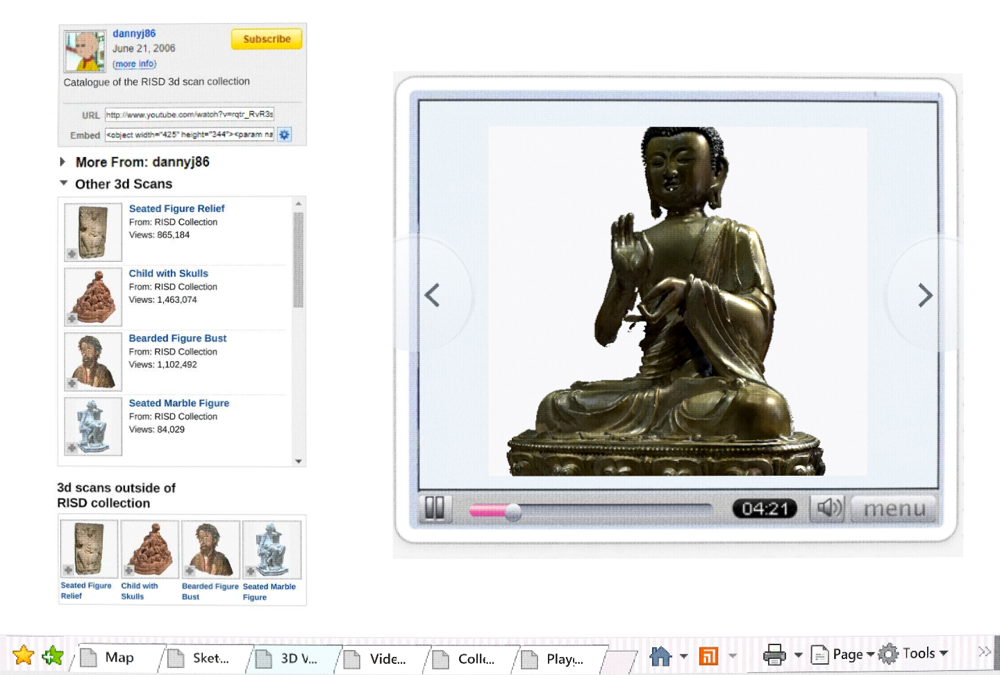
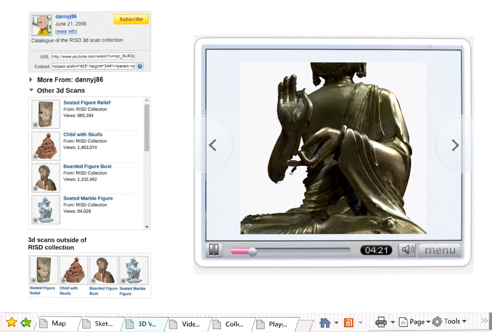

# Closer scan inspection

Issue #82 reduces the existing camera's closest distance from 4.7 to 2.8.
Mouse wheel and keyboard share that limit. The far limit (10.5), wheel step
(0.45), starting/reset distance (8.7), orbit and window layout are unchanged.

The current imported Buddha scan is 4.5 units tall, with unrotated horizontal
extents ±1.633 and ±1.324. At the normal front pitch, the closer camera stays
outside those bounds. The inspected result shows larger torso/hand detail;
extending beyond the picture frame at close zoom is expected, and no near-plane
cut through the mesh is visible in the tested front/orbit views.

Checks: existing native sculpture-viewer gameplay suite passed; a new native
public-seam probe sent 24 wheel notches and reached 2.8; the real browser reached
2.8, orbited, reset by double-click to 8.7 and zoomed again, with no page errors.
The same browser test passed on the existing published game URL. The served PCK
hash matches the local tested export. Repository checks and git diff --check pass.
Independent Standards/Spec review of exact e1cbec5 found no blocker for the current
scan change.

New Proton scan ingestion and actual sidebar switching remain separate work.
The cross-scan portion of #82 stays open until those imports can be tested with
this limit; do not claim newly uploaded scans were tested by this checkpoint.
