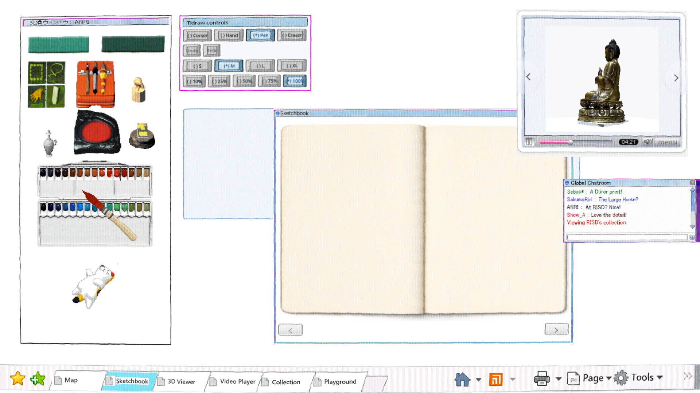
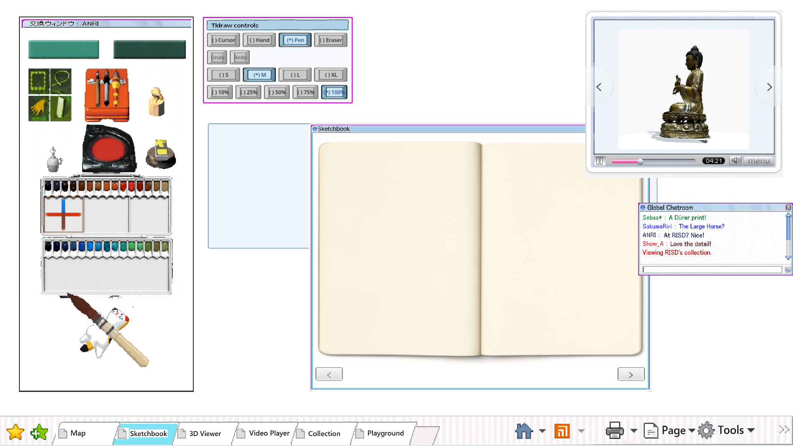

# ANRI paint-window prototype

The opt-in `?paintbox=anri` view uses the complete Muse reconstruction: both material bars, six small green tools, orange tool case, freestanding tools, red pad, two-row interactive palette, and cat brush sit in one tall `交換ウィンドウ：ANRI` window. Tldraw controls remain a separate movable window; their titlebar and normal, hover, and selected button skins come from a second Muse reconstruction pass. Godot supplies the labels, hit areas, and working cursor, hand, pen, eraser, undo, redo, S/M/L/XL, and opacity states.

Muse edit `run-f28bd2a5c04295a923b23a25` produced the preserved full-height paint-window interior for **$0.01**. Muse edit `run-da77a73a15c0c566182d7d54` reconstructed the control window and its three live button states for **$0.01**. Both ran through OpenRouter. The runtime uses the complete paint-window donor, generated control skins, deterministic interaction overlays, and an exact lossless crop of the supplied Japanese title.

Verification:

- `scripts/check.sh`: passed.
- `godot --headless --path . --script res://modules/sketchbook/playtest/tldraw_controls_check.gd`: 9/9 passed.
- `godot --headless --path . --script modules/sketchbook/playtest/anri_palette_check.gd`: all 30 visible wells, two-pigment mixing, and the brush pickup lifecycle passed.
- `anri_browser.mjs` against a fresh Web export: 2,457 painted pixels, 144 Mixbox contacts, visible tray pixels changed, and the palette retained its original aspect.
- Fresh Web export `db900e7-dirty`: Chrome rendered the complete Muse interior and generated control states; Sketchbook drawing produced `02-drawn.png`.
- Existing frozen Sketchbook suite: 38/47 on the local build branch. Its pre-existing layout constants and screenshot expectations disagree with the checked-in desktop implementation; this prototype does not rewrite that frozen acceptance surface.
