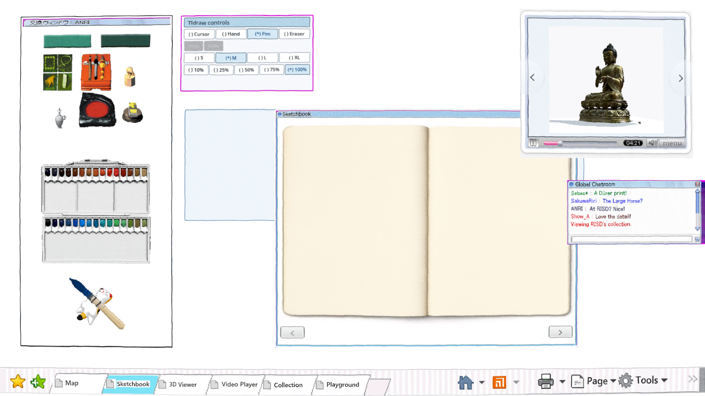
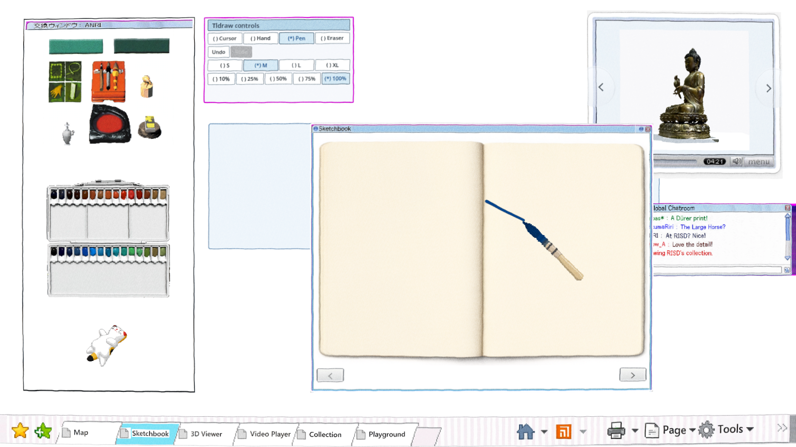

# ANRI paint-window prototype

The opt-in `?paintbox=anri` view puts the preserved toolbox, interactive palette, and cat brush rest in one tall `交換ウィンドウ：ANRI` window. Tldraw controls remain a separate movable window and use radio-style buttons for cursor, hand, pen, eraser, S/M/L/XL, and 10/25/50/75/100% opacity; undo and redo enable from actual stroke history.

Muse edit `run-f28bd2a5c04295a923b23a25` produced one preserved-layout donor through OpenRouter for **$0.01**. The runtime uses its toolbox group, the original interactive palette and brush assets, and an exact lossless crop of the supplied Japanese title.

Verification:

- `scripts/check.sh`: passed.
- `godot --headless --path . --script res://modules/sketchbook/playtest/tldraw_controls_check.gd`: 9/9 passed.
- Fresh Web export `2c08b3c`: every Shell tab opened in Chrome; Sketchbook drawing produced `02-drawn.png`.
- Existing frozen Sketchbook suite: 38/47 on the local build branch. Its pre-existing layout constants and screenshot expectations disagree with the checked-in desktop implementation; this prototype does not rewrite that frozen acceptance surface.
