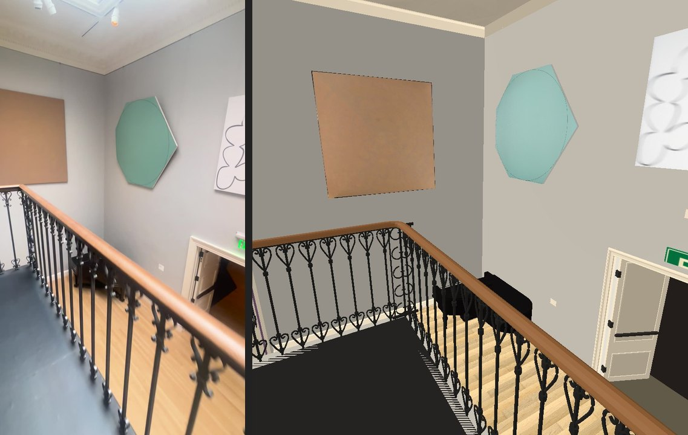
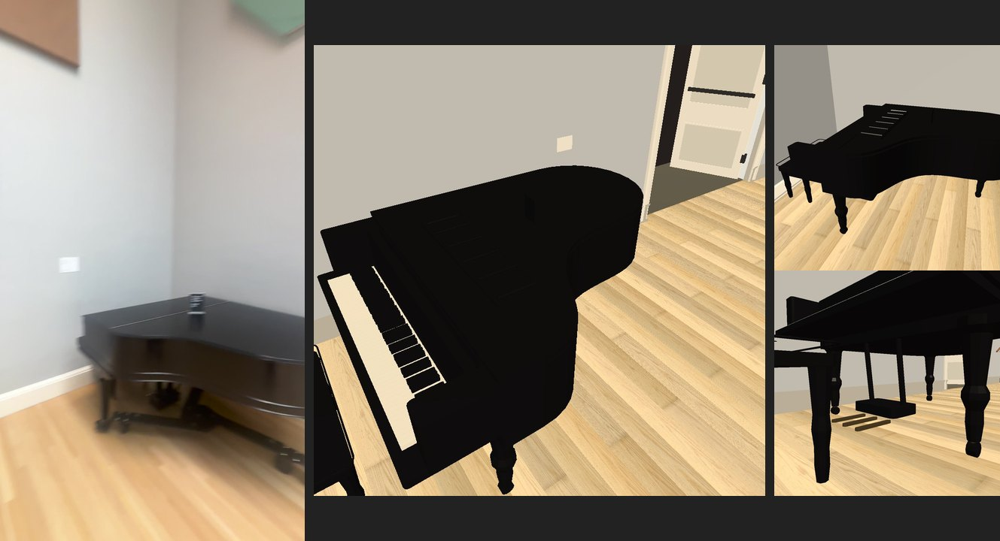
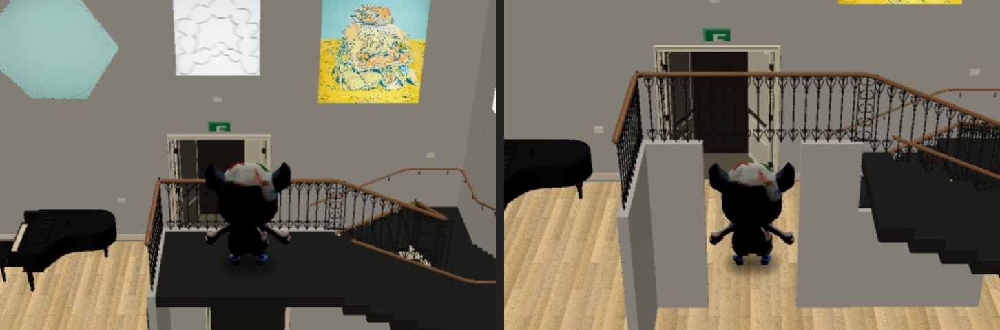

# Skylight Gallery — #275

Source branch: `feat/skylight-275`, starting at `ecfda16e`. Sources only; the
orchestrator must bake and install. No paid services. Measurements and shape
judgments below are estimates, not acceptance flags.

## 1. Survey and plan (8 October)

Read #275, the room pipeline runbook, the Skylight findings 9.1–9.7 and reveal
findings 14.1–14.3 of the 8 October census, and the earlier #238 survey. Viewed
the whole 182.55-second clip as a sequence, including newly tone-mapped frames
at 3, 6.5, 9, 13.5, 26, 40, 54, 68, 82, 99, 112, 127, 132, 144, 154.5,
159.5, 170 and 180 seconds. `00-footage-levels.jpg` and
`01-footage-detail.jpg` retain the principal comparisons.

The zero-byte `collection-expansion/IMG_6379.MOV` is unusable. Read the complete
191 MB copy at `collection-expansion/verified/IMG_6379.MOV`. These are HLG
frames converted with the owner's zscale / Hable filter; no video pixels enter
the architectural materials.

Scale: the existing #238 multi-view survey triangulated the Diao canvas,
69.094, at its catalogue width of 2.21 m (frames 37.7, 38.0, 39.1, 39.9,
151.3 and 153.3 s). Its reported scale error is ±1.3%. That model is not in
this checkout: its numerical fit is inherited, not re-computed here. New
frame checks distinguish direct observations from dimensions inferred from
that fit. Error ranges below include uncertain wall/rail endpoints.

Room coordinates: x increases west to east, z increases north to south;
grey gallery/entry level y = 0. Gallery oak floor y = −2.55 (revised below).

| Item | Reconstruction estimate, error | Frames / method |
| --- | --- | --- |
| Plan | 9.50 × 5.00 m, ±0.60 / ±0.30 m | Inherited 9.55 / 5.04 m canvas-scaled fit; 6.5, 127, 154.5 s corroborate wall order and stair footprint |
| Lower storey | **2.55 m, ±0.30 m** | New independent Diao / Feldman wall-plane checks at 127 / 54 s; initial inherited 3.30 m estimate rejected |
| Landing to ceiling | 3.90 m, ±0.40 m; total 6.45 m, ±0.35 | New Diao wall-plane check at 127 s: floor-to-ceiling 6.457 m; 40 / 154.5 s corroborate |
| Upper landing | 2.70 × 1.65 m, ±0.20 / ±0.15 m | Rail endpoints in earlier fit; 54, 127, 154.5, 170 s show front and west guards, stair departing east |
| Entry | centre 5.20 m from west, ±0.40 m; current 2.00 m clear width retained, ±0.30 m | Camera route 170–182 s; reciprocal IMG_6380 0–14 s. Reveal 0.80 m is existing kit extent, not a new measured claim |
| Stair well | 1.75 × 2.07 m, ±0.20 m | Earlier rail fit; 54 / 68 / 159.5 s corroborate U around east end |
| Stair run / width | upper and lower runs about 1.75 m, middle 2.07 m (±0.20); upper width 1.65 m, east 1.20 m, lower 1.28 m (±0.15) | Fit well inside measured room with landing depth; 26 / 127 / 159.5 s. Provisional 18 risers at 0.142 m, 5 / 7 / 6 descending; 35 / 29 / 72 s, ±1 riser total |
| Landing rail | 0.90 m tall, ±0.08; slender rods at about 0.14 m pitch, ±0.02 | 54 / 154.5 / 159.5 s; proportions to known canvas and estimated platform |
| Laylights | west 3.40 × 2.60 m, east 1.70 × 2.60 m, ±0.30; 5 transverse panes, 4 / 2 along room | 6.5 / 99 / 144 s; common transverse grid, separated by a substantial plaster beam. Plan positions provisional pending draft comparison |
| Piano | 1.75 × 1.48 m, ±0.20; closed lid about 0.98 m high, ±0.10 | 3 / 13.5 / 127 / 132 s; curved grand case, keyboard west, bench at keyboard, three legs and caster feet |

Plan at the current room-scene attachment: shell `[0.35, 9.85, -10.76, -5.76]`;
entry `[4.55, 6.55]` on the south wall. Upper landing x 4.20–6.90,
z −7.41–−5.76. Descend east along south wall, turn north at the south-east
corner, then west at the north-east corner onto the oak floor. Inner well
x 6.90–8.65, z −9.48–−7.41. Piano in north-west corner. Lift in south wall
on the lower floor under / west of the entry platform. Existing deep reveal
and folded leaves stay at y = 0.

## Works and lighting handoff

Five works have images already in `image-work/collection-room-remodel/additions/skylight/`.
The footage survey shows no sixth work needing an absent image. Walsh's
accession remains inferred from the earlier catalogue match; the unreadable
label does not establish its identity.

| Work | Wall / centre from west or north; centre above entry (above lower floor) | Evidence / error |
| --- | --- | --- |
| Diao 69.094 | west, 2.50 m from north; +1.56 m (+4.11) | Canvas triangulation inherited; new floor-plane check +4.109; 40 / 127 / 154.5 s; ±0.20 height, ±0.25 position |
| Mangold 73.018 | north, 1.75 m from west; +1.75 (+4.30) | Seven-point wall-plane checks at 127 / 154.5 s; ±0.25 height / ±0.30 position |
| Feldman 2026.3 | north, 4.65 m; +1.98 (+4.53) | Over lower exit; new floor-plane check +4.528; 54 / 109.5 / 132 s; ±0.25 height / ±0.25 position |
| Congdon 2000.17 | north, 7.45 m; +1.75 (+4.30) | East of exit, 6.5 / 54 / 144 s; ±0.25 height / ±0.30 position |
| Walsh 2025.19 | east, 2.10 m from north; +1.90 (+4.45) | Over turn of stair; 159.5 s wall-corner samples give 2.06–2.16 m; ±0.30 height / position |

Light comes from the two diffuse laylights, with white cylindrical track
heads on narrow tracks round their perimeter and on the dividing beam
(6.5 / 99 / 144 s). A grey high vent and small security devices appear in the
south-east corner (99 s). Lamps / bake are #274's work. Retain pale grey walls,
white kit trim, pale straight oak below, black painted stair/landing and
warm brown wood handrails. There is no window at floor level.

## 2. Build sequence and review checklist

1. Push this survey. Rebuild shell, lower floor, landing, three descending
   runs and quarter landings; supply collision ramps / floor patches and
   trials for entry, stair both ways, landing guards and lower circulation.
2. Inspect a draft against 6.5 / 127 / 154.5 / 159.5 s, then push the shell.
   Keep geometry in `skylight_additions.gd`; only named Skylight plan and
   walking-adapter edits in shared sources.
3. Replace plain rail proxies with paired scroll / leaf balusters, decorated
   corner posts, curved cage newel and wood volute; replace box piano with
   curved case, separate closed lid, keyboard, three legs, pedals and bench.
   Inspect and push that detail.
4. Check five existing images at true heights over the lower floor, move
   room records only if necessary, and push final side-by-side evidence.

Census 9.1 / 14.1: two floors and real stair; 9.2: look upward at both
laylights; 9.3: high hanging; 9.4: piano outline; 9.5: lower exit and lift;
9.6: lighting handoff; 9.7: preserve grey walls / pale floor / white trim /
entry reveal. Census 14.2's navy slabs and 14.3's exit sign need a baked
stage view to judge; do not claim their integration state from a draft.

## Verification / integration record

Initial check failed on missing local Godot texture imports and three
pre-existing representation mismatches (`37.114`, `20.254`, `59.131` declared
mesh with no `place_mesh()` in the installed generated rooms). This predates
any source edit for #275. Running the initial editor import; do not alter
these other rooms or install generated rooms. Draft requested at the one
fixed trial folder `collection-expansion/rebuild-skylight-275` (host lock).

Doorways and route trials, every edit outside the additions file, draft
pictures and exact check results will be recorded here at each checkpoint.

### New height checks, superseding the inherited lower-storey estimate

`measure.py` and `height-check.json` reproduce two plane homographies from the
catalogue rectangle corners to metres. Diao at 127 s gives its centre 4.109 m
above the lower wall/floor line; subtract the inherited +1.64 m relative to
entry and the storey is 2.469 m. Feldman at 54 s gives +4.528 m above the lower
floor; subtract +2.00 and the storey is 2.528 m. These independently support
2.55 m, not the earlier 3.30. Coordinate jitter, floor-line choice and the
entry-relative heights still leave about ±0.30 m uncertainty. The field of
view / wall extrapolation is why an unrectified pixel ratio is unreliable.
The earlier numerical SfM floor result cannot be checked without its missing
model; do not treat it as ground truth.

At 35 s the short top flight shows five risers, at 29 s the middle flight
about seven, at 72 / 75 s the bottom flight six including its curved start.
18 × 0.142 m supports the corrected storey. Counts remain provisional by
one riser; the footage confirms the three runs and two corner landings.

### Shell source checkpoint

The named Skylight block in `prepare_remodel.py` produces nine real collision
patches: three lower floor regions, the upper deck, three descending ramps,
and two quarter landings. The additions file replaces this room's level
visual boards with pale oak at −2.55, adds the downward wall extensions and
platform enclosure, and places the lift and existing piano on that floor.
It reuses kit mouldings / casings; the kit's implementation is untouched.
The lower EXIT is a wall feature with folded leaves / push bars and the
existing Hall sign texture, closing after a 0.95 m doorway study. No new
gallery beyond it is implied.

Outside `skylight_additions.gd`, source edits are:

1. `prepare_remodel.py`: remove the old three flattened Skylight trials;
   append a separate #275 block after all other room layout changes. That
   block changes only the Skylight room's floor tag / height, its collision
   patches, its own walking record and the 16 trials listed below.
2. `main_build_walk.gd`: read the Skylight floor patches / guard lines;
   `_skylight_height` and `_skylight_step` set the visitor's y from those
   same floors / ramps and reject unsupported drops. Skylight floor clicks
   intersect the actual surface planes; the stage mask is lowered to the
   oak floor so it cannot cover the lower room. Other room heights stay
   on the existing path. No room names, stages or joins change.
3. This evidence directory only. No `remodel_room.gd`, lamp, reveal, kit,
   character, playtest, interface or error file changed.

Entry door / both reveal openings stay `[4.55,6.55]`, at y=0, with bounds
`[4.55,6.55,-5.76,-4.96]`. Nothing moves in the grey gallery. Lower north EXIT
is centred at x=5.00, z=−10.76, 1.80 m wide at y=−2.55, 2.40 m clear height; it is not a new
room connection in `geometry.json`. No new room label was added.

Route trials: `grey_skylight_out`, `grey_skylight_back` now stop on / depart
the upper deck (z=−6.58); `skylight_landing_east`, `skylight_upper_down`,
`skylight_east_down`, `skylight_lower_down`, `skylight_lower_aisle`,
`skylight_lower_west`, `skylight_lower_lift`, `skylight_lower_up`,
`skylight_east_up`, `skylight_upper_up`, `skylight_landing_back`,
`skylight_front_guard`, `skylight_west_guard`, `skylight_piano_blocked`.
The guard trials expect collision; the piano trial is moved to the lower
floor. At the stair foot, x=6.30 clears the bottom rail's end; x=6.60 did not.

The actual walking adapter's clamps, grid and pulled click route were run
against the new plan in a small scratch harness: 15 surface / guard trials
pass, entry-to-lower click route has 49 grid cells and reaches the lower
floor, no unsupported height jumps, largest movement step 0.023 m. The
draft must still test the actual piano / rails / walls and supply pictures.

For #274: built pane centres `(3.95,3.888,-8.26)` / `(7.05,3.888,-8.26)`,
dimensions 3.40×2.60 / 1.70×2.60, above a lower floor at −2.55. Ceiling and
tracks seen in the footage are at about +3.90 / +3.65. The current positive
painting centre heights in the table are in entry-level metres, not lower
floor metres. Probes must reach below y=0 as well as the upper deck.

### Shell pictures and checks

Draft #1 completed at the fixed `rebuild-skylight-275/extension` directory.
`ARCHITECTURE_CHECK` has `failures: []` (`shell-architecture.json`). Looked at
seven 960px renderings from entry, upper landing, three lower positions,
stair and ceiling. The comparisons below have footage left and draft right;
all are JPEGs below 150 KB. These establish the shell, not iron / piano detail.

- `03-shell-lower.jpg`: IMG_6379 6.5 s; lower room looks up across all three
  stair runs and full-height east / north walls. Balusters and piano are proxies.
- `04-shell-entry.jpg`: 154.5 s; elevated deck and high-hung north works.
  The draft camera is still in the grey gallery to include the deep reveal.
- `05-shell-stair.jpg`: 159.5 s; descending east flight, lower floor beyond.
- `06-shell-ceiling.jpg`: 144 s; two gridded laylights viewed from below.

Census 9.1 / 9.2 / 9.3 are visible in the draft; 9.4 and iron ornament are
next. Lower exit is on the **north** wall in the plan, under Feldman: the
census's west-wall wording describes the old camera view, not the compass
position corroborated by the filmed wall order. Existing upper door / reveal
casings and leaves are preserved. The floor inside that reveal is black.

`scripts/check.sh` still fails only on the same installed-room representation
mismatches (`installed-representation.json`). It cannot print `checks passed`
against the unchanged generated tree. Missing-import failures were resolved
by a headless editor import. Python compilation, own GDScript check-only and
`git diff --check` pass. No generated room was installed or committed.

The existing draft physical runner completed all **16 movement / collision
trials**, on actual floor or ramp at every endpoint. Recorded y values are
0.0008, −0.707, −1.699 and −2.549 m at the four levels, within 4 mm of plan
(`shell-physical-routes.json`). Its flat-study camera check fails on two
lower-floor segments, `skylight_lower_aisle_camera` and
`skylight_lower_west_camera`: the entry deck is between its overhead camera
and the lower visitor. This is a camera limitation to resolve / inspect in
the actual walking adapter during the detail pass, not a failed stair
collision hidden by the pictures. Draft geometry was restored after selecting
just these trials; no acceptance test source was edited.

## 3. Iron, stair detail and piano

Reference forms: 54 / 99 / 127 / 154.5 / 159.5 s. The rail shafts have mirrored
rolled leaf / heart scrolls below the rail and above the tread, four collars,
and an iron strip under the oval wood. Corner posts are open panels with five
pairs of C scrolls. The lower newel is a cylindrical cage with four hoops,
finished with the curled wood volute. The handrail bends continuously through
the corners and changes slope at the actual quarter landings. Wall rails have
metal brackets into their walls. Pitch ~0.14 m, motifs ~0.11 m across / 0.17 m
high, rods 0.016 m diameter, wood ~0.074 × 0.050 m; all inferred ±15–25% from
the frames. These are closed geometry, batched by material, with no video
texture on architecture. Black treads have rounded noses; the bottom step
curls 0.15 m round the newel. Collision remains on smooth supported ramps.

The old L-shaped piano has been replaced by a closed curved grand case and
a separate lid, cheek blocks, fallboard, 52 ivory / 36 black keys in the two /
three grouping, folded music rack, three turned legs with caster wheels,
pedal lyre / three pedals, padded bench with piping and button tufts / four
legs. The small lid card seen at 13.5 s is blank. Maker and unreadable wording
are omitted. Dimensions remain 1.75 × 1.48 × 0.98 m, ±0.20 / 0.20 / 0.10;
case curve, feet and small details are inferred from 3 / 13.5 / 132 s.
Materials reuse the room builder's iron / wood / plain paint construction and
the kit white. The room's filmed smooth grey walls use plain grey paint.

Census 9.5: lower north EXIT now has a 2.40 m clear opening / approximately
2.50 m outer casing, consistent with the new 2.535 m wall-plane check at 54 s.
Two open fire-door leaves have hinges, two moulded panels each and push bars.
The existing Hall EXIT texture is reused. The short study closes 0.95 m behind
it: it adds no destination / new room / route. Under the platform, a 1.20 m
wide, 2.20 m high cased vestibule study closes after 0.40 m; a white cupboard
fills the underside of the first run. The wayfinding screen faces west toward
the lift, at x=4.07, y=−0.97, z=−6.43; 0.64 × 0.86 m, dark glass / metal.
Its map and lettering are not invented. These feature dimensions / casing
positions are inferred from 6.5 / 23 / 99 s, ±0.15–0.25 m.

Draft #2 and the refreshed own additions passed `ARCHITECTURE_CHECK` with
`failures: []`, 21 casings. The actual attached walking game now passes all
16 movement / collision trials and both pulled click routes, entry to lower
floor and back (`detail-game-routes.json`, review harness `check-walk.gd`).
The physical draft runner independently passes all 16 movement trials, with
floor height errors under 4 mm (`detail-physical-routes.json`). Its two
flat-camera failures remain; it is not the runtime camera. The runtime hides
obstructing Skylight decks / treads and tests the full visitor head. Source
camera changes, beyond the first shell checkpoint, are named Skylight-only
structure collection / visibility, floor-relative low-case handling, head
clearance rays and clicks skipping hidden upper decks while retaining the
existing through-door click rule. No shared kit / reveal / lamp code changed.

For reproducible runtime review, the existing character / close-icon assets
and authored captions were copied **only into the disposable draft**, with
`main_build_walk.gd` copied as `skylight_main_walk.gd`. The repository character
and generated rooms are untouched. The default draft presenter does not use
the actual walking adapter and resets manual visitors below y=−2; the runner's
QA mode bypasses that old reset. Actual adapter trials / pictures use y=−2.55.

### Detail pictures and runtime camera

Looked at the detail pass in both the room scene and the actual walking
adapter. `07-detail-rail.jpg`, `08-detail-stair.jpg`, `09-detail-piano.jpg`
and `10-detail-lower.jpg` compare footage on the left with the draft on the
right. `11-game-two-levels.jpg` shows the runtime visitor on the upper deck
and on the lower oak floor. These JPEGs are each under 150 KB. The keyboard,
curved closed lid, bench, cage newel, scroll panels, rolled balusters, wall
rail brackets and the lower cased openings are visible, not claimed from
node counts alone.

An extra camera edit in `main_build_walk.gd` follows the room scene's
`update_baked_visibility()` call: **only while the current stage is Skylight**,
it restores that stage's hiding of neighbouring ceiling details. The draft
callback was reshowning a grey-gallery ceiling track across the lower room's
camera. The track was diagnosed from its AABB and `grey_additions.gd` source;
no lamp or ceiling geometry was edited. The latest runtime pictures show
that stray white track removed. Existing same-stage laylights remain visible
from inside the room.

## 4. Hanging the five existing works

The final Diao centre is +1.56 m relative to entry / 4.11 m above oak;
Feldman is +1.98 / 4.53 m. Their small corrections of −0.08 / −0.02 m apply
the independent wall-plane checks. Mangold / Congdon remain +1.75 / 4.30 m;
Walsh remains +1.90 / 4.45 m, each with the positional uncertainty in the
survey table. The image dimensions and shaped Mangold outline are retained.
All five works now read as high works above a lower storey, with the existing
wall order corroborated at 6.5 / 127 / 132 / 154.5 / 159.5 s. No artwork was
added, no image regenerated, and no placement / metric acceptance flag set.

`measure.py` also reproduces each blank label's wall-plane position, saved in
`label-check.json`. Mangold uses seven corresponding outline points instead
of treating the shaped canvas as a rectangle; its click fit is less precise.
Pixel coordinates refer to the 960×1707 HLG-converted frames. These estimates
include the uncertainty of the inherited canvas-centre height. They are
measurements of label centres, not readings of their illegible wording.

| Label | Along canvas local x from its centre | Above lower oak floor | Frame / estimated error |
| --- | --- | --- | --- |
| Diao | +1.01 m | 1.22 m | 127 s, ±0.20 m |
| Mangold | +0.90 m | 1.00 m | 127 / 154.5 s, ±0.35 m |
| Feldman | −0.02 m | 3.25 m | 54 s, ±0.20 m |
| Congdon | +1.31 m | 2.05 m | 6.5 s, ±0.40 m; extreme oblique canvas |
| Walsh | +1.48 m | 3.25 m | 159.5 s, ±0.30 m |

The same Feldman plane gives the lower exit's clear width ~1.875 m from
pixels `(224,780)` / `(564,785)`, and outer casing width ~2.179 m from
`(190,750)` / `(594,761)`. Retained clear width 1.80 m is within the ±0.20 m
estimate; the kit controls the moulding profile. This is independent of the
upper entry's existing 2.00 m opening, which was not moved.

Authored-record audit: `collection_rooms/representation.json` already has
all five accessions as `flat` / `flat` in `Skylight Gallery`, and carries no
position fields for them. `objects.json` has no entries for these five. The
actual hanging positions belong to `skylight_additions.gd`'s `WORKS` rows and
new `CARDS` positions. Therefore neither authored list needs a move, and no
generated `collection_rooms/` file was edited. Source images are the three
catalogue photographs plus the two **pre-existing** rectified artwork images
for Feldman / Walsh, whose sources are documented in the existing Skylight
`SOURCES.md`. The no-footage-texture rule is applied to architecture; these
existing artwork images are the explicitly allowed art sources.

The Diao plane at 127 s also checks the **upper storey**, independently of
the typed-in height: ceiling / cove point `(435,230)` projects to 6.457 m
above the oak-floor point `(435,935)`, giving +3.907 m above the chosen entry
level. Cornice foot `(435,272)` gives +3.577 m; the moulding/cove fills the
roughly 0.33 m band above that line. These points are recorded in
`height-check.json`; uncertainty ±0.35–0.40 m includes cornice projection
away from the wall plane and the lower-storey estimate. Thus the retained
+3.90 m ceiling is a checked estimate, not a claim of survey precision. The
shared kit's cornice construction is unchanged; its final profile is #273's.

### Lateral spacing checked again against the wall corners

The first Mangold label clicks were too coarse. Its green outline was
checked at all seven corners in **two** frames, 127 / 154.5 s, and the final
clicks and plane fits are stored in `label-check.json`. Reprojection error
is roughly 1–4 pixels. The label projects +0.802 / +0.981 m from the canvas
centre and 0.832 / 1.133 m above the oak floor. Chosen final placement is
+0.90 m / 1.00 m, ±0.35 m. The cross-frame spread is included in the error;
it does not justify a survey-precision claim.

Intersecting each observed north-west wall corner line with the Mangold
canvas-centre level gives its centre **1.660 / 1.808 m** from that corner.
Chosen 1.75 m replaces the old 2.20 m, ±0.30 m. Using the same 154.5 s plane,
Feldman's left edge at `(895,383)` / `(841,737)`, plus its half-width 0.765 m,
puts its centre 4.576 / 4.597 m from west. The existing 4.65 m position is
within the ±0.30 m combined error and is retained.

At 159.5 s, four samples on the actual east/north wall crease `(18,0)`,
`(78,380)`, `(110,575)`, `(162,767)` project to Walsh offsets 2.115 / 2.145 /
2.158 / 2.058 m from north. Chosen **2.10 m** replaces the old 2.50 m,
±0.30 m. This is a corner-plane measurement, not a guess from screen width.

Congdon's left edge in Feldman's 54 s plane, `(749,631)` / `(760,540)` /
`(823,112)`, gives centres 7.296 / 7.274 / 7.236 m from west when anchored
to Feldman's retained 4.65 m. Its own extreme-oblique 6.5 s plane and north-
east corner `(317,642)` give 1.722 m from the east corner. With the retained
9.50 m inherited room width, that suggests 7.778 m from west. These checks
have combined errors of ~0.30 / ~0.40 m respectively; chosen **7.45 m** lies
in their overlap and replaces the old 7.63 m. The conflicting central values
are recorded rather than hidden: the single-view corner and floor
extrapolations have lens/cove errors. Room plan remains 9.50 × 5.00 m within
its stated ±0.60 / ±0.30 m bounds, with `metric_accepted: false`.

Diao / Feldman vertical changes and these three lateral changes are the
final `WORKS` edits. Labels are blank physical cards; no text or overlays
have been added to the game.

### Final pictures, checks and handoff

Final sanctioned draft #3 completed with `ARCHITECTURE_CHECK` / `failures: []`,
21 casings (`final-architecture.json`). Its own additions file is byte-identical
to the source file. Godot is `4.7.2.stable.official.ed1daf0bf`; pictures use GL
Compatibility, not a bake / Web export. Looked at all thirteen final room-scene
views and five final actual walking-camera views before choosing the images.
The side-by-side pictures below have footage left / draft right, except the
two runtime views in `16` and the keyboard and stacked bench / pedal views to the right of footage in
`15`. All **19** evidence JPEGs are below 150 KB.

| Picture | What was seen / census finding |
| --- | --- |
| [12-final-north-works.jpg](12-final-north-works.jpg) | 54 s: Feldman above the lower exit, centred label; Congdon high to its east; 9.3 / 9.5 |
| [13-final-west-works.jpg](13-final-west-works.jpg) | 154.5 s: Diao / Mangold, piano below, landing scroll pattern / open corner posts; 9.1 / 9.3 / 9.4 |
| [14-final-east-work.jpg](14-final-east-work.jpg) | 159.5 s: Walsh above the east quarter, separate card over the wall rail; 9.1 / 9.3 |
| [15-final-piano.jpg](15-final-piano.jpg) | 13.5 s: closed curved rim / lid, 88 keys, three legs, lyre / pedals and padded bench; 9.4 |
| [16-final-game-levels.jpg](16-final-game-levels.jpg) | Actual visitor on entry deck / lower oak, clear head and no neighbouring ceiling track; 9.1 |
| [17-final-laylights.jpg](17-final-laylights.jpg) | 144 s: both gridded laylights and full-height room viewed upward; 9.2 |
| [18-final-lower-features.jpg](18-final-lower-features.jpg) | 6.5 s: actual walking view of lift / screen / lower stair and pale oak; 9.5 / 9.7 |

`final-game-routes.json` records all 16 movement / collision trials and both
pulled click routes passing against the **final attached draft**; largest
20 mm movement step including slope is 22.23 mm. No unsupported storey jump.
The previous independent physical runner's 16 movement passes still apply:
final hanging changes do not alter its floor / ramp / guard geometry. Its two
flat-study camera limitations and manual y<−2 reset are recorded above;
neither is used by the actual walking adapter.

Final `scripts/check.sh` exits 1 at the unchanged installed representation
failures: 37.114, 20.254, 59.131 declared mesh but absent `place_mesh()`.
Image and museum-record checks and Godot import run before that stage without
an error. This command does **not** print `checks passed`. The same failures
were present before #275; no foreign generated / representation data was
changed to hide them. Own GDScript check-only, measurement script and
`git diff --check` pass. No source acceptance test, interface or error type
was edited.

Besides the two named source adapters above, `modules/shell/PROVENANCE.md`
has one appended #275 record pointing to the local source / reference / art /
evidence hashes in this directory. No other source file is changed. Room
scene / runtime camera capture scripts are review harnesses in this evidence
directory, with explicit output folders; they are not runtime dependencies.

**Orchestrator next action:** integrate these source commits, bake / install,
then run the owning museum playtest including `--only=doors` on that installed
tree. The entry / reveal doors were not moved. Added lower north exit and
under-platform vestibule are closed studies, not new route connections.
The exact sixteen route names and all moved endpoints are listed above and
in the self-contained `prepare_remodel.py` #275 block.

Lighting / final cornice fidelity are #274 / #273. Their kit implementations
are untouched. Screen glass has no invented map / text. The reused Hall sign
is a direction pictogram; the footage's lettered EXIT legend is not recreated
with new typed text. Walsh's identity and small ornament dimensions remain
inferred; metric / placement / fine-fidelity flags remain false. No sixth
filmed artwork without an existing repository image was found. Final baked
light, doorway transitions, Web rendering and frame time are not verified
by this draft.

To reproduce the pictures, use the one sanctioned draft folder. For the
actual walking harness only, copy the unchanged `modules/shell/character/`
assets, tab-strip close icons, `objects.json` / `representation.json` into
matching paths **inside the draft**, and copy `main_build_walk.gd` to its
root as `skylight_main_walk.gd`. Import that disposable project with
`timeout 120 godot --headless --editor --import --path <draft>/extension`.
Then run `capture-room.gd` (960×960) or `capture-game.gd` (960×640) via
`timeout 180 godot --path <draft>/extension --display-driver x11
--rendering-method gl_compatibility --resolution <size> --script <absolute
harness path> -- --out=<absolute scratch folder>`, after sourcing the GPU
environment and exporting `DISPLAY=:99`. `check-walk.gd` uses the same draft
with `--headless` and `--out=<absolute JSON path>`. This process changes no
installed / generated repository room.

### Exact route endpoints for the baked doorway check

These are room-scene coordinates before the walking adapter’s `ATTACH` translation. Start points include the physical runner’s +0.25 m spawn offset; goals are floor / ramp heights.

| Trial | Start | Goal | Expected |
| --- | --- | --- | --- |
| `grey_skylight_out` | `(5.550, 0.250, -4.160)` | `(5.550, 0.000, -6.580)` | reached |
| `grey_skylight_back` | `(5.550, 0.250, -6.580)` | `(5.550, 0.000, -4.160)` | reached |
| `skylight_landing_east` | `(5.550, 0.250, -6.580)` | `(6.900, 0.000, -6.580)` | reached |
| `skylight_upper_down` | `(6.900, 0.250, -6.580)` | `(9.270, -0.708, -6.580)` | reached |
| `skylight_east_down` | `(9.270, -0.458, -6.580)` | `(9.270, -1.700, -10.120)` | reached |
| `skylight_lower_down` | `(9.270, -1.450, -10.120)` | `(6.300, -2.550, -10.120)` | reached |
| `skylight_lower_aisle` | `(6.300, -2.300, -10.120)` | `(6.300, -2.550, -7.860)` | reached |
| `skylight_lower_west` | `(6.300, -2.300, -7.860)` | `(3.500, -2.550, -7.860)` | reached |
| `skylight_lower_lift` | `(3.500, -2.300, -7.860)` | `(3.500, -2.550, -6.360)` | reached |
| `skylight_lower_up` | `(6.300, -2.300, -10.120)` | `(9.270, -1.700, -10.120)` | reached |
| `skylight_east_up` | `(9.270, -1.450, -10.120)` | `(9.270, -0.708, -6.580)` | reached |
| `skylight_upper_up` | `(9.270, -0.458, -6.580)` | `(6.900, 0.000, -6.580)` | reached |
| `skylight_landing_back` | `(6.900, 0.250, -6.580)` | `(5.550, 0.000, -6.580)` | reached |
| `skylight_front_guard` | `(5.550, 0.250, -6.580)` | `(5.550, 0.000, -8.110)` | blocked |
| `skylight_west_guard` | `(4.850, 0.250, -6.580)` | `(3.550, 0.000, -6.580)` | blocked |
| `skylight_piano_blocked` | `(2.700, -2.300, -8.160)` | `(1.200, -2.550, -9.760)` | blocked |

The old grey-piano filter was already present and is unchanged. The three old flat-room Skylight trials are replaced at the end of the source with the sixteen rows above. No other room’s trial or doorway endpoint changes.
