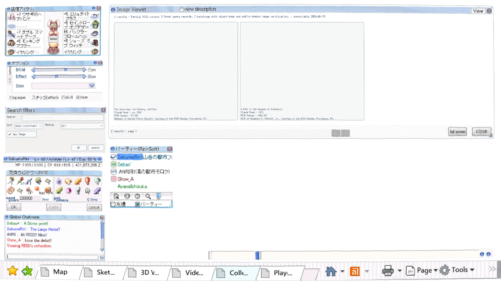
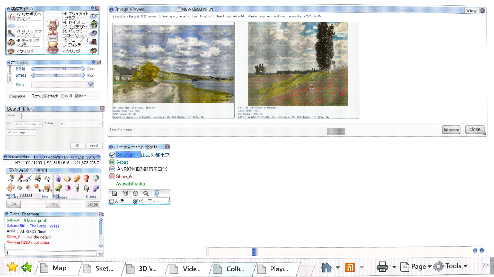
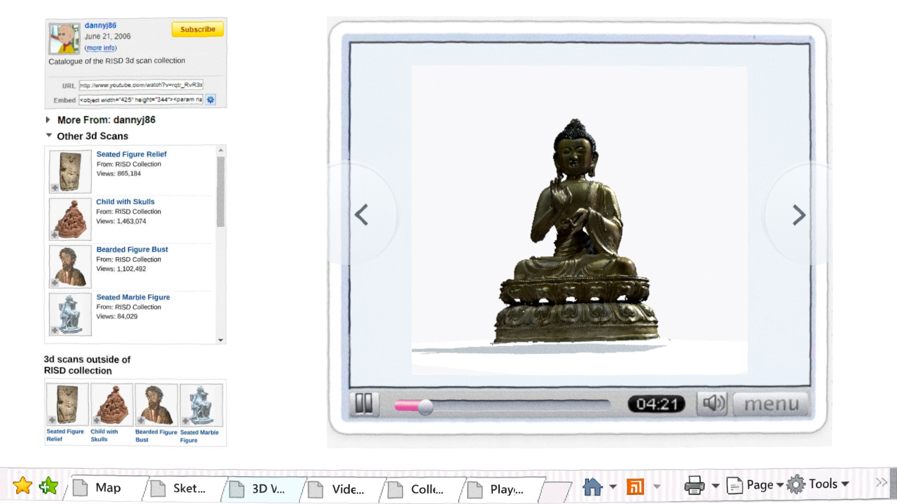
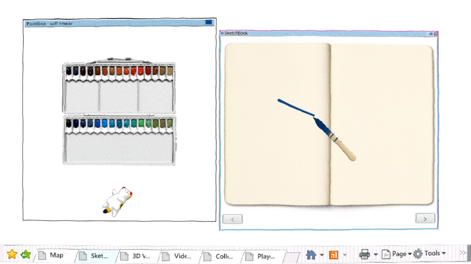

# Subtle Squigglevision screen pass — #89

The selected Squigglevision pass now runs after the existing CRT. It uses the
owner-selected 0.45-pixel displacement, held 3 FPS cadence and a seamless 256×256
NoiseTexture2D backed by FastNoiseLite. F9 toggles Squigglevision; F8 still toggles
the CRT independently.

The implementation was ported from
`figma-ui-ux-qwen-pipeline/painting-tool-prototype/viewer-godot` and retains the
tentabrobpy CC0 attribution. Source shader SHA256:
`aee20f6d875eccacb3dbc7f173373d8a340bccf802c2cbaf609bfa91d7801f76`.
Ported shader SHA256:
`3821e98798ff199b366212ef1c05d1fd3627a96f9636cce57d97a8164cebf62a`.

## Verification

- Exact Web build: `35b38cf`; PCK SHA256
  `815d63468c33a3577b22da3b0694649678966f5a9cdba543baa8b068bffbbe54`.
- Browser test measured 20.89% changed pixels between F9 on/off and 9.79%
  between later held frames, confirming both visible displacement and temporal motion.
- F8 and F9 remained independent. Sculpture orbit, Sketchbook window dragging and
  painting at 1920×1080 and 960×540 all passed with no browser or shader errors.
- `scripts/check.sh` and `git diff --check` passed.

Run:
`PLAYWRIGHT_MODULE=/path/to/playwright/index.mjs node modules/shell/playtest/squiggle_browser.mjs URL OUTDIR`.

Review build:
https://windows-wsl.taile06c45.ts.net/risd-desktop-godot-f57d02de/35b38cf.html
