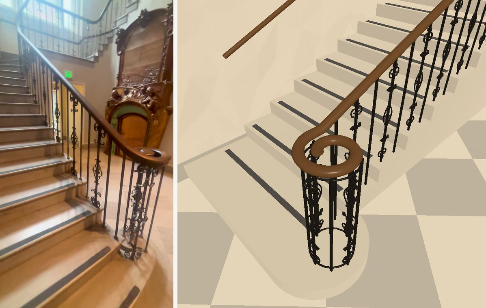
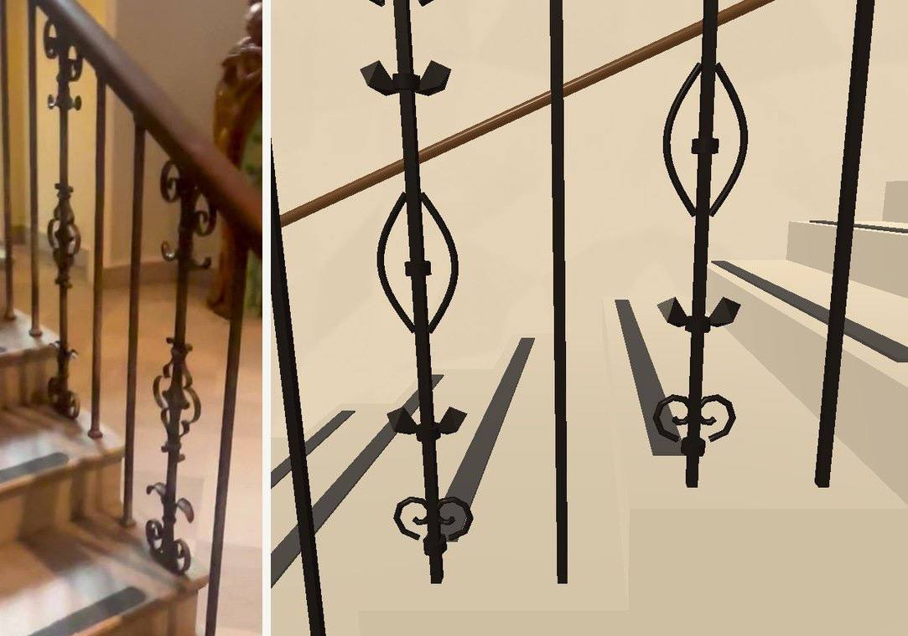
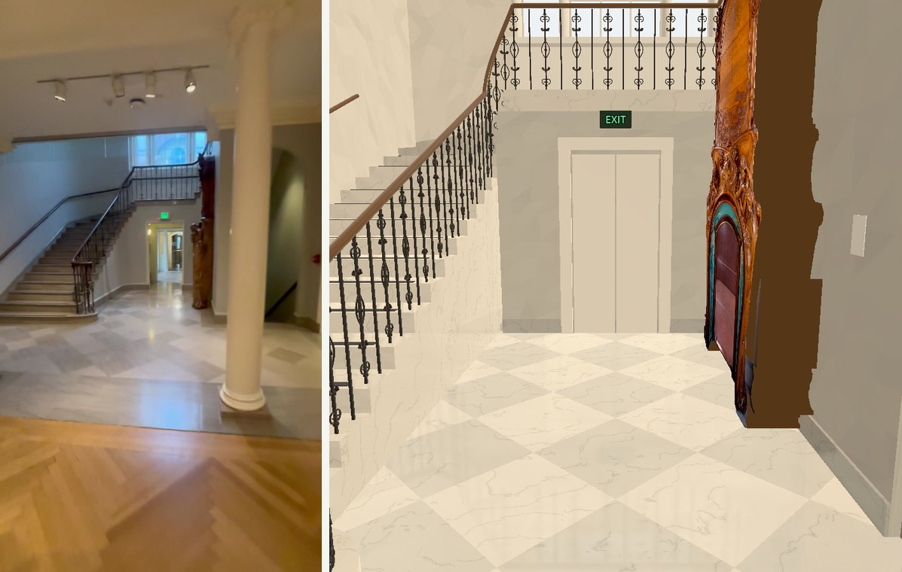
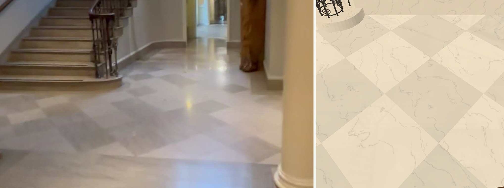

# Stair spaces, issue #276

Worktree `wt-european-west`, branch `feat/stairs-276`, starting commit `ecfda16e`.
Sources only: the orchestrator owns the bake and installation. No paid calls.

## Reference and measurement record

September clips were decoded from `collection-expansion/verified/` using the
specified HLG-to-BT.709 Hable filter. The top-level IMG_6380 file is empty and
IMG_6381 is incomplete (`moov atom not found`); their verified copies decode.
IMG_6343 is SDR. IMG_6381 pictures need a further 180-degree rotation; IMG_6387 needs a further 90-degree counter-clockwise rotation to be upright.
Footage is used only in this evidence folder, never as a game surface.

Initial reads (INFERRED scale; errors include perspective and the assumed door size):

| Feature | Proposed size | Frame / ruler / uncertainty |
| --- | --- | --- |
| Stair guard height | 0.90 m above tread | IMG_6381 3.5, 5.5 s; transfer from the exit leaf, assumed 2.2 ± 0.15 m, in 97.5 s; ± 0.10 m |
| Iron bar section | 0.014 m | IMG_6381 5.5 s, width relative to guard height; ± 0.004 m |
| Ornament width | 0.11 m, within one 0.175 m bar pitch | IMG_6381 5.5 s, curls fit inside two adjacent plain bars; ± 0.03 m |
| Oak handrail | 0.065 × 0.050 m | IMG_6381 3.5, 5.5 s, guard-height ruler; ± 0.015 m |
| Cage / volute diameter | 0.36 / 0.43 m | IMG_6381 3.5, 5.5 s, guard-height ruler; ± 0.06 m |
| Marble tile | Retain 0.76 m at 45 degrees | IMG_6343 84, 87 s and IMG_6381 97.5 s; existing size agrees visually, ± 0.12 m |
| Niche opening | About 1.0 m wide, 2.6 m to arch crown | IMG_6343 87 s and IMG_6380 35.5 s, nearby passage leaf assumed 2.6 ± 0.2 m; ± 0.15 / 0.25 m |

The existing room footprint, riser count, and upper floor heights are retained
until comparison warrants a named room-plan edit. They are provisional estimates,
not a measured survey. Further rulers and pixel ratios will be recorded with each part.

## Ordered work

1. Census 8.1 and 8.7: repeated scroll/leaf ironwork, cage newel, swept oak volute,
   curved bottom step; push after draft and checks.
2. Census 8.2: close pale marble tones, procedural veins, polished response and
   grey marble base at the room's own internal walls; retain diagonal layout.
3. Census 8.3: hollow round-headed niche, olive lining, descending steps and rail.
4. Census 8.5–6: full three-part window, engaged columns, near-white shell,
   finished landing surfaces; use the existing ceiling/trim kit.
5. Census 10: white shaft, curved guard and ornament, warm stone tones, lion wall
   and source-backed incidental details. Door casings/lamps remain the kit's work.
6. Census 7.3 / 8.8: replace the grey gallery's two columns and their beam detail.

## Source locations and scope

The two grey gallery columns are built in `remodel_room.gd`,
`build_grey_gallery()`: the loop over z `[-2.6, .2]`, shafts at x 15.65 in its
old builder frame, capital loaded from `ionic-capital-geometry.json`, followed by
`column_beam` and `column_end_pilaster`. `shift_new` later subtracts 4.6 m in x
and the reveal depth in z. These are the columns facing the marble hall.

At the first checkpoint, production edits are confined to `marble_hall_additions.gd`. No doorway or route trial has moved.
The east wall under the half-landing, its exit leaves/opening and east plan end
belong to #277. Chandelier/camera, chimneypiece reconstruction, shared lamps,
casings, DEEP_REVEALS, skirting/cornice kit, frozen seams and playtests are outside scope.

## Verification

Reference frames inspected: IMG_6381 3.5, 5.5, 28.5, 59.5, 97.5;
IMG_6387 15, 27; IMG_6380 35.5, 44.5, 70.5; IMG_6343 84, 87 s.
No draft verification or final-bake claim yet.

## Part 1 preflight

The scroll template is 812 drawn triangles, 0.11376 m wide and 0.87 m high.
The earlier 646 figure counted vertices in an indexed mesh and was wrong. Mixing
indexed primitives with hand-built unindexed faces also suppressed the curls;
the Batch now deindexes primitives before combining them with swept geometry.
A primitive-only comparison with HEAD verifies identical triangle positions,
winding and UVs (164 triangles); normals differ by at most 0.0000741 from the
additional native normal packing. The chandelier and fireplace builders have no edits.

Godot 4.7.2 parses the source. `git diff --check` passes. The first `--draft`
rebuild is queued behind other agents and a bake; no picture claim yet.

**Inherited repository-check failure at ecfda16e:** `scripts/check.sh` exits 1
at `REPRESENTATION_CHECK`: 37.114, 20.254 and 59.131 are declared as mesh but
`place_mesh()` is absent from the installed medieval additions. The authored
medieval source contains it; the generated copy is older. This check loads
`collection_rooms/`, not the modified stair sources. No generated file was
changed to conceal the failure. A refreshed green base has been requested.

## Further rulers (INFERRED, pending draft comparison)

The lion panel's recorded catalogue dimensions are 2.286 × 1.041 m
(`collection_rooms/objects.json`, accession 34.652); its physical extent remains unchanged.
In the upright 720 × 1280 IMG_6387 10.5 s frame the visible left panel edge is
about 318 px tall, the adjacent text panel about 193 px. The same wall plane
therefore gives 193/318 × 1.041 = 0.63 m high, ±0.07 m. Its apparent width
is about half its height: propose 0.35 × 0.65 m, width error ±0.07 m including
horizontal foreshortening. The white surround is about 35–45 px against that
318 px edge: 0.13 ±0.03 m, proposed 0.14 m. In IMG_6387 42 s the grille is
above the **left** part of the relief, not centred over it. Propose 0.90 × 0.22 m,
±0.15/0.05 m, centre x 13.85 m and y 3.10 m; those locations retain the
existing catalogue panel placement as the ruler.

The lion landing edge is 4.1 m from the lion wall in census 10.3's earlier
measurement, rather than the authored 5.6 m. Proposed edge z 32.215 (4.115 m
from z 28.1), uncertainty ±0.35 m against IMG_6387 15/27 s and the existing
north-door scale. The three guard-blocking trials will be translated with it;
no doorway intervals or fire-leaf poses will be moved. Upper/lower stair
storeys remain inferred where their destinations leave the footage.

No text will be invented for the directory, level sign or label panels.
Door head/casing/reveal dimensions remain with #273; the existing tall leaves
need that coordinated correction. The lamp/ceiling lighting remains with #274.

Material check: Godot's [renderer feature table](https://docs.godotengine.org/en/4.7/tutorials/rendering/renderers.html)
permits two ReflectionProbes per mesh in Compatibility. The planned floor uses
one local box-projected probe, standard roughness/specular response and a
procedural shader; no screen-space reflection requirement or source image.
Visual reflection quality remains to be checked in GL and in the final bake.

## Part 1 checkpoint — census 8.1 / 8.7

**VERIFIED in GL Compatibility draft pictures:** scrolls, curled folded leaves,
short central ovals, open cage newel, oak volute with a visible hole, curved
bottom step, ornamented upper guard and rounded wall handrail. The closer
6381 5.5 s crop prompted a shorter 0.17 m oval and flatter curled leaves in
place of the first long pointed oval. Vertical ornaments use a stable sweep
plane so their sections do not twist at vertical tangents. Final reusable
panel: **820 triangles**; no added scene node per baluster.

Pictures are unbaked review views with the existing lights; no final daylight
or baked-reflection claim. `part1-draft-final.log`: ARCHITECTURE_CHECK,
`failures: []`, exit 0. Capture: five views, no script/rendering errors.
`git diff --check` passes. `scripts/check.sh` was rerun at the checkpoint and
still exits 1 on the **same three inherited medieval declarations** described
above; it did not print `checks passed`. This exception is visible rather than
silently treated as a green baseline. Integration needs the orchestrator's
refreshed generated rooms. No doorway, plan or route-trial change in part 1.

Only `marble_hall_additions.gd` changed in production. Evidence includes the
standalone draft review cameras; they are not used by the game camera.

## Part 2 checkpoint — census 8.2

**VERIFIED in draft:** the same diagonal 0.76 m squares, close off-white/pale-grey
palette, low-contrast warped mineral veins and grey marble base. The existing
kit baseboard meshes get the finish in this room only; their builder and profile
are untouched. The stair stone and threshold use the same procedural material.
No source photograph is bound to any of these surfaces.

Vein contrast was reduced after the first comparison. Specular 0.55 and roughness
0.13–0.17 describe a polished material, with one static local box-projected
ReflectionProbe. **INFERRED polish/reflection quality:** these unbaked views do
not yet demonstrate the strong window/spot reflections in the film. Recheck
after the brighter window checkpoint and the orchestrator's final lighting bake.

Draft rebuild exit 0, ARCHITECTURE_CHECK `failures: []`; GL capture exit 0,
no script/shader errors. Whitespace check passes. The checkpoint repository
check still exits 1 on the same inherited medieval mesh records; no green
baseline claim. No outside production edit, doorway or route-trial change.
