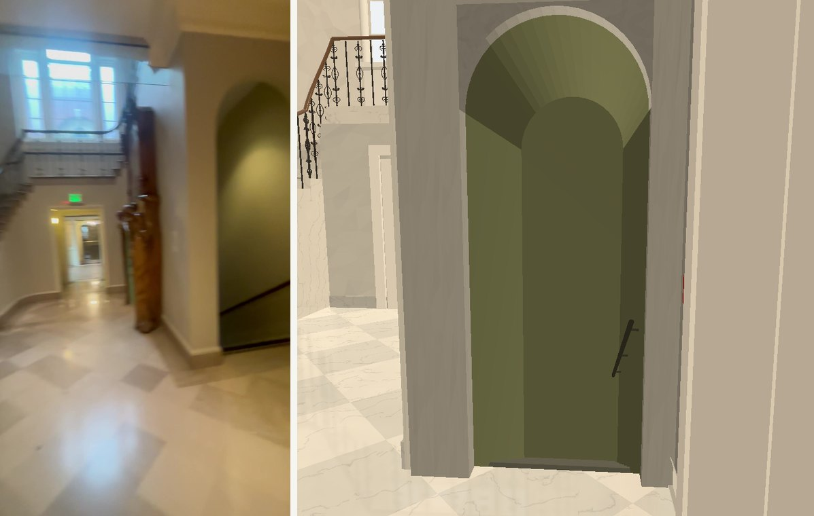
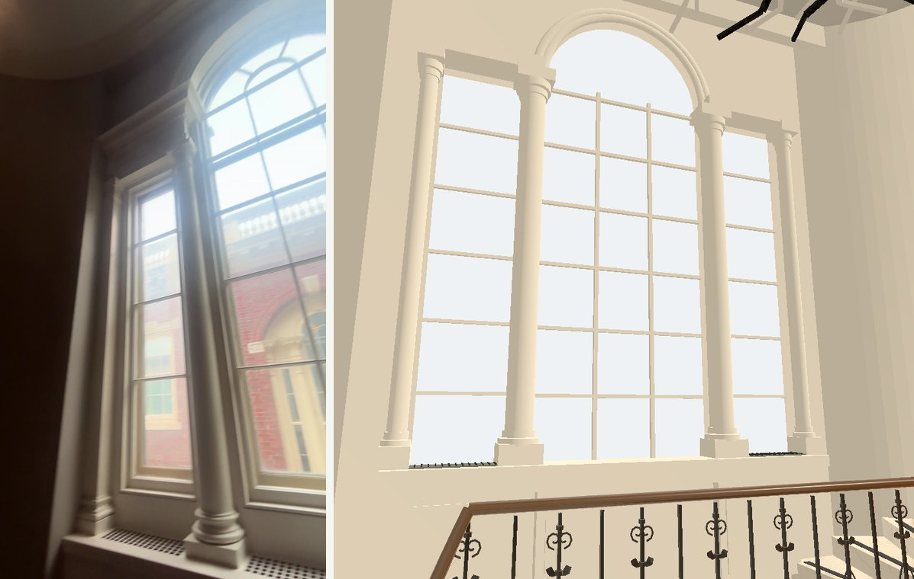
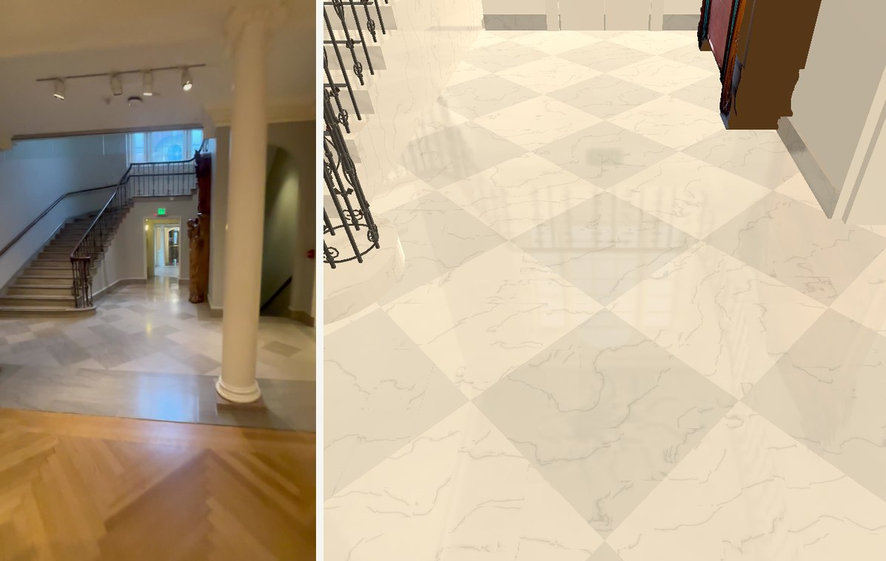
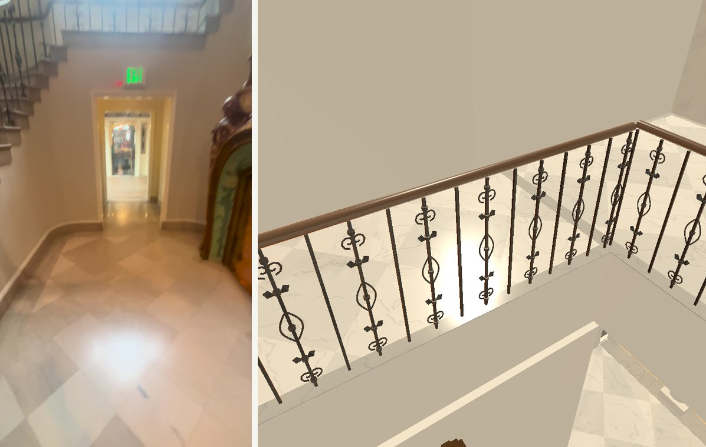
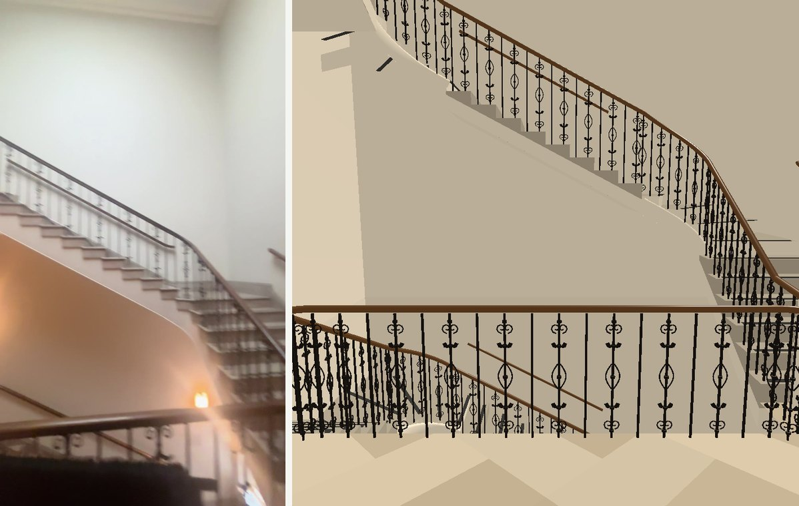
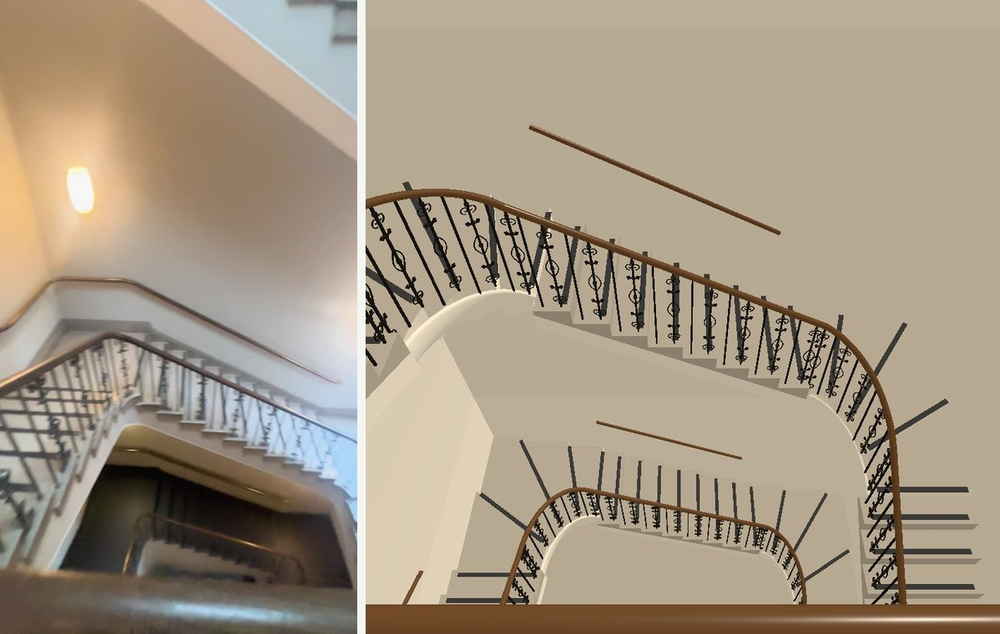
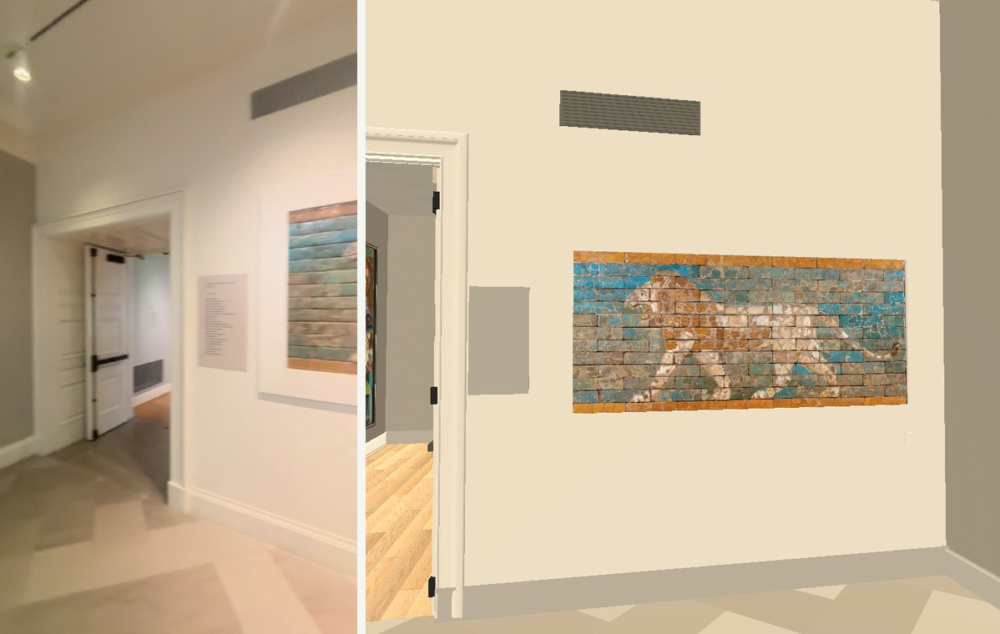
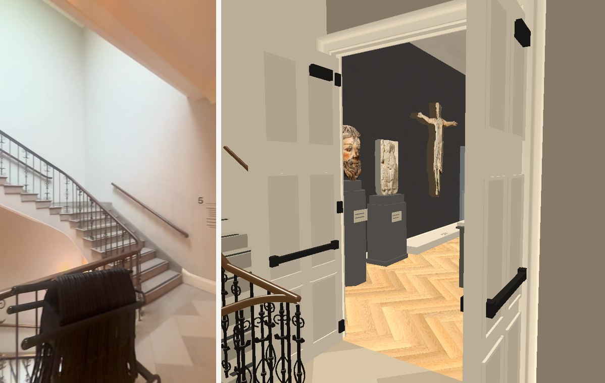

# Stair spaces, issue #276

Worktree `wt-european-west`, branch `feat/stairs-276`, starting commit `ecfda16e`.
Sources only: the orchestrator owns the bake and installation. No paid calls.

## Reference and measurement record

September clips were decoded from `collection-expansion/verified/` using the
specified HLG-to-BT.709 Hable filter. The top-level IMG_6380 file is empty and
IMG_6381 is incomplete (`moov atom not found`); their verified copies decode.
IMG_6343 is SDR. IMG_6381 pictures need a further 180-degree rotation; IMG_6387 needs a further 90-degree counter-clockwise rotation to be upright.
Footage is used only in this evidence folder, never as a game surface.

Initial reads (INFERRED scale; errors include perspective and the assumed door size):

| Feature | Proposed size | Frame / ruler / uncertainty |
| --- | --- | --- |
| Stair guard height | 0.90 m above tread | IMG_6381 3.5, 5.5 s; transfer from the exit leaf, assumed 2.2 ± 0.15 m, in 97.5 s; ± 0.10 m |
| Iron bar section | 0.014 m | IMG_6381 5.5 s, width relative to guard height; ± 0.004 m |
| Ornament width | 0.11 m, within one 0.175 m bar pitch | IMG_6381 5.5 s, curls fit inside two adjacent plain bars; ± 0.03 m |
| Oak handrail | 0.065 × 0.050 m | IMG_6381 3.5, 5.5 s, guard-height ruler; ± 0.015 m |
| Cage / volute diameter | 0.36 / 0.43 m | IMG_6381 3.5, 5.5 s, guard-height ruler; ± 0.06 m |
| Marble tile | Retain 0.76 m at 45 degrees | IMG_6343 84, 87 s and IMG_6381 97.5 s; existing size agrees visually, ± 0.12 m |
| Niche opening | About 1.0 m wide, 2.6 m to arch crown | IMG_6343 87 s and IMG_6380 35.5 s, nearby passage leaf assumed 2.6 ± 0.2 m; ± 0.15 / 0.25 m |

The existing room footprint, riser count, and upper floor heights are retained
until comparison warrants a named room-plan edit. They are provisional estimates,
not a measured survey. Further rulers and pixel ratios will be recorded with each part.

## Ordered work

1. Census 8.1 and 8.7: repeated scroll/leaf ironwork, cage newel, swept oak volute,
   curved bottom step; push after draft and checks.
2. Census 8.2: close pale marble tones, procedural veins, polished response and
   grey marble base at the room's own internal walls; retain diagonal layout.
3. Census 8.3: hollow round-headed niche, olive lining, descending steps and rail.
4. Census 8.5–6: full three-part window, engaged columns, near-white shell,
   finished landing surfaces; use the existing ceiling/trim kit.
5. Census 10: white shaft, curved guard and ornament, warm stone tones, lion wall
   and source-backed incidental details. Door casings/lamps remain the kit's work.
6. Census 7.3 / 8.8: replace the grey gallery's two columns and their beam detail.

## Source locations and scope

The two grey gallery columns are built in `remodel_room.gd`,
`build_grey_gallery()`: the loop over z `[-2.6, .2]`, shafts at x 15.65 in its
old builder frame, capital loaded from `ionic-capital-geometry.json`, followed by
`column_beam` and `column_end_pilaster`. `shift_new` later subtracts 4.6 m in x
and the reveal depth in z. These are the columns facing the marble hall.

At the first checkpoint, production edits are confined to `marble_hall_additions.gd`. No doorway or route trial has moved.
The east wall under the half-landing, its exit leaves/opening and east plan end
belong to #277. Chandelier/camera, chimneypiece reconstruction, shared lamps,
casings, DEEP_REVEALS, skirting/cornice kit, frozen seams and playtests are outside scope.

## Verification

Reference frames inspected: IMG_6381 3.5, 5.5, 28.5, 59.5, 97.5;
IMG_6387 15, 27; IMG_6380 35.5, 44.5, 70.5; IMG_6343 84, 87 s.
No final-bake claim. The checkpoints below record draft comparisons.

## Part 1 preflight

The scroll template is 812 drawn triangles, 0.11376 m wide and 0.87 m high.
The earlier 646 figure counted vertices in an indexed mesh and was wrong. Mixing
indexed primitives with hand-built unindexed faces also suppressed the curls;
the Batch now deindexes primitives before combining them with swept geometry.
A primitive-only comparison with HEAD verifies identical triangle positions,
winding and UVs (164 triangles); normals differ by at most 0.0000741 from the
additional native normal packing. The chandelier and fireplace builders have no edits.

Godot 4.7.2 parses the source. `git diff --check` passes. The first `--draft`
rebuild is queued behind other agents and a bake; no picture claim yet.

**Inherited repository-check failure at ecfda16e:** `scripts/check.sh` exits 1
at `REPRESENTATION_CHECK`: 37.114, 20.254 and 59.131 are declared as mesh but
`place_mesh()` is absent from the installed medieval additions. The authored
medieval source contains it; the generated copy is older. This check loads
`collection_rooms/`, not the modified stair sources. No generated file was
changed to conceal the failure. A refreshed green base has been requested.

## Further rulers (INFERRED, pending draft comparison)

The lion panel's recorded catalogue dimensions are 2.286 × 1.041 m
(`collection_rooms/objects.json`, accession 34.652); its physical extent remains unchanged.
In the upright 720 × 1280 IMG_6387 10.5 s frame the visible left panel edge is
about 318 px tall, the adjacent text panel about 193 px. The same wall plane
therefore gives 193/318 × 1.041 = 0.63 m high, ±0.07 m. Its apparent width
is about half its height: propose 0.35 × 0.65 m, width error ±0.07 m including
horizontal foreshortening. The white surround is about 35–45 px against that
318 px edge: 0.13 ±0.03 m, proposed 0.14 m. In IMG_6387 42 s the grille is
above the **left** part of the relief, not centred over it. Propose 0.90 × 0.22 m,
±0.15/0.05 m, centre x 13.85 m and y 3.10 m; those locations retain the
existing catalogue panel placement as the ruler.

The lion landing edge is 4.1 m from the lion wall in census 10.3's earlier
measurement, rather than the authored 5.6 m. Proposed edge z 32.215 (4.115 m
from z 28.1), uncertainty ±0.35 m against IMG_6387 15/27 s and the existing
north-door scale. The three guard-blocking trials will be translated with it;
no doorway intervals or fire-leaf poses will be moved. Upper/lower stair
storeys remain inferred where their destinations leave the footage.

No text will be invented for the directory, level sign or label panels.
Door head/casing/reveal dimensions remain with #273; the existing tall leaves
need that coordinated correction. The lamp/ceiling lighting remains with #274.

Material check: Godot's [renderer feature table](https://docs.godotengine.org/en/4.7/tutorials/rendering/renderers.html)
permits two ReflectionProbes per mesh in Compatibility. The planned floor uses
one local box-projected probe, standard roughness/specular response and a
procedural shader; no screen-space reflection requirement or source image.
Visual reflection quality remains to be checked in GL and in the final bake.

## Part 1 checkpoint — census 8.1 / 8.7

**VERIFIED in GL Compatibility draft pictures:** scrolls, curled folded leaves,
short central ovals, open cage newel, oak volute with a visible hole, curved
bottom step, ornamented upper guard and rounded wall handrail. The closer
6381 5.5 s crop prompted a shorter 0.17 m oval and flatter curled leaves in
place of the first long pointed oval. Vertical ornaments use a stable sweep
plane so their sections do not twist at vertical tangents. Final reusable
panel: **820 triangles**; no added scene node per baluster.

Pictures are unbaked review views with the existing lights; no final daylight
or baked-reflection claim. `part1-draft-final.log`: ARCHITECTURE_CHECK,
`failures: []`, exit 0. Capture: five views, no script/rendering errors.
`git diff --check` passes. `scripts/check.sh` was rerun at the checkpoint and
still exits 1 on the **same three inherited medieval declarations** described
above; it did not print `checks passed`. This exception is visible rather than
silently treated as a green baseline. Integration needs the orchestrator's
refreshed generated rooms. No doorway, plan or route-trial change in part 1.

Only `marble_hall_additions.gd` changed in production. Evidence includes the
standalone draft review cameras; they are not used by the game camera.

## Part 2 checkpoint — census 8.2

**VERIFIED in draft:** the same diagonal 0.76 m squares, close off-white/pale-grey
palette, low-contrast warped mineral veins and grey marble base. The existing
kit baseboard meshes get the finish in this room only; their builder and profile
are untouched. The stair stone and threshold use the same procedural material.
No source photograph is bound to any of these surfaces.

Vein contrast was reduced after the first comparison. Specular 0.55 and roughness
0.13–0.17 describe a polished material, with one static local box-projected
ReflectionProbe. **INFERRED polish/reflection quality:** these unbaked views do
not yet demonstrate the strong window/spot reflections in the film. Recheck
after the brighter window checkpoint and the orchestrator's final lighting bake.

Draft rebuild exit 0, ARCHITECTURE_CHECK `failures: []`; GL capture exit 0,
no script/shader errors. Whitespace check passes. The checkpoint repository
check still exits 1 on the same inherited medieval mesh records; no green
baseline claim. No outside production edit, doorway or route-trial change.

## Mid-build visual review

The niche source was refreshed in the preceding draft while the full rebuild
waited behind the host lock. Its whole arch and a downward view show the olive
vault and handrail; small rounded stone nosings were added so the descending
treads remain legible before the final shadow bake. Proposed descent: 8 treads,
250 ±50 mm going, 145 ±30 mm rise, about 2.16 ±0.35 m visible depth, inferred
from IMG_6343 87 s / IMG_6380 70.5 s against the adjacent door; the destination
below is not surveyed.

Scratch-only lion/window previews used the same one draft directory, then
restored the pending niche source and original landing/plan. Our queued draft
was held briefly during the source refresh and resumed immediately afterwards.
Production still contains only parts 1–3 at this point. The window preview
exposed the upper-floor helper retaining ground-floor height after the service
void refactor; fixed in the pending part 4 before it reaches production. The
arm over the chimneypiece will receive the same marble finish as the broad
upper floor. Four fan treads now replace adjoining straight risers at each lion
turn; all 29 height intervals per storey are retained, with rounded stringers.

## Window and column rulers (INFERRED)

| Feature | Authored size | Frame / scale / uncertainty |
| --- | --- | --- |
| Central window light | 1.34 m wide, 2.90 m straight plus 0.67 m round head | IMG_6381 28.5 s, relative to existing 1.60 m flight width and transferred 2.2 m door ruler; ±0.15 m width / ±0.30 m height |
| Side lights | 0.60 × 2.80 m | Same frame and plane; ±0.10 / ±0.25 m |
| Engaged columns | 0.19 m inner / 0.12 m outer diameter | Same frame, centre-light width ruler; ±0.04 / ±0.03 m |
| Window sill | 0.95 m above the 2.90 m half-landing | IMG_6381 28.5 s, guard-height comparison; ±0.15 m |
| Gallery plain columns | 0.22 m shaft, 0.38 m round base, 0.36 m capital; head 3.10 m | IMG_6380 35.5 / 44.5 s, IMG_6343 84 s; transferred adjacent-door ruler; ±0.04 / ±0.06 / ±0.06 / ±0.25 m |
| Beam dentils | 0.10 m pitch, 0.055 m high | IMG_6380 44.5 s, shaft-width comparison; ±0.025 / ±0.015 m |

Those are model dimensions, not a survey. The marble hall's 8.0 m room height,
2.90 m half-landing, 4.495 m upper floor and 13 straight lower treads retain
the inherited plan. The lion stair retains 29 × 0.155 m = 4.495 m per storey;
its four fan treads at each turn redistribute the same rise.

Bake source inspection: `remodel_bake.gd` preserves custom ShaderMaterial
overrides except its named oak-floor/PS1 conversions. `load_bake()` retains
the live authored ReflectionProbe and installs the baked materials/meshes.
That supports compatibility, but does not verify final baked reflections.

## Part 3 checkpoint — census 8.3

**VERIFIED in the freshly rebuilt draft:** a shaped round arch, olive barrel
vault and returns, eight descending stone treads with rounded nosings, and a
sloping rail with three wall brackets. The floor mesh is clipped at the
service stair so the descent is visible; the existing room-plan/service floor
void is unchanged. Its depth, riser count and destination remain **INFERRED**.
This service stair is a visible reconstruction, not a new traversable room.

`part3-draft.log`: exit 0, ARCHITECTURE_CHECK `failures: []`. Both whole-arch
and downward review captures exit 0 without script/shader errors. Retained
Hall resources emit inherited UID warnings and load by text path. Whitespace
passes. `part3-check-final.log` still exits 1 on the same three inherited
medieval declarations; it does not print `checks passed`.

Production change remains solely `marble_hall_additions.gd`. No doorway or
route trial added/moved, no east-plan change, no under-stair exit-leaf edit.

## Part 4 checkpoint — census 8.5–7

**VERIFIED in the corrected GL draft:** tall centre arch and two side lights,
four engaged columns with stepped bases/small capitals, glazing bars, paired
arch profiles, deep sill with two louvred grilles, near-white wall finishes,
rounded stair-wall corners and curved stringers. The existing cornice and
ceiling/lighting builders were retained. The upper floor and its arm have
pale veined tiles and grey borders; their plaster faces use the kit white.

The window grid now appears in the ground-floor reflection, **VERIFIED**.
Probe intensity is 2.0; roughness/specular remain the part 2 material.
**INFERRED**: final daylight balance, baked shadows/reflections, and the
unsurveyed upper-room destinations. The draft's inherited lighting is warm.
The physical upper-floor fascia remains plain near-white plaster, rather
than deleting the floor it supports.

Review caught and corrected two tile-helper mistakes: upper tiles retaining
ground height, and the niche cut also cutting the upper arm. That cut now
applies only below 0.02 m. A trial per-probe resolution assignment was
unsupported by 4.7.2 and was removed; its capture began before import ended
and is discarded. The final capture used the completed import and current
source (SHA-256 `275d40431e3fd134afa473ee89d81d5157068296ce8ef0737e7ff02737e98bc5`).

`part4-draft-corrected.log`: exit 0, ARCHITECTURE_CHECK `failures: []`.
Seven final review views: exit 0, no script/shader errors. Whitespace passes.
The push check still fails on the same three inherited medieval declarations;
no `checks passed` claim. Only the marble additions changed in production.
No doorway, room-plan or route-trial change; #277's opening/east plan remains.

## Bake attachment review

The bake writes mesh names as `source_path`. The room's existing `_ready()`
assigns unique `AuthoredSurface%03d` names to every non-visitor mesh before
`load_bake()`, so no new naming helper is needed. A provisional duplicate-name
helper was removed before the checkpoint. The review capture now reports
room geometry budgets and checks those existing final names.

A scratch column preview copied the raw shared builder over the draft's
adapted version and attempted to load the retained Hall bake as an additions
bake. That preview is discarded; the final column proof will come from the
normal draft pipeline with its adapted paths. Production still has parts 1–5.

## Lion landing fit correction

The shortened central landing exposed an inherited plan mismatch: the west
opening ends at z 32.615, beyond the new central edge z 32.215. The first
revised draft showed its folded south fire leaf intersecting the west treads.
The landing now has a 0.45 m west extension to z 32.665 (the existing opening
end plus 0.05 m clearance), x 10.55–11.671. This dimension is **INFERRED** from
the current plan/leaf pose, not a surveyed floor measurement; IMG_6387 15 s
shows the leaf on a landing ahead of the flight. The west going becomes
0.261125 m, east remains 0.317375 m, rise/storey heights remain unchanged.
Its guard has a matching west return and an invisible connecting collider.
The new `lion west landing ear` floor patch supports that extension. No
doorway interval or fire-leaf pose is changed.

The first full lion capture produced its eight views, then the statistics
helper called an ArrayMesh-only method on a BoxMesh and hung. It was stopped;
the helper now uses the generic [Mesh.surface_get_arrays() API](https://docs.godotengine.org/en/4.7/classes/class_mesh.html#class-mesh-method-surface-get-arrays).
A new draft/capture will verify the fit correction and complete cleanly.

## Part 5 checkpoint — census 10.1–8

**VERIFIED in final draft pictures:** near-white shaft instead of the dark
well, the same scroll/leaf mesh and oak/iron finishes as the marble hall,
curved guard returns, fan treads and white curved stringers, wall rails,
continuation through two storeys below, warmer two-tone stone slab weave,
white six-panel fire leaves with closers/hinges and the existing push bars.
The corrected west landing supports the folded leaf and the white shaft
finish clears the doorway. Its existing kit skirting calls clip to the floor
edge on each side; no shared profile/casing/cornice builder was edited.

The lion wall is white, the landing's west/east walls remain grey. The
relief's existing catalogue image/dimensions are retained, with a wider
flush white surround, left louvred vent, tall grey panel and small label.
Fire strobe, pull, access panel and a blank directory carrier are built.
No lettering or source video texture was added. The original laylight and
lighting nodes were retained. **INFERRED/pending:** final daylit balance,
unsurveyed stair destinations, and the floor extension inferred from the
existing folded-leaf pose. Door heads/kit reveals still need #273's correction.

`part5-draft-final.log` and the updated-source
`part5-architecture-push.log`: exit 0, ARCHITECTURE_CHECK `failures: []`.
Eight final Compatibility views: exit 0, no script/shader errors. Snapshot
landing source SHA-256 `58d2c421d3311690b0a193a67696051306a09e583d7a794ff6492c4c880e81e8`.
Constructed geometry by mesh AABB centre (including existing fixtures and
ceilings): marble hall 65 meshes / 61,897 triangles; lion landing 89 / 117,124.
All final authored bake names are unique; template remains 820 triangles.
Whitespace passes. The push repository check exits 1 on the same inherited
37.114 / 20.254 / 59.131 declarations; it still does not print `checks passed`.

### Named plan edit / route handoff

Only the separate #276 block in `prepare_remodel.py` changed outside the two
additions: south room extent 37.615 → 36.115, central floor void begins
33.715 → 32.215, matching north-floor collision patch, and one new
`lion west landing ear` floor patch x 10.55–11.671, z 32.215–32.665.
The west guard/connector follows that floor extension. No doorway moved,
no room or route trial was added. Existing blocked trials changed as follows:

| Trial | Before: start → target | After: start → target |
| --- | --- | --- |
| `landing_guard_blocked` | (13.35, .25, 32.7) → (13.35, 0, 34.6) | (13.35, .25, 31.6) → (13.35, 0, 33.1) |
| `landing_stair_foot_blocked` | (11.15, .25, 32.9) → (11.15, 0, 34.6) | (11.15, .25, 31.6) → (11.15, 0, 33.1) |
| `landing_flight_down_blocked` | (15.55, .25, 32.9) → (15.55, 0, 34.6) | (15.55, .25, 31.6) → (15.55, 0, 33.1) |

They retain `blocked = true`. The orchestrator must run the post-bake
`museum_playtest.gd --only=doors`, including these three trials and the
existing medieval/lion, modern/lion and sculpture/lion doorway crossings.
That playtest cannot validate a draft and was not run against it.
