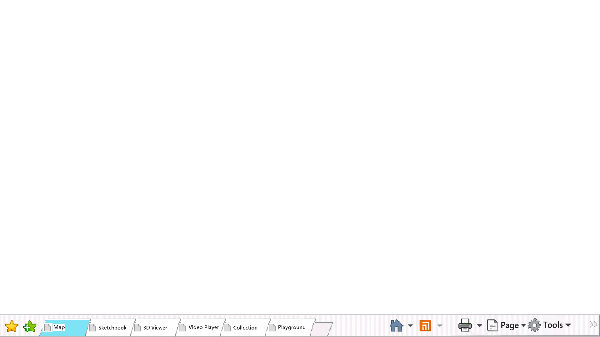
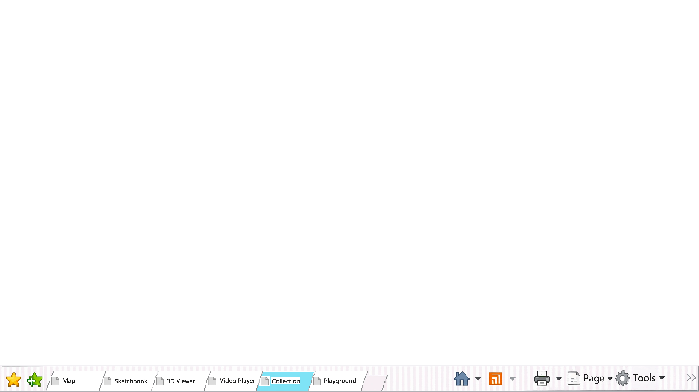
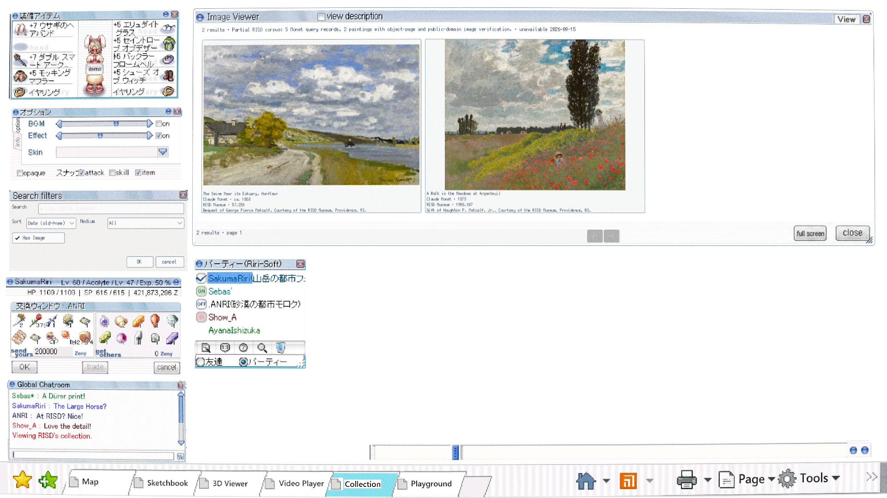
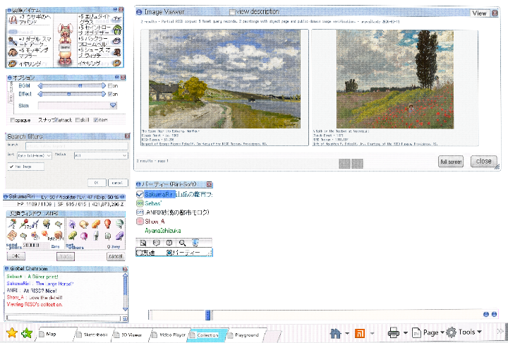
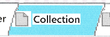

# Compact selected tabs — production candidate

The Shell's six fixed tabs stop at 380 source pixels, retain complete labels and
page icons at 65 percent, and leave more of the toolbar visible before the
right-hand icon cluster. Selection switches directly to the independently reviewed
blue face and holds it.

The native Shell playtest passed every tab, page, timing, freeze, resize, pressed
state and pixel check. Its film records the steady blue endpoint for both Map and
Collection. The reusable non-Shell tab strip
keeps its original geometry and passed its existing playtest unchanged.

The exact `dab7341` Web export selected all six tabs at 1920×1080 and
720×486, measured each at 380 source pixels, returned to Collection, and found
the settled blue crop unchanged after another 160 ms. No browser or network
errors were observed.

Muse produced the recorded blue donor through OpenRouter. Three one-output
Seedance requests are preserved as unreconciled and possibly spent; the third
duplicated the repaired-anchor request before that earlier run was accounted for.
Maximum liability is $0.55 including Muse. Existing runs are reconcile-only and
must not be retried. No generated video is used. The requested entrance remains
disabled until a certified generated Motion Pass exists.
