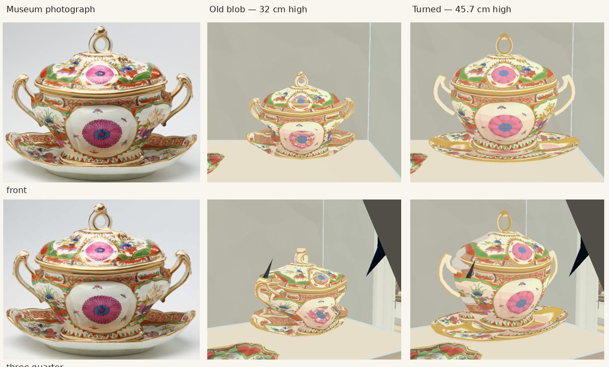
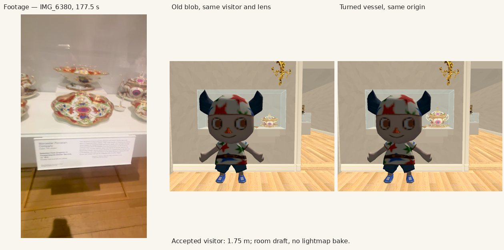

# Turned vessels: measurements and review

Started 8 October 2026, 19:22 UTC, on `feat/vessels-turned` in `wt-medieval`. Sources only; no room bake or install. No paid calls. Deadline and scope are the owner’s task beside #263; no interface, errors, frozen tests, doors or route trials are in scope.

## 1. Measurement and plan

1. **VERIFIED from records:** 32 one-view blobs, all Rockefeller. Ten vessels/bowl-and-handle objects, 22 figures or figural ornaments; see LIST.md. The figural bear jugs, candlesticks and branching sconces stay blobs. The European gallery’s 24 shortfalls are other representation types, outside this instruction.
2. **VERIFIED from source:** the accepted dish path is `dish_asset()` in prepare_remodel.py: a faceted hollow ring profile, catalogue metres, photograph-derived outline/UVs. `build_catalogue_objects()` in remodel_room.gd draws its triangles. `build_tureen()` also contains an unused 16-sided turned example. Reuse the ring-profile idiom, with measured body/lid/stand rows and separate open handles/spouts, in a private vessels additions file.
3. **Catalogue measurement:** exemplar `tureen`, 2017.74.39.18a-c, 45.7 cm high × 55.9 cm wide × 35.6 cm deep. Current blob is 32 × 42 × 26.7 cm. Correct those three dimensions at its existing origin and yaw. This has the largest bounding volume among the turned works (0.091 m³; the sauce tureen is taller at 48.3 cm but narrower in depth, 0.082 m³). No placement changes. Silhouette pixel measurements and error will be added before the exemplar commit.
4. **Draft review plan:** museum photograph left, old blob centre, new turned vessel right, front and three-quarter; also its actual display beside the accepted visitor. Inspect body/foot/lid/handle shapes, hollow openings and texture stretching. Record faults, then push the exemplar alone before extending to the other works.
5. **Census checklist:** objects census’s vessel blobs and Rockefeller 32 shortfalls are ours only for the ten in LIST.md. Room census Rockefeller findings 1–7 (ceiling, ghost shadow, lighting, wall colour, door trim, cuboid bases and labels) and European findings 1–9 are other jobs. In this draft their deficiencies must not be mistaken for vessel acceptance.

## 2. Scope and edits

Planned shared edits: one named ADDITIONS entry in remodel_room.gd; a separate preparation block in prepare_remodel.py; authored representation declarations only. rebuild_rooms.sh explicitly preserves objects.json and representation.json as authored records although their directory contains generated rooms. No generated room scenes, textures or bake files will be edited or committed.

Doors and route trials added/moved: none. Works moved: none. Sizes changed only to the catalogue dimensions, listed per work below.

## 3. Inherited integration checks

After a local editor import, the baseline has no Godot script/import errors. `scripts/check.sh` exits 1 at REPRESENTATION_CHECK (the owner explicitly authorizes these inherited differences; it does not print `checks passed`). Built/declared count: 177/177. The exact inherited failures are:

- `recamier (Rockefeller) is in the build and not declared`
- `06.057 is declared as mesh but no place_mesh() put it there`
- `83.152 is declared as mesh but no place_mesh() put it there`
- `37.201 is declared and not in the build`

The first pre-import run also lacked cached GLB and JPEG imports and reported 13 representation failures. `timeout 420 godot --headless --editor --import --path .` resolved those local cache errors; the four above remain. No generated room was changed. `python3 scripts/check_museum_records.py` passes: 177 works, 58 shortfalls. The first `--draft` acquired the host lock after roughly 30 minutes and finished at 20:00 UTC. `ARCHITECTURE_CHECK` reports `failures: []` (21 casings, 16 case rails); no bake or install. The same working-tree sources are used for the exemplar pictures.

## 4. Exemplar measurements and first inspection (before the room draft)

- Catalogue 2017.74.39.18a-c: 45.7 h × 55.9 w × 35.6 d cm, including the separate stand and handles. Source `objects.json`, museum reference `references/tureen-catalogue-0.png` (1324 × 993 px). The photographed object spans approximately x 200–1162, y 118–887 (±6 px at the edge; shadow excluded). Its front and the smaller second museum photograph are both inspected.
- Same saved colour source as the blob: `trial/tureen-original.webp`, 1760 × 1440. Exact isolated-object crop x 201, y 170, w 1366, h 1122. Each profile row in `additions/vessels-turned/profiles.json` records radius/width and height/full height; the geometry points also overlay the museum photograph’s 962 × 771 px bounds (centre x 681, bottom y 889) within ±15 px at the body/lid, while `crop_px` is the RGB isolate’s texture crop. The body/lid outline is within approximately ±20 px (±8 mm at catalogue scale); handles ±15 px (±6 mm); the stand has ±40 px (±16 mm) perspective uncertainty. Averaging the left/right contour into one axis is INFERRED.
- Four separate swept profiles: a hollow 32-sided stand, ring foot, body and removable-looking lid; two eight-sided curved open handles, a real lid loop and its curled terminal. The reference’s scalloped dish depth and hidden sides are not measured exactly. Front photograph decoration repeats on the reverse; it is not an observed rear.
- First geometry preview exposed pink isolation backdrop on the stand and the old broad hue key deleting pink flowers. The vessel-only preparation block now keys the near-pure magenta backdrop, including its dark shadow, while preserving the object’s pink RGB. This reuses the existing isolate; no new image generation. Separate stand UV rows follow the photographed dish contour rather than projecting the vessel foot onto its rim.
- Footage inspection: intact clip is `collection-expansion/verified/IMG_6380.MOV`; the specified top-level IMG_6380.MOV is a zero-byte placeholder. Extracted 173–181.5 s at 2 fps with the specified HLG→709/Hable filter. Gold service is clear at 173.0/173.5 s, pink service at 177.0/177.5/178.0 s. The 177.5 s frame is the pink-service reference for the draft comparison. No architectural or artwork video texture is added.
- The records confirm suspicious catalogue dimensions for the agate teapot (13.3 × 45.7 cm) and the two pink tureens (45.7 and 48.3 cm tall). These numbers disagree with the photographs/footage’s relative proportions; the task explicitly asks to correct built sizes to these catalogue rows, so those corrections will be applied and reported, without altering placements or quietly editing the museum records.

The previews above are an isolated geometry fixture, not room-draft acceptance. Room pictures, faults and final verification follow after the host lock clears.

## 5. Exemplar: stopped and looked, in the draft room

**VERIFIED in the pictures:** eight separate modelled parts, a continuous oval turned body, a separate lid and foot, a hollow stand, open side handles and an open lid loop. The flower medallions survive. The vessel sits at the old origin, room-scene `(-0.700000, 1.100000, 0.720000)` m, same yaw; no works or supports were moved. Independent complete-mesh measurement in [exemplar-measurements.json](exemplar-measurements.json): `(0.559000, 0.457000, 0.356000)` m, under 0.1 mm from the catalogue target. The old authored blob target was `(0.420, 0.320, 0.267)` m. The visitor is the unchanged accepted character package, set to the game's 1.75 m height; copied to the draft only for the evidence.

**What is wrong with it:**

1. **VERIFIED:** the handles' overall loops are modelled, but their foliate curls and raised ridges are simplified to swept, faceted tubes. The lid terminal is also simpler than the museum's curled leaf. They need a closer silhouette/detail pass if this degree of low-poly simplification is rejected.
2. **VERIFIED:** the side stretches the front picture's medallion into the turned body; the stand's decoration is likewise projected from the front view. **INFERRED:** rear decoration repeats the front, without a measured rear photograph. This is the same front-image limitation as the accepted profile path, not complete rear fidelity.
3. **VERIFIED:** corrected catalogue height makes this assembly much taller than the other provisional pink-service blobs. **INFERRED:** the catalogue rows and the filmed service may disagree in identity or measurement; the source records alone cannot resolve it. The requested catalogue correction is applied and explicitly visible in the before/after.
4. **VERIFIED:** case/wall colour, lighting and the support remain the draft's unfinished architecture (room census Rockefeller findings 3, 4 and 6). No lighting or case code was changed. The first oblique capture crossed the existing glass edge; the final comparison looks obliquely from the other side of the case. No case or work was moved to get it.

The room draft uses GL Compatibility on the RTX (driver falls back to GLES 3.1). Captures and the architecture check complete; no SCRIPT ERROR / ERROR lines. The retained Hall reports invalid resource UIDs and falls back to the valid text paths; these are warnings in the copied project, outside this work. The draft has no new lightmap bake. `scripts/check.sh` was rerun before this push: the same four inherited REPRESENTATION_CHECK failures, no new import/script errors. `git diff --check` and `python3 scripts/check_museum_records.py` pass; 177 records, 57 shortfalls after the exemplar.

Exact edits outside `vessels_turned_additions.gd` for this commit: one named `ADDITIONS` entry in `remodel_room.gd`; one vessel-only RGB preparation block in `prepare_remodel.py`; authored `representation.json` changes only `tureen` to `profile` and removes its shortfall; new measured `image-work/collection-room-remodel/additions/vessels-turned/profiles.json`; a provenance paragraph in `modules/shell/PROVENANCE.md`; these review documents, `capture.gd`, images, sizes/hashes and index. No `main_build_walk.gd` edit, door/route change or generated scene/asset/bake commit.
