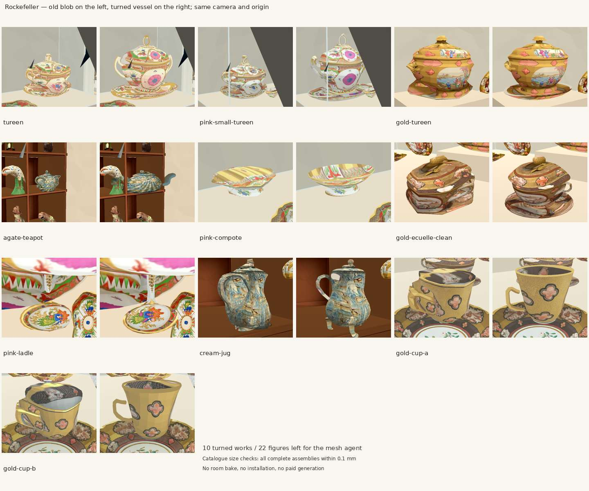
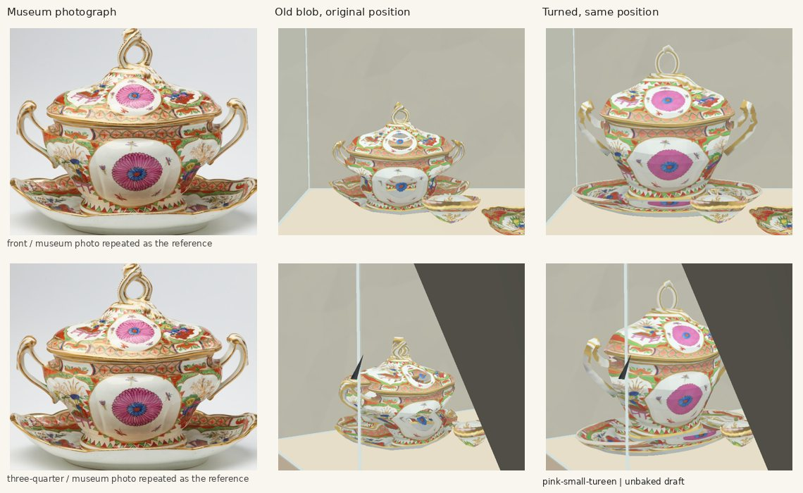
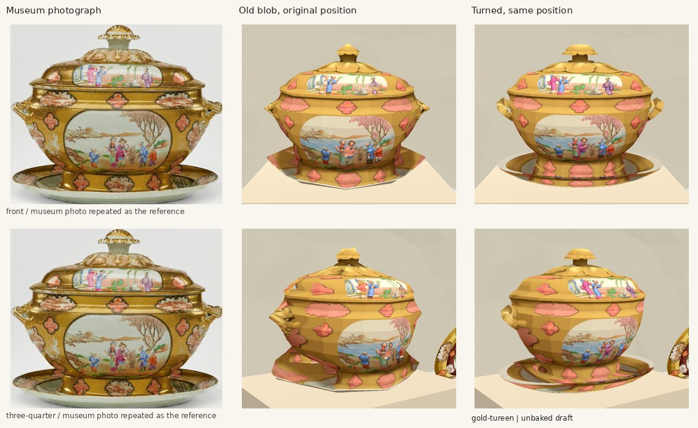
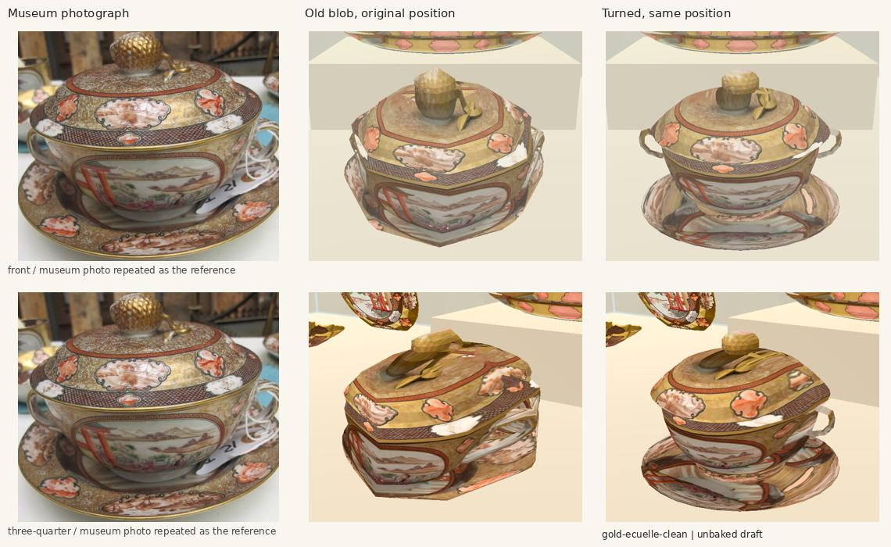
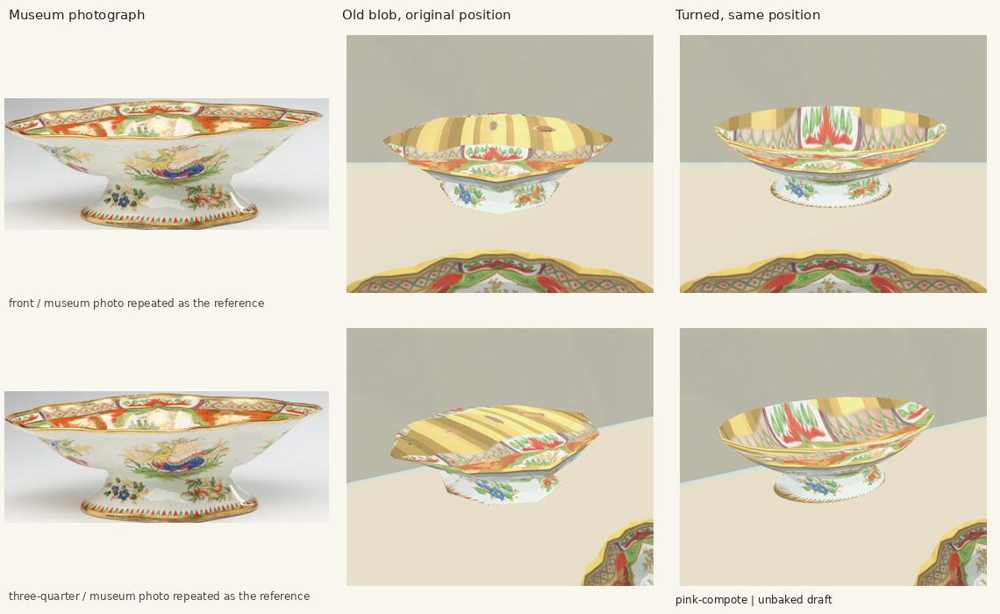
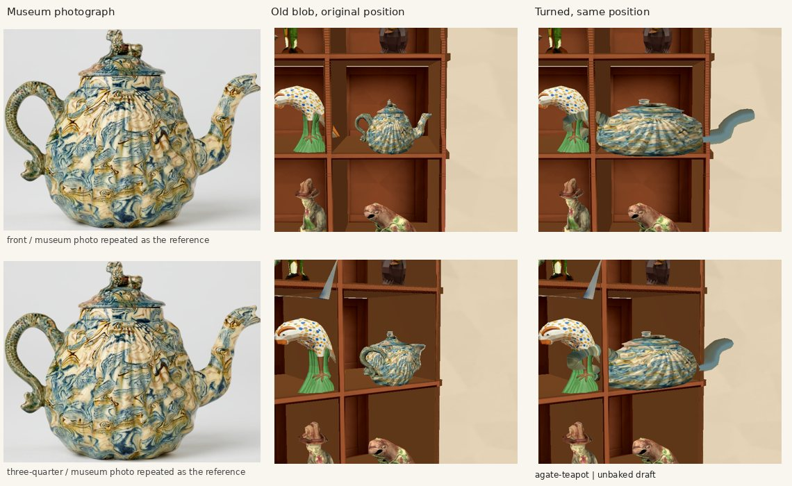
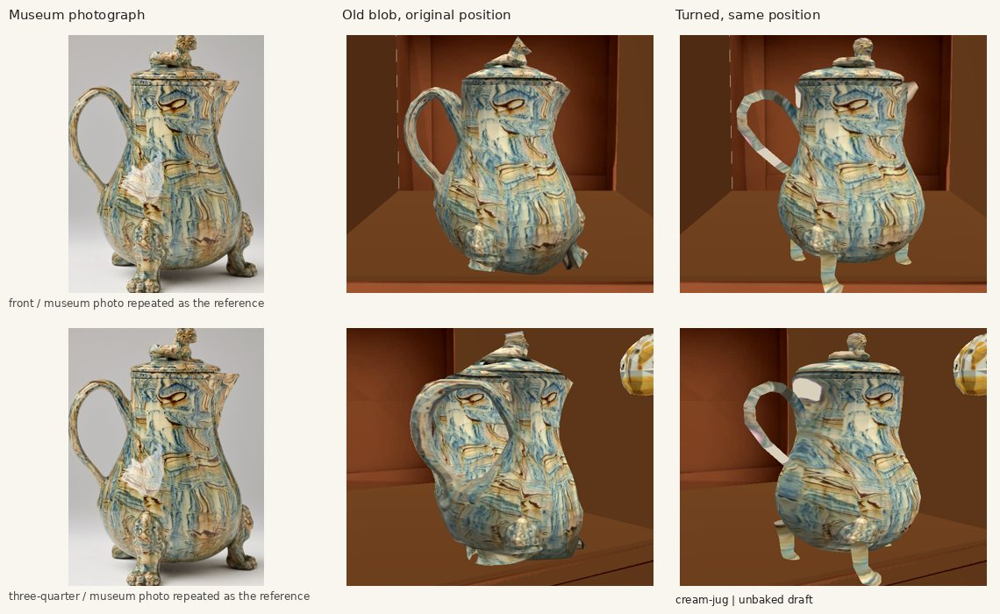
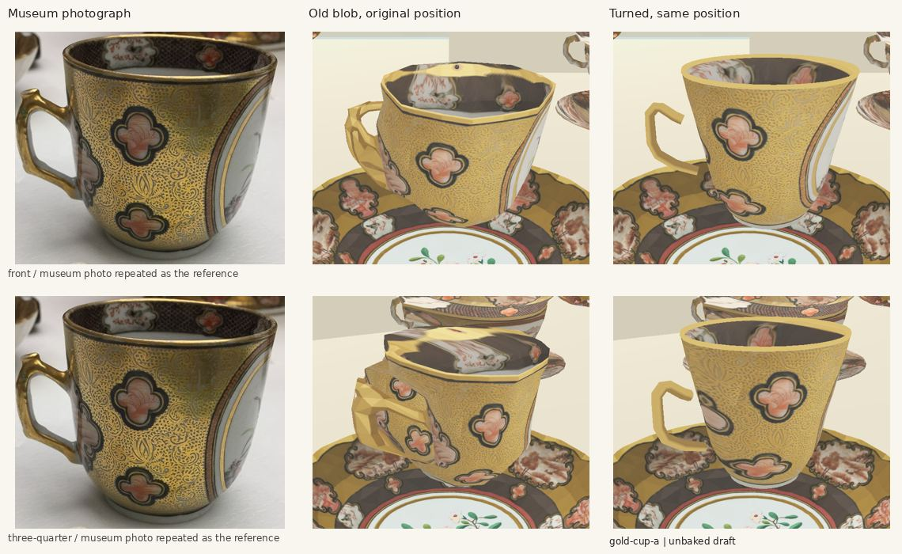
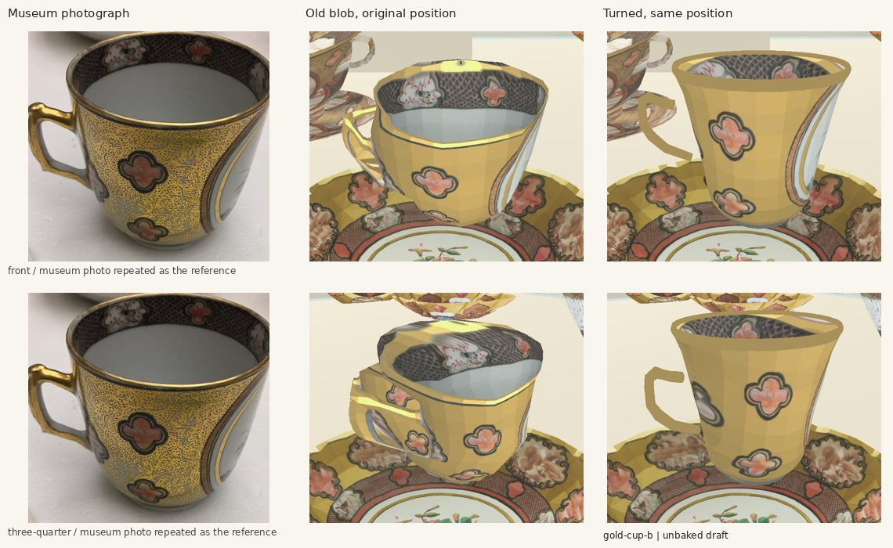
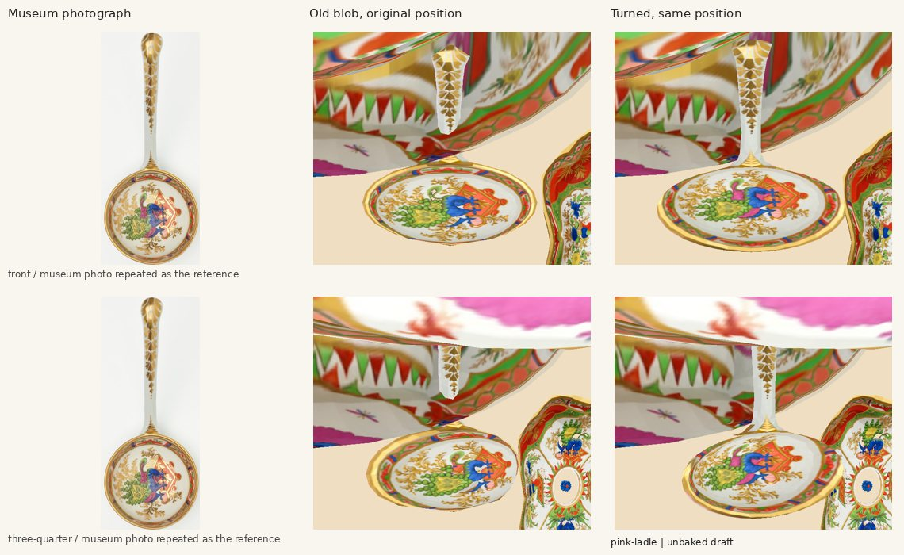

# Turned vessels: measurements and review

Started 8 October 2026, 19:22 UTC, on `feat/vessels-turned` in `wt-medieval`. Sources only; no room bake or install. No paid calls. Deadline and scope are the owner’s task beside #263; no interface, errors, frozen tests, doors or route trials are in scope.

## 1. Measurement and plan

1. **VERIFIED from records:** 32 one-view blobs, all Rockefeller. Ten vessels/bowl-and-handle objects, 22 figures or figural ornaments; see LIST.md. The figural bear jugs, candlesticks and branching sconces stay blobs. The European gallery’s 24 shortfalls are other representation types, outside this instruction.
2. **VERIFIED from source:** the accepted dish path is `dish_asset()` in prepare_remodel.py: a faceted hollow ring profile, catalogue metres, photograph-derived outline/UVs. `build_catalogue_objects()` in remodel_room.gd draws its triangles. `build_tureen()` also contains an unused 16-sided turned example. Reuse the ring-profile idiom, with measured body/lid/stand rows and separate open handles/spouts, in a private vessels additions file.
3. **Catalogue measurement:** exemplar `tureen`, 2017.74.39.18a-c, 45.7 cm high × 55.9 cm wide × 35.6 cm deep. Current blob is 32 × 42 × 26.7 cm. Correct those three dimensions at its existing origin and yaw. This has the largest bounding volume among the turned works (0.091 m³; the sauce tureen is taller at 48.3 cm but narrower in depth, 0.082 m³). No placement changes. Silhouette pixel measurements and error will be added before the exemplar commit.
4. **Draft review plan:** museum photograph left, old blob centre, new turned vessel right, front and three-quarter; also its actual display beside the accepted visitor. Inspect body/foot/lid/handle shapes, hollow openings and texture stretching. Record faults, then push the exemplar alone before extending to the other works.
5. **Census checklist:** objects census’s vessel blobs and Rockefeller 32 shortfalls are ours only for the ten in LIST.md. Room census Rockefeller findings 1–7 (ceiling, ghost shadow, lighting, wall colour, door trim, cuboid bases and labels) and European findings 1–9 are other jobs. In this draft their deficiencies must not be mistaken for vessel acceptance.

## 2. Scope and edits

Planned shared edits: one named ADDITIONS entry in remodel_room.gd; a separate preparation block in prepare_remodel.py; authored representation declarations only. rebuild_rooms.sh explicitly preserves objects.json and representation.json as authored records although their directory contains generated rooms. No generated room scenes, textures or bake files will be edited or committed.

Doors and route trials added/moved: none. Works moved: none. Sizes changed only to the catalogue dimensions, listed per work below.

## 3. Inherited integration checks

After a local editor import, the baseline has no Godot script/import errors. `scripts/check.sh` exits 1 at REPRESENTATION_CHECK (the owner explicitly authorizes these inherited differences; it does not print `checks passed`). Built/declared count: 177/177. The exact inherited failures are:

- `recamier (Rockefeller) is in the build and not declared`
- `06.057 is declared as mesh but no place_mesh() put it there`
- `83.152 is declared as mesh but no place_mesh() put it there`
- `37.201 is declared and not in the build`

The first pre-import run also lacked cached GLB and JPEG imports and reported 13 representation failures. `timeout 420 godot --headless --editor --import --path .` resolved those local cache errors; the four above remain. No generated room was changed. `python3 scripts/check_museum_records.py` passes: 177 works, 58 shortfalls. The first `--draft` acquired the host lock after roughly 30 minutes and finished at 20:00 UTC. `ARCHITECTURE_CHECK` reports `failures: []` (21 casings, 16 case rails); no bake or install. The same working-tree sources are used for the exemplar pictures.

## 4. Exemplar measurements and first inspection (before the room draft)

- Catalogue 2017.74.39.18a-c: 45.7 h × 55.9 w × 35.6 d cm, including the separate stand and handles. Source `objects.json`, museum reference `references/tureen-catalogue-0.png` (1324 × 993 px). The photographed object spans approximately x 200–1162, y 118–887 (±6 px at the edge; shadow excluded). Its front and the smaller second museum photograph are both inspected.
- Same saved colour source as the blob: `trial/tureen-original.webp`, 1760 × 1440. Exact isolated-object crop x 201, y 170, w 1366, h 1122. Each profile row in `additions/vessels-turned/profiles.json` records radius/width and height/full height; the geometry points also overlay the museum photograph’s 962 × 771 px bounds (centre x 681, bottom y 889) within ±15 px at the body/lid, while `crop_px` is the RGB isolate’s texture crop. The body/lid outline is within approximately ±20 px (±8 mm at catalogue scale); handles ±15 px (±6 mm); the stand has ±40 px (±16 mm) perspective uncertainty. Averaging the left/right contour into one axis is INFERRED.
- Four separate swept profiles: a hollow 32-sided stand, ring foot, body and removable-looking lid; two eight-sided curved open handles, a real lid loop and its curled terminal. The reference’s scalloped dish depth and hidden sides are not measured exactly. Front photograph decoration repeats on the reverse; it is not an observed rear.
- First geometry preview exposed pink isolation backdrop on the stand and the old broad hue key deleting pink flowers. The vessel-only preparation block now keys the near-pure magenta backdrop, including its dark shadow, while preserving the object’s pink RGB. This reuses the existing isolate; no new image generation. Separate stand UV rows follow the photographed dish contour rather than projecting the vessel foot onto its rim.
- Footage inspection: intact clip is `collection-expansion/verified/IMG_6380.MOV`; the specified top-level IMG_6380.MOV is a zero-byte placeholder. Extracted 173–181.5 s at 2 fps with the specified HLG→709/Hable filter. Gold service is clear at 173.0/173.5 s, pink service at 177.0/177.5/178.0 s. The 177.5 s frame is the pink-service reference for the draft comparison. No architectural or artwork video texture is added.
- The records confirm suspicious catalogue dimensions for the agate teapot (13.3 × 45.7 cm) and the two pink tureens (45.7 and 48.3 cm tall). These numbers disagree with the photographs/footage’s relative proportions; the task explicitly asks to correct built sizes to these catalogue rows, so those corrections will be applied and reported, without altering placements or quietly editing the museum records.

The previews above are an isolated geometry fixture, not room-draft acceptance. Room pictures, faults and final verification follow after the host lock clears.

## 5. Exemplar: stopped and looked, in the draft room

**VERIFIED in the pictures:** eight separate modelled parts, a continuous oval turned body, a separate lid and foot, a hollow stand, open side handles and an open lid loop. The flower medallions survive. The vessel sits at the old origin, room-scene `(-0.700000, 1.100000, 0.720000)` m, same yaw; no works or supports were moved. Independent complete-mesh measurement in [exemplar-measurements.json](exemplar-measurements.json): `(0.559000, 0.457000, 0.356000)` m, under 0.1 mm from the catalogue target. The old authored blob target was `(0.420, 0.320, 0.267)` m. The visitor is the unchanged accepted character package, set to the game's 1.75 m height; copied to the draft only for the evidence.

**What is wrong with it:**

1. **VERIFIED:** the handles' overall loops are modelled, but their foliate curls and raised ridges are simplified to swept, faceted tubes. The lid terminal is also simpler than the museum's curled leaf. They need a closer silhouette/detail pass if this degree of low-poly simplification is rejected.
2. **VERIFIED:** the side stretches the front picture's medallion into the turned body; the stand's decoration is likewise projected from the front view. **INFERRED:** rear decoration repeats the front, without a measured rear photograph. This is the same front-image limitation as the accepted profile path, not complete rear fidelity.
3. **VERIFIED:** corrected catalogue height makes this assembly much taller than the other provisional pink-service blobs. **INFERRED:** the catalogue rows and the filmed service may disagree in identity or measurement; the source records alone cannot resolve it. The requested catalogue correction is applied and explicitly visible in the before/after.
4. **VERIFIED:** case/wall colour, lighting and the support remain the draft's unfinished architecture (room census Rockefeller findings 3, 4 and 6). No lighting or case code was changed. The first oblique capture crossed the existing glass edge; the final comparison looks obliquely from the other side of the case. No case or work was moved to get it.

The room draft uses GL Compatibility on the RTX (driver falls back to GLES 3.1). Captures and the architecture check complete; no SCRIPT ERROR / ERROR lines. The retained Hall reports invalid resource UIDs and falls back to the valid text paths; these are warnings in the copied project, outside this work. The draft has no new lightmap bake. `scripts/check.sh` was rerun before this push: the same four inherited REPRESENTATION_CHECK failures, no new import/script errors. `git diff --check` and `python3 scripts/check_museum_records.py` pass; 177 records, 57 shortfalls after the exemplar.

Exact edits outside `vessels_turned_additions.gd` for this commit: one named `ADDITIONS` entry in `remodel_room.gd`; one vessel-only RGB preparation block in `prepare_remodel.py`; authored `representation.json` changes only `tureen` to `profile` and removes its shortfall; new measured `image-work/collection-room-remodel/additions/vessels-turned/profiles.json`; a provenance paragraph in `modules/shell/PROVENANCE.md`; these review documents, `capture.gd`, images, sizes/hashes and index. No `main_build_walk.gd` edit, door/route change or generated scene/asset/bake commit.

## 6. Remaining Rockefeller works: source and size ledger

All 32 blobs are in Rockefeller, so there is one remaining room commit. Ten become `profile`; the 22 figures in LIST.md remain blobs. The records check passes with 177 works and 48 shortfalls (22 Rockefeller, 24 adjacent/European, one Renaissance, one lion landing). No European declaration is changed.

The rows below use width × height × depth, in metres. **VERIFIED in the draft pictures and independent mesh measurement:** the new complete assemblies include all handles, spouts, feet and lids, and agree with each target within 0.1 mm. **INFERRED:** catalogue depth is used to turn the unseen side; the photographs do not measure it. The teapot has no recorded depth, so its previous 0.115 m depth is retained. Placement/yaw/pitch are copied unchanged from each blob, including the ladle's existing −90° pitch. The source `video-inventory.json` rows are not changed.

| Work / accession | Before authored target (W,H,D) | New whole bounds (W,H,D) | Built parts |
|---|---|---|---|
| tureen / 2017.74.39.18a-c | (0.420, 0.320, 0.267) | (0.559, 0.457, 0.356) | Stand, foot, body, lid, two leaf handles, lid loop and curl |
| pink-small-tureen / 2017.74.39.19a-c | (0.420, 0.320, 0.250) | (0.559, 0.483, 0.305) | Own narrower-neck sauce body, stand, foot, lid, two leaf handles, loop and curl |
| gold-tureen / 2017.74.38.1a-c | (0.350, 0.280, 0.267) | (0.350, 0.280, 0.267) | Stand, foot, squat body, lid, two pierced gilded handles, stem and fluted cap |
| gold-ecuelle-clean / 2017.74.38.3a-c | (0.195, 0.140, 0.195) | (0.195, 0.140, 0.195) | Stand, foot, covered bowl, dome, ball/collar, two handles and lid leaf |
| pink-compote / 2017.74.39.3 | (0.306, 0.097, 0.222) | (0.306, 0.097, 0.222) | Flared foot, scalloped outer bowl, hollow returning inside |
| agate-teapot / 2017.74.24.ab | (0.190, 0.133, 0.115) | (0.457, 0.133, 0.115) | Fluted body, neck, lid, two-part finial, handle/curl, spout and inside wall |
| cream-jug / 2017.74.25 | (0.117, 0.150, 0.095) | (0.117, 0.150, 0.095) | Pear body, lid, two-part finial, tall handle, three feet, pouring lip and inside wall |
| gold-cup-a / 2017.74.38.7 | (0.088, 0.067, 0.068) | (0.088, 0.067, 0.068) | Ring foot, own flared body, gilded lip, real inner wall/floor, open handle |
| gold-cup-b / 2017.74.38.8 | (0.087, 0.069, 0.068) | (0.087, 0.069, 0.068) | Ring foot, own differently flared body, gilded lip, real inner wall/floor, open handle |
| pink-ladle / 2017.74.39.20 | (0.150, 0.170, 0.066) | (0.150, 0.170, 0.066) | Turned hollow bowl outside/inside and measured thin silhouette handle |

The two pink tureens correct all three dimensions. The agate teapot corrects width from 0.190 m to the recorded 0.457 m. The other seven keep their authored catalogue targets; the old sampled blob's actual contour could fall short of its target, whereas the new complete assembly is explicitly fitted to the target. No work or support is translated or rotated to make it fit.

Measurement sources: each work's own museum catalogue JPEG already used by `objects.json`, inspected beside its existing saved `trial/<asset>-original.webp` colour isolate. Profile/control rows are normalized photographed outline coordinates. The body and lid follow the averaged outline; separate stands have their low physical profile and independent projected-image UV rows. The visible inner ellipse supplies the compote/ladle colour, and the cups' observed inside band and glaze supply their returning walls. The ladle handle is a thin extrusion of its own measured contour, not a round rod. Flower colour is retained; geometry owns the handle holes. No new image generation or substituted artwork.

| Museum image (pixels) | Measured bounds x,y,w,h (pixels) | Outline error / modelling qualification |
|---|---|---|
| `assets/details/pink-small-tureen.jpg` | 145, 66, 736, 617 | ±20 px body/lid; ±15 px handle centre; projected stand ±40 px |
| `assets/details/gold-tureen.jpg` | 132, 72, 751, 638 | ±20 px body/lid; ±15 px handle centre; projected stand ±40 px |
| `assets/details/gold-ecuelle-clean.jpg` | 15, 94, 668, 588 | ±20 px body/lid; ±15 px handle centre; projected stand ±40 px |
| `assets/details/pink-compote.jpg` | 94, 190, 849, 344 | ±20 px body/lid; ±15 px handle centre; projected stand ±40 px |
| `assets/details/agate-teapot.jpg` | 149, 171, 738, 578 | ±20 px body/lid; ±15 px handle centre; projected stand ±40 px |
| `assets/details/cream-jug.jpg` | 68, 83, 647, 853 | ±20 px body/lid; ±15 px handle centre; projected stand ±40 px |
| `assets/details/gold-cup-a.jpg` | 163, 204, 488, 421 | ±20 px body/lid; ±15 px handle centre; projected stand ±40 px |
| `assets/details/gold-cup-b.jpg` | 106, 134, 530, 506 | ±20 px body/lid; ±15 px handle centre; projected stand ±40 px |
| `assets/details/pink-ladle.jpg` | 200, 60, 376, 883 | ±20 px body/lid; ±15 px handle centre; projected stand ±40 px |

The museum images' dimensions and content hashes are in SHA256.json. Exact RGB crop bounds, per-part texture sampling and profile points are in profiles.json. **INFERRED:** averaging a photographed oblique silhouette into a turned axis loses perspective; unobserved rear texture repeats the front. Approximate physical error at catalogue scale is `pixel error × target dimension / measured pixel span`: body/handle control errors are typically 2–15 mm, stand projection 10–33 mm. These are uncertainty ranges, not claims of millimetre fidelity to the original art.

No architectural size is estimated or changed. Footage references are IMG_6380, gold at 173.0/173.5 s and pink at 177.0/177.5/178.0 s (HLG converted by the owner's exact filter). Catalogue art supplies all vessel metres; the unchanged accepted visitor is 1.75 m in the exemplar scale picture. No floor, door, canvas or camera measurement is used to change the room's scale.

## 7. Room review and remaining faults

The first remaining-work views were captured by refreshing only our additions, profiles and ten RGB crops in the existing unbaked `--draft` project while the host lock held the next full draft rebuild. This interim refresh does not constitute the full rebuild check; that result will be recorded below before pushing the room commit.

**VERIFIED in the room pictures:** all ten are drawn in the round, with distinct curved bodies and separate required small parts. The covered tureens have pierced handles and independent stand/lid forms; the compote and cups have real openings and returning inner surfaces; the jug has feet and a pierced tall handle; the teapot has a swept spout and open handle; the ladle is a hollow turned bowl with a thin decorated handle. The original silhouettes' broad cuboid shoulders and alpha-cut flower holes are gone.

**What is still wrong / limited:**

1. **VERIFIED:** front-image decoration stretches around the side; small foliate/animal terminals remain simplified silhouette parts. **INFERRED:** rear decoration, inner thickness and hidden joints are not observed. These are turned low-poly profiles, not complete measured scans.
2. **VERIFIED:** the record-driven 45.7 cm teapot width makes a very wide, low object, visibly unlike the museum photograph. The corrected tall pink tureens also disagree with the footage's relative service proportions. **INFERRED:** records may refer to other components/units or assembled views; resolving catalogue identity/dimensions is outside this task. The discrepancy is explicitly shown, not accepted as museum fidelity.
3. **VERIFIED:** some small handle/foot surfaces repeat a patch of the same photo rather than reproducing all local painted details. The first handle samples hit the photographed openings; they were corrected to opaque parts of the original RGB. Cup inside UV stripes seen in the first room capture were remapped to the actual inner band/glaze.
4. **VERIFIED:** the unchanged ladle placement lies among the large pink works, and neighbouring works remain close. The room's cuboid support blocks, case glass/casing, wall/lighting deficiencies and 22 figural blobs are still visible. No display is moved to solve them. Rockefeller room findings 1–7 and European room findings 1–9 remain other agents' work.
5. **VERIFIED:** review cameras are chosen to see the objects without moving them. Cups/compote/écuelle use a higher eye to expose the real opening; the écuelle oblique view uses the opposite side to clear a neighbouring cup. The ladle uses its own tilted Y as camera-up. Captions/measurement marks are on evidence composites only, never on game geometry or textures.

Individual museum / old / turned comparisons (front and oblique, museum reference repeated where no second reference is present):

Exact additional source edits after the exemplar: only measured controls in `image-work/collection-room-remodel/additions/vessels-turned/profiles.json`, nine authored `representation.json` rows and removal from shortfalls, the private additions builder's inside-photo sampling and small-part handling, and evidence/provenance. The shared `prepare_remodel.py` preparation block and the one `remodel_room.gd` ADDITIONS entry remain as committed with the exemplar. No edits to `main_build_walk.gd`, lamps, casings, DEEP_REVEALS, skirtings, cornices, `gallery_walk4/`, `character/`, `playtest/`, interface files or error files. Doorways/route trials added or moved: none.

## 8. Completed full draft and checks

The second `scripts/rebuild_rooms.sh --draft` completed at 20:40 UTC after waiting approximately 20 minutes for the host lock. `ARCHITECTURE_CHECK`: `failures: []`, 21 casings / 16 case rails, no architecture failure. It overwrote the same one draft folder. The only final post-copy control changes were the compote's inside RGB ellipse and the jug feet's photo UVs; the geometry builder and all geometry/placement controls are the same as the full rebuild. Those final RGB controls were copied into that draft and its architecture check rerun: `failures: []`. No bake/install/export of production rooms.

Two interim captures overlapped the full rebuild replacing its temporary files, producing missing-file/script errors; they were stopped/discarded and are not acceptance evidence. The completed-project editor import and final capture complete with no SCRIPT ERROR / ERROR lines. The individual comparisons/contact sheet in section 7 are refreshed from that completed-project capture. Every JPEG is under 150,000 bytes.

`scripts/check.sh` was run again after the final geometry change: no new Godot import/script errors, the four inherited representation failures in section 3 only; it exits 1 and does not print `checks passed`. `python3 scripts/check_museum_records.py` and `git diff --check` pass. The independent capture compares old placement reconstructed from catalogue instance rows plus the existing regional room shifts against each new root, and checks all complete bounds to 0.1 mm. Runtime click registration was inspected: `_collect_objects()` and `_ray_reach()` already traverse a metadata-bearing root's drawn child meshes, so no picking adapter edit is needed. Click behaviour after the orchestrator's bake remains INFERRED.

### Actual sampled blob widths versus catalogue

The original blob mesh was also measured, rather than assuming its authored target was its drawn width. All its heights/depths match the old authored targets. Its sampled width fell short, so fitting the new whole assembly corrects the following actual width differences to the catalogue:

| Work | Old measured width, m | New catalogue width, m | Correction, mm |
|---|---|---|---|
| tureen | 0.416003 | 0.559000 | +142.997 |
| pink-small-tureen | 0.416972 | 0.559000 | +142.028 |
| gold-tureen | 0.346477 | 0.350000 | +3.523 |
| gold-ecuelle-clean | 0.194864 | 0.195000 | +0.136 |
| pink-compote | 0.305360 | 0.306000 | +0.640 |
| agate-teapot | 0.185056 | 0.457000 | +271.944 |
| cream-jug | 0.116169 | 0.117000 | +0.831 |
| gold-cup-a | 0.087934 | 0.088000 | +0.066 |
| gold-cup-b | 0.086312 | 0.087000 | +0.688 |
| pink-ladle | 0.149772 | 0.150000 | +0.228 |

The larger height/depth corrections remain only the pink tureens, as listed in section 6. Gold cup A's width correction is under 0.1 mm. No original instance position, yaw or pitch is changed.
