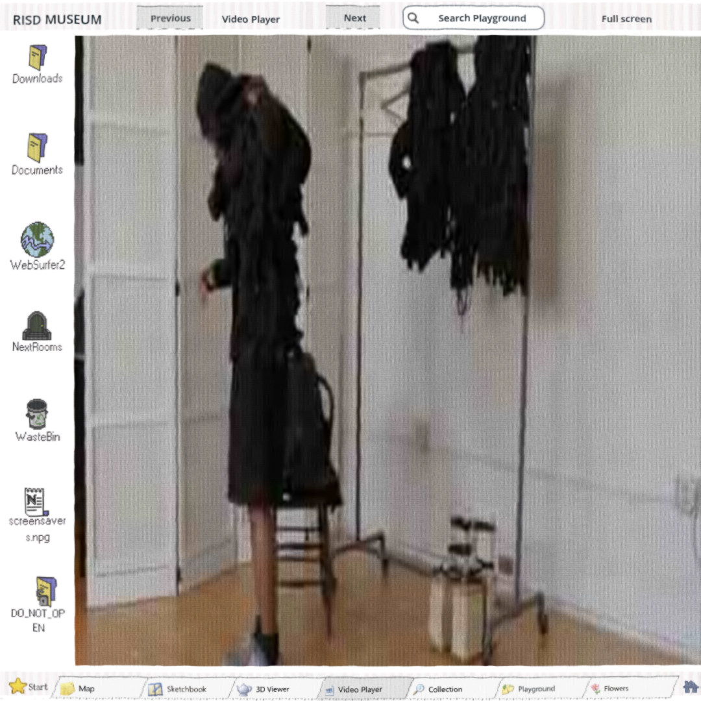
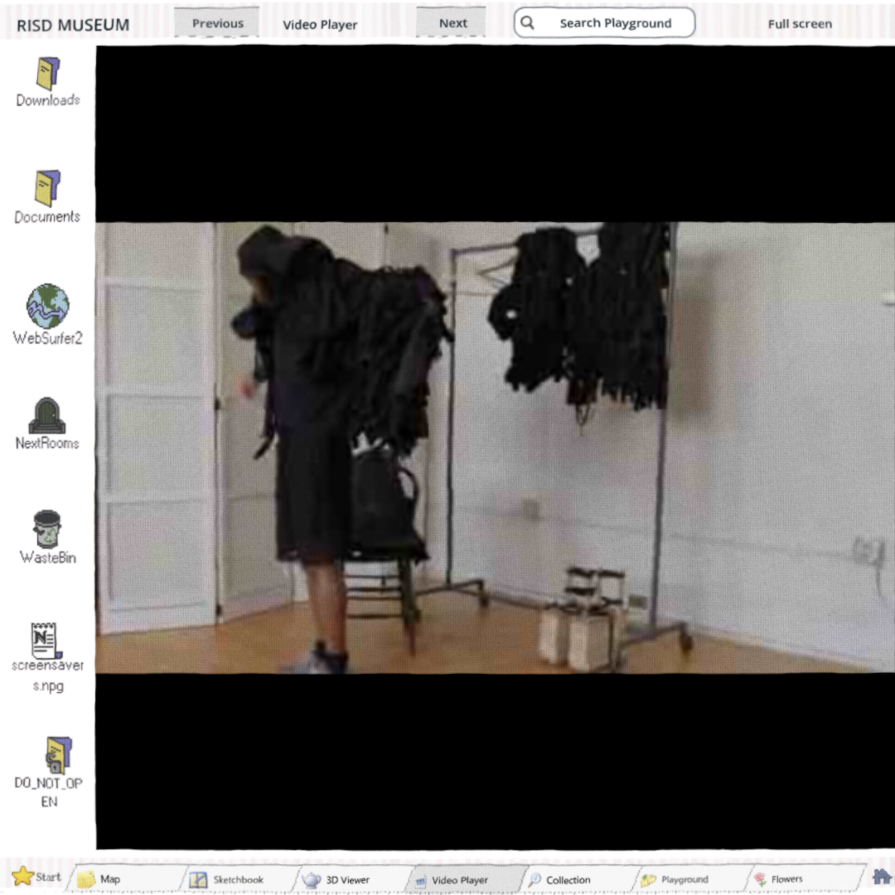
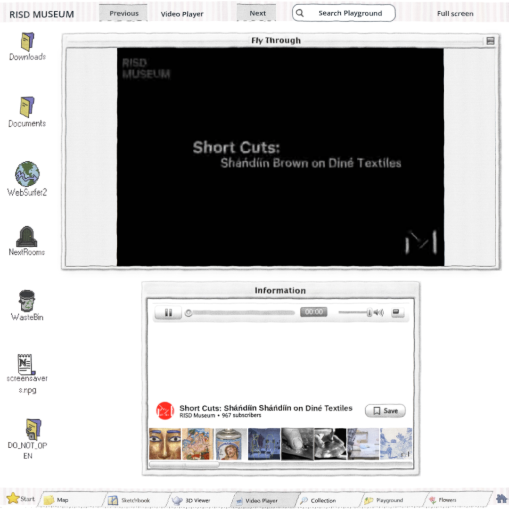
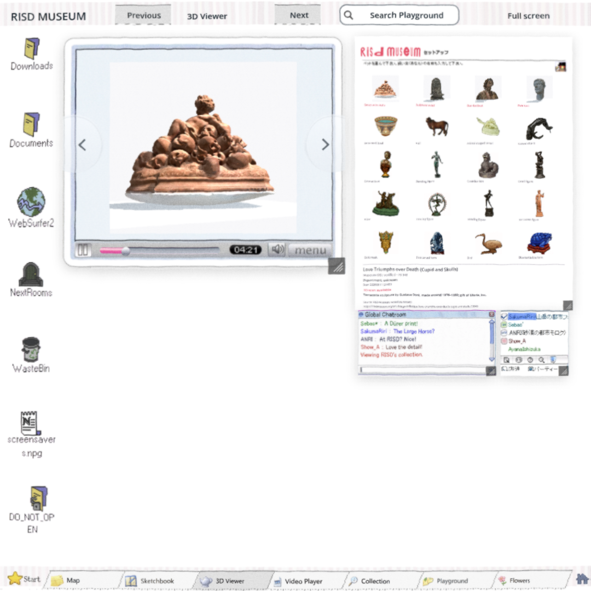
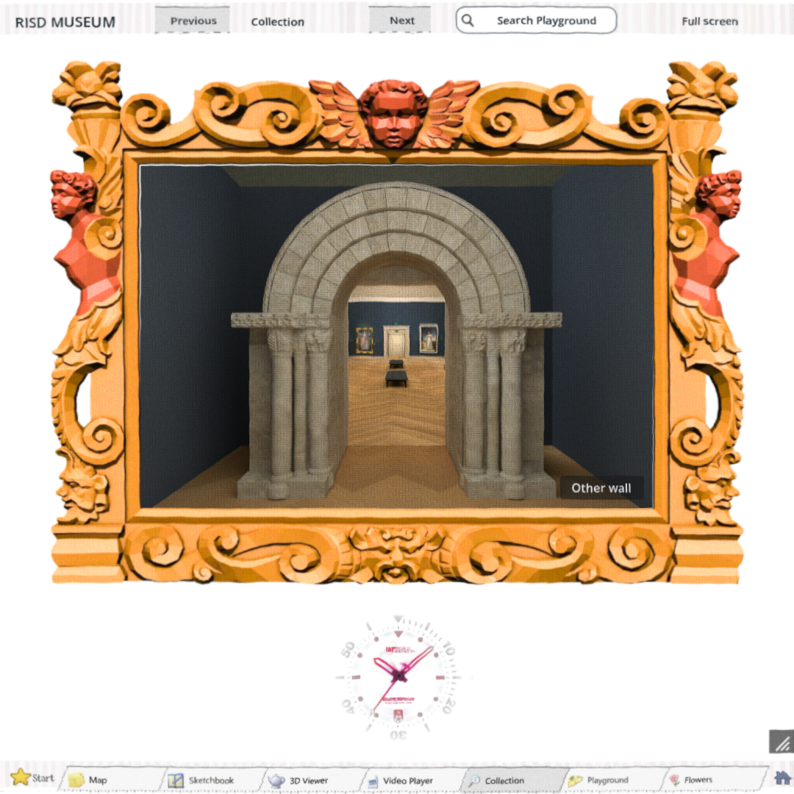

# Movie proportions — exact36cb27af

The retained Fly Through aperture and Video fullscreen used the full playback rectangle to stretch every movie. Native AspectRatioContainer and TextureRect now present the existing decoded playback texture at its source proportions; opaque gray/black letterboxing fills unused space. Playback/input rectangles, controls, stream/state, hidden pause, source media and frozen interfaces/errors/acceptance tests stay intact.

## Pictures

https://windows-wsl.taile06c45.ts.net/risd-video-current-01a0f078/

Complete private build, runtime36cb27af. Movie keyboard seek/pause/fullscreen, retained scans, paintings and square resize.

https://windows-wsl.taile06c45.ts.net/risd-video-pictures-01a0f078/

Before/after pictures and recorded clip. Serving copy remuxes original WebM without re-encoding to add finite duration/cues; source and serving hashes recorded.

## Verification

- Native actual composed aspect RED14/14 failures before; GREEN14/14 PASS including five source window/fullscreen ratios, outer landscape/portrait/small portrait and fullscreen return.
- Native206 actual focus/input18/18 PASS; exact Web all five sources/window/fullscreen, Right15/Left5, Space/play/pause, Freturn, hide/paused return, explicit Tab-Space-Enter PASS errors[].
- Full-app capture33 states covers seven Tabs, four live scans/main-hover, Playground, six distinct gallery poses, five viewport shapes, portrait Viewer/Sketchbook and visitor movement clip; errors[].
- Repository baseline PASS13 existing ObjectDB shutdown warnings; whitespace PASS. Owning frozen video_player playtest44/57, identical13 named failures on125927da and36cb27af. Same stale square/Page/icon-rail assumptions; retained failure logs and matched comparison. Legacy Shell timing/layout failures remain recorded206/187. No all-checks-pass claim.
- Exact export HTML/boot/game/wasm HTTPS hashes match; game archive6bd1fa94df4e7e4ea99368ec9053e72e6de24788a57b0c4f8941672a2193b177. Four GLBs, saved room, EXR/LMBake and five movies match source records.
- Independent focused Standards/Spec find no implementation finding; proof gap supplied by focused interactions. Ponytail1 accepted native-container simplification suggestion documented. Fresh Astra medium image-only Video review passes chrome, all five proportions, letterbox, viewport return and all227 ordered recorded frames; continuous real-time smoothness/audio/full-duration playback remains NEEDS-EVIDENCE.

## Evidence failures retained

First browser navigation failed ERR_CERT_VERIFIER_CHANGED before app startup; TLS200/hash verification followed, then one retry without bypass passed. Two integrated capture attempts timed out at the next Collection click after viewport reset: portrait Viewer and Sketchbook had already passed. Instrumented failure proves settled Sketchbook active1 and final square geometry; capture read stale portrait geometry immediately after setViewport. Waiting for published square stage before the next click resolves the QA race, with no runtime change. Isolated portrait Viewer→Sketchbook replay also passes. Failed packet/logs retained.

Source1014865523 has tiny non-square sample-aspect metadata (41663:41640): decoded480×244 fitting differs from original display aspect by approximately0.055%. No exact original SAR claim.

Private only. No generation/provider/bake/spend. All18 current Web window/grip checks and actual painting/X/Escape, fullscreen, tab retention, movement/release/Hair36/23paintings/F8/F9 PASS. GitHub CLI2.101 uploaded four before/after images into PR166 comment5905980239; authenticated API body readback contains asset URLs. Anonymous and bearer-token asset GET return404 (private assets need browser-session access), so authenticated browser rendering remains unverified. Private picture gallery supplies an independently tested image/video route. Final149/162/173/174/177 owner approval and earlier readability/Sketchbook/bench/motion/performance/rights findings remain open; whole review stays needs-work. Automation stays enabled.
