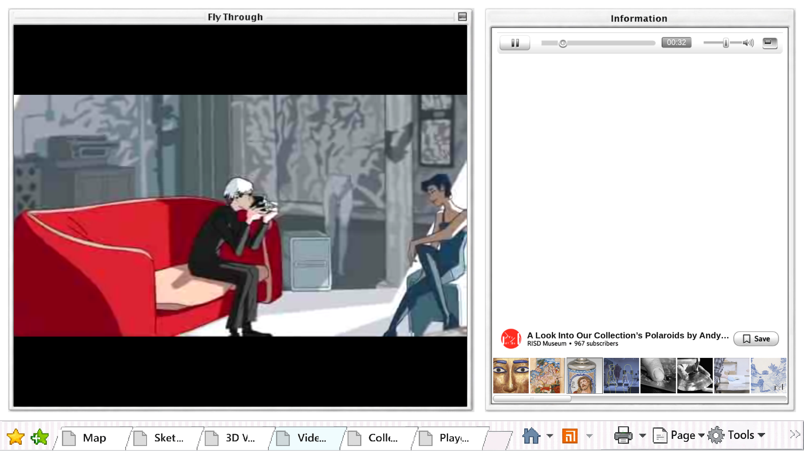
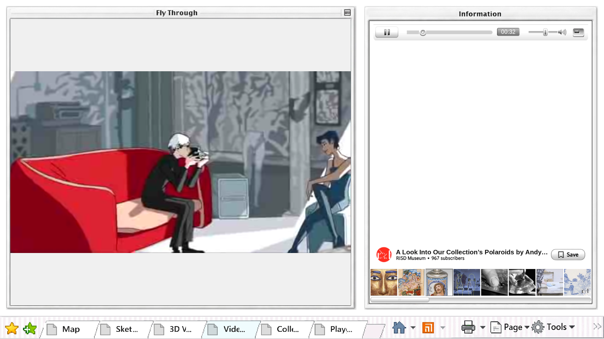
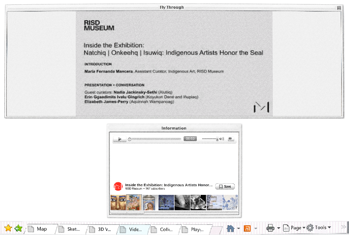

# Light grey video margins

Issue #83 changes the unused Fly Through area from black to #f0f0f0, the median
RGB value in the original header's plain patch (x250..600, y66..95). It reuses the
existing background; no media, aspect fitting, controls or CRT code changed.

Native gameplay: 57/57 checks passed with a 60-fps test cap. Uncapped before and
after both passed 56/57: the frame-count-based resume assertion expected more
than 0.2 seconds to elapse in 30 frames. The cap fixes test pacing only; no
production timing or unrelated acceptance was changed. The single revised pixel
assertion is explicitly authorized by #83.

Real browser: three clips at 1440x972, 1920x1080 and 720x486; grey margins sampled
with CRT enabled, playback and fullscreen/restore observed, no page errors.
Repository checks and git diff --check passed. Independent Standards and Spec
reviews of exact c3b9500 passed with no blocker.

Published to the existing owner-requested preview, using versioned resources
and an atomic landing-page replacement. published.json records the served PCK
hash, compared against the tested local export. The separate metadata probe is
not this product screen; unfinished search/image ingestion remains on #78.
