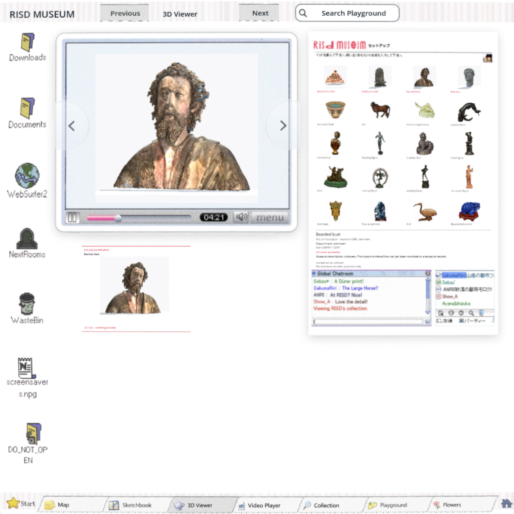

# Restored Viewer — #154 / #157

The owner requested the older two-window layout and accepted the current four scans for present use. `owner-layout-reference.png` is the supplied reference. The existing player is on the left, with the original RISD setup header, a five-by-four collection and chat on the right. Four unchanged Proton GLBs load into the main player; a single enlarged lower-left hover preview turns independently. Image-only entries show no linked scan. Verified #169 metadata remains intact.

## Checks

- `native/`: seven-tab traversal, all twenty native selections, four main/hover models, separate 3D worlds, real orbit-button input, hover, hidden-input freeze and selection return. Recheck recorded results with `python3 modules/sculpture_viewer/playtest/verify.py docs/evidence/viewer-157/native`.
- `metadata-report.json`: all twenty displayed titles, descriptions, URLs and unknown fields checked after real native clicks.
- `browser.json`: four scan selections and orbit/zoom at 1080×1080, 1920×1080, 1080×1920, 720×486 and 486×720; image-only state and tab return; zero browser errors.
- `checks.log`: repository baseline passed, with the existing thirteen ObjectDB shutdown warnings.
- `REVIEW.md`: independent GPT-6 Astra medium image-only native and browser visual PASS; small-text readability and still-image evidence limits recorded.

`d55fc7f5` additionally synchronizes the transport scrubber when selecting a scan. `export.json` pins its final game pack. `shared-build.json` checks the exact shared export, including four models and scrubber/camera consistency. No final whole-build owner approval is claimed. World architecture/surface work remains open.

## Owner preview

https://windows-wsl.taile06c45.ts.net/risd-viewer-latest-01a0e95d/

Private Tailnet share, kept for three days. Open **3D Viewer**, then choose the first four objects. Published through the share tool's supported directory route; the earlier port-route HTTP401 does not block this preview.
