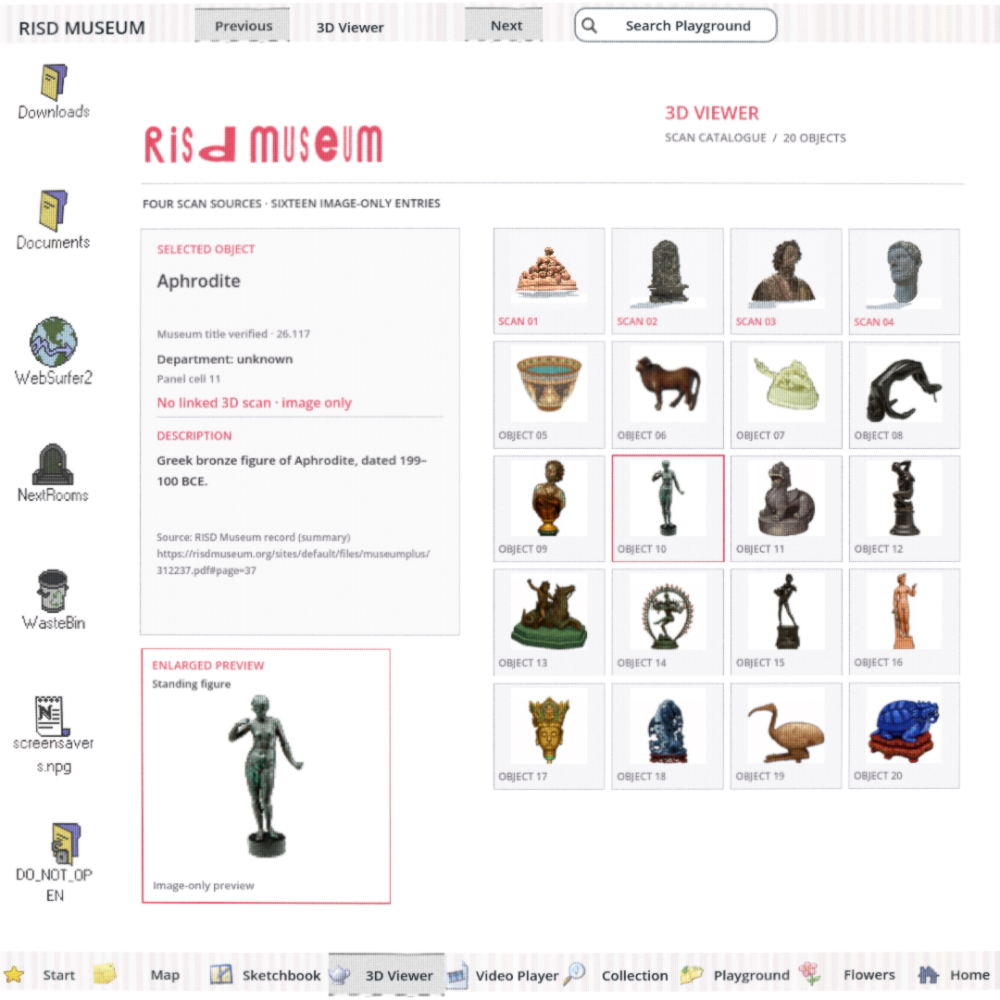
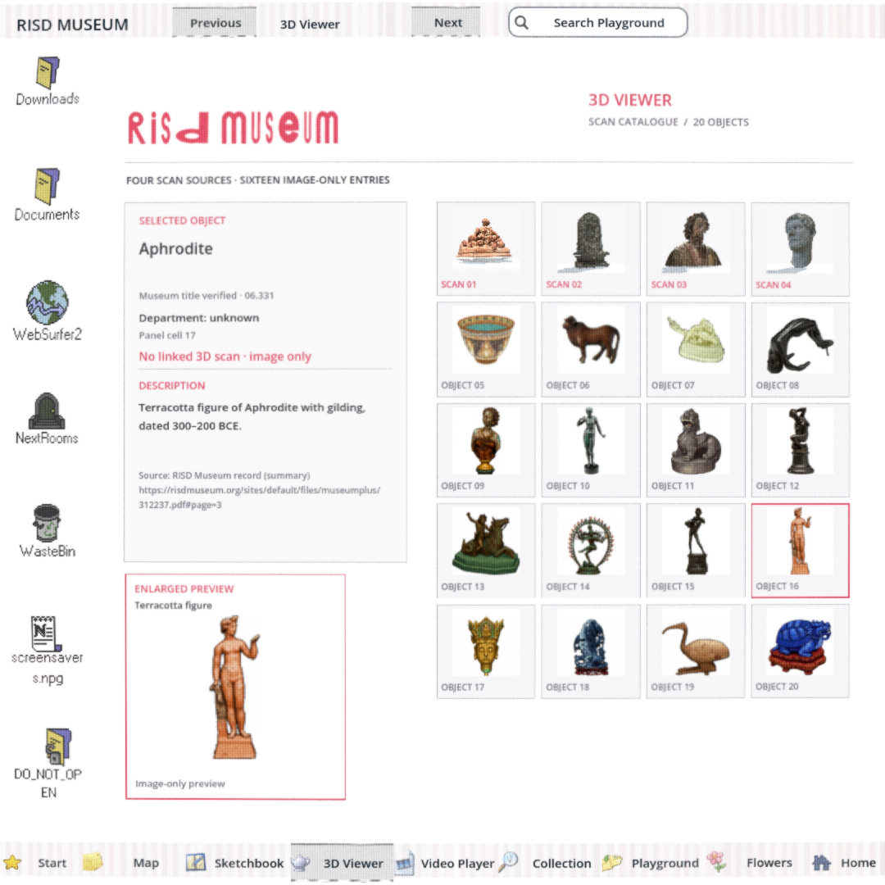
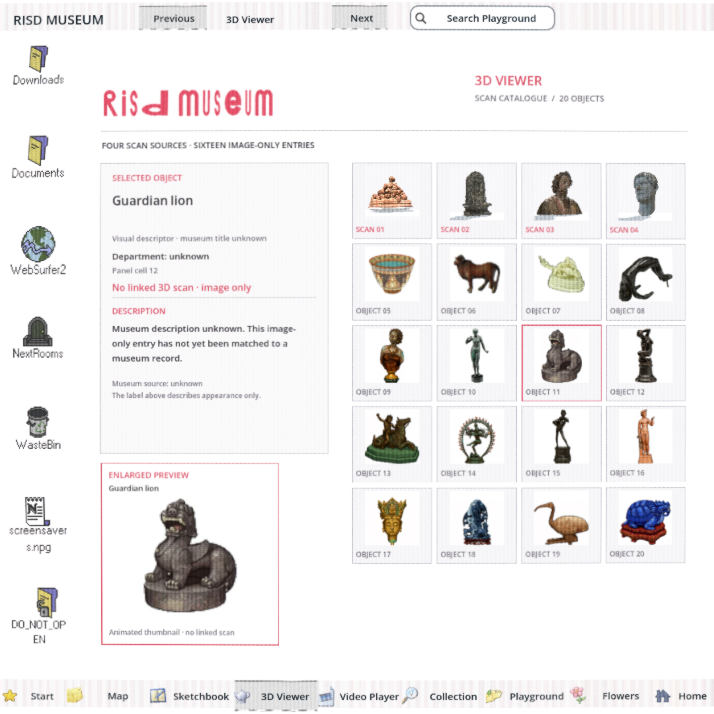
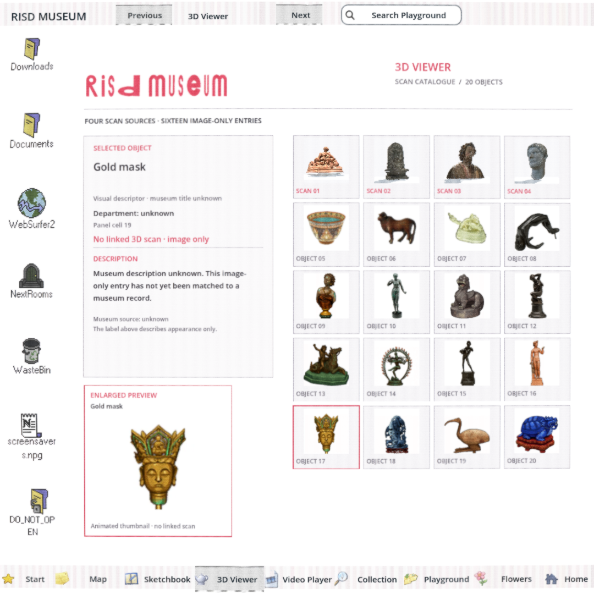

# Two additional Viewer records — #169

Based on accepted build `1dc0250783cb4483c6619490672cb80ec29eb72d`, not the scan prototype branch. [Research checkpoint 39a10662](https://github.com/Reid-Surmeier/risd-godot/blob/39a10662/docs/research/2026-09-28-viewer-panel-photo-matches.md) establishes the source-photo/accession pairs. The coordinating agent independently spot-checked both source/photo pairs and agreed that poses, bases and supports match; no independent runtime image-review verdict is claimed here.

| Card 10: Aphrodite 26.117 | Card 16: Aphrodite 06.331 |
| --- | --- |
|  |  |

| Card 11: explicit unknown after verified card | Card 17: explicit unknown after verified card |
| --- | --- |
|  |  |

The implementer inspected all four images above. Titles, accessions, descriptions and source pages fit; no stale verified metadata remains on the following unknown cards. Both added records remain image-only. No thumbnails, animations, meshes, layout geometry, frozen interface, errors or frozen baseline acceptance fixtures changed. The previously added #169 selection test is extended, not replaced. The legacy state probe remains untouched.

## Tests

- **Red before production edit:** the expanded native test failed `card 10 title: Standing figure != Aphrodite`; [exact output](red.log). A 25-second timeout terminated the assertion-stopped process (exit 124); that timeout is not the regression evidence—the named assertion is.
- **Green after minimum patch:** all twenty native selections check the actual visible Title, Identity, Department, LocalSource, Status, Description and Source Labels; [output](native.log), [all twenty recorded selections](report.json). Four records and sixteen explicit unknowns; every department unknown. Unknown cards follow every verified card, detecting stale metadata. Assertions also reject clipped Label lines.
- **Unchanged module regression:** seven Tabs, twenty clicks, 5×4 layout, animated hover, hidden input, freeze/return and pixel checks PASS; [output](regression.log), [independent verifier result](regression-verify.json).
- `scripts/check.sh` PASS, [output](check.log); existing 13-instance ObjectDB shutdown warning remains. Native logs also retain the environment's OpenGL→OpenGLES and unsupported 2D MSAA warnings.
- `git diff --check` PASS. All twenty mapping hashes were recomputed from current-build scan bytes/panel RGBA crops and matched [CATALOGUE.md](../../../modules/sculpture_viewer/CATALOGUE.md).

Native selection command:

```sh
godot --path . --script res://modules/sculpture_viewer/playtest/record_selection.gd \
  --resolution 1080x1080 --windowed --display-driver x11 --rendering-driver opengl3 \
  -- --out-dir=/tmp/viewer169-green
scripts/playtest.sh sculpture_viewer /tmp/viewer169-regression
```

All twenty transient captures remain in `/tmp/viewer169-green`; representative images above are committed. No new Web or 720/1600 capture is claimed for this small metadata follow-up. Browser/build integration remains the coordinator's next verification surface.

| Image | SHA-256 |
| --- | --- |
| `card-10.png` | `1a76d1dda14af8ee63035cdd9d307affb400a5f695b772abf4c779847d7bf4a3` |
| `card-11.png` | `909a3189eb8010c0adbd62e55eb866ada6adf55383c2f93ea400961cec134f22` |
| `card-16.png` | `77f1b6819d39211c9c91356259cb62bd8a0e6a5bc120f9689572986ee4f80b33` |
| `card-17.png` | `ef09285976eed523cbcb56b054540319afb06e7e8c5fc7d7eef77892f5200088` |

#169 remains OPEN: sixteen identities and all departments are unresolved. The cited twenty-row mapping and selection test now cover explicit unknowns as well as four verified records. No paid calls, generated imagery, accounts or 3D acceptance: USD 0. GitNexus had no index for this isolated worktree; impact inspection used direct source/caller search plus the runtime tests, not a claimed graph gate.
