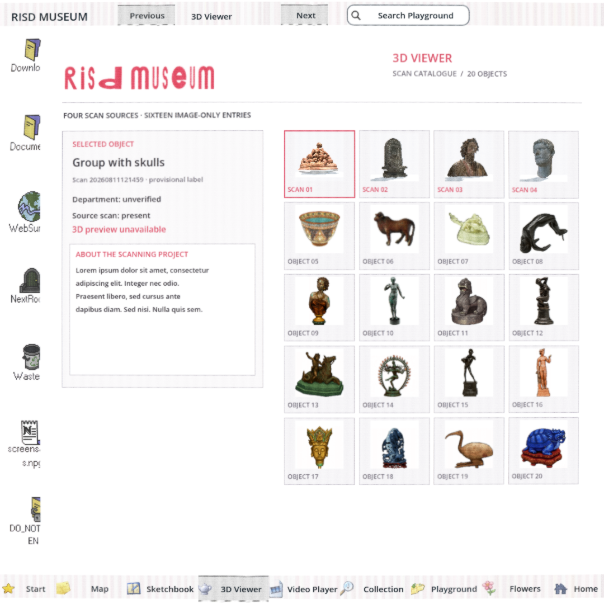
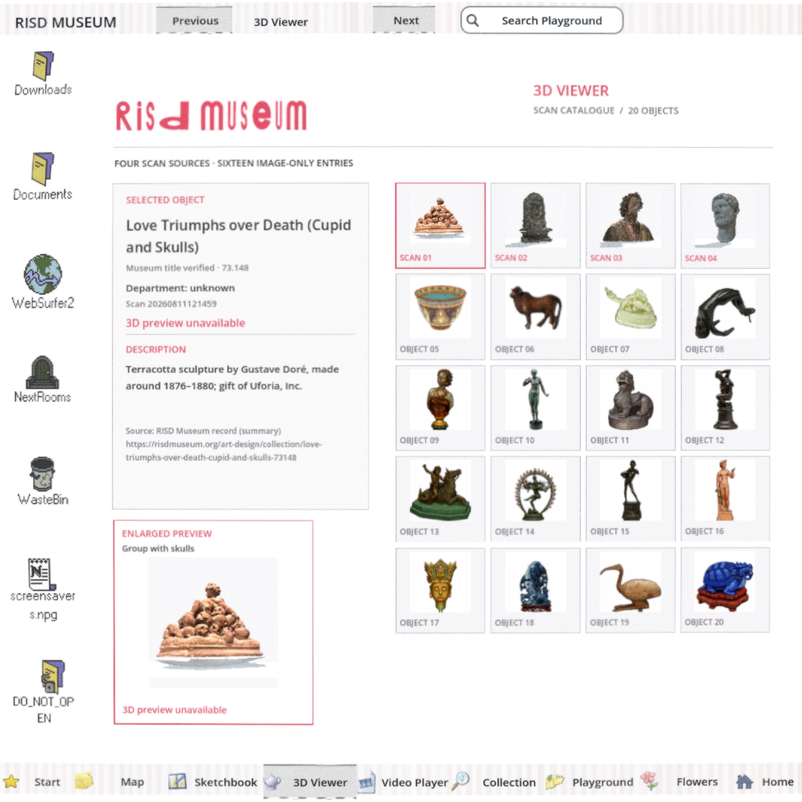
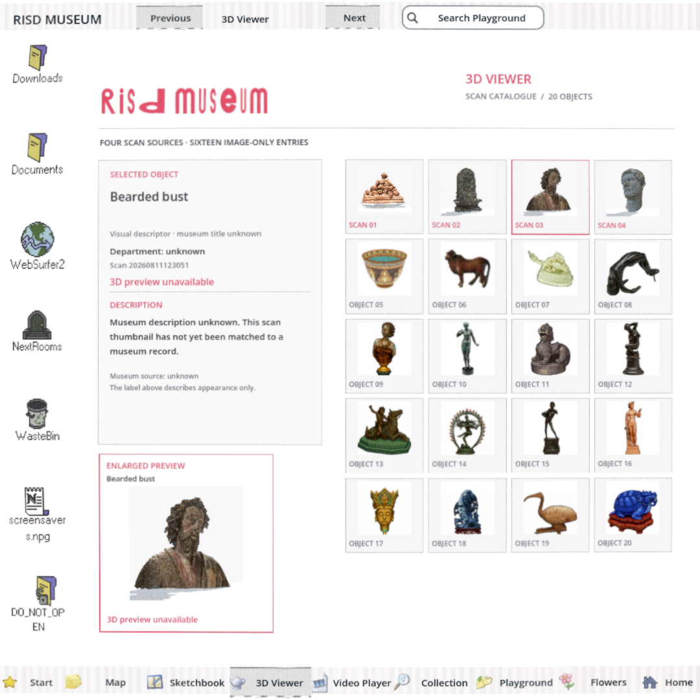
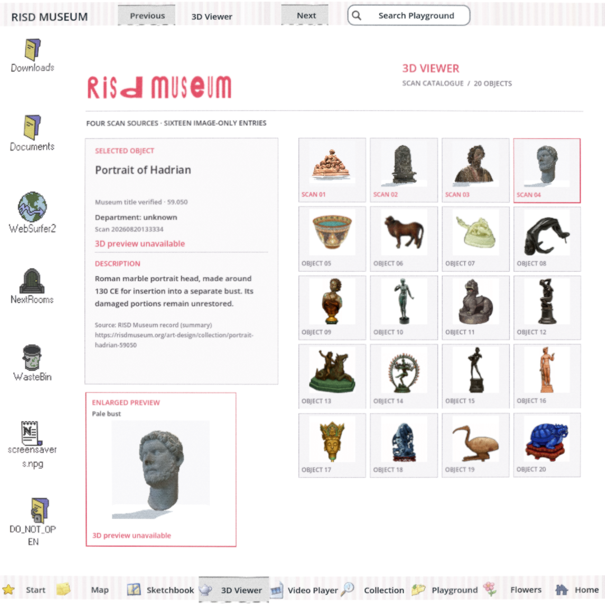
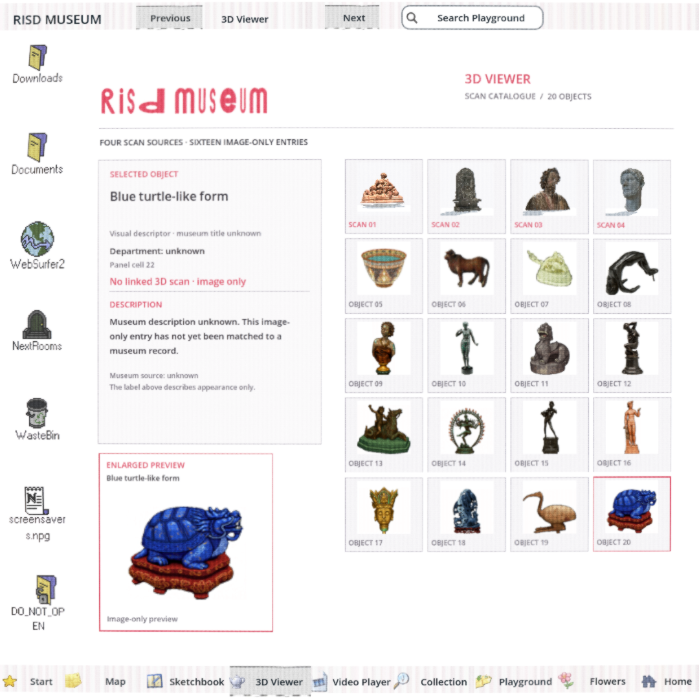

# Two source-backed Viewer records — #169

Based on build `8606d87d`; metadata evidence is the [primary-image comparison at ae5e3bbe](https://github.com/Reid-Surmeier/risd-godot/blob/ae5e3bbe/docs/research/2026-09-28-viewer-primary-record-comparison.md). Only the two established matches are named; eighteen museum identities and every department remain unknown. No image, mesh, animation, interface, error type, or existing frozen acceptance file changed. Cost USD 0.

| Before: provisional detail | After: verified record | After: unknown record |
| --- | --- | --- |
|  |  |  |





## Checks

- `scripts/check.sh`: PASS, [output](check.log). The existing ObjectDB shutdown warning remains.
- `git diff --check`: PASS.
- `scripts/playtest.sh sculpture_viewer /tmp/viewer-records-169-regression`: PASS, unchanged frozen fixture; seven tabs, all twenty native card clicks, 5×4 geometry, retained selection, animated hover, hidden input/freeze/return and pixel checks. [Output](regression.log), [verifier output](regression-verify.json). Complete transient captures remain at that `/tmp` path.
- New module-owned `playtest/record_selection.gd`: PASS for all twenty native clicks, checking actual displayed title, identity status, department, local source, description, source URL and unavailable-3D status. Unknown cards immediately follow verified cards to catch stale metadata. [Output](native.log), [twenty-card report](report.json). All twenty 1080×1080 captures are in `/tmp/viewer-records-169`; representative captures are checked in above.
- Independent Astra-medium image-only review: PASS; [scope and verdict](BLIND-REVIEW.md). Main implementer also inspected the verified titles, unknown scan and image-only captures.

Native invocation:

```sh
godot --path . --script res://modules/sculpture_viewer/playtest/record_selection.gd \
  --resolution 1080x1080 --windowed --display-driver x11 --rendering-driver opengl3 \
  -- --out-dir=/tmp/viewer-records-169
```

The frozen diagnostic `selected_name` remains the provisional visual descriptor, and its department value remains `unverified`, preserving the existing seam. Rendered detail Labels hold the source-backed presentation, independently inspected by this module's new playtest. Neither verified title enables a live scan. The original 5×4 order and scan/image-only distinction are unchanged.

#169 remains open for the remaining identities and department research. This is a partial truthful metadata integration, not completion of the full catalogue identity investigation; #154 mesh repair remains independent.
