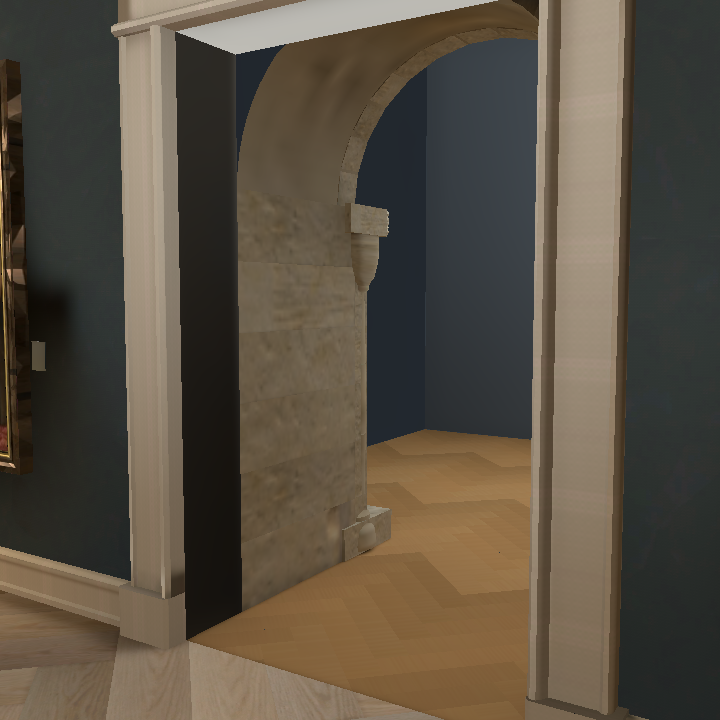
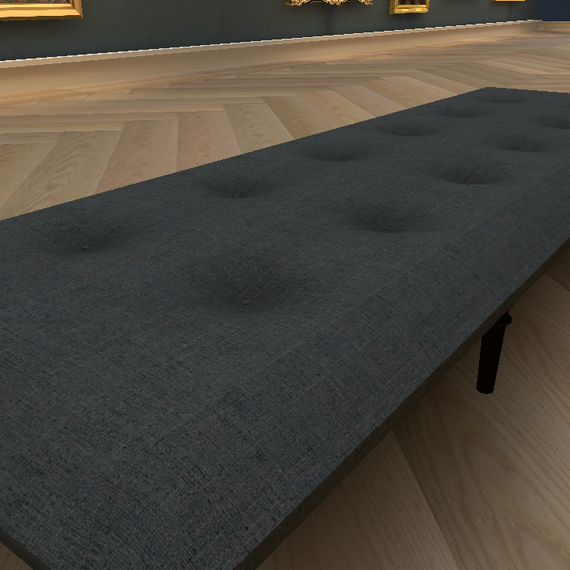
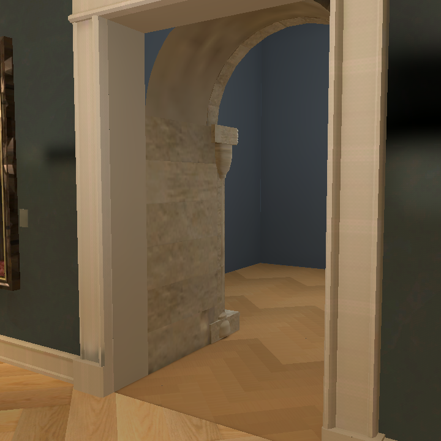
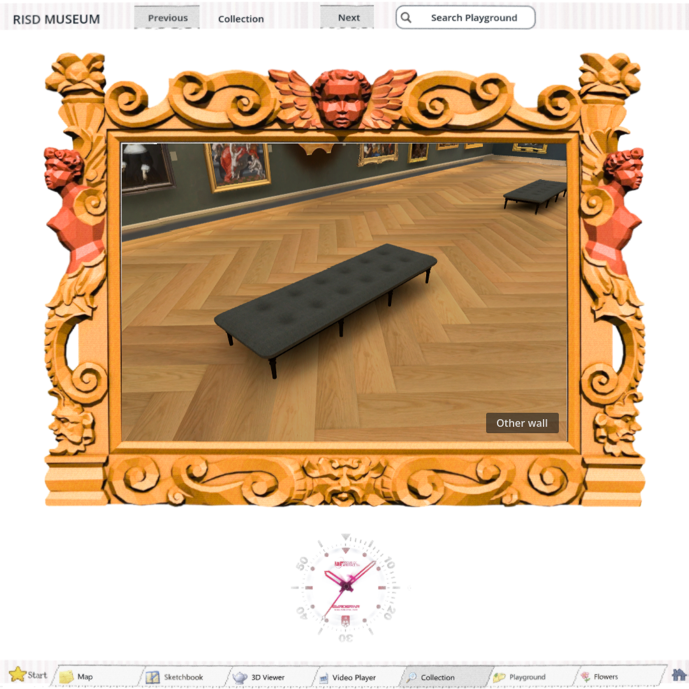
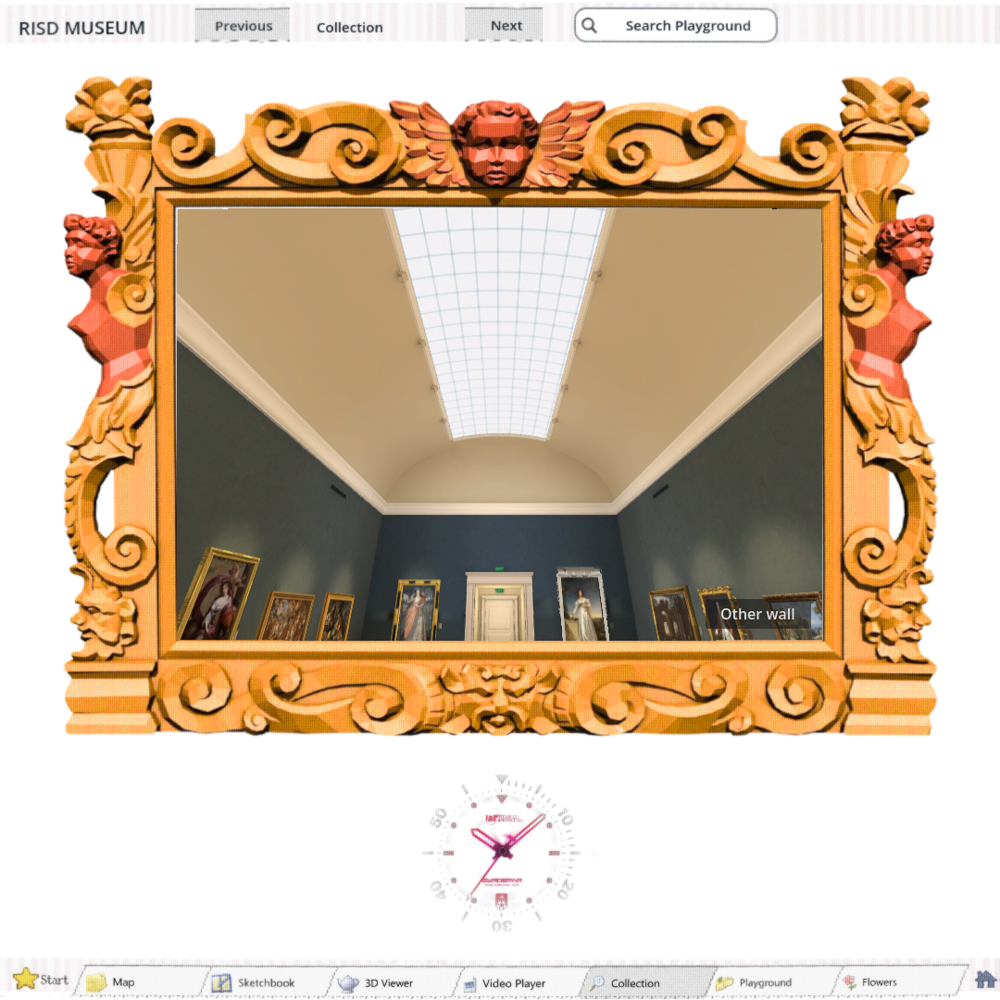

# Warm floor, softer skylight and repaired doorway reveals — #187

Owner requested the prior honey tone on the accepted #186 floor, more warm room light and less skylight. The atlas, board detail and 1.9×0.36 layout remain. Material tint changes to (0.96, 0.80, 0.60); daylight energy changes 0.8→0.35, warm fill 0.4→0.55 and painting spots 6→6.8. No generated image changes or spend.

The supplied black strip is the plaster reveal. Both side normals pointed away from the opening (dot −1). Shared `_panel` triangle winding also opposed supplied normals. Corrected winding in that shared builder, and inward normals for the reveal and adjoining passage returns/ceiling. Rendered regression samples the actual reveal and inspects its saved mesh normals; before minimum luminance is 0.093.

Run `DISPLAY=:99 godot --path . --rendering-method gl_compatibility --script docs/evidence/warm-room-187/check.gd -- --after` for matched native views and the reveal check.

The first software bake completed in 330.19 seconds with 137 lightmap users, then the editor crashed during shutdown. The previous runner discarded those completed files. Its recovery now recognizes the plugin's durable saved marker (nonzero users, emitted after save succeeds), while preserving rollback for unfinished failures. The extended recovery test fails the old runner and passes the correction. `bake.log` preserves the failed attempt; `bake-retry.log` records an aborted startup-race attempt: the editor selected boot_loader instead of the bake room, and CPU activity was initially mistaken for bake progress. Direct window inspection exposed this. The runner now opens the bake scene explicitly; the plugin waits for import scanning and rejects a replaced scene. `bake-final.log` records the corrected run with live output. The offline limit is 30 minutes, and output streams during the run rather than being hidden until exit. No RTX bake is claimed; #184 remains open.

Source furniture/art checks and floor shared-edge checks pass. `scripts/check.sh` passes with existing UID fallback/ObjectDB exit warnings. A Shell playtest run during baking failed timing and layout expectations; its raw log is retained as `shell.log`, The isolated display rerun and unchanged Shell-fixture baseline reproduce the same failures (`shell-final.log`, `shell-baseline.log`); this patch changes none of that fixture’s Shell/TabStrip/testing code.

## Verified result

Runtime `dbfe2393`: corrected bake completed in 333.80 seconds on llvmpipe with 137 users. Native reveal luminance is 0.410/0.405, with zero outward-facing sampled reveal normals. Both sides, floor detail and room overview were visually inspected.

Doorway and navigation checks report zero failures, including 23 paintings. Full Web captures and real key movement/release pass with zero browser errors, stable FOV and visitor identity. Export reports no errors. The repository baseline and diff check pass. The unchanged legacy Shell fixture still fails its existing timing/layout checks; logs preserve that limitation.

Native captures still run explicitly from the now-ignored evidence directory. `build/.gdignore` and `docs/evidence/.gdignore` prevent generated exports and review images from entering future editor scans. The bake log retains the prior non-runtime review-image import and editor cleanup errors; the completed runtime was checked separately.

Web game gzip SHA-256: `a7c62eb32d5c91cc63dbf3ef44eae06a4aeb7e8588d5a8b1fb33d7604a6358c7`.
