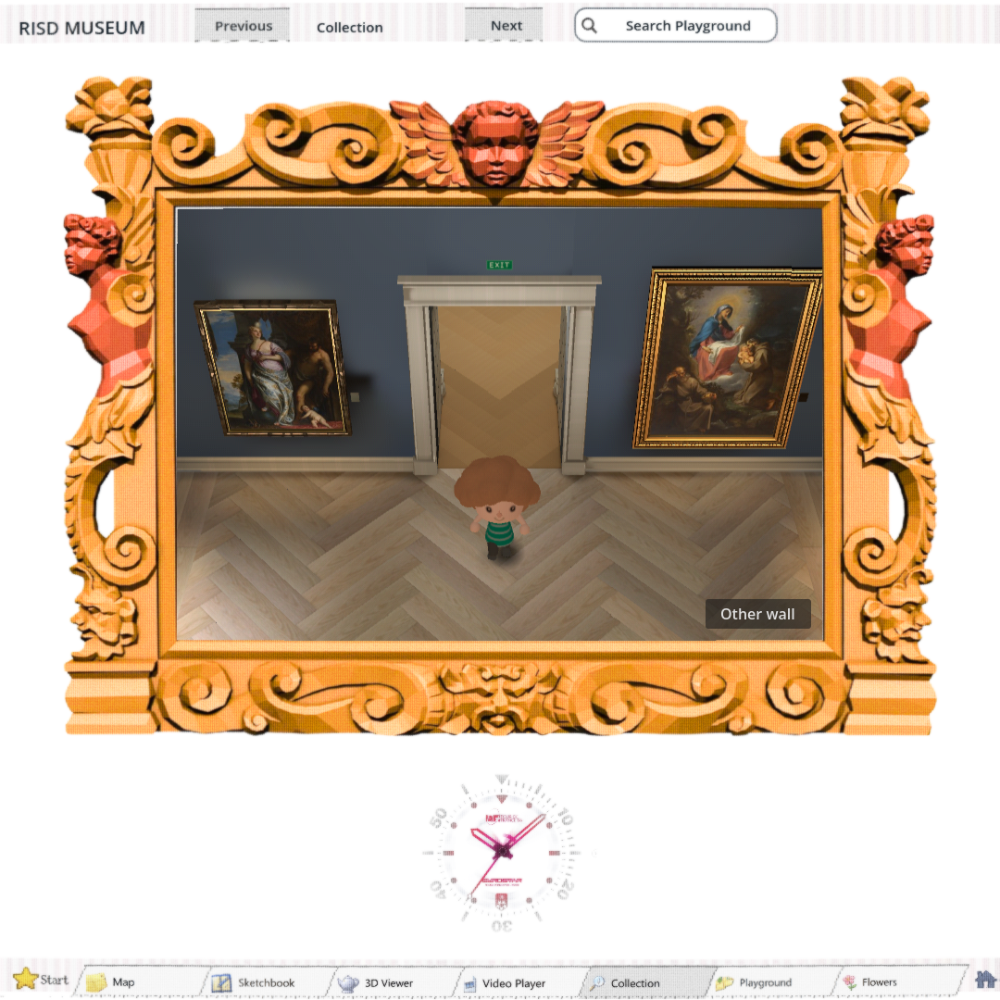
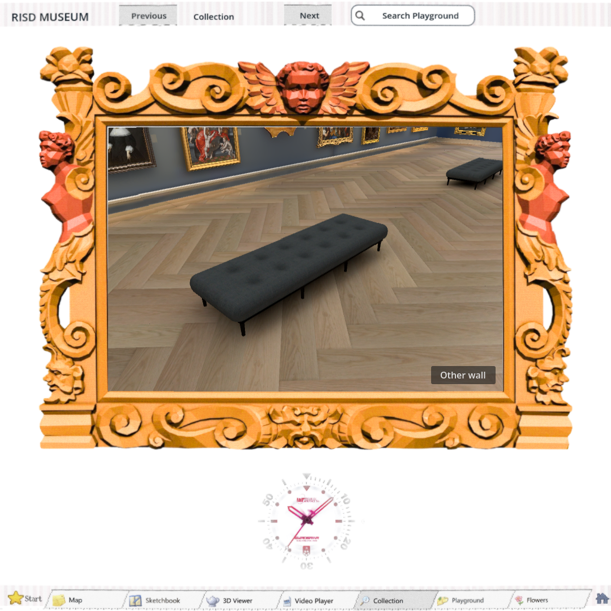
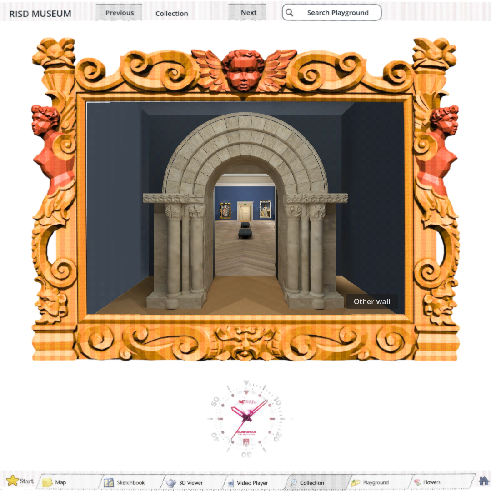

# Reviewed world correction — #176

The updated full app has padded textured benches, photo-visible wall vents and joints, and broader portal supports with closed relief joins.

https://windows-wsl.taile06c45.ts.net/risd-world-01a0e95d/

Runtime c614b5ed; durable export build/world-c614b5ed. HTTPS index and whole game gzip SHA-256 verified:129136e7e91d240cf219b79ed991ca9474e4a0071b410fc1dda4ad312d488fd6. Three-day owner-requested share.

## Evidence

- First candidate rejected for cushion UV/rim, dashed wall seams and portal joins; records retained in rejected-1.
- Second candidate bench and wall image-only re-reviews PASS at native/browser720/1600; portal remained FAIL.
- Third candidate portal image-only re-review PASS; source e952dcee, saved candidate2670002d.
- Integrated independent image-only review PASS across five viewport shapes and seven framed gallery views. Existing Astra medium reviewers re-reviewed corrections; not represented as fresh blind threads.
- Integrated baseline, world geometry, owner camera/cushion regression, saved portal topology, rendered cutaway and native23painting navigation PASS. Full-app browser matrix/details errors[]. Real browser key movement changes position, key release stops movement, FOV and Hair36 identity stay fixed,23paintings retained. Logs/captures in integrated.
- Old source fails the new cushion-rim regression; corrected source passes. Initial dummy-renderer cutaway invocation could not read pixels; rendered rerun passes. Bake retains known editor shutdown errors; fresh import/export had no ERROR lines. Baseline retains known ObjectDB shutdown warnings.

## Limits

Museum dimensions are approximate. Portal carving/collars/base remain simplified; labels remain blank; cornice plainer than reference; far bench lacks its own closeup and fine turned leg detail is subdued. Continuous motion quality and universal startup performance are not cleared by these stills/checks. No new paid generation. Final owner approval, #162 and #149 remain open.
