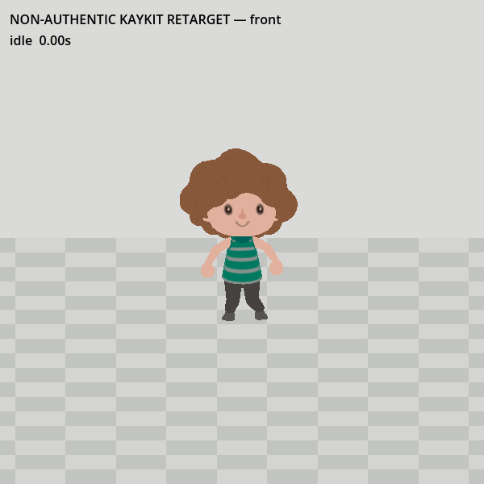
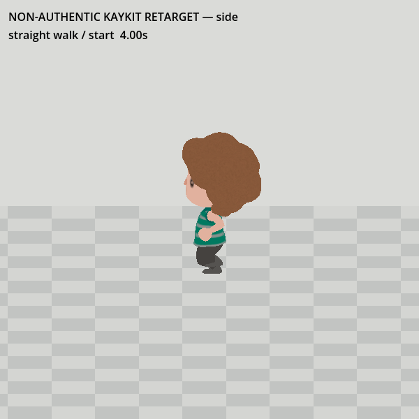
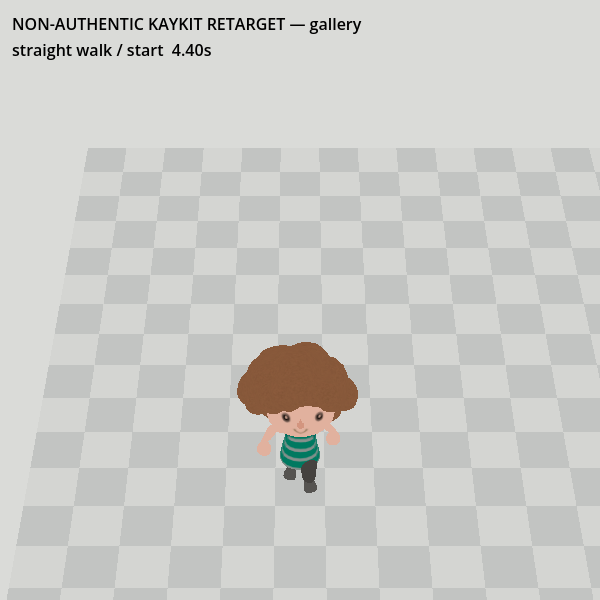
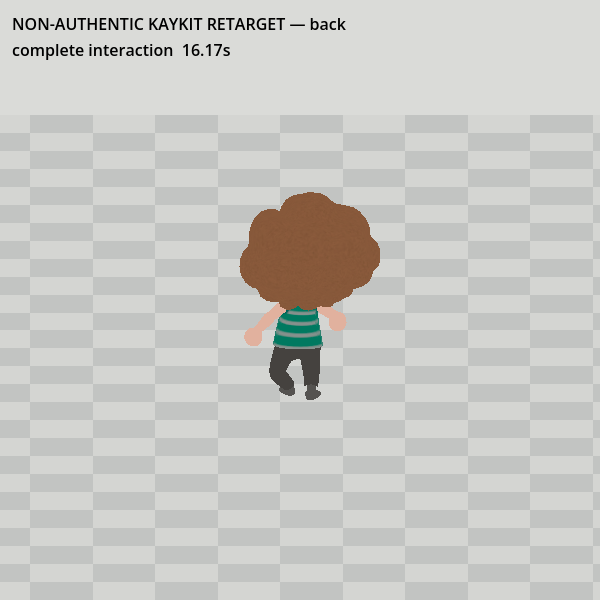
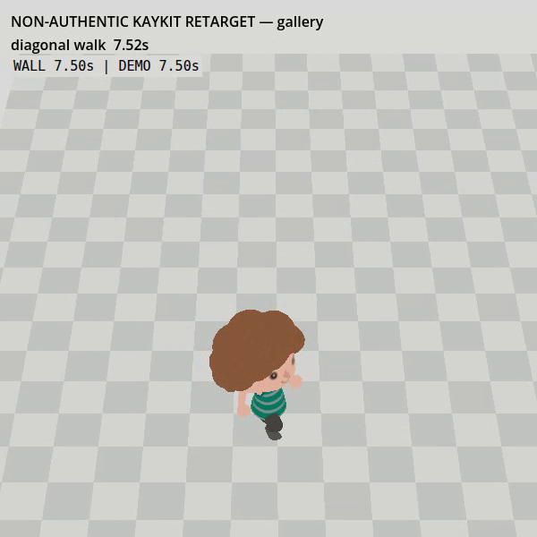
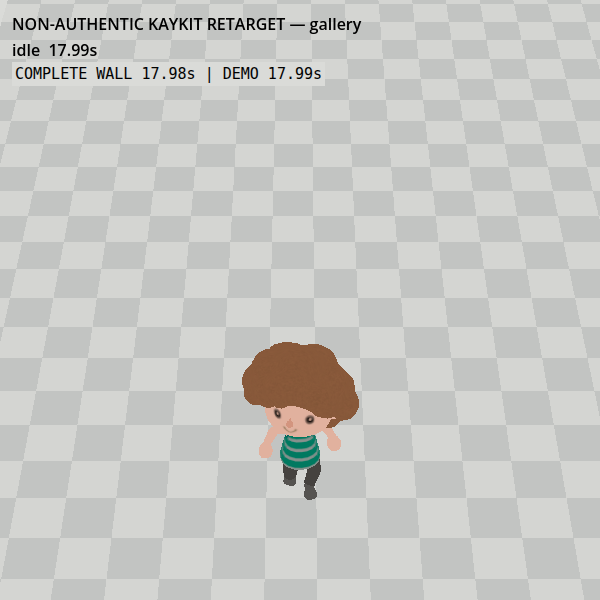

# #171 — non-authentic motion on the sourced New Horizons rig

2026-09-28 UTC. **Native/Web playback and numerical contact checks pass; a later independent visual re-review found a failed stop/idle stance. No runtime asset accepted or installed.** This is a throwaway prototype, not Nintendo motion. #159 must satisfy its remaining integration gates independently.

Continuous 18-second, 540-frame native captures: [front](evidence/front.mp4), [side](evidence/side.mp4), [back](evidence/back.mp4), [gallery camera](evidence/gallery.mp4). The [original Web replay](evidence/browser.webm) was rejected for slow playback and is retained as failure evidence. Its replacement is the [normal-speed Web replay with independent wall-clock overlay](evidence/browser-normal-speed.webm). [Rejected uncorrected transfer](evidence/raw-rejected.mp4) records the original contact failure.

## Preserved target and bounded donor

The target is the [#163 statically reviewed Hair36 candidate at cf4a17ae](https://github.com/Reid-Surmeier/risd-godot/blob/cf4a17ae/docs/prototypes/character-materials/RESULT.md), SHA-256 `a2e6e0948dafb5b0ac10ffdc7359c64fbe04371038f0265d9cb1e1af390e54c4`. Its 42-bone Godot rig contains the unchanged 36-joint body and the separately sourced Hair36 attachment. Body geometry, UVs, skin weights, inverse binds, local rest transforms, source PNGs and GLB bytes remain untouched. The earlier 44-bone assembly used Hair00; this trial changes neither assembly nor hair choice. Raw target assets stay in `/tmp/risd-171-motion`, outside the committed runtime.

The donor is the [pinned KayKit Rogue GLB](https://raw.githubusercontent.com/KayKit-Game-Assets/KayKit-Character-Pack-Adventures-1.0/672074b73ba276876a19e8816ecdc5241817ab47/addons/kaykit_character_pack_adventures/Characters/gltf/Rogue.glb), SHA-256 `e825437cd4d2ee9c1960b517a74a69101e33eb409ae7fa8cedc7134a998fbb7d`, creator Kay Lousberg, CC0. Only `Idle` (1.066667 s), `Walking_A` (1.066667 s), and `Interact` (1.3 s) are evaluated. This does not establish a Nintendo run or any native clip. The #151 native `CharactorAnimation.Nin_NX_NVN.zs`/BFSKA route remains open; no such payload was available for this trial. No paid generation or new provider call; spend USD 0.

## Transfer and observed correction

`trial.gd` samples donor global bone rotations relative to its rest pose, applies that rotation delta to the target rest basis, and reconstructs parent-relative rotations. Target bone translations/lengths and unmapped helper, skirt and hair bones retain their authored relationships. The two target root bones share normalized donor hip translation. The measured rest-skinned vertical extent is `0.187345907..17.017436981` source units; uniform scale `0.1039804237` gives 1.75 world units, and the floor offset removes the rest sole gap. Target hip-height/donor hip-height ratio is `11.4692592`.

Direct rotation/hip transfer failed: the actual sock mesh penetrated the floor by **0.0368793** world units, exceeding the proposed 0.01 limit. The next trial adapts the existing gallery visitor's two-bone contact solver to the target's additional helper-bone chains, retaining rest toe flex and adding a 0.031194-unit knee reserve. Merely locking a sole center still failed: during root turns, sole vertices rotated around that fixed center and drifted **0.158812** units. The final correction locks the planted foot's orientation in world space as well as its center. These are project-authored contact corrections, not donor or Nintendo animation.

The final native maximum floor penetration is **0.000000473** units, sole-center anchor error **0.000001094**, and actual planted-sole vertex drift **0.000001528**. Web reports the same penetration/center error and **0.000001475** vertex drift. The verifier follows 194 authored bottom-of-sock vertices (97 per foot), maintaining their vertex identity across each contiguous planted interval. Limits are 0.01 penetration and 0.02 horizontal vertex drift at 1.75 height. This proves the recorded numerical scenarios only; it does not substitute for visual approval.

The separate shirt audit measures 1,284 triangle edges over 540 poses. Edge-length ratios versus the rest-skinned shirt range from **0.690706 to 2.200075**. This is a substantial local stretch, not a garment-quality pass; inspect the sleeves/hem and interaction in the independent visual review. No automatic deformation threshold was invented to approve it.

The scripted scenarios cover idle, straight start/walk/release, diagonal walk, 90/180-degree turns, a turn to artwork, interruption of `Interact` at approximately 0.65 s by movement, a second release, project-authored head look, and a complete interaction. Translation uses the current gallery's 1.2-unit speed. At that speed the sampled walk runs at three times its source cadence: **accelerated walk, not a native run**. Front/side/back are full-body inspection views; the gallery view uses the existing camera's 23-degree FOV, 14.2-unit distance and 42-degree pitch at 600×600. This is an isolated camera/rig test, not a test of live gallery input, collision, artwork picking or animation-controller integration.

The original Web test exported with Godot 4.7.2's single-thread Compatibility template and completed 540 poses with no console/page errors. Its fixed 1/30-second pose step was tied to a loop that also waited for rendering and a timer. That made real playback slow, rather than merely retiming the recording. The independent reviewer passed the sampled poses/deformation but correctly withheld complete motion sign-off. See the measured correction below.

## Browser timing diagnosis and correction

The independent browser oracle observes each published demo timestamp through `requestAnimationFrame` and stamps it with browser `performance.now()`. Its four-second regression failed on the actual old export: **4.000 demo seconds / 6.4921 browser seconds = 0.6161×**. Removing only the extra timer also failed, in the opposite direction: **4.000 / 2.2841 = 1.7512×**. This distinguishes the fixed-per-iteration step from recording retiming or asset deformation. Raw observations are retained in `evidence/timing-before.json` and `evidence/timing-without-timer.json`.

The corrected browser loop samples actual elapsed time and uses its delta for locomotion, gait and turn interpolation. Offline native frames retain their deterministic 30 FPS sampling. Shader/skinning warm-up occurs visibly under “Preparing motion replay” before the playback clock begins. A separate DOM overlay uses browser `performance.now()`, rather than the engine's clock, to display wall time beside the demo timestamp. After 18 seconds it explicitly displays “COMPLETE”; heavyweight audit serialization happens afterwards and is not motion playback. No frame-rate conversion or video time-stretch is applied to the Playwright recording.

`browser.cjs` now asserts a wall/demo ratio within 5%; `timing.cjs` runs the same assertion through a short four-second capture. The real-time contact verifier accepts variable frame counts, checks scenario duration and monotonic sample gaps under 0.1 seconds, and retains the same floor/sole-vertex thresholds. The final full-run timing and geometry records are committed separately as `evidence/timing-normal-speed.json` and `evidence/browser-normal-speed-metrics.json.gz`. This proves timing on the tested Chromium/SwiftShader host; integration with live gallery input/collision remains outside this isolated prototype.

Final normal-speed result: **17.9872 demo seconds / 17.9827 browser seconds = 1.000250×**, 1,080 rendered observations. Frame intervals are 16.7 ms median, 16.8 ms p95, and 23.8 ms maximum. The real-time geometry check passes with maximum floor penetration **0.000000376**, planted sole-center error **0.000171321**, and planted sole-vertex drift **0.000133994** world units. The target GLB remains SHA-256 `a2e6e0948dafb5b0ac10ffdc7359c64fbe04371038f0265d9cb1e1af390e54c4`. The fresh independent decision on the corrected-time evidence is recorded below.

## Reproduce and verify

Use the exact hashed GLBs above. Copy this folder's `trial.gd`, `trial.tscn`, `export_presets.cfg` and `project.godot.template` into an empty scratch project, naming the latter `project.godot`; put the inputs there as `character.glb` and `donor.glb`. Run `godot --headless --editor --path <scratch> --import`, then `MOTION_VIEW=front godot --path <scratch> trial.tscn`; repeat for `side`, `back`, and `gallery`. The trial writes full PNG sequences and world-space metrics into that scratch folder. Encode each PNG sequence at 30 FPS as shown by the committed MP4s.

`python3 docs/prototypes/character-motion/verify.py <scratch>/metrics-front.json <scratch>/metrics-side.json <scratch>/metrics-back.json <scratch>/metrics-gallery.json` passes. The stronger vertex check fails on the earlier center-only correction, so it does not merely repeat the solver's anchor assertion. `inspect.gd` inventories target/donor rigs; `garment_audit.gd` runs the same poses while comparing source shirt triangle edge lengths against rest.

The committed `evidence/native-metrics.json.gz` and `evidence/browser-metrics.json.gz` retain the complete frame/vertex records and can be passed directly to `verify.py`. `evidence/garment-audit.json` records the separate shirt result. `evidence/SHA256SUMS` binds the capture and metric artifacts.

Export the scratch project with `godot --headless --editor --path <scratch> --export-release Web /tmp/risd-171-web/index.html`, serve that folder privately on port 8171, then run `browser.cjs` with `PLAYWRIGHT_PATH` pointing to the already installed Playwright package. It records video, errors and metrics under `/tmp/risd-171-browser`; run `verify.py` on that metrics file too. Never publish the raw model payload as a runtime asset based on this test.

Repository `scripts/check.sh` passed after a fresh Godot editor import; `git diff --check` passed. The engine logged its existing exit-time object-leak warning, not a test failure.

## Independent final visual decision — scoped PASS

The fresh independent GPT-6 Astra reviewer, at medium effort and supplied images only, returned **PASS for sampled visual motion and normal overall browser speed**. The reviewer inspected native gait, turn and interaction samples spaced 0.1 seconds apart, plus browser images showing WALL 2.55 / DEMO 2.55, WALL 9.98 / DEMO 9.99 and completion 17.97 / 17.98. It found no obvious garment or hair detachment and no gross floor-contact failure.

The reviewer did **not** play the video directly. Frame pacing and micro-skating therefore remain unverified by that visual review; the separate browser wall-clock and mesh-contact measurements above are numerical evidence, not a claim that the reviewer saw continuous smooth playback. It described the side-view gait as slightly jog-like, noted that the hair reduces arm-gesture readability from the gallery/back views, and noted that no artwork target appears in the trial.

That review initially closed #171's bounded, explicitly non-authentic fallback-motion prototype. The later re-review below supersedes its stop/idle verdict and reopened the ticket. Neither review approves an authentic Animal Crossing animation claim, a native run, a shipped model, live gallery input/collision, or artwork interaction/picking. #151 can reference the demonstrated retarget separately from the native-container research route; #159 owns gameplay integration and its remaining acceptance checks.

## 2026-09-28 independent re-review — reopened, visual FAIL

A new GPT-6 Astra medium-effort reviewer received only the approved Hair36 front/profile/back images and the final native/Web clips, without code or prior verdicts. It sampled every second of all five clips, then the side and gallery transition windows at 5 fps. **FAIL:** the visitor retains a staggered, bent-knee walk stance after release ([side at 5.47 s](evidence/failed-stop-side.png); [gallery at 14.47 s](evidence/failed-release-gallery.png), visible through 17.87 s). Gallery-size interaction reads mainly as a head turn, with no visible artwork target. Side gait has high knee lifts and a crouched/marching look. Hair, shirt, silhouette and turns remain intact; the reviewer could not assess every in-between frame or micro-skating from sampled frames. This supersedes the earlier scoped visual PASS for stop/idle acceptance. #171 was reopened; no motion candidate is approved for #159 integration.

The committed capture hashes, native/Web contact metrics and repository checks still pass independently. Two scratch-only stop probes were run through the full 540-frame side capture: resetting foot anchors during the walk-to-idle blend narrowed the stagger but left a crouched idle pose; using the donor idle without contact correction made a foot float ([probe frame](evidence/no-contact-idle-floats.png)). A neutral-leg/rest-basis probe also failed to straighten the stance. These probes were not retained as implementation because none passed the visual question.

**Next falsifiable repair:** measure the accepted Hair36 rig's standing hip/ankle positions and source rest knee bend, then blend the walk into a neutral planted-foot stance without changing source geometry, skin weights or donor clip labels. Re-run the existing sole-vertex verifier and capture continuous side/gallery stop and interaction clips in native and Web. Submit only reference images and replacement clips to a fresh blind reviewer; keep this ticket open unless the stop pose, gait and interaction read at actual gallery size.

## 2026-09-28 neutral-stance scratch pass — partial visual pass

The next isolated trial is in [`evidence/neutral-stance/`](evidence/neutral-stance/). It keeps the exact Hair36 source GLB (`a2e6e0948dafb5b0ac10ffdc7359c64fbe04371038f0265d9cb1e1af390e54c4`), donor, labels and untouched runtime assets. `trial.gd` raises the target hip only to a contact-reachable stopped offset, attenuates donor leg rotations toward the source rest pose while stopped, and moves unlocked feet toward the source rest support positions during the walk-to-idle transition. The side frames show feet together at 5.5 s rather than the previous visibly staggered stop. This is an observed comparison, not independent visual acceptance.

The rejected scratch probes explain the bound: a +1.0 source-unit hip offset straightened the legs but left the sole target about 0.10 world units out of reach; a +0.6 offset still missed by 0.046. The selected +0.2 stopped offset with the original −0.30 moving offset passes the existing side and gallery 540-frame native contact verifier: maximum penetration `0.000000542`, locked sole-target error `0.004654`, and locked planted-vertex drift `0.0000998` world units. The exported-browser replay passed with 989 frames, maximum penetration `0.000000454`, sole-target error `0.004654`, and locked vertex drift `0.0000990`. Browser wall/demo timing was `17.9793 / 17.9764 s` (`0.99984×`), with no console/page errors. These measures exclude unlocked transition intervals: both feet are marked unplanted for 18 frames from 5.00–5.57 s, so visual review must judge the shuffle and actual floor contact there. The isolated harness does not prove live gallery controls, collision, artwork picking, or authentic Nintendo animation.

Continuous [side](evidence/neutral-stance/side.mp4), [gallery](evidence/neutral-stance/gallery.mp4), and [normal-speed Web gallery](evidence/neutral-stance/browser-gallery.webm) clips, selected 600-square frames, compressed per-frame metrics, timing/error records, and SHA-256 hashes are committed together. `scripts/check.sh`, `git diff --check`, and the native/Web `verify.py` checks pass. No runtime asset has been accepted or installed; #159 remains separately owned.

A fresh independent GPT-6 Astra reviewer at medium effort received only the accepted Hair36 front/profile/back reference images and the three final clips/stills. It decoded the clips into sequential frames (full clips sampled every 0.25 s, denser interaction samples), without code, prior reviews, or implementation narrative. **PASS for stop-to-idle stance:** the bent stride at 5.00 s gathers under the torso by 5.50 s, and the same recovery appears at 13.00–13.37 s; 14.50 and 17.83 s are upright without a lingering squat. **PASS, visually limited, for floor contact:** no conspicuous sinking/hovering at 3.10, 3.40, 5.50, 14.50, or 16.50 s, but camera tracking and absent contact shadows prevent a strong sliding verdict. **PASS for sampled gait/turns and garment/hair stability:** the 2.10–4.87 and 6.10–7.87 s strides alternate coherently; 8.10–10.60 s turns show intermediate orientations; shirt stripes and hair remain stable at 3.40, 8.60, 9.60 and 16.50 s. The gait still reads as energetic and slightly crouched; continuous temporal smoothness was not certified.

**FAIL for interaction readability at gallery size:** at 16.50 s the side view shows an extended arm, but the gallery view reduces it to a hand by the face; from 16.03–16.93 s the dominant change is a head tilt. Its purpose is ambiguous without the on-screen label. This candidate therefore remains an isolated partial repair, not a selected #171 prototype or #159 runtime input. The next falsifiable test is a gallery-size artwork-target and gesture read using the separately owned #159 visitor scene, followed by a new image/video-only review; do not infer that target or interaction acceptance from this isolated camera trial.
