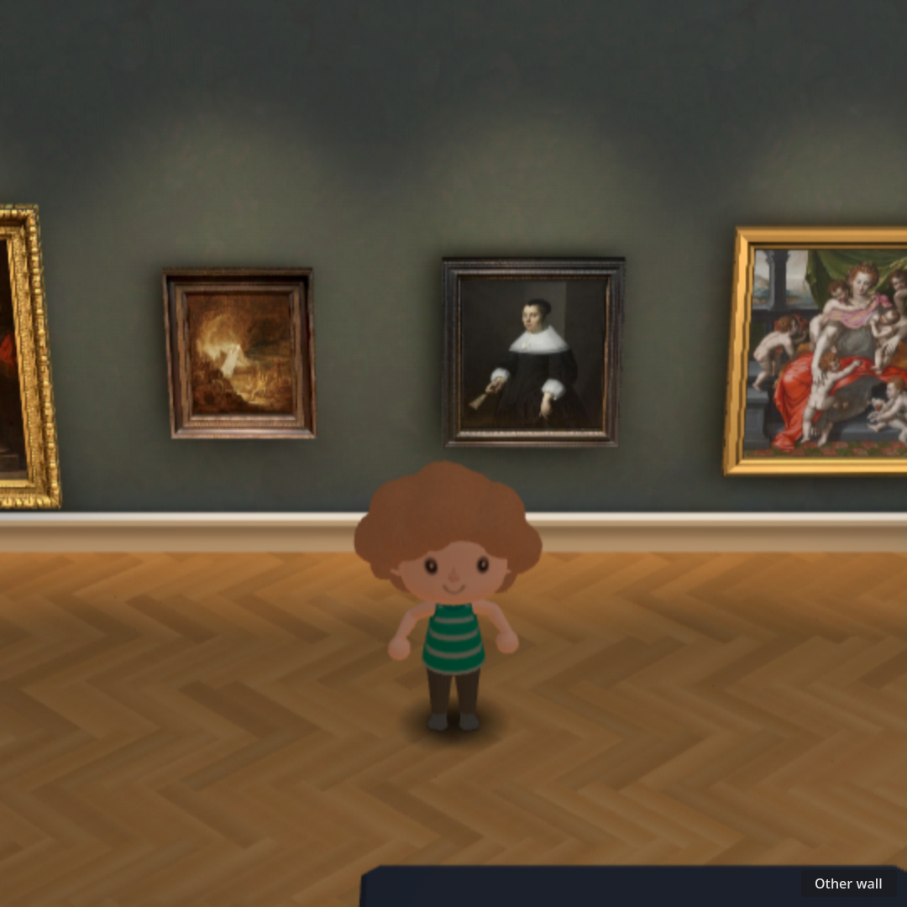
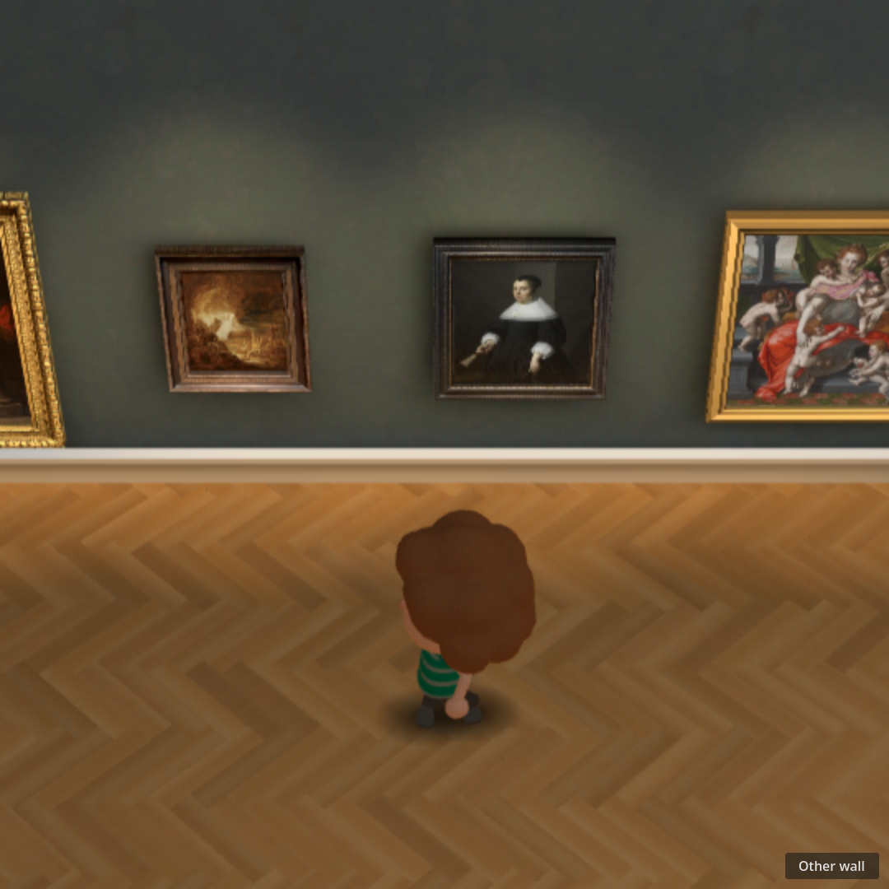
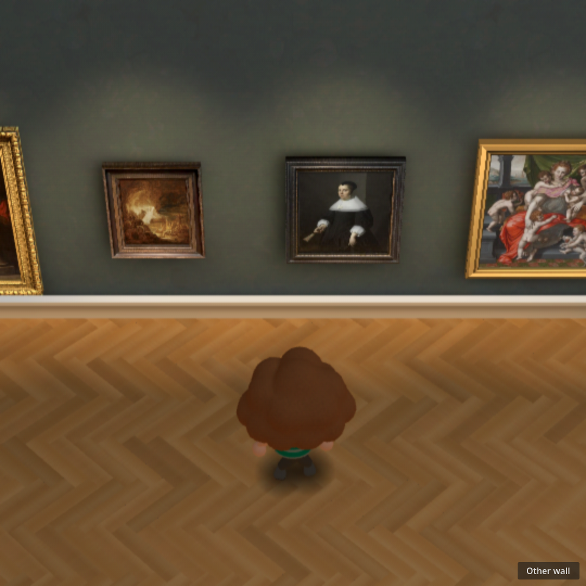
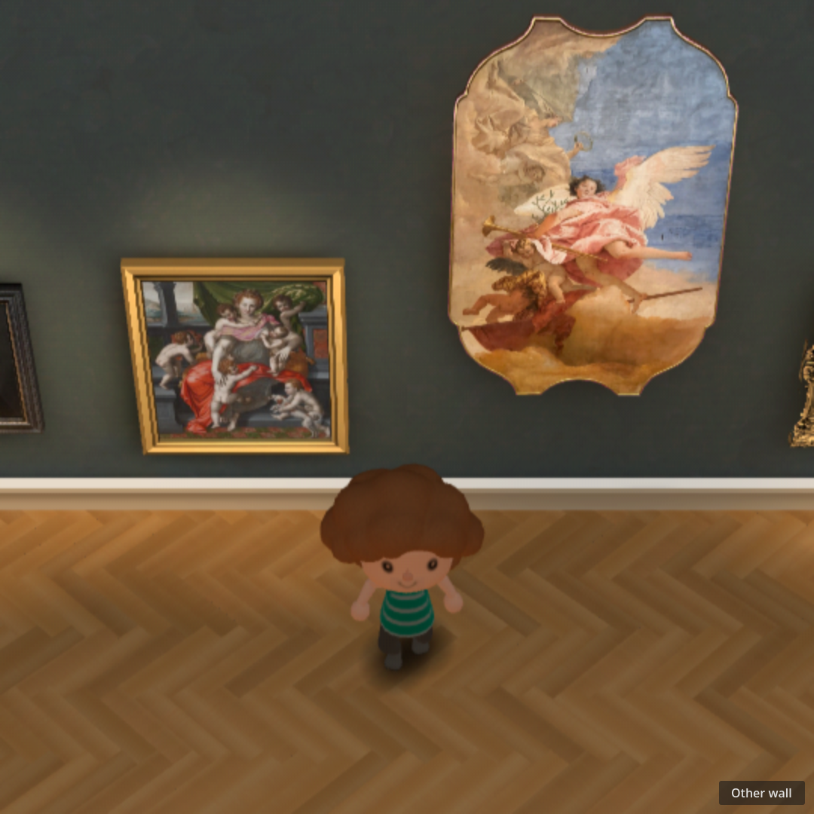
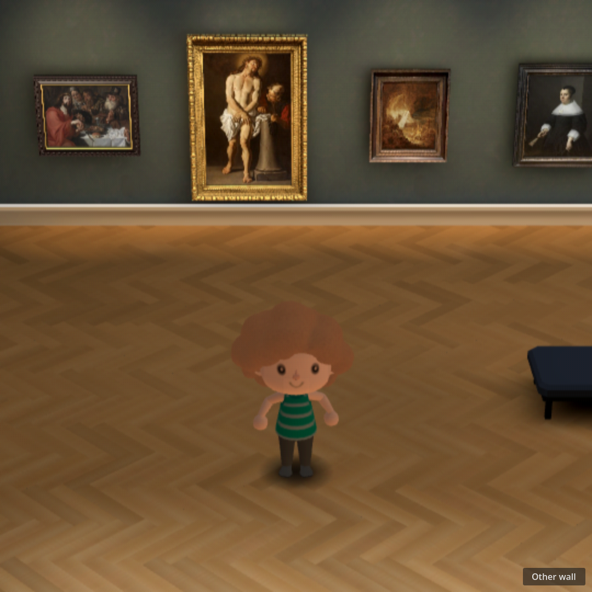
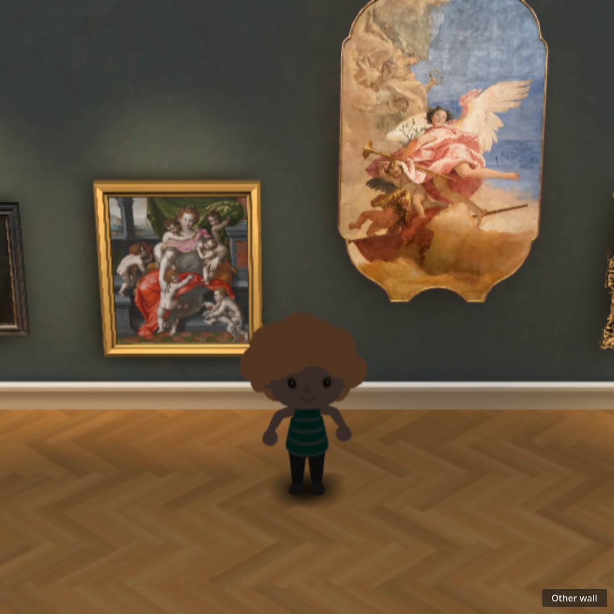
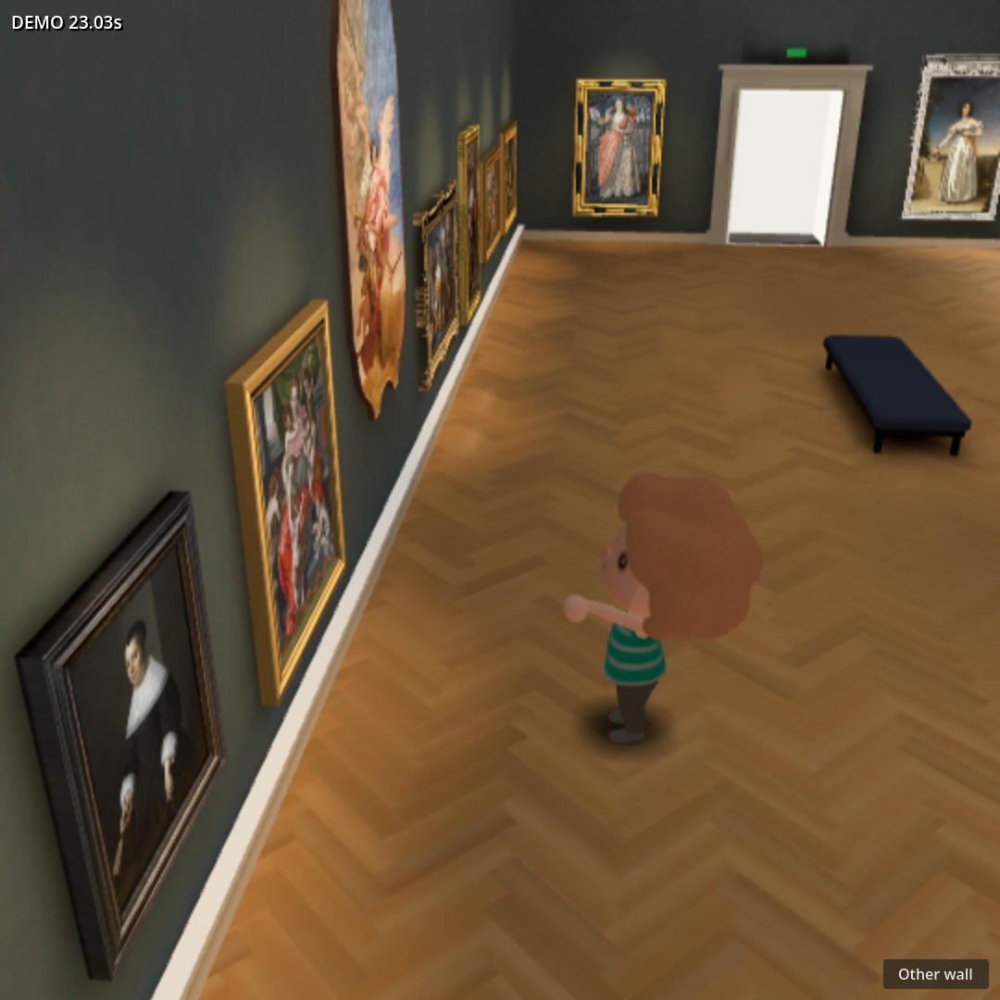

# #159 — sourced visitor in the Grand Gallery

Status: first two visible batches **failed** independent review; repaired batch awaiting
a fresh independent visual gate. Technical integration is not visual acceptance.
This is a throwaway branch, not a runtime or release asset selection.

## Question and scope

Can the actual sourced New Horizons body, UVs and skeleton replace the current
visitor while preserving the gallery and its 23 works? Yes at the integration
level: the replacement uses the existing navigation, camera, collision, picking
and artwork-detail controller. Visual acceptance is not inferred from that fact.

The branch starts at build `8606d87d09692357a8b86173b1e8f6537277be6d`.
`visitor159/gallery.gd` subclasses the existing gallery, replaces its visitor,
and lowers the default camera framing; the original room/controller file and
all paintings remain unchanged.
The dedicated Web export feature selects the throwaway scene. This branch's
viewport width is 1080 for square Movie Maker evidence, not a build integration.

Exact source pins, local input hashes, non-authentic motion labeling, material
adaptation and repeat commands are in
[PROVENANCE.md](../../../modules/shell/prototype/gallery_walk4/visitor159/PROVENANCE.md).
The character input is byte-identical to #163's candidate; animated transforms
and material overrides do not rewrite geometry, UVs, weights or inverse binds.
Native game clips were not recovered: only pinned KayKit Idle, Walking_A and
Interact are used. No Nintendo redistribution right or authentic animation is
claimed. No provider generation or spend was used.

## Corrections found by this prototype

1. The source emissive export has metallic=1. Disabling emission alone made the
   visitor black under gallery diffuse probes. Nonmetallic material copies fix
   that, retain source textures, and leave an untouched source-emissive route.
2. The initial controller adapter omitted #171's short settling interval when
   transitioning from walking/turning to idle. The stronger whole-plant-interval
   check exposed 3.17 cm drift. Restoring that settling behavior and correcting
   hip reach before leg solving reduced the measured drift to micrometers.
3. A look request at the instant reverse input was released was canceled by
   normal braking movement. The evidence now stops first, then invokes looking;
   it does not bypass the controller's gesture-cancellation behavior.
4. Fixed-30-fps capture exposed a residual alignment turn canceling Interact
   just after the controller started it. The visitor now finishes rotation at
   the controller's existing 0.015-radian alignment tolerance. The regression
   verifier requires actual `wave` samples, not merely an opened detail view.

## Technical evidence

### Repair after the first blind review

Fresh external GPT-6 Astra medium image-only review rejected `858e21df`: identity
and provisional rig/contact/cohesion passed, but the elevated rear/diagonal view
hid torso/arms under hair; look and artwork gestures needed labels to read; hair
was too dark/soft. That failed checkpoint remains in Git history and was not
integrated or closed.

The first bounded repair preserves the exact source geometry and rig. A 42° / 25° / 15°
framing trial selected 25° with a 1.55 m framing center: it shows the torso and
limbs while retaining more floor context than 15°. Character-only source-color
fill is 0.25, or 0.6 on hair; the existing diffuse probe response remains, and no
room light or global finishing shader changes. That batch's outward left-arm
accent and fixed head turn were later rejected as semantically unclear; the
target-directed replacement is described under the independent gate below.
All procedural accents remain non-authentic, not recovered game animation.

Closer inspection also rejected a numerically planted but crouched/asymmetric
resting stance. The donor idle lowered the pose root by 0.556 source units and
supplied sideways knee poles. Stationary settling now targets source-rest sole
positions, restores neutral hip height (0.03 source-unit reach reserve), and
blends knee poles forward over 0.2 seconds. Walking keeps the donor displacement.
The verifier additionally requires separated left/right soles at settled stops.
This is a #159-only procedural repair; #171 has a separate reopened visual gate.

Both final captures are now 1080 square. Action labels were removed: only clocks
remain, so look/artwork poses must communicate without explanatory captions.
Independent static views also reset foot anchors before changing orientation;
they no longer inherit anchors from the previous static view.

The capture uses real key-event handling and pointer press/release over W5;
`NAV_PICK W5` confirms picking before the normal approach, turn, gesture and
detail flow. Front/profile/back, straight/diagonal walk, stop, reversal, look,
and artwork interaction all appear in one continuous sequence. The headless
controller check verifies all stages, both look and wave, 23 works, and 42 bones.

Light probe negative control: warm hair pixel RGB
`[0.466667, 0.274510, 0.156863]`; cool `[0.458824, 0.266667, 0.149020]`;
GI-disabled/fill-only `[0.317647, 0.203922, 0.125490]`. This is a subtle spatial
response with a clear probe contribution above fill, not a claim of dramatic
color variation. The probe test also checks that all 23 painting records have
positive dimensions. No room lighting or global finishing change was made.

The final browser recording is [browser-normal-speed.webm](evidence/browser-normal-speed.webm),
with its [summary](evidence/browser-summary.json) and full
[clock/contact records](evidence/browser-metrics.json). The
[native controller movie](evidence/native-controller.mp4) is 1080 square,
1081 frames at 30 fps (36.033 seconds including warm-up). Its
[metrics](evidence/native-metrics.json) pass all stages and both gestures:
maximum sole penetration **0.000000227 m**, whole-plant drift **0.001694 m**.
It was rendered offline in 3:19; that is
explicitly not live native frame time.

Final target-directed 1080-square isolated browser result: **32.0161 demo seconds /
32.0220 wall seconds = 0.9998×**. This passes the pre-existing ±5% overall clock
gate. Independent browser observations: 733;
median interval **42.6 ms**, 95th percentile **60.6 ms**, maximum **158.4 ms**.
Browser console/page errors: 0. The software-rendered 1080 capture has visible
frame-time limitations; the earlier 720-square performance is not substituted.
Actual `look` and `wave` samples plus detail opening are required by the verifier.
Maximum sampled sole penetration: **0.000000250 m**; maximum whole-planted-interval
sole-vertex drift: **0.010392 m**, across 194 bottom sock vertices sampled at
roughly 0.1-second intervals. Gate tolerances remain 0.01 m penetration and
0.02 m planted drift; numerical tests do not replace visual inspection.

The browser timing run used Playwright Chromium / SwiftShader at 1080 square
while the other agents' Godot and browser renders were held. Preliminary
contended runs were slower (earlier repair trial 0.8318× with another native gallery
capture active) and are not used as the final timing claim. The final native Movie
Maker capture ran after the quiet browser window. Native
software-rendered Movie Maker output is deterministic 30 fps evidence, not a
measurement of live hardware performance. Neither establishes a 60 fps guarantee.

Repository `scripts/check.sh` and `git diff --check` passed on the final source;
the repo check retains the baseline ObjectDB exit-leak warning. Native and
browser `verify.cjs` checks pass. No frozen module interface changed. The original
gallery/controller, `works.json`, `gaps.json`, room meshes and paintings have no
diff from the base. Source GLB hashes still match the pinned inputs.
The fast headless-only harness additionally emits exit-time ObjectDB/resource
cleanup warnings; the rendered evidence is checked separately from that shortcut.

## Independent visual gate

The first verdict was FAIL as recorded above. Fresh independent GPT-6 Astra
medium blind review of `8f16eb4c` reference images and complete native/browser
videos also returned **FAIL for the complete visitor visual gate**. Source
identity, striped torso/hands/feet readability and grounded stop/turn contact
passed. Hair remained softer and upper arms partly obscured.

At native 14.13–15.87 s / browser 18.12–19.92 s, the head-look read as standing
at a wall without a distinct target, including full-1080 frames 14.80 / 18.60 s.
At native 24.40 s / browser 28.44 s, the sideways arm read as a wave/general
spread, not indicating the painting; only the later overlay clarified it.

The next bounded repair targets a readable gaze and painting-directed arm using
pose/camera staging on the unchanged rig. A nearest-work target is selected for
the look: body turns to a three-quarter stance, then head aims toward its center.
The actual picked work supplies the point target. The camera-side left arm aims
toward that center while the right arm samples quiet Idle. A target-relative
attention view (target heading +1.48 rad, 6 m distance, 51° FOV) frames the visitor
and work together. The wider FOV compensates for the shorter distance, keeping
the full visitor at approximately the normal gameplay size. Default view remains
14.2 m / 23°. Camera movement is continuous, not a cut or annotated explanation.
Fixed offsets 0.75, 1.05 and 1.25 rad failed to consistently show both face and
target at the actual controller position, despite a different static trial
position looking clearer. The target-relative trial uses both exact controller
look and approach-endpoint positions. A minimum 1.8 m distance from the work's
plane prevents the closer approach shot grazing the frame or viewing it edge-on.
The inherited cutaway mask now follows the actual camera angle and retains all
gallery walls while the eye is inside the room; no room geometry was changed.
Look lasts 1.8 s and point
2.2 s, including eased entry/exit and a held pose before the detail overlay.
The continuous controller sequence now runs 32 demo seconds to show the turn,
gaze, point and overlay without rushing. The alignment test requires the held
forearm direction to agree with the painting target (dot product >0.98); this
cannot establish human-readable intent. Held-look/point samples also require all
four target corners on screen and the camera clear of the painting plane.
Fresh blind review still decides whether the actions communicate their intent.
The prior 1.0021× clock check was not visual acceptance. #159 remains open;
no runtime integration or visitor selection.
