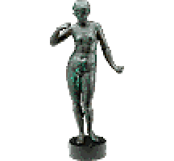
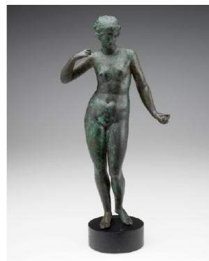
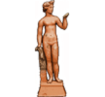
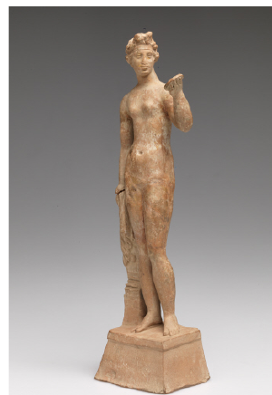

# Viewer panel photograph matches — 2026-09-28

Research checkpoint for [#169](https://github.com/Reid-Surmeier/risd-godot/issues/169), based on `1fedfbd5506d44465ae1b5bda0544d5a2f81bc92`. **Two additional image/accession matches: slots 10 and 16. The cumulative result is four identified objects and sixteen unmatched; every department remains unknown.** No runtime files, metadata, scan availability, or acceptance tests changed. This does not complete #169.

## Evidence

The official [Ancient Greek and Roman Galleries checklist](https://risdmuseum.org/sites/default/files/museumplus/312237.pdf) puts photographs beside object titles and accession numbers. Both physical pages were rendered and inspected, not identified from extracted text alone. The images below are plain crops, without generated detail or recoloring. These establish depicted-object identity, not identical file bytes or ownership/licensing of the composite.

| Catalogue source | Museum photograph | Verified record fields |
| --- | --- | --- |
| Slot 10, `panel-cell:11`  |  | **Aphrodite**, **26.117**, Greek, 199–100 BCE, bronze. [Checklist physical page 37](https://risdmuseum.org/sites/default/files/museumplus/312237.pdf#page=37). |
| Slot 16, `panel-cell:17`  |  | **Aphrodite**, **06.331**, Asia Minor; Greek; Smyrna, 300–200 BCE, terracotta; gilding. [Checklist physical page 3](https://risdmuseum.org/sites/default/files/museumplus/312237.pdf#page=3). |

Slot 10 correspondence: hand raised to the shoulder on image-left; opposite arm angled down and out with upturned hand; tilted pelvis and closely offset feet; green surface patches; cylindrical dark mount. Slot 16 correspondence: raised bent arm on image-right; long lowered opposite arm beside the narrow support; asymmetrical standing legs; distinctive narrow upper plinth over a flared trapezoidal foot; swept-up hair. These combined details distinguish the two objects despite the small, altered-color composite cutouts. The catalogue crop clips the uppermost head pixels; the full panel was also inspected.

Safe record-derived descriptions, explicitly paraphrases rather than quoted museum narratives: slot 10, “Greek bronze figure of Aphrodite, dated 199–100 BCE”; slot 16, “Terracotta figure of Aphrodite with gilding, dated 300–200 BCE.” Both display titles can be **Aphrodite**, but accession numbers must distinguish them. Department remains **unknown**, not inferred from culture, material, object type, or gallery title. Individual collection-record URLs were not verified; use the exact checklist page as the source citation. Image identity does not establish 3D availability or redistribution permission.

## Bounded search and unchanged unknowns

This pass searched museum-hosted handbook, Classical Bronzes, and selected-work listings for the bull and standing figures, plus the prior bearded-scan and stela leads. Text-only listings and search-result alternative text were discovery aids, never match evidence. The two Aphrodite candidates were then tested against actual checklist photographs. No automated nearest-neighbor, face recognition, or inferred title assignment was used.

The collection API request below returned **HTTP 403, HTML**, not museum JSON. The handbook HTML download also returned 403; a web fetch of Classical Bronzes timed out. In contrast, the checklist PDF downloaded with HTTP 200. This access limitation is not evidence that unmatched objects are absent from the collection.

```bash
curl -L --max-time 30 -o /tmp/risd169-api.html -w '%{http_code} %{content_type}\n' \
  'https://risdmuseum.org/api/v1/collection?search_api_fulltext=16.022&items_per_page=25'
```

The [John the Baptist 16.022 article lead](https://risdmuseum.org/art-design/projects-publications/articles/wood-middle-ages) still lacks an inspected corresponding museum photograph. The [handbook's stela listing](https://risdmuseum.org/art-design/projects-publications/publications/handbook-museum-art-rhode-island-school-design) still lacks a verified photograph/accession pair. Neither is a new scan identification. Bull listings in [Classical Bronzes](https://risdmuseum.org/art-design/projects-publications/publications/classical-bronzes) and [The Crawford Bequest](https://risdmuseum.org/art-design/projects-publications/publications/crawford-bequest) were not promoted to matches.

The [prior confirmed scan matches](2026-09-28-viewer-primary-record-comparison.md) remain slots 01 (73.148) and 04 (59.050). Slots **02, 03, 05–09, 11–15, and 17–20 remain unmatched**. All twenty departments, remaining descriptions, rights/source provenance, and integrated per-card metadata acceptance remain unresolved. No change to the [twenty-slot source/hash inventory](2026-09-28-viewer-catalogue-identity.md) or five-row/four-column order.

## Reproduce

Source composite: `modules/sculpture_viewer/assets/setup/panel-2x.png`, SHA-256 `d6cdb4c2c3ff042ea3380868184d297ea608f733bd377723cc71fd792f5b99d5`. Existing RGBA-pixel crop hashes remain authoritative: slot 10 `7326b4681293eee746ee11f4cbe5c92e2077a091571bbd23e8a7b08271e3b248`; slot 16 `32c890e0912d715f20196da918f3ca5b56cb3a1260a77b987ec6f2d6195ea9d9`.

```bash
curl -L --max-time 30 -o /tmp/risd169-classical.pdf \
  https://risdmuseum.org/sites/default/files/museumplus/312237.pdf
sha256sum /tmp/risd169-classical.pdf
pdftoppm -f 3 -l 3 -scale-to 1800 -png -singlefile /tmp/risd169-classical.pdf /tmp/risd169-page3
pdftoppm -f 37 -l 37 -scale-to 1800 -png -singlefile /tmp/risd169-classical.pdf /tmp/risd169-page37
convert /tmp/risd169-page3.png -crop 300x436+902+624 +repage /tmp/risd169-06331.png
convert /tmp/risd169-page37.png -crop 300x375+902+644 +repage /tmp/risd169-26117.png
convert modules/sculpture_viewer/assets/setup/panel-2x.png -crop 216x200+582+770 +repage /tmp/risd169-slot10.png
convert modules/sculpture_viewer/assets/setup/panel-2x.png -crop 216x200+80+1150 +repage /tmp/risd169-slot16.png
```

Inspected PDF SHA-256: `bf7a36c7165a9bda60215faf9df5999badffd571d42ba2890d63247a352fb3f1`, matching the previous checkpoint's download. Retrieved 2026-09-28 UTC. File-byte hashes of committed PNGs (different from raw RGBA crop hashes):

| Evidence file | SHA-256 |
| --- | --- |
| `risd-06331-photo.png` | `fbee72dd669b4a91dcf9600806c636cc81df7af533a2ea31849be99ccb300d62` |
| `risd-26117-photo.png` | `8f13bb17db6e62cece7a41e09a88fc6e9d28d78303fa80076b1aa3a19ebdd697` |
| `slot10-panel-cell11.png` | `a146d49073815a543e667906d72c80b862cd0f60f50533e0c895766e02c82f69` |
| `slot16-panel-cell17.png` | `48e19fec39d7472da2af135f476cadf20ed79a909a25221e97d847f40f8801a9` |

Museum photographs are evidence-only; no new runtime asset or rights claim. No paid requests, generated artwork, or accounts: USD 0.

Verification: fresh-worktree headless asset import completed; `scripts/check.sh` passed, retaining the existing 13-instance ObjectDB shutdown warning. `git diff --check` passed. No new runtime playtest is asserted for this documentation-only change. Independent image-only review, if performed later, must be recorded separately; these visual comparisons are this researcher's findings.
