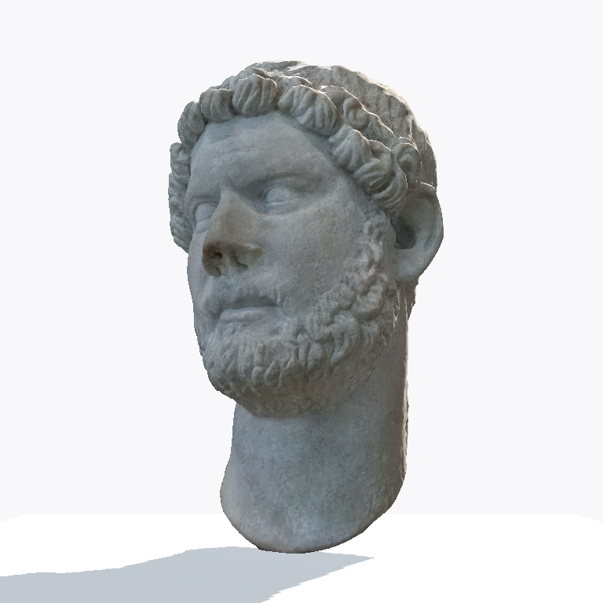

# Viewer primary-record comparison — 2026-09-28

Research checkpoint for [#169](https://github.com/Reid-Surmeier/risd-godot/issues/169), based on `35109ea2`. **Two scan thumbnails have visually established object matches; eighteen entries remain unidentified. No department is verified.** This is a research report, not completion of #169 or permission to present damaged scans as available 3D.

The [earlier inventory](2026-09-28-viewer-catalogue-identity.md) remains the source of the twenty exact thumbnail hashes, crop rectangles, stable IDs, and five-by-four order. This report supersedes its “none verified” finding only for slots 01 and 04. All other unknowns remain unknown. No runtime metadata, assets, interface, errors, or acceptance tests were changed.

## Method and limits

Read the original scan PNGs, the full owner composite, official museum record pages, and downloaded official photographs/checklist pages. Identification below rests on corresponding individual sculpted details and damage, not on a title search or generic iconography. This establishes the depicted object; it does not document who captured the scan, certify its mesh, or establish the scan/panel's redistribution rights. Research used only RISD Museum primary sources, with no generation or paid service (USD 0).

The [Collection API documentation](https://risdmuseum.org/art-design/projects-publications/articles/risd-museum-collection-api) describes title, description, object number, images, record URL, type, and public-domain fields, but no department. Requests to `https://risdmuseum.org/api/v1/collection?search_api_fulltext=Hadrian&items_per_page=25` and a `16.022` query returned HTML challenge/error content, not collection JSON. The browser retrieval also failed for the first query. No API response is claimed as evidence. Official record pages and downloadable PDFs supplied the findings below. Object type “Sculpture,” culture, and gallery placement are **not** department values.

## Confirmed visual matches

### Slot 04 — pale bust → Portrait of Hadrian, 59.050

Local file: [`20260820133334-front.png`](../../modules/sculpture_viewer/assets/scans/20260820133334-front.png), SHA-256 `084106155dd8543a0be2ea2360c15aa580a2111df17c6a3a5362dfca661fce92`.

The [direct museum record](https://risdmuseum.org/art-design/collection/portrait-hadrian-59050) identifies **Portrait of Hadrian**, object **59.050**, ca. 130 CE, Unknown Maker, Roman. Its [official photograph](https://risdmuseum.cdn.picturepark.com/v/UZ3LXvjG/) and the [Ancient Greek and Roman Galleries checklist](https://risdmuseum.org/sites/default/files/museumplus/312237.pdf#page=73) were inspected. The checklist location is physical PDF page **73**, zero-based index **72**; physical page 72 depicts other objects.

Exact visual evidence: the scan and photograph share the broken nose with the same recessed nostril cavities and irregular upper break; the asymmetric sequence of thick forehead curls including the large central paired locks; the stepped sideburn-to-jaw curls and divided chin locks; and the long, shoulderless neck with a curved, oblique lower termination. The scan is a different camera angle and has reconstruction seams across the crown; those artifacts are not used as museum-object features. The conjunction of individual features and break geometry supports the match, rather than merely “a bearded Roman head.”

Verified display name: **Portrait of Hadrian**. Department: **unknown**. Proposed description, explicitly a paraphrase of museum label copy: “A Roman marble portrait head of Emperor Hadrian, made around 130 CE. It was intended for insertion into a separately carved bust; its damaged portions remain unrestored.” The current record says marble likely from Thasos; prefer that record over the checklist's spelling. The record marks the object CC0; this does not independently license the Proton scan.

| Exact local thumbnail | Exact official photograph inspected |
| --- | --- |
|  |  |

### Slot 01 — group with skulls → Love Triumphs over Death (Cupid and Skulls), 73.148

Local file: [`20260811121459-front.png`](../../modules/sculpture_viewer/assets/scans/20260811121459-front.png), SHA-256 `a3b68dd79037f55d97c142bb1932b7073970cd2e0f7d657148853c6991224282`.

The [direct museum record](https://risdmuseum.org/art-design/collection/love-triumphs-over-death-cupid-and-skulls-73148) identifies **Love Triumphs over Death (Cupid and Skulls)**, object **73.148**, Gustave Doré, ca. 1876–1880, terracotta. The official [Nicole Eisenman exhibition checklist, physical page 23](https://risdmuseum.org/sites/default/files/museumplus/327266.pdf#page=23) places the photograph directly beside that accession and title. That rendered PDF page—not just its extracted text—was inspected against the exact scan.

Exact visual evidence: the reclining child's bent raised leg, opposite descending leg, arm laid across the skull mound, and curled head correspond. Beneath the torso are the same prominent upward-facing skull and irregular interlocked skull cluster. The layered base has the same straight side moldings meeting a projecting rounded end; the scan emphasizes its long side while the official photograph looks from the rounded end. These compound pose and base features support an object match despite the changed viewpoint. Fine surface identity is less legible than in the Hadrian comparison because the checklist image is smaller.

Verified display name: **Love Triumphs over Death (Cupid and Skulls)**. Department: **unknown**. No museum narrative description was present on the retrieved direct record. A safe record-derived factual summary, not a quoted museum description, is: “Terracotta sculpture by Gustave Doré, made around 1876–1880; gift of Uforia, Inc.” Keep any field specifically requiring *museum narrative description* unknown. The record marks the object CC0, not the independently captured scan.

## Rejected and unverified leads

For slot 03, [`20260811123051-front.png`](../../modules/sculpture_viewer/assets/scans/20260811123051-front.png), hash `30c8fce99f4d74fd6ebb56cde9793cbd629235f8062444a821d0b654f3f6de3e`:

- **Rejected: Head of Christ or a Saint, 59.131.** The [record](https://risdmuseum.org/art-design/collection/head-christ-or-saint-59131), [museum article](https://risdmuseum.org/art-design/projects-publications/articles/head-christ-or-saint), and [official photograph actually inspected](https://risdmuseum.cdn.picturepark.com/v/m78wVE8W/) show a detached head with broad ribbon-like, center-parted hair, a forehead lock, and a beard arranged in large mirrored curls. The local scan has small open curls, a receded forehead, many narrow beard locks, and a broad clothed chest with a textured shoulder. This is a different sculpture, not grounds to assign accession 59.131. The museum itself leaves the represented person's identity uncertain; do not simplify its title to a particular saint.
- **Unverified lead: John the Baptist, 16.022.** RISD's [Wood in the Middle Ages](https://risdmuseum.org/art-design/projects-publications/articles/wood-middle-ages) names this accession and limewood. The scan's textured garment suggested a search lead, not an identification. No corresponding official object photograph was obtained in this pass. Candidate collection URLs did not resolve through the browser retrieval, and the API query failed. Do not copy this title, accession, material, origin, or description into the slot. A complete sculpture could have been only partially scanned, so presence of a chest alone cannot establish or reject this lead.

For slot 02, [`20260811122415-front.png`](../../modules/sculpture_viewer/assets/scans/20260811122415-front.png), hash `5ecb033f9efca6071bf580b2d487a2bcf50f6492ab8ec6d115cbf6a50b5b3267`, inspection shows an arched, densely carved relief with a central seated figure and tiered base. Searches for RISD stele/Buddha records did not establish an exact object-image match. Title, accession, culture, department, and description remain unknown; the visual form alone does not justify a religious or geographic attribution.

The sixteen panel crops still have no established source-photo/record chain. Their tiny depictions and visual descriptors are not authoritative titles. The full panel contains unrelated interface text and composite cutouts; interpreting its captions is not a substitute for matching a museum record image. This pass inspected the composite but did not complete sixteen exact official-photo comparisons. No exhaustive search or negative identification of those objects is claimed.

## Ordered mapping after this pass

Hashes and crop rectangles are incorporated from the [unchanged twenty-row inventory](2026-09-28-viewer-catalogue-identity.md#exact-slot-inventory). “Unknown” below includes accession, museum title, department, description, and record URL unless a confirmed row specifies otherwise. Every row's department remains unknown.

| Slot | Stable source ID | Identity state / permitted museum name |
| --- | --- | --- |
| 01 | `scan:20260811121459` | Confirmed visual match: Love Triumphs over Death (Cupid and Skulls), 73.148; record and description limitation above |
| 02 | `scan:20260811122415` | Unknown |
| 03 | `scan:20260811123051` | Unknown; 59.131 rejected, 16.022 only a lead |
| 04 | `scan:20260820133334` | Confirmed visual match: Portrait of Hadrian, 59.050; record and paraphrase above |
| 05 | `panel-cell:06` | Unknown |
| 06 | `panel-cell:07` | Unknown |
| 07 | `panel-cell:08` | Unknown |
| 08 | `panel-cell:09` | Unknown |
| 09 | `panel-cell:10` | Unknown |
| 10 | `panel-cell:11` | Unknown |
| 11 | `panel-cell:12` | Unknown |
| 12 | `panel-cell:13` | Unknown |
| 13 | `panel-cell:14` | Unknown |
| 14 | `panel-cell:15` | Unknown |
| 15 | `panel-cell:16` | Unknown |
| 16 | `panel-cell:17` | Unknown |
| 17 | `panel-cell:19` | Unknown |
| 18 | `panel-cell:20` | Unknown |
| 19 | `panel-cell:21` | Unknown |
| 20 | `panel-cell:22` | Unknown |

## Reproduction and remaining acceptance

Downloads used only for inspection live in `/tmp/risd-identity-169/`, not runtime assets. File-byte SHA-256 values:

| Download | SHA-256 |
| --- | --- |
| `312237.pdf` | `bf7a36c7165a9bda60215faf9df5999badffd571d42ba2890d63247a352fb3f1` |
| `eisenman.pdf` (327266.pdf) | `55e4e6eac65b451645f2bdbb61538db9f5d126e9a3e95a1a8dc93ebc8916db85` |
| `hadrian.jpg` (UZ3LXvjG) | `0e324e986b2c7ec1e6a9edc76be7e2e91ca16246a04f7d609c53d061db654744` |
| `christ-saint.jpg` (m78wVE8W) | `4c14e8957d95afe59020354a7fbb4e3244096489a11e678a76198eaa647206ba` |

Render the checklist pages using `pdftoppm -f 73 -singlefile -scale-to 1800 -png 312237.pdf hadrian-p73` and `pdftoppm -f 23 -singlefile -scale-to 1800 -png eisenman.pdf eisenman-p23`. Downloads may change; hashes pin what was inspected. All four local PNG hashes were recomputed and matched the earlier audit.

#169 stays open: eighteen identities, all departments, source/rights provenance beyond the museum photographs, and per-card name/department/description selection acceptance remain unresolved. No selection test was added or claimed by this documentation-only pass. The next falsifiable lookup is an official photograph or source sheet for accession 16.022; compare it to the exact bearded scan before any metadata use. Mesh repair and validation remain independently owned by #154.

Verification: `scripts/check.sh` passed after running the editor's asset import for this fresh worktree; `git diff --check` passed. The first check failed on missing generated import-cache resources, not a report change. The successful run retained an ObjectDB shutdown warning (13 instances). No visual runtime change was made, so no new runtime playtest result is asserted.
