# Muse → 3D character → Blender bake → rig and animation

Research for [Issue #225](https://github.com/Reid-Surmeier/risd-godot/issues/225), September 30, 2026. Related motion investigation: [#151](https://github.com/Reid-Surmeier/risd-godot/issues/151). The owner supplied an Animal Crossing gameplay screenshot and requested a repeatable asset procedure, including Muse reference preparation, Blender MCP, baking, rigging, animations and effects. Research spend: **$0**. No generation, runtime replacement or installation was performed by this research. Captured and rechecked for the September 30 wayfinder map; separate prototype work is recorded on its own ticket.

## Decision

**Use the existing Muse/OpenRouter edit procedure to establish a clean character reference. Test Meshy 7.1 with an explicit T-pose; use coherent multiple views when available, otherwise begin with one inspected front reference, and use Blender to verify and finish the result.** This is a recommendation based on interface fit, not a measured model-quality ranking. No model was run against the supplied screenshot during this investigation.

The repeatable part should be an accepted body/UV/skeleton/animation template and a saved Blender script. A generation contributes the new appearance; it must not silently redefine the skeleton or asset contract each time. Keep a generated mesh if it passes the pose tests; do not automatically rebuild every successful mesh. If repeated body deformation failures persist, fit an authored body template to the generated reference and bake its appearance onto that template.

Muse reduces ambiguity by specifying what the 3D generator should build. It does **not** recover hidden geometry or guarantee that invented views describe one possible 3D object. Inconsistent extra views can make reconstruction worse. A beautiful turnaround, a quad mesh, a rigged file and an appealing game character are four different acceptance claims.

```mermaid
flowchart LR
    A[Gameplay reference] --> B[Muse T-pose and matching views]
    B --> C[Inspect identity and consistency]
    C --> D[Meshy 7.1 candidate]
    D --> E[Blender silhouette and topology]
    E --> F[Rig and deformation test]
    F --> G[Final UV and texture bake]
    G --> H[Bake animation keys and export GLB]
    H --> I[Godot motion and effects review]
```

The diagram is the proposed workflow, not completed asset evidence. Test deformation on temporary/simple materials before spending time on final baking; finish the UVs and mesh before the final bake. If rigging reveals that topology must change, return to the mesh stage and rebake only the accepted result.

## What this screenshot actually supplies

Visual observation: the player is a small region of an 886 × 664 gameplay image, viewed obliquely from above. It shows a large rounded head, painted face, horned/patterned headwear, small body, short limbs and a held dark object. It does not show a T-pose, unobstructed hands, clear joint placement, the rear outfit or the underside of the headwear. Those missing details must be designed and recorded. The screenshot does not establish the original UVs, skeleton, shading technique or exact character dimensions.

Do not send the full scenery/HUD image directly to image-to-3D. Preserve the original source, isolate a character reference, and remove the carried object from the **body reference**. If wanted later, create that object separately and attach it to the hand. Preserve the recognisable head shape, face placement, head-to-body proportion and outfit rather than adding realistic fingers, detailed fabric or modern glossy surfaces.

A T-pose turnaround is a modeling reference; it is not a UV texture atlas. The UV atlas comes after choosing the final mesh. A generated back view is proposed design, not recovered Nintendo source data.

## Muse reference preparation using the maintained tool

The local [image-generation-pipeline skill](/home/reidsurmeier/.codex/skills/image-generation-pipeline/SKILL.md) selects Muse (`meta/muse-image`) through OpenRouter. Its [saved procedure](/home/reidsurmeier/Image-generation-pipline/procedures/muse/README.md) supports source edits with ordered image inputs, prompt/input hashes, one output per request, durable reservation and a separate visual review state. Use ordinary `edit` for this reference task. `dis-composite` is the saved advertising/photo-composition procedure and would add irrelevant contents rules here.

Start with one reference-edit output. Proposed prompt content:

> Create a modeling reference of the same character shown in the supplied gameplay reference. Preserve its oversized rounded head, facial features, horned patterned headwear, outfit colors and short chibi proportions. Full body in a neutral T-pose, both arms straight horizontally, hands empty, feet apart, limbs visibly distinct. Front view, flat neutral illumination, plain background, no scenery, HUD, perspective exaggeration, text or added realistic detail. The face and outfit must remain painted and simple. Keep the complete character inside the frame.

Once that front identity passes visual inspection, use it as the controlling reference for a coordinated front/left/back/right sheet or additional views. A single coordinated sheet reduces independent redesign, but every panel still needs inspection. Extract each panel as a separate image before multiview submission. Use the same scale, head/foot baseline, hat/horn arrangement, clothing bands, pose and color palette. Do not feed the sheet collage into a single-image endpoint. If side/back disagree, repair the references; do not try to average the conflict with more 3D runs. Preserve meaningful original asymmetry instead of blindly mirroring the outfit.

Prefer front + back + the useful profile(s) only when they agree. A single accepted front view is a valid fallback, with explicitly designed unseen details. No generation should claim exact recovery from this tiny screenshot.

The repo already contains a [Muse turnaround](../../image-work/gallery-character/review/identity.webp) and [review](../../image-work/gallery-character/identity-review.md). It is a different red-cap design, not the supplied horned character. Reuse its saved process, not its identity or historical review flags. Keep the new source, recipe, prompt, output and run receipts together under an application-owned character study directory. `identity` → `prepare` → `image` without `--execute` are the unpaid preparation path; execution must use the approved reservation and secret runner described by the maintained procedure.

## Which 3D model to test

| Candidate | Verified interface fit | Recommendation and limit |
| --- | --- | --- |
| **Meshy 7.1 multiview** | `meshy/v7.1/multi-image-to-3d`: 1–4 separate images, T-pose control, remeshing and quad output, polygon target; optional humanoid rigging and walk/run outputs. | **First candidate** for the requested multiple-view → T-pose → rig workflow. No proof yet that it reproduces this character or deforms its tiny limbs well. [fal schema](https://fal.ai/models/meshy/v7.1/multi-image-to-3d/api). |
| **Meshy 7.1 single-image / smart topology** | `meshy/v7.1/image-to-3d` exposes a `smart-topology` mode as well as standard/lowpoly, plus T-pose. Smart topology's documented polygon ceiling is 15,000. | Fallback if coherent multiview references are unavailable or the first topology fails. Do not copy `model_type` into the multiview request: that field is absent from its fal schema. [Single-image schema](https://fal.ai/models/meshy/v7.1/image-to-3d/api). |
| **Tripo P2** | `tripo3d/p2/image-to-3d`: one image, quad switch, face limit, UV output, separate geometry/texture seeds and delight option. | One comparison candidate if Meshy fails silhouette/topology. The verified fal P2 endpoint is single-image and does not expose rigging; do not invent a P2 multiview route. [P2 schema](https://fal.ai/models/tripo3d/p2/image-to-3d/api). |
| **Tripo H3.1 multiview** | 2–4 images ordered front/left/back/right, polygon target and quad option; quad results may be FBX. | A documented multiview alternative if needed, without assuming it shares P2's mesh behavior. [H3.1 schema](https://fal.ai/models/tripo3d/h3.1/multiview-to-3d/api). |
| **Rodin 2.5** | Up to five images, `TAPose`, quad/triangle choices, texture-delighting and multiple export formats. | Additional option only if the bounded comparison establishes a reason; detailed generation is not automatically a better fit for a small retro character. [Rodin schema](https://fal.ai/models/fal-ai/hyper3d/rodin/v2.5/api). |

Meshy v7 pages currently mark themselves deprecated in favor of v7.1. Pin the exact endpoint/model used; do not silently follow `latest`. [Deprecation](https://fal.ai/models/meshy/v7/image-to-3d/api).

For the first Meshy multiview candidate, proposed controls are `pose_mode: "t-pose"`, `should_remesh: true`, `topology: "quad"`, `should_texture: true`, `enable_pbr: false`, and rigging/animation disabled until geometry is inspected. These are proposed settings, not verified output quality. Start with roughly 2,000–4,000 quad polygons and measure the triangulated export; a face target is not a triangle guarantee. Source geometry may need more density to preserve the silhouette before producing the final low mesh.

Meshy's primary multiview documentation says the first image is the front view. It also exposes input enhancement, lighting removal and pre-remesh preservation that are not all present in fal's wrapper. It now marks symmetry control deprecated. Do not rely on a wrapper field to enforce symmetry or assume undocumented passthrough to the upstream API. A future implementation must inspect the wrapper's actual schema before submitting. [Meshy multiview contract](https://docs.meshy.ai/en/api/multi-image-to-3d).

Auto-rigging requires a textured humanoid with discernible limbs; Meshy warns against ambiguous anatomy and untextured inputs. Uploaded GLB must face +Z for pose estimation. This matters for the tiny limbs and large headwear in the screenshot. Keep accessories separate where necessary, provide measured height rather than a human default, and test weights. [Meshy rigging contract](https://docs.meshy.ai/en/api/rigging).

## Existing work and live tool state

The [earlier identity study](gallery-character-identity-next.md) produced an assembled skin with a working inherited rig, but rigid weights and silhouette/material problems remained. The [UV-bake trial](gallery-visitor-uv-bake-trial.md) preserved 41 joints and 76 animation entries and imported its maps into Godot; its authored placeholder shirt had no clear improvement at gameplay size. Reuse the [bake transfer recipe](gallery-visitor-uv-bake-sources.md) and acceptance lessons. A texture bake cannot repair the rejected head/body shape.

The currently selected runtime visitor belongs to [#174](https://github.com/Reid-Surmeier/risd-godot/issues/174). This investigation does not authorize silently replacing it. Build the new pipeline proof as an asset study before considering integration.

Live checks during this research: `/usr/bin/blender` reports **4.0.2**; Godot exists at `/home/reidsurmeier/bin/godot`. A Blender 4.3 add-on file exists. The managed [Blender MCP definition](/home/reidsurmeier/agentic-workflow/mcp/blender/MCP.md) is scoped to **Jax-Solve-Slicer**, pins `mcp-for-blender==2.0.0`, and describes Blender 4.3.2. No Blender tools are exposed in this session, and `ss` showed no listener on port 9876. Therefore Blender is present, but **MCP connectivity and a matching GUI/add-on have not been established for this project**. Version-sensitive scripts must use a verified selected Blender binary; current upstream documentation is not proof that Blender 4.0.2 supports every current option.

The new Bitwarden entry `Fal-ai -NEW` was independently checked earlier in this conversation: authenticated model-list request returned HTTP 200; invalid-key control returned 401. That establishes credential acceptance, not balance, generation quality or paid authorization.

## Spend and execution constraints

No research calls were paid. The owner's standing [operating preference](/home/reidsurmeier/agentic-workflow/docs/knowledge/operating-preferences.md) permits paid actions through **OpenRouter only**. On September 30 the owner explicitly approved **fal for the first character pilot with a $4 aggregate ceiling including Muse, 3D and rigging**; the scoped exception is recorded in [the map Notes](https://github.com/Reid-Surmeier/risd-godot/issues/226). This exception does not change the standing rule elsewhere. Credential installation alone grants no spend authorization.

The exact current first-request price was subsequently checked against fal's first-party page HTML and authenticated unpaid pricing catalog: Meshy 7.1 is **$0.80 untextured or $1.20 textured**, plus $0.20 for inline rigging and $0.12 for inline animation. Standalone multi-animation rigging is **$0.20 plus $0.12 per requested clip**. The catalog's $0.08 rigging unit is not the price of a complete submitted request. Tripo P2 standard-textured output is $1.10. Muse's current OpenRouter page is $0.01/image. See the [exact pilot note](character-inputs-227.md) for the sanitized observations, schemas, dated bounds and proposed $1.53 minimum pilot. [Meshy pricing](https://fal.ai/models/meshy/v7.1/image-to-3d), [rigging pricing](https://fal.ai/models/fal-ai/meshy/rigging/multi-animation), [P2 pricing](https://fal.ai/models/tripo3d/p2/image-to-3d), [Muse pricing](https://openrouter.ai/meta/muse-image).

A smallest future proof is one inspected Muse identity/reference set, one Meshy candidate, one rig with idle/walk, and one Blender→Godot review reel. Add one comparison candidate only after recording the first failure. Preserve request IDs and liability after uncertain paid results; polling the same job is different from generating again. Never spend on a batch before one asset survives the whole process.

## Existing workflows, and the strength of the evidence

Blender Studio's own **Game Asset Creation** course explicitly covers modeling, UVs, texturing, baking and engine import. Its **Low Poly Character Creation** course is a character-specific starting point and includes UV baking. These are established first-party educational workflows; they do not demonstrate AI generation or unattended MCP execution. [Game Asset Creation](https://studio.blender.org/training/game-asset-creation/), [Low Poly Character Creation](https://studio.blender.org/training/low-poly-character-creation/).

Artist/developer Tommy Raffaello Hodoroaba publishes a creator-owned **Meshy → Blender → RetopoFlow → Auto-Rig Pro** procedure. It treats generated meshes as references, distinguishes deforming characters from props, rebakes after retopology, and tests weights in difficult poses. The author lists an Unreal horror-game enemy as an example. The repository contains documentation, not reproducible project files, so its claimed production outcomes are self-reported. It is evidence that this procedure already exists, not proof that every generation becomes game-ready or that its blanket claims and numeric settings apply universally. [Creator's pipeline](https://github.com/73K-Y/3D-Workflow-Pipeline).

Do not buy RetopoFlow or Auto-Rig Pro merely to follow that example. Begin with Blender's native editing, shrinkwrap and rigging facilities; add an assisted retopology tool only when the pilot shows where hand work is expensive. This is a proposed minimal implementation choice, not a comparative benchmark.

Stronger implementation evidence: **fal-3d-unreal** includes real C++ for concept image → Meshy mesh → multi-animation rigging → GLB loading and movement-driven playback. Its README acknowledges clip-dependent scale corrections, hard-cut transitions, fused-arm skinning and props that bend with the limbs. Its Meshy-7 endpoints are a historical implementation example and need replacement with current supported endpoints, not copying unchanged. This demonstrates integration exists, not production-quality chibi animation or Blender baking. [Creator-owned source project](https://github.com/blendi-remade/fal-3d-unreal), [inspected rigging implementation](https://github.com/blendi-remade/fal-3d-unreal/blob/454f56defb0f53f589bd870d6129701651b8f4dc/fal3DDemo/Source/fal3DDemo/FalRigClient.cpp), [inspected gameplay implementation](https://github.com/blendi-remade/fal-3d-unreal/blob/454f56defb0f53f589bd870d6129701651b8f4dc/fal3DDemo/Source/fal3DDemo/fal3DDemoCharacter.cpp).

## Five stages to standardize

1. **Source acceptance.** Import the complete generated mesh and textures; preserve it unchanged. Align high and low versions in the same rest pose, apply appropriate rotation/scale, establish feet on the ground and the intended height. Inspect front/side/back plus wireframe before proceeding. The supplied screenshot hides the back and much of the limbs; prepared references make the missing design explicit, but invented back/side details remain design decisions rather than recovered facts.
2. **Final topology.** For this animated chibi body, keep a passing mesh or fit a reusable mesh with enough geometry at shoulders, hips, elbows and knees, preserving the silhouette. Separate rigid hat/horns/hair/shoes as appropriate. A decimated output can be a static prototype; polygon reduction is not evidence of good deformation. Blender describes retopology as cleaning generated/scanned/sculpted topology and identifies deformation as a reason to do it. QuadriFlow can supply a starting mesh; a quad mesh still needs deformation inspection. [Retopology](https://docs.blender.org/manual/id/4.0/modeling/meshes/retopology.html), [Decimate](https://docs.blender.org/manual/en/4.3/modeling/modifiers/generate/decimate.html).
3. **UV and bake.** Keep a source and low mesh in matching poses. Give the target UVs and an active Image Texture node in every target material. In Cycles use Selected to Active with low mesh active; use a matching-topology cage or calibrated ray distance. Bake color without direct/indirect illumination, or temporarily route source base color into emission for an Emit bake. Include island padding; separate or temporarily isolate adjacent body/accessory parts to prevent projection contamination. Optional tangent normals only after a visual comparison establishes value. [Baking](https://docs.blender.org/manual/id/5.0/render/cycles/baking.html), [Cycles baking passes](https://code.blender.org/2014/02/cycles-baking/).
4. **Rig and animation.** Fit one template skeleton, bind and repair weights, then test shoulder raises, elbow/knee bends, a squat, head turn and walking. Bake the evaluated animation to export keys, using visual keying for constrained motion. Work on an export copy so the authoring controls remain editable. Export only intended meshes, armature and actions. [Rigify](https://docs.blender.org/manual/en/latest/addons/rigging/rigify/basics.html?highlight=pose+mode), [Bake Action](https://docs.blender.org/manual/nl/5.1/editors/nla/editing/strip.html).
5. **Godot acceptance.** Export an explicit GLB, reopen it in a clean scene, and inspect materials, scale, skeleton and animation before Godot import. Godot recommends glTF from Blender. View the character at its intended camera angle and screen size, not only in a close-up render. Check looping, transitions, attachments, foot slip and texture seams. Keep engine behavior in a scene composed around the imported asset so re-exporting does not erase gameplay work. [Available formats](https://docs.godotengine.org/en/stable/tutorials/assets_pipeline/importing_3d_scenes/available_formats.html).

The proposed pilot budget is a few thousand triangles and one 512–1024 px color atlas, with smaller exports compared visually. These are starting values for this camera/style, not measured project requirements. Keep facial detail in the texture initially; add facial topology or shape keys only for an identified animation need.

## Preserve the screenshot's style

The screenshot suggests simple forms and prominent painted facial/clothing detail. It does **not** prove that the original game uses unlit shading. Compare a baked-color unlit treatment with a softly lit material before choosing. Avoid making metallic, roughness, AO and detailed normal maps mandatory for every asset. A strongly lit source image may already contain shadows; baking its color does not separate those into physical albedo.

Blender's glTF exporter supports both metallic/roughness PBR and the `KHR_materials_unlit` extension. Use a documented exporter-compatible node arrangement rather than assuming arbitrary Blender shaders transfer. [Blender glTF material documentation](https://docs.blender.org/manual/en/4.0/addons/import_export/scene_gltf2.html).

## T-pose, auto-rigging and animation reuse

**T-pose reference is a pose specification; it is not a UV map or a skeleton.** Geometry, rest pose, skeleton placement, bone roll and weights must still be checked. A prepared front/side/back sheet is useful for modeling and comparison, but feed each view separately to a multiview API. Do not pass a collage to an endpoint that expects one object image.

Mixamo is free with an Adobe ID and its assets/animations can be used in games. Adobe says its auto-rigger needs a clean, centered, neutral humanoid with distinguishable body parts; heavily distorted proportions, large extra appendages, or disconnected parts can fail. That makes it a useful optional pilot, not a dependable default for a huge-headed, tiny-limbed character with an elaborate hat. Rig the clean body before adding large accessories if trying this route. No assumption of a supported public automation API was verified. [Adobe Mixamo FAQ](https://helpx.adobe.com/creative-cloud/faq/mixamo-faq.html).

For a repeatable Blender-controlled route, Rigify offers a Basic Human metarig without fingers or face; fit its bones and generate controls. Preserve the metarig and source rig. Its deform bones live in the DEF collection; export an evaluated deform skeleton with baked animation rather than runtime dependence on Blender controls. Rigify generates controls but does not invent correct proportions or eliminate weight repair. [Rigify basic usage](https://docs.blender.org/manual/en/latest/addons/rigging/rigify/basics.html?highlight=pose+mode).

For multiple characters, standardize bone hierarchy, names, rest orientation, root and scale. Godot provides BoneMap and SkeletonProfileHumanoid, but identical names alone are insufficient. Its profile uses a T-pose and +Z facing in Y-up coordinates. The importer can normalize movement for height differences, but large silhouette differences and bone-roll errors are not guaranteed to be fixed. Retargeting can remove unmapped or non-bone tracks, which can also remove accessory animation; review import settings instead of enabling them indiscriminately. [Godot retargeting](https://docs.godotengine.org/en/stable/tutorials/assets_pipeline/retargeting_3d_skeletons.html).

Start the reusable clip set with idle, walk, run if needed, start/stop and left/right turns; add a wave or interaction only to prove upper-body layering. These are recommended pilot acceptance cases, not established clip counts. Human mocap may need hand correction for the character's short stride, oversized head and desired stylized timing.

## Runtime animation and effects

Godot's AnimationTree provides blends, state transitions and root-motion extraction. For this exploratory top-down character, start with controller-driven movement plus in-place clips and match playback speed to travel speed. Choose root motion for actions requiring authored movement/contact; Godot cancels the selected root track visually and exposes its delta for the controller to apply. Never independently apply both controller travel and the same root displacement. This default is a design recommendation; both routes are supported. [AnimationTree](https://docs.godotengine.org/en/stable/tutorials/animation/animation_tree.html).

Give stylized locomotion a small body bob, head lag and anticipation/settle in the authored clips. Add squash/stretch only on a deliberately authored visual control and validate its exported behavior. Keep collision and controller scale stable. Godot warns that SpringBoneSimulator3D expects unscaled skeletons/bones, so do not combine arbitrary skeleton scaling with spring accessories without a separate tested solution. SpringBoneSimulator3D supplies inertial motion for nonbranched hair/cloth/tail bone chains and can use its own collisions. [SpringBoneSimulator3D](https://docs.godotengine.org/en/stable/classes/class_springbonesimulator3d.html).

Use BoneAttachment3D for a carried item or rigid head accessory. Footstep sounds, dust or interaction effects can use AnimationPlayer method-call tracks; verify when they fire through blends, loops and state changes, and generate them in the Godot scene/library rather than assuming Blender's events survive GLB. Bake foot contacts and fix slipping first; runtime IK is an additional feature, not a cure for a broken walk cycle. [BoneAttachment3D](https://docs.godotengine.org/en/stable/classes/class_boneattachment3d.html), [Animation track types](https://docs.godotengine.org/en/stable/tutorials/animation/animation_track_types.html).

## MCP should operate the pipeline, not invent it each time

Upstream **Blender MCP** is now named **mcp-for-blender**; it is a third-party integration, not a Blender product. Its tools inspect scenes, capture viewport images and execute Python. The official source asks for small sequential execution chunks and uses 180-second socket receive timeouts. Therefore keep fixed stage scripts and checkpoints; a long bake timeout is not proof that the operation failed, and blind reruns can duplicate or overwrite work. Pin the installed version before implementing against its behavior. [Upstream README](https://github.com/ahujasid/mcp-for-blender), [Tool/socket implementation](https://github.com/ahujasid/mcp-for-blender/blob/main/src/blender_mcp/server.py).

The least complicated implementation is one existing Blender `.blend` template plus one small `bpy` pipeline script, split into stage functions that MCP calls. Configure explicit source/low/cage names, materials, dimensions, pose, bake images, export selection and clip names; query current state before any rerun. Validate face count, UV existence, texture files, deform weights and exported actions with small assertions, and produce a turntable/contact sheet and a short animation review reel. Do not build a new orchestration framework before one asset survives the whole route.

The upstream socket lacks authentication and encryption, so keep it on loopback or behind an SSH tunnel. Its optional safe mode blocks risky arbitrary filesystem/network/process code while allowing normal Blender save/import/export. Keep provider keys outside generated Blender scripts. Its built-in Rodin/Hunyuan generation integrations do not establish authorization for provider-direct paid calls under this user's OpenRouter-only spend rule; importing a locally obtained model through Blender avoids coupling the DCC to generation credentials. [Security and safe mode](https://github.com/ahujasid/mcp-for-blender#environment-variables).

## Animation sources and the first motion proof

After mesh acceptance, the verified fal endpoint `fal-ai/meshy/rigging/multi-animation` can rig a textured humanoid GLB and return separate preset clips against one shared rig. It includes basic walk/run outputs and accepts additional action IDs. Begin with one idle preset and the basic walk, rather than requesting a full library. Keep the resulting rig as the animation source of truth; import additional clips onto that skeleton instead of independently re-rigging each one. [fal rigging/multi-animation contract](https://fal.ai/models/fal-ai/meshy/rigging/multi-animation/api).

Meshy's animation API applies library motions to a completed rig, while its text-to-motion API generates raw motion that must be retargeted. The latter is a candidate for an unusual gesture only after library motion and the body pass inspection; a text prompt is not proof of planted feet or correct interaction contact. Preserve the exact chosen clip and its provenance, not just its informal name. [Animation API](https://docs.meshy.ai/en/api/animation), [Text-to-motion API](https://docs.meshy.ai/en/api/text-to-motion).

A creator example uses idle action 0 and casual walk 30. Validate current names and preview those motions before choosing; an API-valid preset can still have inappropriate style or root translation. [Current preset catalog](https://docs.meshy.ai/en/api/animation-library). Existing KayKit clips are another locally recorded source, but the repo's prior result already shows that compatible animation data does not establish accepted appearance or gait. Do not force a new skeleton into the current controller's hard-coded bone assumptions without a separately scoped adapter change.

## Acceptance record for one asset

| Gate | Evidence to keep | Stop condition |
| --- | --- | --- |
| Reference | Original, accepted front and separate matching views; side-by-side silhouette review | Outfit/headwear changes between views, invented limbs, carried tool fused into the body |
| Mesh and rig | Front/profile/back render, wireframe, shoulder/elbow/knee/head pose reel | Fused armpits/legs, detached skin, collapsing joints, hat/head deforming with shoulders |
| Bake | Source/target/cage in matching rest pose, named UV and material inputs, saved color atlas, seam renders | Projection bleeding, overwritten mirrored UV detail, double lighting, missing/black texture |
| Motion and effects | Idle→walk→stop and 90/180-degree turns; feet and hand attachment closeups, squash/secondary-motion check if included | Foot slipping/penetration, sudden scale changes, clipped limbs, duplicated root travel, repeated effect events |
| Export and runtime | Clean GLB reimport and Godot native/Web captures at actual gameplay size; triangle, skin, texture and animation inventory | Missing clips/textures, changed bind pose/axes, distorted silhouette, accessories or events lost on import |

The reusable asset packet should contain the source/model receipts and hashes, source `.blend`, accepted low mesh/UV/rig, named animation actions, saved Blender stage script, export GLB, and review evidence. Keep generated trial files out of runtime dependencies. Texture baking and animation baking are separate operations: the former transfers surface information to images; the latter samples Blender's evaluated motion into exported keys. Neither operation guarantees the other.

## What remains unverified

No first-party source found demonstrates this exact screenshot, Muse references, selected fal endpoint, chibi skeleton, Blender MCP bake, and Godot effects as one proven unattended system. The established parts are mesh cleanup/retopology, high-to-low transfer, fitted rigs, baked exported clips and engine-side animation. Exact model quality, generation settings, UV reuse, rig fit, deformation and the final material require one actual pilot; model-preview quality alone cannot settle them.
