# The New Horizons museum as a finish specification for the Collection walk

Research for the owner's north star — "the Nintendo [Animal Crossing New Horizons] Museum ... in terms of how everything is polished and made and lit" — written 2026-10-01 against checkout `consolidate-character-236` (HEAD `32d3ba8c`). This file and the 20 pictures beside it are the only things added. No project file was changed, nothing was run in the engine, no paid call was made, and the roughly 100 MB of footage fetched for study was deleted.

**The answer in one paragraph.** The New Horizons museum looks finished for four reasons that can be measured: the camera looks at the walls instead of the floor (30° down through most of the gallery, about 19° in the back room where the largest paintings hang, always a narrow 22–23° lens); the art is the brightest thing in the picture because each work sits in its own cream-white pool and the rest of the room is allowed to go dark; looking at a work is a small piece of camera choreography (a 0.7 second glide to an over-the-shoulder shot, a text panel, one click per page) rather than a screen swap; and nothing ever cuts — every view change is a glide or a wipe. This project has the same lens already, but looks 42° down at a bright floor, lights every room evenly, and opens a work by replacing the room with a white page.

The ten changes worth the most, in order:

1. Lower the dollhouse camera from 42° to 30° and pull it back from 11 m to about 16 m, lens unchanged.
2. Re-bake the light for contrast: a third of today's fill, tight cream-white pools on each work, art brighter than floor.
3. Inspect a work in the room: 0.73 s glide to an over-the-shoulder shot and a bottom text panel, with the existing zoom page kept as a second step.
4. Where tall works hang, ease the camera down toward 19° as the visitor nears the wall, as the game does in its back gallery.
5. Give floors a soft moving sheen from the lamp positions (shader only, no screen-space reflections).

6. One soft round shadow under the visitor (about 0.9 m, half strength) and a visible dark contact band under benches, cases and plinths.
7. White landscape label cards, about 0.30 × 0.17 m, beside every work.
8. No cuts: slow the quarter-turn to about 1 s, turn "Other wall" into a glide or an iris wipe, keep wipes for jumps only.
9. Benches you can sit on, with a calm angled "rest view".
10. Light sources that read as sources: bright lamp faces with a soft glow, and one short sound per press instead of three long ones.

How to read the labels. Every row in section 2 was read off footage, or quoted from a source, at the time given; where a row goes beyond what was seen it says so. Numbers handed to the builder carry **[M]** measured from footage, **[E]** estimated (worked out from a measurement, or converted from game units to metres) or **[T]** taste. Each step in section 4 is marked **bake** (needs a lightmap re-bake) or **runtime** (code, shader or scene only).

## 1. Sources and method

| Key | Source | What was studied |
| --- | --- | --- |
| A | bloodrive65, [100% Complete Museum Tour (Bugs, Art, Fossils, Fish & Brewster) [4K]](https://www.youtube.com/watch?v=5u3V2sfaSHc), uploaded 2024-04-10, 37:50 | 0:00–1:04, 7:20–21:30 (the whole Art chapter), 20:58–23:40, at 854×480, 30 fps. The player reads every label, so this is the inspection reference. |
| B | MonkeyKingHero, [A walk around a complete Art Gallery Museum](https://www.youtube.com/watch?v=4nWg4mjpjFc), uploaded 2020-04-24 (the day after the gallery shipped), 2:12 | All of it at 640×360. One unbroken walk on a Switch, no labels read: the free-walk camera reference. |
| C | Nintendo 公式チャンネル, [[2020.4.23 配信] あつまれ どうぶつの森 無料アップデートのお知らせ](https://www.youtube.com/watch?v=QfljxrVs5yc), uploaded 2020-04-21, 1:44 | Nintendo's own trailer for the update that added the art gallery; gallery at 0:41–0:46 with the captions 博物館の増築 / 美術品の展示室がオープン. 854×480. |
| D | Dandelion Go Go Go, [Tour of the Art Museum](https://www.youtube.com/watch?v=-PHCVq02HXI), uploaded 2023-03-15 | 1:00–2:30 at 640×360. Shot with the in-game handheld camera at eye level: a frontal look at the wall light. Carries the uploader's own captions and letterbox, so it is a secondary source. |
| E | Digital Foundry, [Animal Crossing New Horizons on Switch: Revamped Tech For a New Generation](https://www.youtube.com/watch?v=Iw5epbkgSQM), 2020-03-25 | Auto-captions, read in full. |
| F | Nintendo support, [更新データ Ver. 1.2.0 [2020.4.23]](https://support.nintendo.com/jp/switch/software_support/acbaa/120.html); Nintendo, [イチからはじめる『あつまれ どうぶつの森』](https://www.nintendo.com/jp/ichikara/acbaa/02.html) | Version and date of the update; Nintendo's own description of the museum. |
| G | CEDEC 2020 sound session by 戸高一生 and 藤川浩光, as reported by [Famitsu](https://www.famitsu.com/news/202009/08205356.html) and [電ファミニコゲーマー](https://news.denfaminicogamer.jp/kikakuthetower/200906b) | Sound design intent. Not museum-specific. |
| H | [Nookipedia: Museum](https://nookipedia.com/wiki/Museum), [1.2.0 April Free Update](https://nookipedia.com/wiki/1.2.0_April_Free_Update); Animal Crossing World, [update datamine, July 2021](https://animalcrossingworld.com/2021/07/brewsters-cafe-might-still-be-coming-to-animal-crossing-new-horizons-based-on-update-datamine/) | Layout facts; one datamined camera reference. |
| I | Godot 4.7 documentation, [Overview of renderers](https://docs.godotengine.org/en/stable/tutorials/rendering/renderers.html) | What the Compatibility renderer supports. Read from the page's table, not from memory. |

Timestamps below are minutes:seconds into the named video, with the exact second in brackets where a single frame matters. Every frame was pulled at its original timestamp (stream copy with timestamps kept, checked against a second seek method: 0 differing pixels).

How the camera numbers were obtained. The gallery's marble floor is a square grid and its wooden floor is a herringbone, so the picture contains its own ruler. From the point where floor lines running away from the camera meet, the spacing of the lines across the screen, and (where visible) the lean of upright edges, a pinhole-camera fit gives the downward tilt and the lens angle together. The marble fit leaves under 1 pixel of error over nine tile rows at 480p. Three independent sources (A, B and Nintendo's own C) give the same result in the same hall. Picture 20 shows the lines used. The small scripts that did the fitting and the brightness sampling are left, untracked, in `build/audit-acnh/`; the footage they read is gone, so rerunning them means fetching the sections listed above again.

How the light numbers were obtained. "Luma" below is display brightness on a 0–1 scale, computed from the video's sRGB values (0.2126 R + 0.7152 G + 0.0722 B). YouTube compression, the uploader's capture chain and the game's own tone curve all sit between the game and these numbers, so ratios within one frame are trustworthy and absolute values are a guide.

Limits that apply to everything below: source A is a 4K, 60 fps upload of a game that renders 1080p at 30 fps (E, 2:04–2:36), so it was probably captured from an emulator or upscaled. Its geometry agrees with B and C, but its loading times do not transfer, and every inspection timing in this report comes from A alone.

## 2. What the game does

### 2.1 Camera

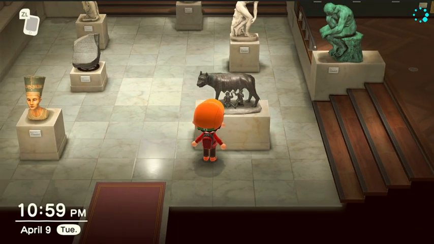

*A 9:50. The standard view: 30° down, 22–23° lens, the player a quarter of the picture height.*

| # | Observation | Source |
| --- | --- | --- |
| C1 | **Standard view: 29–31° down, vertical lens angle 22–24°, heading locked square to the room.** Grid fit at A 9:50: 28.5–29.2° and 21.4–23.0°; at A 7:45: 31–32° and 23.4–25.4° (rougher fit); at C 0:46: 29.4–31.4° and 21.9–24.3°. | A 7:45 (465.0), 9:50 (590.0); C 0:46 |
| C2 | **The tilt does not change as the player crosses the hall.** The vanishing point sits 1.39–1.45 picture-heights above centre in 17 samples across three sources, and within about 5 px of the picture's centre line every time (no free rotation). | B 0:12–0:19, 0:29–0:30; A 7:45, 9:50, 9:56, 20:56.5; C 0:44–0:46 |
| C3 | **Distance: 17.4–18.5 floor tiles along the view line, camera 8.4–9.0 tiles up.** The player is about 1.8 tiles tall, so the camera is 9–10 player-heights away. The player fills 24–25% of the picture height, feet at 66% down. | A 9:50, 11:17.6 |
| C4 | **The lower painting rooms use the same view, even with the player at the wall:** 28.9° with a 23.5° lens at A 11:17.6; 29.5° / 21.6° at A 13:36, half a second before a label is read; 28.0–28.7° in B. | A 11:17.6 (677.6), 13:36 (816.0); B 1:04–1:06 |
| C5 | **On the top terrace, where the largest paintings hang, the camera sits at 18–20°** and the wall fills three quarters of the picture. Settled frame A 13:14.6: 18.1° from upright edges, 19.9° with a 22.2° lens from the floor boards; player 24% of picture height, feet 80% down. B, walking, no label read: 19.2–19.5° at 0:59.5–1:00.5. | A 13:14.6 (794.6); B 0:59.5–1:00.5 |
| C6 | **The tilt is tied to where the player is and blends as they walk.** Leaving the top terrace down the stairs, B reads 19° at 1:00, 21° at 1:01 and 28.5° by 1:04. So the tilt is set per zone, not per wall: other walls keep 29–30° (C4). | B 0:59.5–1:06; A 13:15–13:16 |

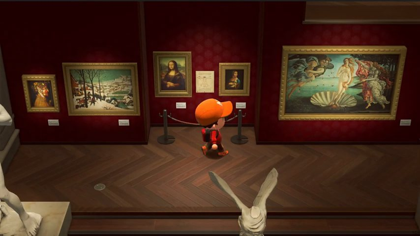

*A 11:17.6. Standard tilt in a painting room. Every work has its own pool; the wall above is nearly black; labels sit at the lower right of each frame.*

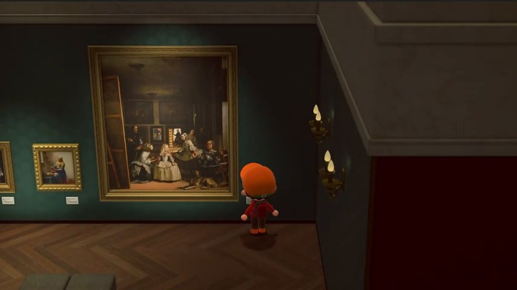

*A 13:14.6. Top terrace: the camera is 18–20° down.*

| # | Observation | Source |
| --- | --- | --- |
| C7 | **A second, composed "rest" view exists:** turned 27–31° off the room's axis, about 16° down in the statue hall (18.5–19° seated on the top terrace), lens 21.5–22.9°, the player 19–20% of picture height (about 1.4× farther). The camera glides to it in about 1.0 s; the turn back takes about 1.5 s. It is seen with the player standing and with the player seated on a bench. What triggers it was not identified. | B 0:20.1–0:21.0 (in), 0:21–0:27, 0:47.5–0:49.0 (seated), 0:57.0–0:58.5 (out) |
| C8 | **Looking at a work is a real camera move toward the player, not a lens zoom.** In one move the player grows 2.72×, the wall behind 2.36×, a statue in front about 3.8×. | A 10:09.07–10:09.80 |
| C9 | **That move takes 0.73 s in (slow–fast–slow) and 0.75 s out (fast then settling).** Other cases: 0.76 s in, 0.67 s and 0.70 s out. | A 10:09.07–10:09.80; 13:36.47–13:37.23; 13:33.10–13:33.85; 11:16.50–11:17.17; 13:13.77–13:14.47 |
| C10 | **It ends nearly level — 6–7° down — behind the player, with the work in the upper part of the picture.** The work's frame fills 43% of picture height for a small painting, 56–68% for a large painting or a statue. The player stays in shot at the bottom. How far the camera comes in depends on the work: the player grows 2.7× for a small painting and 1.3× for the largest. | A 17:28 (1048.0), 12:22 (742.0), 10:10, 13:38, 13:32, 13:13 |
| C11 | In the statue hall the same action keeps the camera high and only moves in; for objects in a glass case it looks into the case. | A 8:02 (482.0), 19:10 (1150.0) |

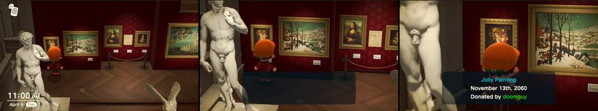

*A 10:09.0, 10:09.43, 10:09.83. Start, middle (empty panel already up), end.*

### 2.2 Rooms as open sets

| # | Observation | Source |
| --- | --- | --- |
| R1 | **There is no near wall to remove.** The floor simply ends at a dark, flat cut along the bottom of the picture. Nothing fades or dissolves. | A 9:50 (bottom band), 0:10.5 |
| R2 | **The gallery is terraced toward the camera**, so art hangs on the riser walls of the lower levels and faces the viewer. | A 13:19 (799.0), picture 08 |
| R3 | **Things in front of the player are left in view** — a statue's legs, a parapet across the player's body — and are softened by depth blur rather than hidden. Digital Foundry describes the game's depth blur as a simple Gaussian one that blends near and far objects (E 6:44–6:57, auto-captions). | A 11:17.6, 13:19, 10:10 |

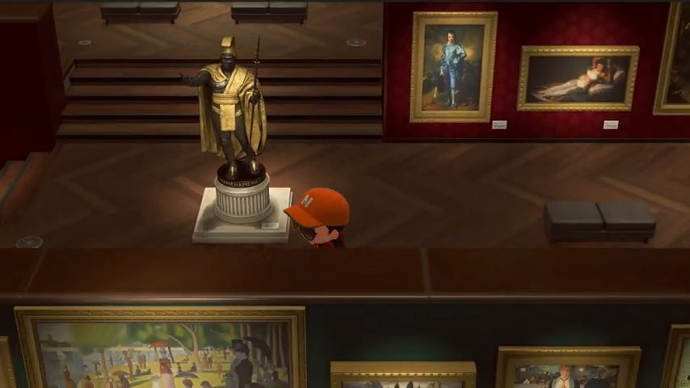

*A 13:19. Terraced levels, a parapet crossing the player, and a pool of light on the floor around the statue's plinth.*

### 2.3 Floors

| # | Observation | Source |
| --- | --- | --- |
| F1 | **Marble: square tiles in two alternating tones, with soft bright highlights that slide across the tiles as the camera moves.** One highlight peaks at 0.94 luma against 0.50–0.65 floor; it is about half a tile wide and a tile long toward the viewer. The highlights stay near the same place on screen while the room scrolls, so they are reflections of lamps, not paint. | B 0:15.5–0:19.5; C 0:44–0:45; A 9:50 |
| F2 | **No mirror images.** Plinths, frames and the player are not reflected. Digital Foundry: "it's a shame reflections are so limited here even mirrors don't show your character" (E 7:24–7:31, auto-captions). | A 9:50; B 0:16 |
| F3 | **Wood: dark herringbone, quiet grain, lit in a zone under the lit wall.** Luma 0.28–0.38 in the lit zone, 0.11–0.13 at the room's edges (about 3:1). | A 11:17.6, 13:14 |
| F4 | Small floor furniture: brass vent grilles, dark step nosings, a red carpet at the entrance. | A 11:17.6, 9:50 |

### 2.4 Light

| # | Observation | Source |
| --- | --- | --- |
| L1 | **Painting rooms are dark pictures with bright art.** Whole-frame mean luma 0.155–0.178 (median 0.125–0.137). The marble statue hall is the bright room at 0.378. The entrance hall at night is 0.244. | A 11:17.6, 11:56, 13:14; 9:50; 21:08 |
| L2 | **Unlit wall is close to black; lit wall is 2.5–3× brighter.** Red room: 0.02–0.03 above the pools, 0.05–0.10 in them. Teal room: 0.06–0.09 and 0.17–0.25. | A 11:17.6, 13:14 |
| L3 | **Each work has its own pool, shaped like an arch.** Seen frontally (D), the pool is about 1.2× the frame's width, reaches about 0.7 frame-heights above the frame, is half as bright about 0.3–0.4 frame-heights up, and the wall between two works is 10–20× darker than the pool. | D 1:44 (104.0), 2:02 |
| L4 | **The art is the brightest large thing in the picture.** Canvases 0.25–0.70; lit floor 0.28–0.38. Art to floor is about 1.5 to 1. | A 11:17.6 |
| L5 | **The bright hall still falls off:** floor 0.85–0.90 in the middle, 0.3–0.5 toward the edges, dark beyond. | A 9:50 |
| L6 | **The light is cream-white, not orange.** White label cards read RGB (219, 211, 186) and (212, 200, 175); the marble under the hall's pool reads (240, 237, 211). Red is 1.14–1.21× blue. Read as a screen colour that is about 5200–5550 K. | A 13:14, 9:50 |
| L7 | **Sculptures get a pool on the floor** about twice the plinth's width and about twice as bright as the floor around it (0.25–0.31 against 0.13). | A 13:19 |
| L8 | **Every pool has a visible source that glows:** candle sconces with a halo, white picture lights over the gallery arch, small downlights over the wing emblems, and in the fossil hall floor-mounted spot cans with a visible cone of light. Glow from lamps is described at E 4:45–4:52. | A 13:14, 7:38, 0:10.5, 22:30 |
| L9 | **Warm pools sit against a cool ambient** in the entrance hall at night. | A 0:10.5 |
| L10 | **A doorway into a brighter space glows** and spills haze onto the dark floor in front of it. | A 22:14 |
| L11 | **Nothing flickers or crawls.** In a 3 s static shot the median pixel changes by 0.00 luma levels. No drifting specks were found in two static shots. | A 12:05–12:08, 10:10–10:13 |

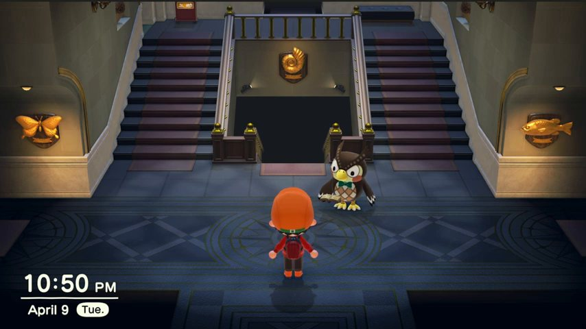

*A 0:10.5. Entrance hall at night: warm pools on the emblems against a cool room.*

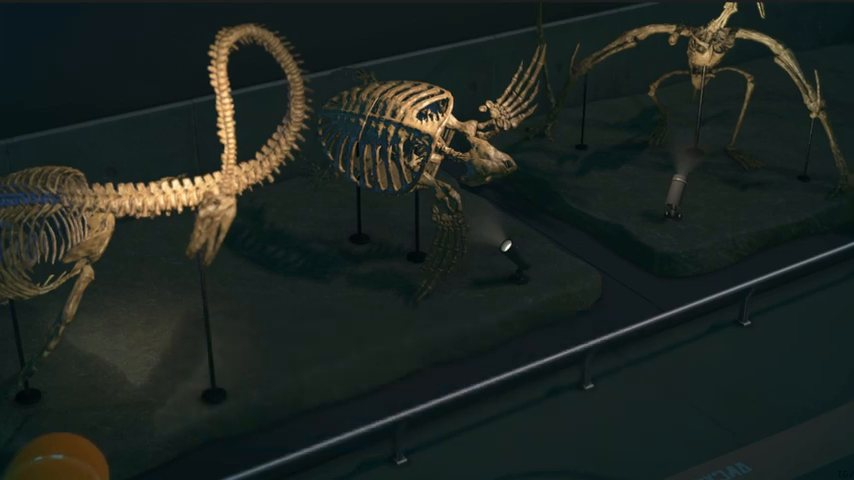

*A 22:30. Fossil hall: the spot cans and their beams are visible.*

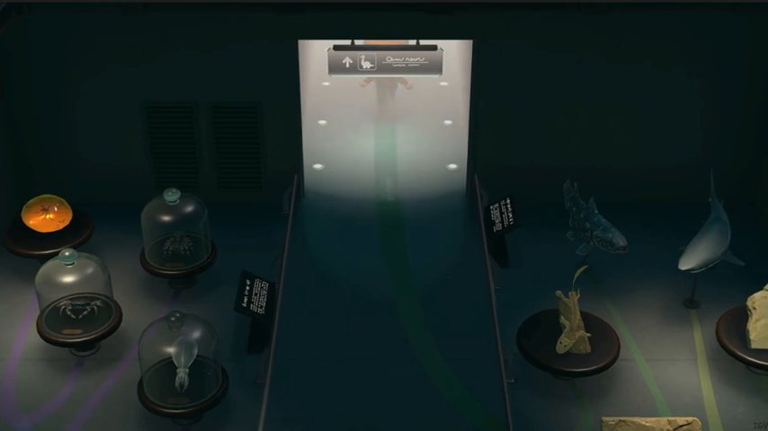

*A 22:14. A doorway to a brighter room.*

### 2.5 Shadows

| # | Observation | Source |
| --- | --- | --- |
| S1 | **The player has one soft round shadow.** At its core the floor is 45–50% as bright (0.22–0.25 against 0.50–0.55). It is 56–64 px wide at 480p — the width of the body with arms, about half the player's height — and fades over 12–16 px. | A 9:50 |
| S2 | **Plinths, benches and statues sit in a soft dark band** where they meet the floor, and statues shade their own plinth tops. | A 9:50, 13:19 |
| S3 | **The player takes the room's light:** walking into the dark arch, the player goes dark before the wipe begins. | A 7:38.4 |

### 2.6 Frames, labels, plinths, ropes, benches, cases

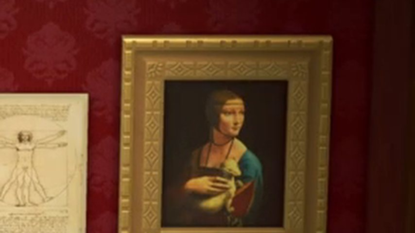

*A 10:52, enlarged. A frame built in relief, on a tone-on-tone patterned wall.*

| # | Observation | Source |
| --- | --- | --- |
| P1 | **Frames are modelled, not flat:** an outer rim, a sloped patterned band and an inner lip, with a highlight along the top and shade inside. | A 10:52 |
| P2 | **Every work has a white label card**, wider than tall, about 20 × 11 px at 480p (about 0.33 × 0.18 m at the player's scale), with two or three grey lines for text. For paintings it hangs just below the frame's bottom corner; for sculpture it is on the front of the plinth; in a case it lies in front of each object. | A 11:17.6, 9:50, 19:10 |
| P3 | **Rope stanchions appear in one place only**, in front of the Mona Lisa alcove. | A 11:17.6 |
| P4 | **Benches are backless, two cushions, dark grey-green, in the middle of the floor facing the wall — and the player can sit on them.** | A 13:14, 13:19; B 0:46.5–0:47.5 |
| P5 | **Plinths are cream stone blocks** about 0.8 player-heights tall. | A 9:50 |
| P6 | **The glass case** is one long case with a lit shelf, labels inside, and a faint diagonal streak on the glass. | A 19:10 |
| P7 | **Walls are a single deep colour with a tone-on-tone pattern** that only shows where the light falls, dark pilasters, and a thin dark skirting. | A 10:52, 11:17.6 |

### 2.7 Looking at a work

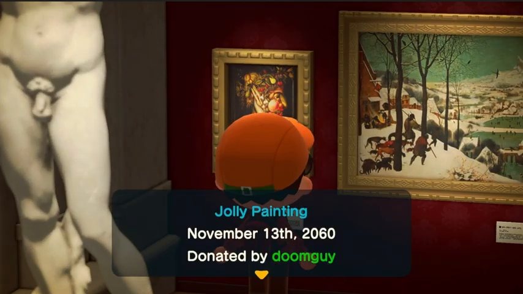

*A 10:10. First page. The player stays in shot.*

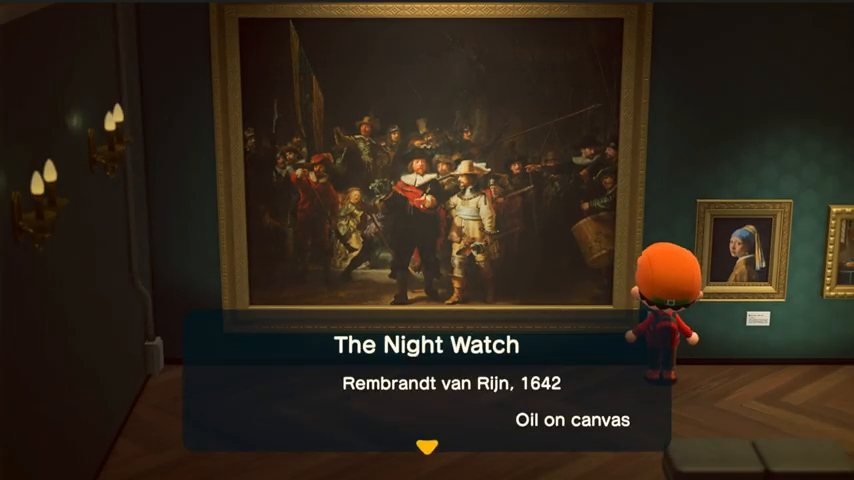

*A 12:04. Second page: real title, artist and year, medium.*

| # | Observation | Source |
| --- | --- | --- |
| I1 | **No button prompt is drawn.** A sixth of a second before the press nothing marks the work or the label; the player is simply standing in front of the label. | A 13:36.3 (816.3) |
| I2 | **Order of events from the press:** camera starts at 0.00 s; the empty panel and a short sound arrive at +0.13 s; the text appears, whole, at +0.67 s; the camera settles at +0.73 s; the "next" arrow appears at +0.83 s. | A 10:09.07–10:09.90 |
| I3 | **The panel:** bottom centre, 58% of picture width, 27.5% of its height, 8% up from the bottom edge, rounded corners, a very dark blue-black that lets roughly 40% of the scene through (estimate 30–55%). | A 10:10 |
| I4 | **Page 1:** the item's game name in cyan (about `#23b3c6`), the date it was donated, "Donated by" and the name in green (about `#3aa637`), centred. **Page 2:** the real title in larger type, then artist and year, then medium, smaller. **Then 2–4 pages** of one sentence each, at most three lines, left-aligned, white. | A 10:10, 12:04, 10:14–10:26 |
| I5 | **Text does not type out.** Each page appears complete in one frame. Between pages the panel is empty for about 0.13 s. The arrow bobs about twice a second. | A 10:13.83–10:14.07, 10:17.60–10:17.83 |
| I6 | **One short sound per press:** about 95 ms, strongest around 0.7 kHz with energy up to about 2 kHz, 24–30 dB above the music in that band. The opening sound is softer and shorter (about 75 ms). | A 10:13.77, 10:17.53, 13:32.93; 10:09.22, 13:36.64 |
| I7 | **Closing:** the last press plays the same click; text and panel fade in 0.2 s; the camera returns in 0.75 s; the player can walk again about 1.1 s after the press. There is no separate closing sound. | A 13:32.93–13:34.07 |
| I8 | **The player keeps moving slightly while reading** — the head's apparent width swings about ±3% every 1.1 s. | A 20:50–20:55 |

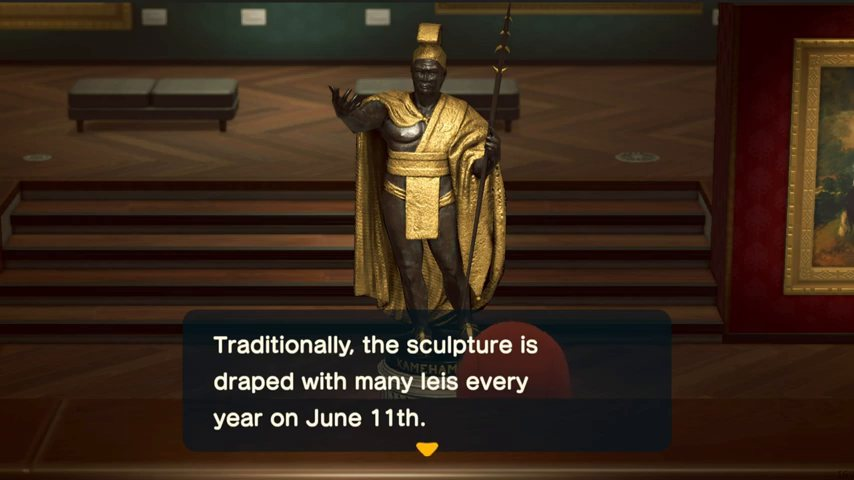

*A 13:32. A sculpture: low, frontal, the room behind it soft.*

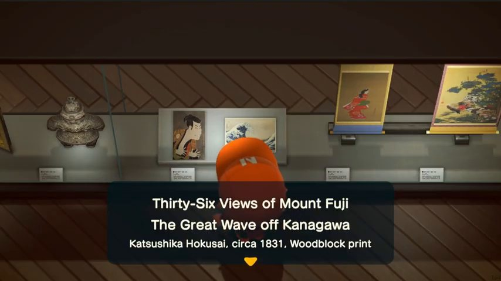

*A 19:10. An object in a case: the camera looks into the case.*

### 2.8 Sound

| # | Observation | Source |
| --- | --- | --- |
| A1 | **There is always sound under the walk.** Across 17 minutes of footage no 5 s stretch falls below −55 dBFS (median −39). In the art gallery that bed carries notes on a steady 0.48 s grid: music. | A 0:01–1:03, 7:21–23:39; 10:09–10:18 for the grid |
| A2 | **Footsteps are dry clicks.** Running cadence is 3.7 steps a second (median gap 267–270 ms in four rooms). In the 2.5–12 kHz band a step is 20 dB down within 5–28 ms and at least 25 dB down by 100 ms. No tail was found above the music. | A 9:58–10:03, 21:16–21:28, 0:09–0:15, 0:21–0:31 |
| A3 | **There is no echo either.** A second bump 30–77 ms after each step moves around from step to step, so it is the sample's own heel-and-toe, not a fixed delay. | A 9:56–10:01 |
| A4 | **Steps differ by floor.** Peak level in the high band: marble and parquet −37.5 to −41 dB, fossil hall −44.7 dB, entrance hall −48.3 dB. | same |
| A5 | Nintendo's sound team describe a fixed order of loudness — "UI音＞接近物＞対象物＞遠景", with music between the last two — and say distance is carried by an EQ blur plus reverb. This is their general approach, not a statement about the museum. | G |

### 2.9 Moving between rooms

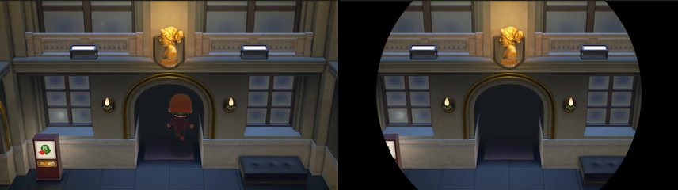

*A 7:38.4 and 7:39.3. The player darkens walking into the arch; the camera holds; the iris closes.*

| # | Observation | Source |
| --- | --- | --- |
| T1 | **Between wings: a circular wipe.** The player walks into a dark arch and goes dark, the camera stops following, a circle closes on the picture's centre in about 0.83 s, the screen is black while the room loads, and a circle opens in about 0.57 s. | A 7:37.8–7:44.1 |
| T2 | The black hold is 4.7 s on a Switch (B 0:05.7–0:10.4) and 3.4–4.2 s in A. That is loading, not design. | B; A |
| T3 | **Inside the gallery there are no transitions at all.** Statue hall, three painting rooms, the case room and the landings are one continuous space walked for two minutes without a cut. | B 0:10.8–2:10 |

### 2.10 Life

| # | Observation | Source |
| --- | --- | --- |
| V1 | **Villagers visit and look at the art.** Nintendo: "展示物が増えると住民も見学に訪れます". One is on screen in D. | F; D 1:24–1:32 |
| V2 | Standing still for a moment brings up a quiet clock. | A 10:04.5; B 0:21.0 |
| V3 | Nintendo describes the museum as somewhere to rest: "静かな博物館の中で一息ついて癒やされる". | F |

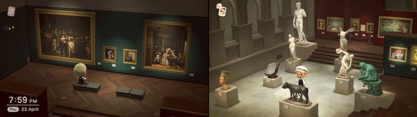

*B 0:49 and 0:21.6. Seated on a bench; the rest view in the statue hall.*

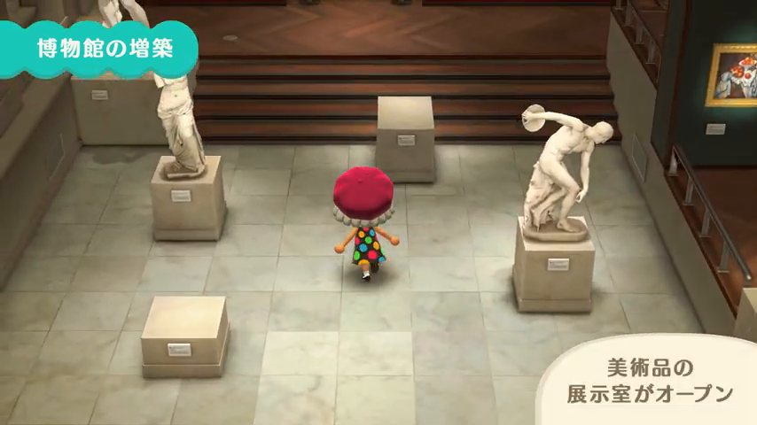

*C 0:46. Nintendo's own capture gives the same camera as A and B.*

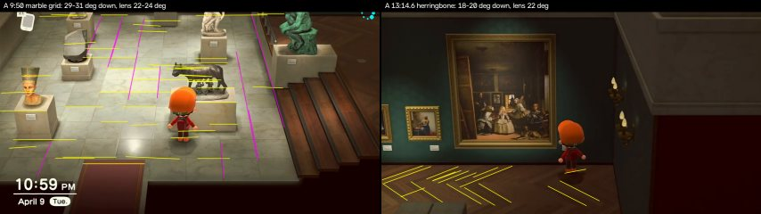

*The floor lines used for the camera fit: marble grid (A 9:50) and herringbone (A 13:14.6).*

## 3. Side by side with this project

"Now" means the working tree between 20:53 and 22:06 EDT on 2026-10-01: commit `32d3ba8c`, the room pictures in `build/museum-atlas/` (made 20:47–20:49), and uncommitted edits other agents were landing during this audit (object clicking in `main_build_walk.gd` at 21:35 and again at 21:58; sprint and jump in `walk4.gd` and `visitor.gd` at 21:47). The camera constants were re-read at 22:06 and had not changed. Constants are named rather than given line numbers because the files were moving.

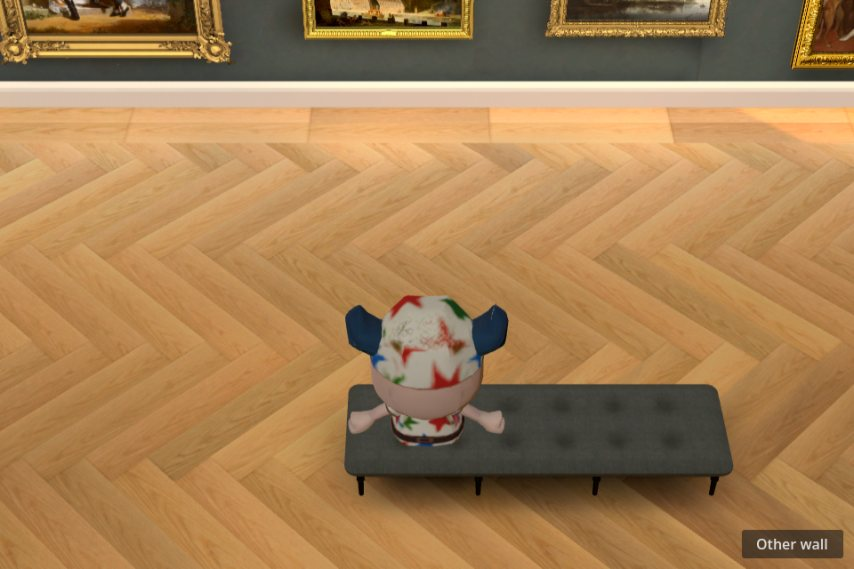

*This project now, Grand Gallery, dollhouse view: mostly floor; the hang is cut off. (The atlas drops the visitor on a grid of points, here onto a bench; that is not how the walk behaves.)*

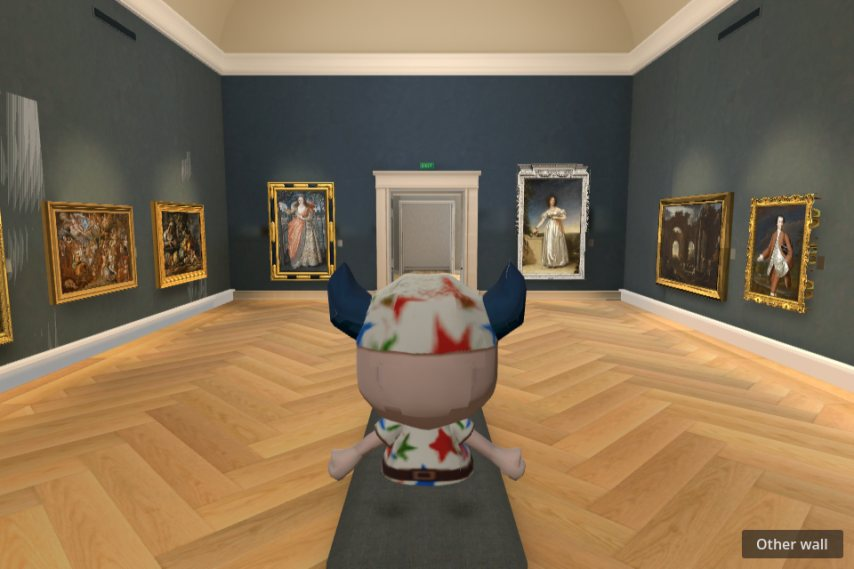

*This project now, Grand Gallery, follow view: even light; the floor is the brightest surface.*

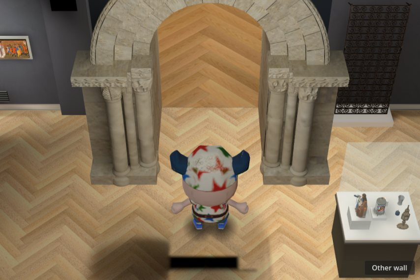

*This project now, medieval room, dollhouse view.*

| Topic | New Horizons | This project now | Gap |
| --- | --- | --- | --- |
| Tilt | 30° standard (C1) | 42° (`_update_camera`, view mode 0) | 12° too steep. Standing 3 m from a wall, the picture's top edge meets that wall 2.44 m up, and 11 of the Grand Gallery's 23 frames reach higher than that (`works.json`). At 30° and 16 m it would be about 3.8 m, which clears 22 of the 23. |
| Lens | 22–24° (C1, C7) | 23° | None. |
| Distance | 9–10 player-heights (C3) | 11 m for a 1.75 m visitor: 6.3 heights | Half again too close. |
| Visitor size | 24–25% of picture height (C3, C5) | About 33% by design (issue #133, taken from the owner's house screenshot) | A real conflict between two references; see step 1. |
| Where the big works are | Tilt drops to 18–20° by zone (C5, C6) | Tilt never changes | Missing. |
| Rest view | 16–19° down, 30° off-axis, glide (C7) | A manual "Gallery" option: 35°, 30° lens, 9.3 m | Different idea; benches are obstacles only (`BENCHES`, `BENCH_CLEAR`). |
| Near walls | None exist (R1) | Faded out per wall layer by `cutaway.gdshader`; void colour `#20242a` | Works. The void is cool grey-blue where the game's is a dark tone of the room. |
| Brightness | Painting rooms 0.16–0.18 mean; bright hall 0.38 (L1) | Follow-view means 0.41–0.68 across seven rooms | Two to four times brighter overall. |
| What is brightest | The art: 1.5× the floor (L4) | The floor: 0.52–0.56 against paintings 0.28–0.33 and wall 0.20–0.29 | Inverted. |
| Pools | Lit wall 2.5–3× the unlit wall; black between works (L2, L3) | Spots exist in the bake (energy 6.8, 25° half-angle) but five fill lamps, an environment term and a daylight lamp wash them out | Present on paper, invisible in the picture. |
| Light colour | Cream: red 1.14–1.21× blue, about 5200–5550 K on screen (L6) | Spots `#ffd391` (red 1.76× blue, about 3800 K), fill `#ffe1b2` (about 4400 K) | Orange. |
| Floor | Glossy stone or satin dark wood with moving highlights; no mirror images (F1–F3) | `oak.gdshader`: `ROUGHNESS = 1.0`, `specular_disabled`; light honey oak, luma 0.52–0.56 | Matte and bright. The oak itself is the owner's choice (#186) and stays. |
| Visitor shadow | One round blob, about half the player's height across, 45–50% (S1) | A 0.75 × 0.42 m blob at 25% plus a 0.56 × 0.72 m patch per sole at 85% when planted | Reads as two dark patches rather than one soft shadow. |
| Contact shade | Soft dark band under every object (S2) | Baked; visible under benches in the follow view, patchy in the added rooms' atlas pictures | Uneven. |
| Labels | White landscape card, about 0.33 × 0.18 m, at every work (P2) | A grey 0.12 × 0.17 m plate beside each Hall painting (`_place`), about 7 px wide in the dollhouse view; no label geometry found in `collection_rooms/remodel_room.gd` | Too small and too dark to read as a label. |
| Frames | Modelled and lit (P1) | Modelled nine-slice frames, kept unshaded so they hold their colour | Shape is there; frames do not respond to the pools. |
| Opening a work | 0.73 s camera move, text panel, room stays on screen (C8–C10, I2–I7) | Walk up, turn, then a full-screen white page with the image, fading in over 0.18 s; a caption with title, artist and accession number under it | The approach is already right. The room disappears instead of the camera moving. |
| Sounds on open/close | One 75 ms sound, one 95 ms click per page, nothing on close (I6, I7) | `select` on click, `menu_open` (455 ms) then `pickup` 0.18 s later, `menu_close` (455 ms) | Three long sounds where the game uses one short one. |
| Hover | No pointer in the game | Pointing hand plus a `cursor` tick | Fine; this is the web equivalent of walking up to the label. |
| View changes | Glides of 1.0–1.5 s; wipes for jumps (C7, T1) | Quarter-turn settles in about 0.35 s; "Other wall" teleports the visitor and flips the view in one frame; a 0.22 s white flash for the test rooms | One hard cut, one fast turn. |
| Footsteps | Dry, 3.7 a second running (A2) | Captured GameCube steps, dry, about 3.6 a second at full speed | Matches. |
| Music | A constant bed (A1) | None found in `walk4.gd` or `visitor.gd` (the Shell was not checked) | Missing or elsewhere. |
| Idle | Constant slight motion (I8) | Idle loop and blinking; `play_gesture` returns false | Fine. |
| Glow, sources | Lamps glow; beams visible (L8) | No glow in the walk's Environment | Missing. |
| Other visitors | Villagers (V1) | None | Missing; out of scope for finish. |

## 4. Specification, in build order

Each item says what to change, the numbers to try, and how to tell it worked. Nothing here was run in Godot; these are starting values. Feature claims about the Compatibility renderer are from source I and are flagged where they matter. Only step 3 and the contact band in step 5 need a re-bake; everything else is code, shader or scene.

One rule first. The game's ropes, sconces, damask walls and stone plinths belong to its own invented museum. This project reconstructs real rooms from a Room Survey. Take the finish — camera, light, shadow, sheen, labels, choreography — and add no furniture the survey does not have.

### Step 1 — camera (runtime)

1. **Standard view.** In `walk4.gd` `_update_camera`, view mode 0: tilt 42° → **30°** [M 29–31]; `_cam.fov` stays **23°** [M 22–24]; distance 11 → **16 m** [E: 9–10 player-heights × 1.75 m is 15.4–17 m]. Keep the aim point (0.7 m ahead, 1.25 m up). Passes when the visitor is 24–27% of the picture height [M 24–25] and, standing 3 m from a wall, the wall is visible to about 3.8 m [E]. The feet will sit about 73% down; the game's sit at 66% [M], which here would cost half a metre of visible wall, and this hang is taller than the game's.
   The owner approved a visitor one third of the picture high with feet four fifths down in #133, from a different reference. **30° at 12 m keeps that composition** (computed: feet 80% down, visitor about a third) and still lifts the visible wall from 2.44 m to 3.0 m. Choosing between 16 m and 12 m is the owner's call. The 30° tilt is the part that should not be traded away.
2. **Low tilt where the tall works are.** The game sets its tilt by zone: about 30° in most rooms, 18–20° in the back room with the largest paintings, blending as the player walks between them [M, C5–C6]. Adapted to a museum hung on all four walls [E for the rule]: let `d` be the distance from the visitor to the wall the view faces; tilt = 30° at `d` ≥ 4 m and **19°** at `d` ≤ 1.5 m, smooth in between, for walls whose tallest frame tops 3.5 m [T]; lens 23° → **22°** [M 22.2]; distance × **1.1** so the visitor stays the same size [M 24%]; aim height 1.25 → **1.65 m** so the feet sit 78–80% down [M 80]. Low-pass the result with a 0.4 s time constant [E; the game takes about 4 s of walking to go from 19° to 28.5°]. Passes when the full hang, frame top to label, is in the picture 1.5 m from the wall (computed: wall visible to 4.8 m).
3. **Small rooms.** A 16 m camera sits two rooms away from a 6 m room, and every wall between must be cut away. Use distance = 1.6 × the room's depth along the view, held between 9 and 16 m [E; the game's is 1.8–2× its hall]. Check each added room for missing chunks of neighbouring rooms.
4. **No cuts.** Quarter-turn (Q/E): replace the `1 − exp(−12·dt)` ease with a **1.0 s** slow–fast–slow turn [M 1.0–1.5]. "Other wall": glide the view round 180° in about 1.2 s while the visitor walks across, or cover the jump with the iris from step 7 [T which]. Low-pass the aim point with 0.12–0.2 s [T].
5. **Rest view.** Turned **30°** off the wall-facing heading [M 27–31], **16–19°** down [M], lens **22°** [M], **1.4×** the standard distance [M, from player size]. Glide **1.0 s** in, **1.5 s** out [M]. Reached by sitting on a bench (section 5). Replace the manual "Gallery" option with it.

### Step 2 — inspection (runtime)

See section 5 for the whole sequence. The numbers: glide in **0.73 s** slow–fast–slow [M]; out **0.75 s** fast then settling [M]; end tilt **6°** for wall works [M 6–7]; keep the 23° lens [E: the game's move is a real camera move, C8]; distance from the camera to the wall = work height ÷ (k × 0.407), where 0.407 is how much height a 23° lens sees per metre of distance and k, the share of the picture the work should fill, runs from **0.43** for a work under 1 m to **0.68** for one over 3 m [M for the two ends, E for the ramp], held between 4.5 and 13 m. That gives 5.7 m for a 1 m work and 9.9 m for a 2.5 m one. Put the work's centre 40% down the picture and the visitor in the lower third, to one side. The move belongs where `_approach` hands over to `_open_detail` in `walk4.gd` and its override in `main_build_walk.gd`.

### Step 3 — light (bake)

Targets, sampled from a screenshot of the standard view of a painting wall, the same way the footage was sampled for this report:

1. Wall away from any pool is at most a third as bright as the wall inside a pool [M 2.5–3×].
2. Canvases average at least 1.2× the lit floor [M 1.5×].
3. Floor in the lit zone is at least twice the floor at the room's edge [M 3×].
4. A white label card under a spot has red at most 1.25× blue [M 1.14–1.21].
5. Whole-picture mean is 0.20–0.30 in dark-walled rooms and 0.35–0.40 in pale rooms [M 0.16–0.18 and 0.38; raised a little for a browser on an unknown screen, T].

Starting values in `gallery_walk4/bake/prepare.gd` and `collection_rooms/remodel_bake.gd` [all E; Godot's energies are not calibrated to anything in the footage, only the ratios above are]. Both saved bakes change (`gallery_walk4/baked/` and `collection_rooms/addition_baked/`), so the rendered checks (`scripts/check-gallery.sh` for the Hall, and the added rooms' own) must be rerun afterwards:

| Light | Now | Try |
| --- | --- | --- |
| Fill omnis | energy 0.55 (0.4–1.1 in added rooms), `#ffe1b2` (about 4400 K) | energy × 0.33, `#fff4dc` (about 5400 K) |
| Environment | 0.18 / 0.22, `#dfd6c7` | 0.06 |
| Daylight | 0.35 (Hall), 0.8 (added rooms), `#eff5ff` | 0.25 in the skylit Hall only; off elsewhere unless the room has a window |
| Painting spots | energy 6.8, 25° for all, attenuation 1.5, `#ffd391` (about 3800 K), size 0.35 | energy 10; half-angle per work = atan(0.62 × frame width ÷ lamp distance), held to 12–28°; attenuation 2.0; `#fff1d2` (about 5150 K, red 1.21× blue [M]); size 0.25 |
| Case and plinth spots | energy 1.0–1.2, 40–45° | energy × 2, 30°, aimed so the floor pool is about twice the plinth's width [M] |

The temperatures are the colour a white card would show on screen, worked out from the sRGB values; they are not lamp ratings. The skylit Grand Gallery should follow the game's statue hall (a bright floor pool in the middle that falls away, L5), not its painting rooms. Rooms with dark walls follow the painting rooms.

A quick look before any bake (runtime, [T]): turn on the walk Environment's adjustments at brightness 0.85, contrast 1.15. Source I lists adjustments as supported in Compatibility. It will not make pools, but it shows the exposure the bake is aiming for.

### Step 4 — floor (runtime; bake unchanged)

1. **Sheen without screen-space reflections.** Screen-space reflections do not exist in the Compatibility renderer (I), and the game does not use mirror images either (F2). In the floor shaders (`oak.gdshader`, `floor_oak.gdshader`) add a highlight computed from a short list of lamp positions: for each lamp, the usual half-vector term between the view direction and the direction to the lamp against the floor normal, raised to a power, summed, and added to `EMISSION`. Pass up to eight positions per room — the same proxy positions the bake uses, so each highlight lies under a real pool. Wood: strength **0.10**, power **60** [T, the game's wood sheen is faint]. Stone: strength **0.35**, power **90** [M: highlight is 0.3–0.4 above the floor and half to one tile wide]. Keep `specular_disabled`; this replaces it.
2. **Grain.** A lower camera sees more floor at a distance. If one-pixel stripes crawl during a slow walk at 480×320, lower the grain mix in `oak.gdshader` from 0.60 toward 0.45 [T]. Do not change the oak's colour (#186).
3. **Optional trial.** One ReflectionProbe per room, updated once, floor roughness 0.35. Source I lists probes as supported, two per mesh. Measure the frame time in the browser before keeping it.

### Step 5 — grounding (runtime, then bake)

1. **Visitor shadow.** One round blob **0.9 m** across [M: half the player's height], soft to the edge, **0.5** at the centre [M 45–50%], under the hips. Drop the per-sole patches from 0.85 to about 0.35 [T].
2. **Contact band.** After the re-bake, every bench, case and plinth must show a dark band at least 10 cm wide where it meets the floor [M: present under every object at A 9:50]. Where the lightmap is too coarse, put back the soft shadow cards `_shadow_mat` already draws in the unbaked room.

### Step 6 — labels and sources (runtime)

1. **Label cards.** **0.30 × 0.17 m**, wider than tall, off-white (`#e9e4d4`), two grey bars and no legible words [M in pixels, E in metres]. At the frame's lower corner on the side the visitor will stand, top edge 5 cm below the frame; on the front of plinths; inside cases in front of each object. Every Painting Asset and every catalogued object gets one.
2. **Sources that glow.** Give lamp faces an emissive material and turn on glow in the walk's Environment (threshold about 0.9, intensity 0.3–0.5) [T]. Source I lists glow as supported in Compatibility; confirm it in the exported web build before relying on it.
3. **Doorway glow** [T]. Where a bright room is seen from a darker one, an additive card in the opening at about 25%, after L10.

### Step 7 — transitions and sound (runtime)

1. **Iris for jumps only.** Close on the picture's centre in **0.83 s**, hold, open in **0.57 s** [M]. Use it for the elevator, any teleport, and first entry. Rooms that join through a doorway keep no transition at all [M, T3].
2. **Entering a doorway to a jump:** let the visitor walk in and darken, hold the camera, then wipe [M, T1].
3. **Sounds.** Opening: one sound of about 75 ms — `item_select` or `cursor`, not `menu_open` followed by `pickup` [M for length; T for which file]. Each page: one click of about 100 ms — `cursor` or `select`. Closing: the same click and nothing else. Keep `menu_open` and `menu_close` for the zoom page.
4. **Footsteps: leave alone.** Cadence and dryness already match. Do not add reverb; none was found (A2, A3).

### Left out on purpose

No vignette (none could be separated from the game's own dark edges; if one is wanted anyway, keep the corners within 15% of the centre [T]). No dust motes (none found). No film grain or flicker (L11). No depth blur: the Compatibility renderer has none (I), and faking it is not worth a pass at 480×320. No ropes or sconces.

## 5. What "every object is clickable and has an animation" should mean

Modelled on I1–I8. "Animation" here is the sequence below — approach, turn, camera, panel — not a wobble on the object. The game moves the player and the camera and leaves the art still.

The sequence, for every kind of object:

1. **Offer.** Hovering any catalogued work, case object, sculpture or bench shows the pointing hand and plays the tick once. (The game has no pointer and draws no prompt.)
2. **Approach.** On click the visitor walks to a standing spot, stops, and turns to face the work. Input other than cancel is ignored from here until the end.
3. **Camera.** As the turn finishes, the camera glides for 0.73 s to its framing. The room stays on screen.
4. **Panel.** At +0.13 s an empty panel and the opening sound; at +0.67 s the first page, whole. Bottom centre, 58% wide, 27.5% high, 8% from the bottom, dark blue-black at about 60%, drawn at full resolution above the low-resolution view.
5. **Close.** After the last page, or on Escape or a click outside: click sound, panel fades in 0.2 s, camera returns in 0.75 s, control comes back when it lands.

Pages, using only what the catalogue holds (`works.json` already has title, artist and accession number; nothing is to be written by hand):

1. Title, large. Artist and date. Accession number as "RISD Museum 57.227".
2. Medium and size, if the collection data has them.
3. One page per sentence of catalogue text, three lines at most, if there is any. One click each. Text appears whole.

Per kind of object:

| Kind | Standing spot | Camera | Extra |
| --- | --- | --- | --- |
| Painting | 1.5–2.5 m from the wall, on the label's side so the body is not in front of the picture's middle | 6° down, behind the visitor, work's centre 40% down the picture, distance from the formula in step 2 | A second click on the work, or scrolling, opens the existing zoom page with a 0.25 s cross-fade. That page is this project's own addition and is worth keeping. |
| Object in a case | 0.8–1.2 m from the glass, in front of the object | Level with the shelf, close enough that the object is a third of the picture height; the glass keeps one diagonal highlight | Other objects in the case stay visible. |
| Sculpture, free-standing | 1.5 m from the plinth on the label side | 6–10° down and frontal when there is open floor behind it; keep the standard tilt and only move in when it stands among others | None. |
| Bench | The seat | Rest view (step 1, item 5), 1.0 s in | The visitor sits; any move key stands up and the camera returns in 1.5 s. Needs a sit pose for the visitor, which does not exist yet. |
| Doors, stairs, the elevator | The threshold | Standard | These are travel, not inspection: iris if it is a jump, nothing if it is a walk-through. |

What exists already: the approach, the turn, the hover, and (since 21:35 today, uncommitted) clicking for every catalogued object in the added rooms with a fade-and-scale on the zoom page. What is missing is steps 3 and 4 — the camera and the panel — and benches.

## 6. Reviewer's checklist

For one room, from the exported web build at its real size, using a still of the standard view, a still at a wall, and a recording of one inspection and one walk around. Answer yes or no.

Camera
1. Standing 3 m from a wall, is every frame on that wall visible top to bottom?
2. At a wall with tall works, does the camera ease down so the whole hang, frame top to label, is in the picture?
3. Is the visitor between a fifth and a third of the picture's height in the standard view?
4. Is every view change — turning, changing wall, entering a room — a glide or a wipe, with no single-frame cut?
5. Do near walls leave without flicker and without a see-through wall drawn across the visitor?

Light
6. Is the brightest large area in the picture a work of art or the wall right around it — not the floor, not the ceiling?
7. Does each work sit in its own pool, with the wall one frame-width away visibly darker (at least 2× in a pixel sample)?
8. Does the floor get clearly darker from the lit area to the room's edges?
9. Does a white label under a lamp look cream rather than orange (red no more than 1.25× blue)?
10. Can you point to the lamp for every pool, and does that lamp look lit?

Ground
11. Does the visitor have one soft round shadow about as wide as its body, never detached and never hard-edged?
12. Does every bench, case and plinth sit in a soft dark band where it meets the floor?
13. Does the floor show a soft highlight that moves as the camera moves, with no mirror-sharp reflection and no shimmer?
14. During a slow walk, is the floor free of crawling one-pixel stripes?

Objects
15. Does every work have a label you can recognise as a label from the standard view?
16. Do frames show a lit top edge and a shaded inner edge?
17. Does everything in the room that is in the catalogue answer to the pointer (hand and tick)?

Looking
18. After a click, does the visitor walk up, stop and turn before anything else happens?
19. Does the camera glide (0.6–0.9 s) to a low shot with the work above and the visitor still in the picture?
20. Does the panel show the title first, appear whole, and advance one page per click?
21. On closing, does the camera glide back in under a second, and is there exactly one short sound per press throughout?

Life
22. Is the visitor never frozen — still breathing or blinking while reading?
23. Can the visitor sit on the bench, and does the view settle into a calm composed shot?

## 7. What could not be verified

1. **Native-hardware inspection timings.** The 0.73 s, 0.75 s and panel timings come from source A only, a 4K 60 fps upload that is probably emulated. The camera geometry was cross-checked against a Switch capture and Nintendo's trailer; the timings were not.
2. **What triggers the rest view.** It appears with the player standing and seated. The right stick is the likely cause; no source confirmed it. A controls guide that might have was blocked (HTTP 403).
3. **The lens during inspection.** Assumed unchanged at about 23°. The parallax proves the camera moves; it does not rule out a small lens change as well.
4. **Whether the camera follows with a lag.** Not measured. The smoothing in step 1, item 4 is taste.
5. **Footstep reverb below the music.** None was found down to about 25 dB under each step; anything quieter is hidden by the soundtrack. A capture with music off would settle it; none was found. No sound was listened to — all audio findings are numeric.
6. **Dust motes, vignette, depth haze.** No motes at 480p in two static shots; anything smaller than a 480p pixel would not show. A vignette could not be told apart from the dark edges of the sets. The 480p limit also hides fine texture and normal detail.
7. **Head-tracking toward exhibits.** Not seen and not ruled out.
8. **Actual camera and light data.** A datamine notes that "a camera parameter change was made to the code reference 'IdrMuseumCafe'" in version 1.11 (H), which shows per-room camera entries exist. No values were found. Nothing about how the rooms' light is authored (baked or live) was found; Digital Foundry describes the engine's lighting in general only.
9. **Pool shape at eye level** rests on source D, which is one uploader's handheld-camera footage with their own captions and letterbox.
10. **Everything in section 4.** No value was tried in Godot. Glow, adjustments and reflection probes in the Compatibility renderer are quoted from the documentation table, not from an exported build of this project. The wall-visibility figures are arithmetic from the camera constants.
11. **Sources that could not be reached.** Nintendo of America's and Nintendo UK's uploads of the April 2020 trailer ("This video is not available" from this machine; the Japanese upload was used). Captions for the Boundary Break episode on this game (HTTP 429); the episode's museum section was looked at without them and settled nothing about near walls.

## 8. Picture record

All game pictures are single frames at the stated second, scaled to at most 854 px wide, no grading. Pictures 04, 10, 13 and 20 place two or three such frames side by side; 15 is an enlarged crop; 20 has the measurement lines drawn on. 17–19 are this project's own atlas pictures.

| File | Source and time | SHA-256 (first 16) |
| --- | --- | --- |
| `01-statue-hall-overview.jpg` | A 9:50 (590.0) | `fc3b7302b521bb53` |
| `02-painting-wall-free-walk.jpg` | A 11:17.6 (677.6) | `996fb86a555ce35d` |
| `03-top-terrace-low-tilt.jpg` | A 13:14.6 (794.6) | `f5a45e1451bc201f` |
| `04-inspect-dolly-in.jpg` | A 609.0, 609.433, 609.833 | `315aa8285944dea1` |
| `05-inspect-page-one.jpg` | A 10:10 (610.0) | `3be85e530fbc5143` |
| `06-inspect-title-page.jpg` | A 12:04 (724.0) | `66386c4fcb123ea8` |
| `07-inspect-sculpture.jpg` | A 13:32 (812.0) | `3cfaf17a33944e82` |
| `08-terraced-rooms-statue-pool.jpg` | A 13:19 (799.0) | `3236d14024a76ec2` |
| `09-inspect-glass-case.jpg` | A 19:10 (1150.0) | `4485d839833b01fd` |
| `10-doorway-fade-and-iris.jpg` | A 458.4, 459.3 | `5be9f3e2e24205f0` |
| `11-fossil-spot-beams.jpg` | A 22:30 (1350.0) | `703220bb8dd936cf` |
| `12-fossil-glowing-doorway.jpg` | A 22:14 (1334.0) | `23ceb5ff0e88724b` |
| `13-bench-seated-and-second-view.jpg` | B 0:49.0, 0:21.6 | `a373918954acb311` |
| `14-official-trailer-statue-hall.jpg` | C 0:46.0 | `f3acdbd73cffd42e` |
| `15-frame-and-wall-detail.jpg` | A 10:52 (652.0), crop | `263f6ce24e3566f7` |
| `16-main-hall-warm-pools.jpg` | A 0:10.5 | `53260e7a78533892` |
| `17-project-grand-gallery-dollhouse.jpg` | `build/museum-atlas/grand-gallery-2-e.png` | `d6eca39e9b6b8065` |
| `18-project-grand-gallery-follow.jpg` | `build/museum-atlas/grand-gallery-1-follow.png` | `64e5905e041752b3` |
| `19-project-medieval-room-dollhouse.jpg` | `build/museum-atlas/dark-medieval-room-0-n.png` | `f8a1caece8fb587f` |
| `20-camera-measurement-lines.jpg` | A 590.0 and 794.6, annotated | `50c5a15e7eae09d5` |

Prior research this builds on and does not repeat: `animal-crossing-reference-light.md` (pools and fill for the first bake), `animal-crossing-reference-composition.md` (the 33% target), `animal-crossing-room-transitions.md` (cover, swap, reveal — from the GameCube game; section 2.9 here supplies the New Horizons footage that note said was missing), `gamecube-reference-rendering-plan.md` and `gallery-final-render-overlay.md` (the display finish, untouched by this report), `gallery-wider-camera-decision.md` (the 23° lens), and `2026-10-01-animal-crossing-character-audio.md` (footstep samples).
