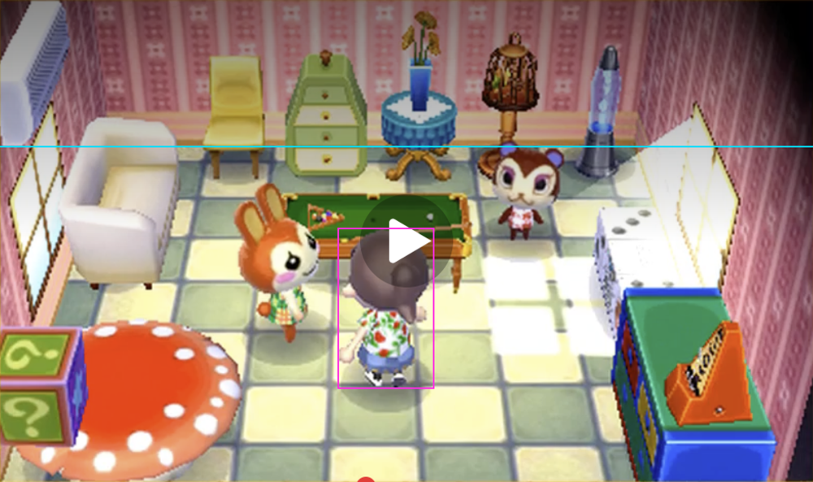
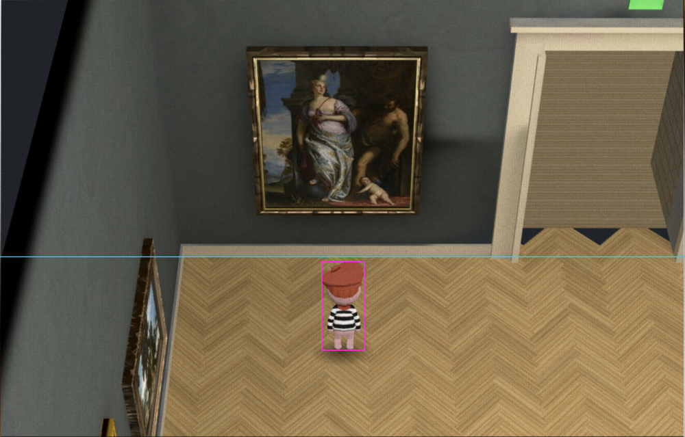
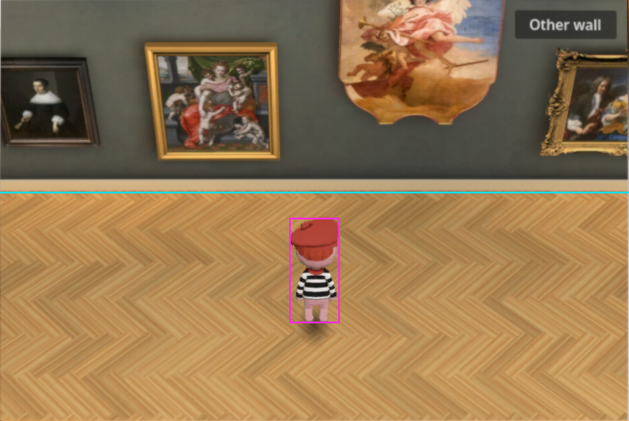

# The owner's Animal Crossing room: composition measurements

Research for [issue #133](https://github.com/Reid-Surmeier/risd-godot/issues/133), measured 2026-09-26. **The selected reference calls for a player roughly 33% of the game-view height, with feet about 80% down.** The earlier 19–22% recommendation describes another gameplay frame; it does not match this screenshot. Preserve the measured museum and its art positions. A uniform character scale and camera aim adjustment can match the player framing without rebuilding the room.

## Evidence and method

The owner's exact uploaded image is the primary visual source, not a generic Animal Crossing image. These exports crop only the game image inside the gold frame; desktop, decorative frame and controls outside the game image are excluded. The old prototype's bottom toolbar is excluded. The reference's central play icon obscures part of the human player's crown; its shadow overlay and a few bottom-edge progress pixels remain in the source crop. Measurements deliberately exclude the play triangle and the ground shadow from the player's bounds.

These are **manual image measurements**, not recovered engine settings. A rectangle encloses the estimated visible human silhouette including hair/hat, hands and shoes. The cyan line identifies the floor edge at the **back-facing wall**, extrapolated through furnishings where necessary. It is not a segmentation of the image into wall and floor pixels: side walls, objects and perspective prevent that interpretation.

| Measurement | Exact owner reference | Owner's earlier gallery | New candidate before scale trial |
|---|---:|---:|---:|
| Cropped source size | 3050 × 1808 px | 1419 × 907 px | 703 × 470 px |
| Displayed viewport aspect | 1.687:1 | 1.564:1 | 1.496:1 |
| Human height / viewport height | **33.4% ±2 percentage points** | 20.4% ±1 point | 24.9% ±1 point |
| Human width / viewport width | **11.9% ±1 point** | 6.3% ±0.5 point | 8.0% ±0.5 point |
| Visible feet, y / viewport height | **80.6% ±1 point** | 80.2% ±1 point | 76.6% ±1 point |
| Silhouette horizontal centre / viewport width | **47.5% ±1.5 points** | 50.1% ±0.5 point | 49.9% ±0.5 point |
| Back-wall floor junction, y / viewport height | **30% ±2 points** | 59% ±2 points | 46% ±1 point |
| Band below that junction | About 70% | About 41% | About 54% |

The extra digits above make the arithmetic reproducible, not the landmarks exact. Errors include soft edges, masking, frame cropping and resampling. Original image bounds, SHA-256 hashes and crop-relative landmarks are in [measurements.json](animal-crossing-reference-composition/measurements.json). Run `python3 docs/research/animal-crossing-reference-composition/measure.py` to recompute ratios and annotation exports from the saved crops. Assertions check bounds and crop dimensions; visual inspection establishes the landmarks.

## Shape, aspect and room composition

**Do not widen the character to match the raw reference.** The screenshot is displayed at 1.687:1, while the GameCube source initializes a 4:3 camera. If the screenshot is a horizontally stretched 4:3 picture, correcting that stretch takes its character width/height from approximately 0.60 to **0.47**. The candidate's visible character width/height is **0.48**; its source PNG alpha bounds are 147 × 312 pixels, or **0.471**. This is strong evidence against treating the apparent raw width difference as a required character redesign. It does **not** prove the screenshot's entire capture history: cropping or other transforms may also have occurred. [Sources: exact crop; prototype `kid/00.png`; game camera source below.]

The reference head/hair occupies roughly half to a little over half of the character's height; the candidate hat/head occupies roughly half. The play icon crosses the reference head, so a precise head/body ratio would be false precision. Existing art can establish the requested large-player composition without altering its pixels. A new asset becomes necessary for a different face, silhouette, clothing, or convincing front/side/turn views, not merely because the reference is wider on screen. The current sprite is a back view in every direction; billboard orientation cannot create missing directional poses. [Sources: the crops and `_build_kid`, `_update_camera`, animation assignment in `walk4.gd`.]

The reference is a compact furnished room with **both side walls visible**, roughly **10–11 separate floor-standing furnishing groups** (depending on whether the foreground block and table grouping is counted separately), and **three characters**. Large foreground tables/cabinets crop at both lower corners; a pool table overlaps the central depth band. The candidate shows **four art works, two clipped at an edge**, one player and no floor furnishing in this particular crop. These are scene counts, not area percentages or totals for the museum. [Source: saved crops.]

The reference floor junction is much higher, leaving more depth for furniture and actors. The prototype instead shows a long museum wall and an open walking lane. Its actual room is **26.3 m long, 10 m wide, with 6 m walls and a further 3 m vault rise**; the measured art arrangement and bench positions are already encoded in the prototype. Changing camera aim, position or framing can reveal different parts of that existing room. It cannot turn its wide open lane into the reference's small furnished room or supply additional occupants. Compressing the room, moving paintings, adding furniture or arranging everything into a compact house would be a new layout decision, outside this research and contrary to the current instruction to preserve the museum. [Source: `walk4.gd` constants and scene construction.]

## Screenshot versus generic game camera

The [primary game camera implementation](https://github.com/ACreTeam/ac-decomp/blob/09ca8e8b5b24e6ab44047ee980cf0088ad7ecb4c/src/game/m_camera2.c) initializes a **20° vertical FOV**, **4:3 aspect**, normal **620-unit distance** and fixed normal direction corresponding to a **45° downward view**. It also defines indoor distance additions of −280, 0 and +300, paired with pitch adjustments, and room-constrained camera centres. Consequently these defaults do not uniquely identify the camera state of a supplied screenshot. They are a reasonable projection starting point, not evidence that every Animal Crossing room should occupy the same fraction of the image.

The cached [owner-linked GameCube video at 986 seconds](https://www.youtube.com/watch?v=EwwW4Rk1wMU&t=986s) is visibly a **different room and moment**. Its saved [4:3 comparison frame](animal-crossing-reference-composition/comparison-video-986s.png) has a smaller player, more visible floor rows, different furniture, and a camera-control overlay. It supports the distinction between normal gameplay framing and the selected close composition; it cannot recover the selected screenshot's exact camera state. The previous [research report](https://github.com/Reid-Surmeier/risd-godot/blob/a74788254217d7c3ef16d3e7a9bfc2adf596fb4d/docs/research/animal-crossing-look.md) measured that comparison frame. Its 19–22% character recommendation must not override the present exact-reference measurements.

No exact FOV, pitch, world-space camera distance or zoom state can be established from this single reference screenshot without knowing the source frame, aspect transform and room geometry. Keep 45°/20° as an implementation starting point and judge the rendered composition against measured screen ratios.

## Smallest implementation recommendation

1. **Target 32–34% visible character height and 79–81% visible feet y**, with the player near horizontal centre. Keep existing generated pixels, uniform scaling, fixed yaw, current cutaway and museum art placement. Exact-reference x ≈47.5% is a minor composition offset; centring is an acceptable prototype simplification.
2. **Preserve the candidate's room projection first.** With its distance 14.2, vertical FOV 20°, pitch 45° and forward aim offset 0.7 m, trial `KID_H = 1.75` instead of 1.35 and aim height **1.55 m** instead of 1.3 m. This predicts approximately **32%** visible height and **79–80%** visible feet y, accounting approximately for the PNG's transparent padding. It increases character scale relative to museum fixtures; it preserves the character's proportions. These are predictions, not a claim that the final trial has been rendered and verified in this report.
3. A camera-only alternative is distance approximately **10.6 m**, aim height approximately **0.9 m**, retaining the 0.7 m forward offset and the 1.35 m sprite. It predicts roughly 33% height / 80% feet, but zooms the museum and clips more artwork. **Distance alone is insufficient:** retaining aim height 1.3 m would push the feet toward 87% down. Choose the scale trial when preserving art framing matters.
4. Verify a screenshot at the same viewport shape, then walking in all directions. Screen ratios can be corrected now; matching forward/side turns requires new generated directional character and motion assets. Matching the reference's compact furniture density requires a separately authorized layout choice. Neither is solved by a camera constant.

The prediction uses the pinhole approximation `visible_height_fraction ≈ visible_sprite_height / (2 * depth * tan(FOV/2))`; the current fully facing billboard and alpha bounds make this useful. Actual screenshot measurement remains the acceptance check because rasterization, alpha cutoff and camera aim affect the visible endpoints.

## Source record

- Exact reference: owner attachment `/tmp/orca-paste-1790463217298-144fe770-a4bf-4757-99ae-db558a9480e7.png`; preserved [game crop](animal-crossing-reference-composition/reference-viewport.png). This is the source of screenshot-specific numerical targets.
- Earlier prototype: owner attachment `/tmp/orca-paste-1790463198799-047ab0e7-c761-459e-8fe7-0328d497b00c.png`; preserved [game crop](animal-crossing-reference-composition/owner-current-viewport.png).
- Candidate: `/tmp/gallery-refine-verified/dollhouse_shot/01-dollhouse-baked.png`; preserved [game crop](animal-crossing-reference-composition/candidate-viewport.png).
- Primary game implementation: [ACreTeam/ac-decomp `m_camera2.c`, commit `09ca8e8`](https://github.com/ACreTeam/ac-decomp/blob/09ca8e8b5b24e6ab44047ee980cf0088ad7ecb4c/src/game/m_camera2.c), especially `Init_Camera2`, `Camera2_Get_GoalDistanceAndDirection`, `Camera2_PolaPosCalc`, `Camera2_GetBorderScale` and indoor addition arrays. Read the cached checkout at this exact commit and verified the primary URL.
- Primary local implementation: [`walk4.gd`](../../modules/shell/prototype/gallery_walk4/walk4.gd), read at 23:01 UTC before the final scale trial; [`kid/00.png`](../../modules/shell/prototype/gallery_walk4/kid/00.png), 330 × 330 with alpha bounds `(93,6,240,318)`. Source was inspected only, not modified by this research.
- Reference video: [Animal Crossing GameCube longplay](https://www.youtube.com/watch?v=EwwW4Rk1wMU&t=986s), cached `EwwW4Rk1wMU.mkv`, previously extracted `gc/g986.png` copied as comparison evidence. Its room is not the owner's exact screenshot.

No paid generation, game-asset edits, production changes or layout changes were performed for this research. A subsequently supplied lighting reference is intentionally outside these camera/composition measurements; it is not a request to recreate that room.
