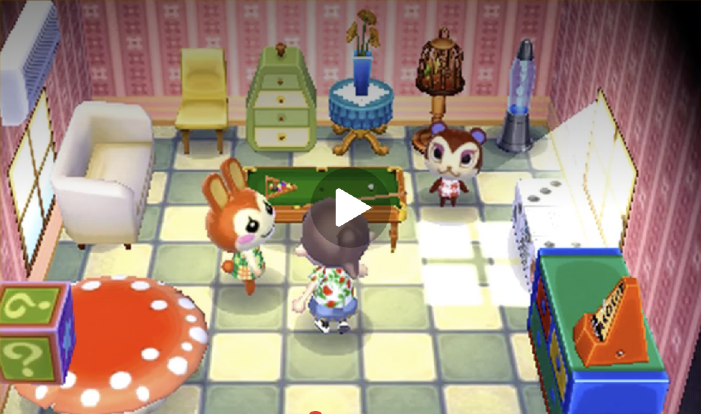
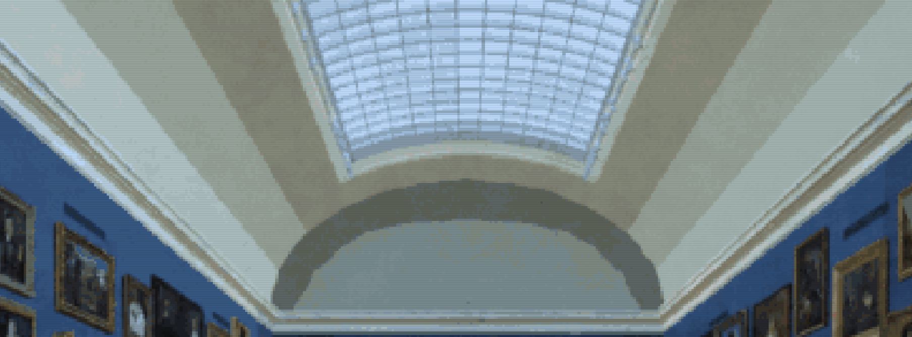
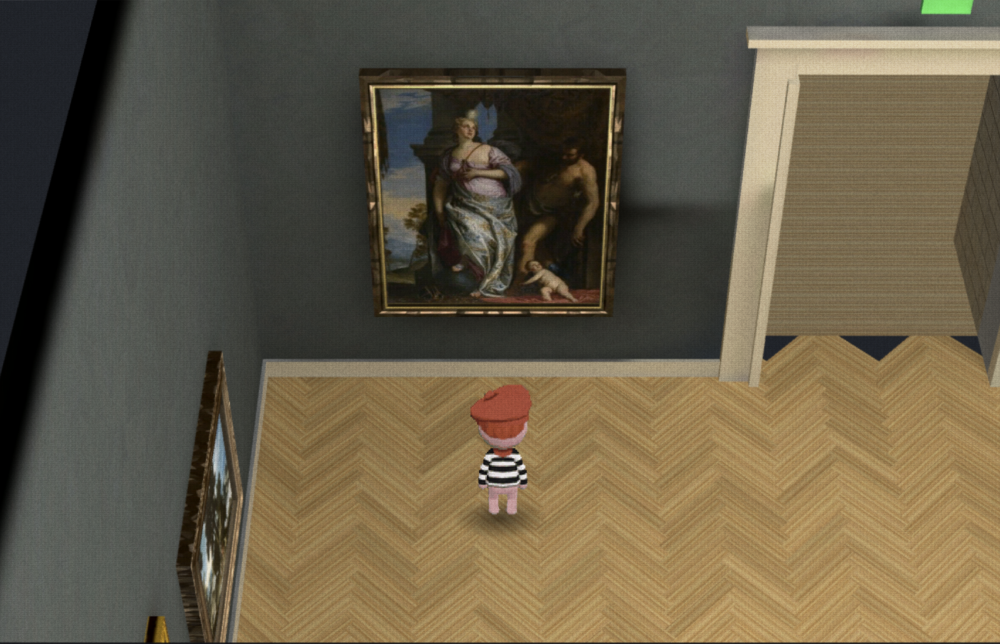
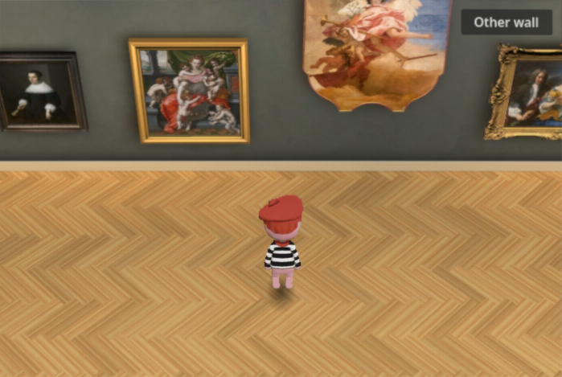
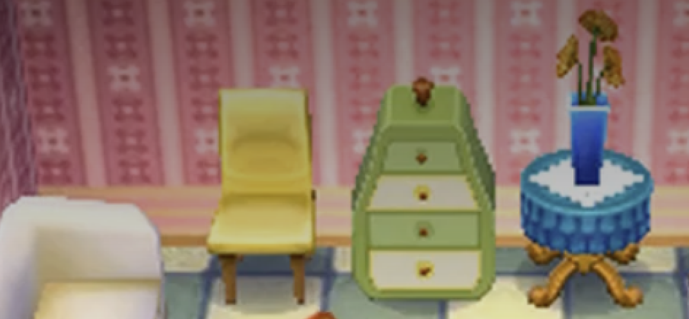
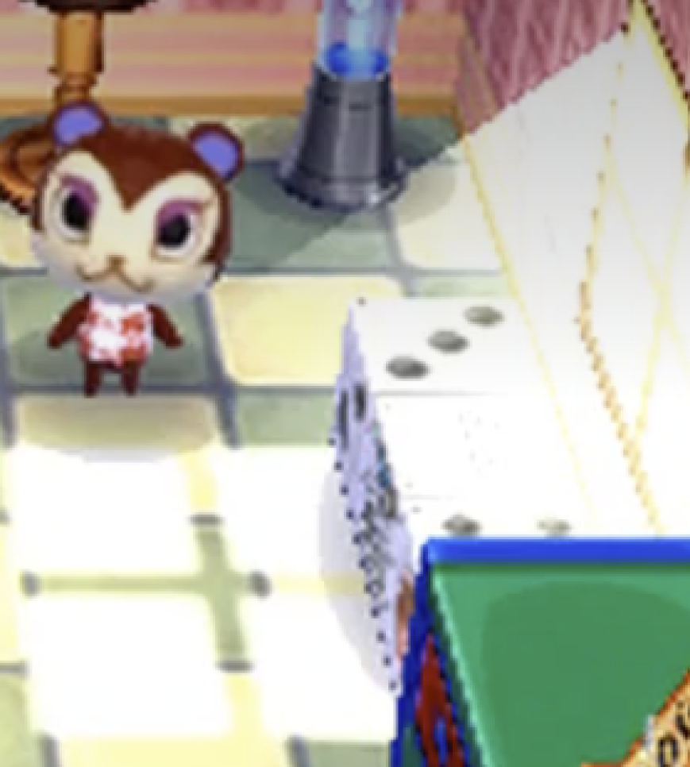

# Reference material scale and baked light shapes

Research for [#134](https://github.com/Reid-Surmeier/risd-godot/issues/134), 2026-09-26. **Recommendation: keep the existing museum and native lightmap workflow; reduce broad fill, narrow and strengthen warm lamp pools, and admit one directional daylight bake through the existing skylight.** The target is readable forms, not a brighter exposure everywhere.

Evidence labels: **V** = verified in a supplied image, local code, or cited primary source; **I** = interpretation of that evidence; **T** = proposed tuning target, not a measurement of Nintendo's renderer. No production changes, image generation, paid requests, or bake were performed for this report.

## Exact references and their limits

**V:** The owner's exact home screenshot contains a strongly lit window area, cream/green floor tiles, pink patterned walls and chunky furniture. The play button obscures the center. Its original file is 3508×2269; that is a screenshot size, **not** a native game resolution. Video scaling, possible aspect stretching, compression and display capture prevent recovery of native texture resolution or light energy. The image alone does not identify its engine, release, or whether a bright patch was painted, projected, vertex-lit, or lightmapped.

**V:** The later museum image was explicitly supplied for the rendering of white surfaces and the amount of baked-looking lighting. The owner said to treat it as a reference and not recreate it. Its architecture, furniture inventory, hang and wall color are therefore not a new room specification. **I:** Its large cream/grey vault bands, dark lunette arc, bright cornice lips and darker recesses are the relevant visual language. A single frame cannot establish that any of them were actually baked.

**V:** These two museum captures have different camera positions, artwork and viewport sizes; they are not a controlled before/after. The candidate has broad wall pigment and clean frame silhouettes, but its floor grain is still much busier than the home reference's tiles. Neither crop displays the ceiling, so neither proves the vault treatment. Their identities, source hashes, original pixel sizes, lossless crop rectangles and sampled patches are recorded in [evidence.json](animal-crossing-reference-light/evidence.json). Crops retain source pixels without paint, grading, resampling or generated content.

## What produces the look

| Component | Image observation and confidence | Museum translation |
| --- | --- | --- |
| Albedo paint | **V:** the home wallpaper repeats a large motif; each drawer/chair face is a broad color field. **I:** local gradients may already be painted into the texture. | Keep `wall-muse.webp` and `oak-muse.webp`; wall UV repeat currently covers 4 m. Avoid added grain, normal maps or high-contrast cracks. Preserve the herringbone layout and plank dimensions. |
| Face shading | **V:** furniture sides are darker than top/front faces; the white museum reference separates adjacent plaster faces clearly. **I:** this need not imply faceted geometry everywhere. | Let existing casing depth, cornice steps and vault normals produce broad value changes in the bake. Do not turn the entire museum into randomly faceted triangles. |
| Contact/AO-like shade | **V:** furniture meets the home floor with compact dark regions; museum bench undersides are darker than surrounding floor. **I:** a still cannot separate AO from cast shadows and painted shading. | Bake the actual benches, frames and reveals. Do not multiply the previous analytical `_ao()` and shadow cards over the baked room; the current preparer already removes that duplicate shading. |
| Cast-light shape | **V:** a large bright rectangular region and mullion-like darker bars appear beside the home's right window. **I:** these are consistent with window light, but its production technique is unknown. | Use the museum's existing skylight opening as the daylight source. No invented home windows, projected home window image, or new furniture. Existing skylight grid is texture, not full mullion geometry: a true cast grid cannot follow from that mesh alone. |
| Emission | **V:** window panes and a blue lamp look bright. **I:** brightness alone is not proof of emission or bloom. | Keep visible lamp faces bright if needed, but use baked static spots to illuminate surrounding geometry. An unshaded face alone does not establish an emitting light source. |
| Indirect light | **V:** shadows retain color and forms rather than becoming uniformly black. **I:** indirect bounce, ambient fill or painted colors could produce this. | Retain 2 light bounces initially and moderate cool/neutral fill. Compare warm wall pools against neutral shadow faces. |
| Display filtering | **V:** reference edges and texture features are softened. Its capture contains scaling artifacts. | Existing linear mipmapped materials and 2× MSAA are useful. Do not intensify screen dither to imitate uncertain capture noise. A still cannot establish absence of crawl. |

**I, modelling:** The toy character comes from few readable masses, thick rims/legs, rounded or chamfered transitions and clear differences between faces. It does not come merely from reducing polygon count. The measured museum's silhouettes and placements remain authoritative: use existing box-built benches and stepped casings first. Do not enlarge frames, shorten the gallery or add rounded furniture to chase the home scene. Any later geometry proposal must be compared at the actual small viewport before changing dimensions.

## Numeric targets, with uncertainty

Values below describe the displayed image, not lux, reflectance, physical color temperature or Nintendo texture resolution.

| Quantity | Evidence or proposed target |
| --- | --- |
| White vault light/dark separation | **V:** selected source patches have display luma 0.724 on a light face and 0.527 on a broad darker band: ratio 1.37. **T:** aim for roughly 1.3–1.6 on adjacent broad plaster faces, without clipping white. |
| Lunette arc | **V:** dark arc 0.363 versus inner lunette 0.509, ratio 0.71. **T:** preserve a visibly darker architectural return, about 25–35% below the adjacent face in display luma. |
| Bench contact | **V:** sampled underside/floor regions are 0.247 versus 0.404, ratio 0.61. **T:** broad contact darkness around 55–75% of adjacent floor, with the darkest shade under the object, not a black halo beyond it. |
| Sample confidence | Mean RGB converted using `Y′=(0.2126R+0.7152G+0.0722B)/255`; no linear-light conversion. Exact rectangles are in the manifest. **I:** allow about ±0.05 luma for patch placement/material variation; this is an estimate, not a statistical confidence interval. Neither ratio is a recovered light intensity. |
| Warm lamp pools | **T:** central wall pool 1.25–1.6× adjacent same-material wall in display luma, warm cream rather than orange. Visible pool diameter around 2–3 m; use actual framing to judge overlap. Paintings stay color-faithful. |
| Surface frequency | **I:** roughly 8–12 large floor-tile widths span the home's visible room; perspective and occlusion make this approximate. This is not a reason to replace the museum floor with tiles. **T:** plank/grain micro-detail should be secondary to large light shapes; avoid resolved alternating 1-pixel stripes in the low-resolution viewport. |
| Modeling visibility | **T:** existing casing/cornice face changes should span at least 2–3 internal pixels in a relevant view. If a feature is subpixel, first choose a better review view and texture filtering; do not silently enlarge measured features. |

**V, current world scale:** `walk4.gd` uses a 26.3 m length, 10 m width, 6 m cornice, 3 m vault rise, 4.2 m skylight width, 0.84×0.18 m planks and two benches at z=−9/−17. These are verified **implementation values**, not a newly verified architectural survey. The earlier [hang research](https://github.com/Reid-Surmeier/risd-godot/blob/research/grand-gallery-hang/docs/research/grand-gallery-hang.md) explicitly says room distances were unresolved there; later prototype comments cite further gap measurements. This report does not re-certify those measurements.

## Current native bake: what is actually verified

Local source inspected: [`walk4.gd`](../../modules/shell/prototype/gallery_walk4/walk4.gd), [`prepare.gd`](../../modules/shell/prototype/gallery_walk4/bake/prepare.gd), [`plugin.gd`](../../modules/shell/prototype/gallery_walk4/bake/plugin.gd), [`run.py`](../../modules/shell/prototype/gallery_walk4/bake/run.py) and the [bake notes](../../modules/shell/prototype/gallery_walk4/bake/README.md), approximately 22:58–23:03 UTC. Concurrent prototype work may change these values after this report.

**V:** UV1 carries Muse surface color; UV2 carries unique lightmap coordinates. Floor UV2 is continuous in world space with a 512×1024 hint; other meshes unwrap at 0.12 m. Existing fill is five omnis at y=5.7, energy 0.85, range 13 m, size 2.5 m, color `#fff1d9`. Existing painting spots have energy 4, half-angle 30°, range 7 m, size 0.35 m, color `#ffd391`, originating 2.2 m out and 3.1 m above each painting center. They are proxy positions, not the visible track heads. The bake has two bounces, low quality, nondirectional lightmaps, no probes and environment energy 0.35.

**V:** the preparer uses lit native materials for architectural surfaces, disables specular, removes old vertex room-light multipliers, and preserves artwork/painted-frame textures as unshaded. The editor plugin removes every `Light3D` after a successful bake. Runtime ambient energy is zero; baked materials intentionally retain `disable_ambient_light=false` because the project's Compatibility regression found that disabling it blacked out the lightmap. This report read that regression record; it did not rerun it.

**I:** the huge overlapping fill sources and 60° full spotlight cones reduce local contrast. More energy everywhere would make the room flatter. Narrower pools and less fill should improve differentiation before adding detail.

## Smallest implementation recommendation

1. **Change only the existing bake setup first.** Keep room layout, materials, paintings, camera and display pass fixed for an interpretable comparison. Reduce omni energy from 0.85 to **0.25–0.45**, keeping their positions. Retain environment energy **0.2–0.35**, then adjust from the white-face ratios. These are **T** starting ranges, not a tested result.
2. **Give warm lamps a visible footprint.** Start existing proxy spots at energy **5–8**, half-angle **20–25°**, angular attenuation **1–1.5**, size **0.15–0.35 m**, existing range 7 m. At 3 m along the cone, 20–25° gives a perpendicular footprint roughly 2.2–2.8 m wide; the oblique wall footprint is longer. Try the angle change before raising every light. If fixtures are aligned in a later pass, use the existing track heads and recompute range for their longer throw; current 7 m may not reach the lowest art. No new fixture model is required. Godot documents angle as the angular radius and range as a hard reach limit. [SpotLight3D](https://docs.godotengine.org/en/stable/classes/class_spotlight3d.html#class-spotlight3d-property-spot-angle)
3. **Bake a broad daylight direction through the real skylight.** **T:** one neutral/warm-white `DirectionalLight3D`, energy **0.6–1.2**, rays about **20–35° from vertical**, initially across rather than along the gallery. Its purpose is a readable large floor patch and cast shapes from existing objects, not a copy of the home window. The light position is irrelevant; orientation sets parallel rays. [DirectionalLight3D](https://docs.godotengine.org/en/stable/classes/class_directionallight3d.html) **Critical:** the existing skylight is an opaque textured mesh; the preparer includes it in static GI. Exclude only that display-glazing mesh from bake geometry (`GI_MODE_DISABLED`, retaining its visible unshaded presentation) so rays can enter. Keep vault, walls and actual trim as occluders, including camera-hidden cutaway surfaces. Do not assume `cast_shadow=OFF` excludes a mesh from LightmapGI: the primary source selects visible static-GI meshes. [Godot LightmapGI mesh collection](https://github.com/godotengine/godot/blob/4.5/scene/3d/lightmap_gi.cpp#L343-L385) The same selection was checked in current upstream source; the installed engine still needs a rendered verification. The glazing grid cannot cast a grid unless actual occluding geometry exists; this first trial needs only the broad opening.
4. **Keep illumination offline.** Set authoring lights to `BAKE_STATIC` with `editor_only=false`; use the existing plugin to remove lights afterward. Do not add runtime shadow maps, SSAO, glow, normal maps or animated noise. Godot excludes `editor_only` lights from lightmap baking. [Light3D](https://docs.godotengine.org/en/stable/classes/class_light3d.html#class-light3d-property-editor-only) Keep `directional=false`: that flag stores directional information and does not prohibit baking a DirectionalLight3D. Retain two bounces and the current resolution for the first composition check; raise bake quality to medium for the selected version if blotches remain. [LightmapGI](https://docs.godotengine.org/en/stable/classes/class_lightmapgi.html#class-lightmapgi-property-directional) Light size is passed into the native baker for omni and spot lights, so it is a valid offline softness control even though runtime PCSS has renderer restrictions. [Godot native bake setup](https://github.com/godotengine/godot/blob/4.5/scene/3d/lightmap_gi.cpp#L1075-L1109)
5. **Judge the output, then stop at the smallest passing change.** Capture identical pose/exposure with fill-only versus new bake; include a ceiling/door-casing view and one bench. Inspect at real viewport size plus a crop. Confirm nonblack lightmaps with zero runtime lights, visible warm pool separation, white-face separation, no clipped plaster, unchanged paintings and no double shadow cards. Walk and quarter-turn the camera in the browser: floor grain, lightmap seams, temporal sparkle and cutaway leaks cannot be certified from screenshots. Use existing `scripts/check-gallery.sh` and repository checks for implementation; no new renderer or test framework is needed.

## Exact-match limits and decisions left visible

The home reference is a compact furnished room; the museum has tall plaster, long empty floor runs and artwork that must retain source detail. Their object scale, floor pattern and material palette cannot match exactly while preserving the museum. Transfer broad paint, clear faces, compact contact shade and deliberate light shapes. The second museum reference supports stronger white-surface separation, not changing the present hang, wall color, door, benches or skylight design.

The old [Animal Crossing look report](https://github.com/Reid-Surmeier/risd-godot/issues/130) researched hardware/camera behavior against decompilation and other footage. It expressly did not measure this exact home screenshot. Its general GameCube facts therefore do not prove the origin, light technique or material resolution of this frame. This report intentionally gives no claim of exact Nintendo bake settings, native texture size or recovered lamp temperature.

**Recommendation ready for a prototype trial; visual acceptance remains pending the rebake and moving browser view.** All proposed energy values are starting points. Existing Muse assets remain unchanged and spend for this research is $0.
