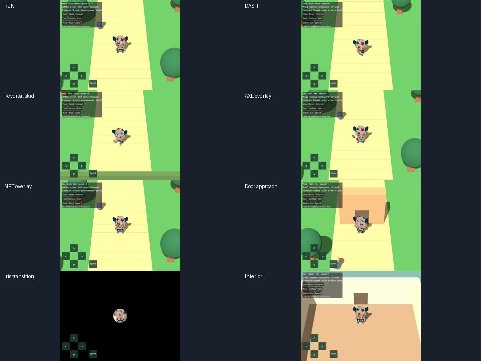
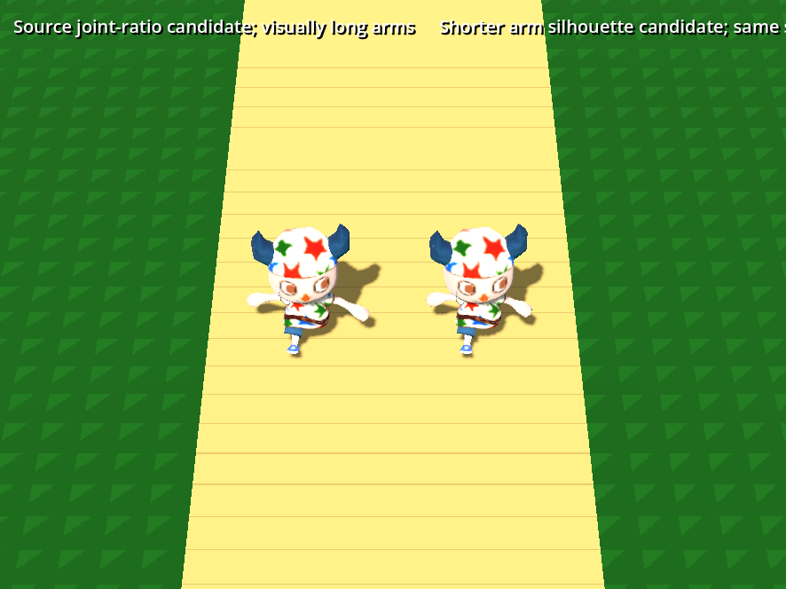
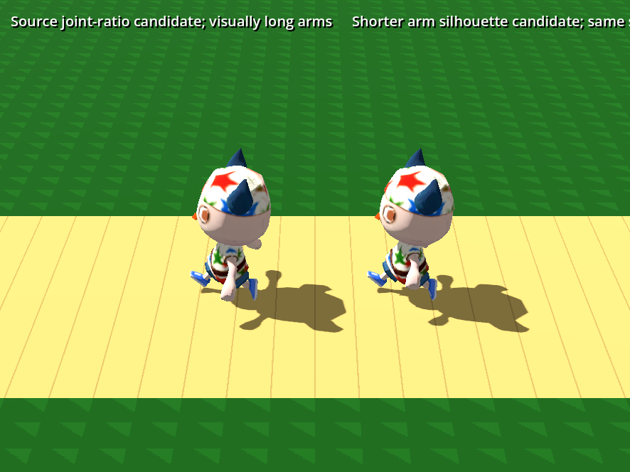
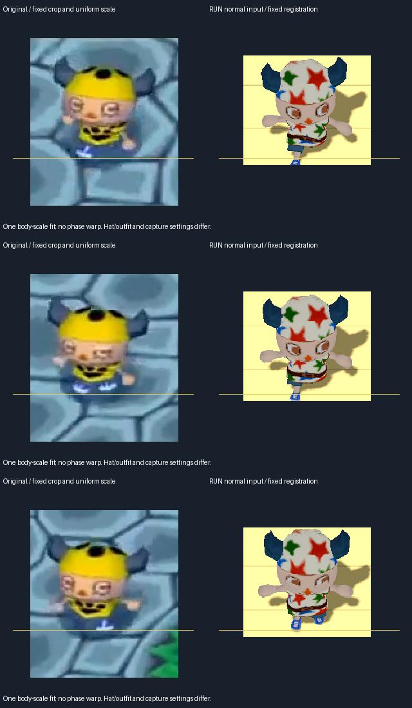
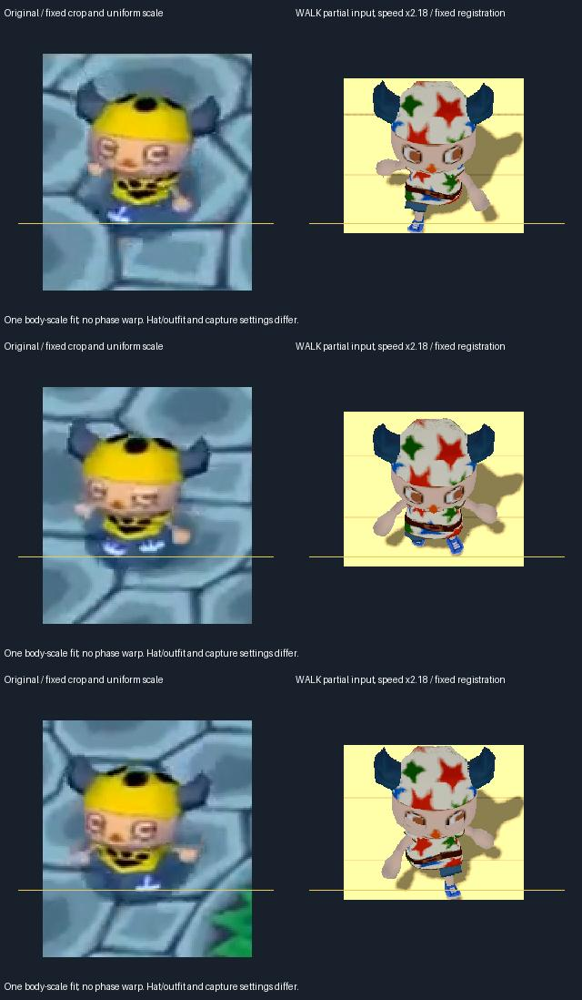

# Driven character implementation and comparison — 2026-09-30

Implemented the owner-authorized fixes in standalone [prototype 231](https://github.com/Reid-Surmeier/risd-godot/issues/231), under [map 226](https://github.com/Reid-Surmeier/risd-godot/issues/226). The live character now uses a shared rig, distinct WALK/RUN/DASH/skid poses, heading-dependent movement, tool overlays, blinks, NPC interactions, door transitions and surface effects. This is a working review prototype. Exact Nintendo likeness and world-foot locking are **not** accepted.

## Behavior changed

| Previous behavior | Implemented behavior | Evidence |
| --- | --- | --- |
| Direct input translation with a lagging visual turn | Travel follows actor heading; heading error reduces desired speed; acceleration/braking govern translation | Controller and driven-scene receipts |
| One WALK clip used for normal movement | Partial input WALK, full-input RUN, held DASH; one shared phase across switches | Controller, analog and browser checks |
| Slow-feeling motion, then independent speed/playback boosts | Normal travel 3.15 units/s; dash 4.846154; source-informed phase gives about .551266/.444444s cycles at steady state | Native controller formulas and measured browser state |
| Reversal immediately changes direction | Static RUN_SLIP skid; brake along old heading; captured target turns visual shape through positive wrapped angles; lean recovers | Release-during-skid assertion and actual scene reversal/effect checks |
| Generated rest rig assumed interchangeable | Shared corrected hip/shoulder rest shape, shorter visible arms, 80% boots, rigid-head/arm weight repairs retained | Actual Blender MCP completion, exported-buffer equality and multi-view comparisons |
| Tools absent from animated silhouette | AXE overlays eight arm/hand bones, NET overlays four; props attach to the right hand and blends take .167s | Native global scale/visibility checks, browser screenshots |
| Static face | Atlas eyelid shader follows the reconstructed blink countdown/repeat timing | Native closed-eye image and blink checks |
| Interactions absent | NPC face/stop, movement lock, receipt pose, resume; door approach, iris close/open, indoor entry and exit | Native scene checks and browser enter/exit |
| Same generic spheres on every moving loop | Actual-motion foot events; dry dash/turn puffs, surface/weather dispatch, ordinary grass and indoor suppression; .30s textured quads and synthesized foot audio | Surface/rain/wall/idle checks and contact-event history |
| Tight pose crops could hide travel/aspect mismatch | Full viewport plus fixed crop/uniform-scale alternatives; independent source ground tracking | Recorded trace, movies and comparison receipts |

These source-informed formulas come from the pinned community reconstruction ACreTeam/ac-decomp `09ca8e8b5b24e6ab44047ee980cf0088ad7ecb4c`, not a captured original executable. At a 60-update assumption, ordinary normal velocity 4.875 gives phase/update≈.483735 and dash 7.5 gives≈.600000. The controller retains a travel gain because original world scale and capture/input remain unresolved. See [the source audit](character-locomotion-fidelity-audit-2026-09-30.md) and [implementation source checks](character-implementation-source-checks-2026-09-30.md) for primary links and calculations.

The adapted controller uses continuous radians and Godot physics rather than console binary-angle truncation. Generic AnimationPlayer blends replace the original morph logic. Skid target capture, positive-angle turning and old-heading braking are implemented; the local slip sound/effect is an adaptation. Full normal movement selects RUN conservatively at the source floating-point threshold. The Speed button exposes ×1/×1.5/×2.18 hypotheses without silently changing the source gait formulas.

## Iteration exposed two different rig problems

The generated arm/leg joint ratio was1.021334 and hip/shoulder ratio .414497. A first canonical candidate changed them to the reconstructed joint-chain ratios 1.471765 and.777774, keeping UVs and the repaired head. Native gates passed, but the fixed-camera source comparison made its arms look visibly too long. Passing joint arithmetic did not accept its silhouette.

Further source investigation found the crucial limitation: 626+625 describes an arm pivot/attachment chain, **not verified visible skin length**. Original player vertex includes are absent from the public repository. A hand attachment position is not necessarily the visible palm center. Source RUN also places wrist proxies about 13% wider than WALK; scripted DEMO_WALK can retain WALK at higher speeds. There is no evidence for a hidden ordinary RUN arm rotation correction. [Source findings and reproducible calculation](character-implementation-source-checks-2026-09-30.md#follow-up-wide-arms-in-the-fixed-emuretro-comparison).

The selected `fitted-*` set shortens that arm chain to 72%, producing arm/leg 1.059671 while keeping the corrected hip/shoulder widths. This is a documented **visual calibration**, not recovered original geometry. The side-by-side top, profile and idle renders look better than the long-arm candidate; they do not prove exact fit. All six selected exports share identical position, UV, joint, weight, index, embedded texture and inverse-bind bytes. The original Muse and provider artifacts remain unchanged.

Actual MCP schedules the saved Blender 4.3.2 stage; each completed GLB is checked against its completion hash. A first shorter-arm bake failed its idle reach assertion because the old .55-unit hand target exceeded the new .423-unit chain. The corrected profile uses .40, and the failure log/launch are retained. No paid retry occurred. A standing WAIT foot-basis trial passed dense numerical checks but showed no clear visible benefit, so it remains rejected. The retained head repair keeps the jaw extension rigid instead of letting neck weights collapse it; it does not recreate missing original head geometry.

## Whole-view and pose comparison

[EmuRetro's original-game upload,602–604s](https://www.youtube.com/watch?v=Fd0g57lSedA&t=602s) supplies the short source segment. Its input and scripted gait are unknown. The ordinary RUN comparison and the partial WALK/×2.18 alternative use the same camera, crop and scale settings. No per-frame crop following, pose warp or phase correction is applied. Source and target clothing, head details, capture settings and direction differ. Both remain marked `exact_match:false`.

The target recording advances two 60Hz updates per 30fps image and retains the entire viewport. Ground tracking starts from 77 source features; forward/back flow and RANSAC perspective fits preserve at least 72 inliers at the end, with inlier RMS below 2px. An earlier translation/template fit failed and is retained as a rejected diagnostic. This perspective transform is used only to estimate source ground motion, never to deform the compared character. Optical-flow and inlier semantics follow [OpenCV optical flow](https://docs.opencv.org/4.x/d7/d8b/tutorial_py_lucas_kanade.html) and [homography documentation](https://docs.opencv.org/4.x/d1/de0/tutorial_py_feature_homography.html).

Three manually picked source ground anchors carry ±5px uncertainty. A single body-span estimate likewise carries ±5px. Normalized projection is useful for exposing gross camera/travel differences, but is not a world-speed fit: homography extrapolation, perspective depth, source heading, camera follow and clothing landmarks matter. The game camera now uses 45° depression, 20° vertical FOV and 22-unit distance; these remain calibrated review settings. Source input/gait cannot be inferred merely by making one animation visually fit.

## Verification and remaining limits

`live-demo/build.py` imports at 240fps with optimization disabled and requires controller plus actual-scene integration checks before exporting. Those checks exercise phase retention, acceleration/braking, analog WALK, fixed-target skid, blocked-wall feedback, tool scale/visibility, NPC movement lock/receipt, door entry/exit, surface/rain dispatch, blinks and root clearance. Dense 257-pose native checks pass for selected WALK/RUN/DASH. The browser additionally drives real keys and two simultaneous touches at 960×720 and 390×844; it exercises partial WALK and both door transitions and reports no script errors. A physical gamepad is not tested. The repository baseline and diff check pass. The baseline prints its 13-instance ObjectDB exit warning; that warning is recorded rather than silently discarded. The secret scan has no new findings after two manifest SHA256 values were independently verified as false positives. Static-pose decoder checks correct the source span to frames1–2 and verify every baked matrix remains unchanged. Evidence integrity is runnable with `python3 image-work/character-pilot/live-demo/check.py`.

The flat-floor correction moves the whole visual root after lean/blends; it is **not stance IK**. Ground height correctness does not remove world-foot drift during travel, turns, blends or uneven terrain. Tool silhouettes, audio, particles, NPC and room are local placeholders. The receipt uses a carried-arm adaptation, not a separately recovered item-receive animation. Original tool identity in the owner's screenshot remains unknown. Blink regions are calibrated to this atlas and are not a reusable arbitrary-face detector. Exact original head/body contours cannot be certified from absent vertex assets or unknown input footage. Production integration and standardized reusable asset acceptance remain the owner's later to-spec step.

No shipped runtime module, frozen interface, production asset, provider source file or secret changed. Added API cost/provider calls: $0/0. Aggregate pilot liability remains $1.54 of the owner-authorized $4 ceiling. Build exports and raw frame intermediates are ignored and disposable; compact films, images, source, profiles and completion receipts are retained. See `live-demo/evidence/provenance.json`, root `PROVENANCE.json` and `hashes.json` for exact asset/build binding.
