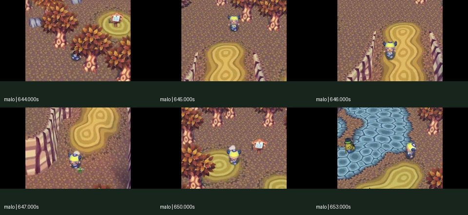
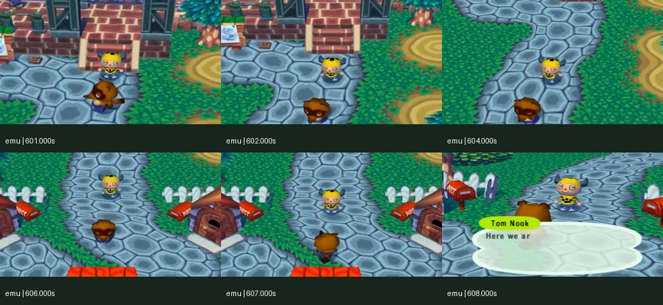
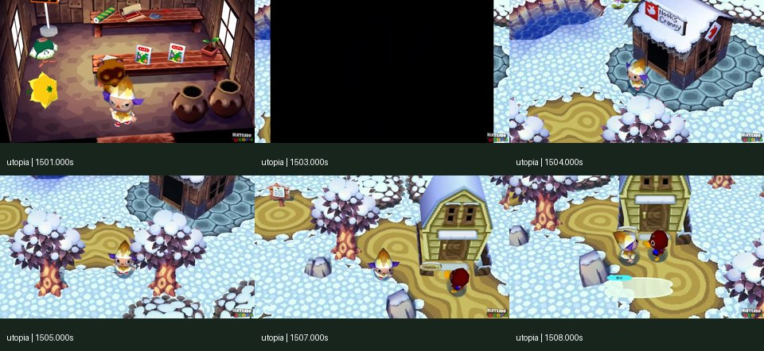
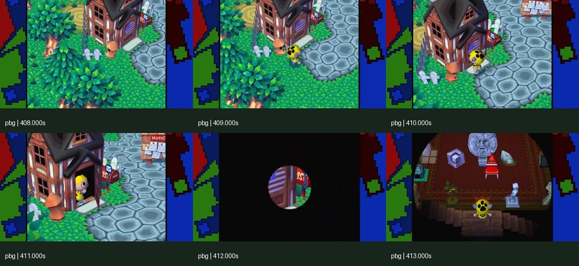

# More original GameCube footage: fidelity needs movement and interactions

Research for [character pilot #231](https://github.com/Reid-Surmeier/risd-godot/issues/231), 2026-09-30. The owner rejected the live demo's slow travel and its broader Animal Crossing fidelity. This pass adds **four independently uploaded gameplay sources** to the existing Mutch Games comparison. It does not accept the character or establish exact input/state matching. No paid calls, complete longplay downloads, ROMs, or original character meshes were used.

## What this changes

A loop can reproduce angular motion while feeling wrong when driven. Travel displacement, step frequency, acceleration, turn response, rest pose, arm proportions, camera response, surface effects and stopping behavior jointly determine the result. The earlier Mutch front/profile cores lasted less than one second and changed yaw; they cannot establish those coupled behaviors. Compare a complete traverse and its stop, then separately compare turning and interactions. The new examples visibly include sustained travel, a ramp, NPC approach, dialogue camera changes, building entry/exit, and item receipt. [MaloDogfish at 10:42](https://www.youtube.com/watch?v=o7pRJ3Vhu7s&t=642s), [EmuRetro at 10:01](https://www.youtube.com/watch?v=Fd0g57lSedA&t=601s), [Nintendo Utopia at 25:00](https://www.youtube.com/watch?v=OUMNiEiR1As&t=1500s), [PBGGameplay at 6:42](https://www.youtube.com/watch?v=RwWURstn4eQ&t=402s).

These are primary recordings published by their gameplay uploaders. Nintendo owns the displayed game imagery. Uploader titles/descriptions identify original GameCube Animal Crossing; **exact executable revision, original hardware versus emulator, enhancement settings and controller input remain unverified**. Do not substitute an upload's branding for binary/version evidence.

## Inspected references

Timestamps below are absolute YouTube times. Windows identify visually useful material, rather than recovered controller-event timestamps. Allow approximately ±0.25 seconds for descriptive boundaries until native-frame annotation is completed. All four retained 12-second excerpts were verified with `ffprobe` as 360 video frames at 30 encoded fps. This is the selected stream's frame rate, not proof of the game's simulation frequency.

| Primary uploader, publication | Inspected window | Useful observation and limits |
| --- | --- | --- |
| **MaloDogfish**, *Animal Crossing GCN - Week 1 - No Commentary Longplay*, 2021-11-30 | [10:42–10:54](https://www.youtube.com/watch?v=o7pRJ3Vhu7s&t=642s); separately 10:50–11:02 | Leaves Spike, moves south down the ramp, changes direction near its bottom, continues toward the plaza, then approaches/stops facing Tortimer. Front-facing portion around **10:45–10:47** is clearer; trees obstruct other portions. Ramp height and camera follow make it unsuitable for a single planar speed estimate across the entire window. Horned yellow/purple outfit, no matching star hat. Title establishes GCN claim; exact region/revision unknown. |
| **EmuRetro Gameplays**, *Animal Crossing - Gameplay - Part 1 - English - Gamecube*, 2015-09-01 | [10:01–10:13](https://www.youtube.com/watch?v=Fd0g57lSedA&t=601s) | Around **10:01–10:07**, boy travels largely toward the camera behind Tom Nook on the stone path; by about **10:08** he is stopped facing Nook with dialogue and a closer framing. This gives several seconds of visible front movement followed by a stop. Opening-job context may imply guided/scripted movement; it does **not** prove an unrestricted player walk or B input. Yellow spotted outfit and smiling face differ from the owner reference. Exact revision/settings unknown; uploader has no explanatory description. |
| **Nintendo Utopia**, *Animal Crossing for GameCube ⁴ᴷ Full Playthrough (All Debts)*, 2024-03-21 | [25:00–25:12](https://www.youtube.com/watch?v=OUMNiEiR1As&t=1500s) and [26:40–26:52](https://www.youtube.com/watch?v=OUMNiEiR1As&t=1600s) | **25:01–25:04:** shop exit/iris transition/outdoor resumption. **25:04–25:08:** moves through snow, changes heading around houses/trees, approaches Bill and stops for dialogue. Trees obscure parts of the path. **26:40–26:44:** item/clothing receipt while facing Bill; **26:48–26:52:** finishes interaction and resumes movement. Winter setting, different outfit. Creator identifies original English GameCube; title advertises 4K60, but the deliberately small selected stream is 854×480/30. Neither establishes original-resolution geometry or controller input. |
| **PBGGameplay**, *Visiting my Original Childhood Animal Crossing Town!*, 2019-05-04 | [6:42–6:54](https://www.youtube.com/watch?v=RwWURstn4eQ&t=402s); separately 2:00–2:12 | Closes map, changes heading near tree/house and enters house about **6:50–6:52**, then indoor spawn at about **6:53**. Useful for interaction transition and changing environment/camera. Early 2:00 material is Resetti dialogue, not locomotion. Decorative side panels, occasional editing and different outfit make this a weaker quantitative motion reference. Description explicitly says original GameCube; end hashtags mention later games and must not override the visual/context check. |

[Exact retained excerpt/frame hashes and metadata](character-fidelity-references/references.json) bind the inspected source windows and selected screenshots. Excerpts remain in `/tmp/character-fidelity-footage`; they are not committed. The compact contact sheets retain each frame's aspect and absolute timestamp:

Attribution: MaloDogfish upload, Nintendo game imagery. [Watch the sequence](https://www.youtube.com/watch?v=o7pRJ3Vhu7s&t=642s).

Attribution: EmuRetro Gameplays upload, Nintendo game imagery. [Watch the sequence](https://www.youtube.com/watch?v=Fd0g57lSedA&t=601s).

Attribution: Nintendo Utopia upload, Nintendo game imagery. [Watch the sequence](https://www.youtube.com/watch?v=OUMNiEiR1As&t=1500s). Black frame is an inspected transition, not a missing sample.

Attribution: PBGGameplay upload, Nintendo game imagery. [Watch the sequence](https://www.youtube.com/watch?v=RwWURstn4eQ&t=402s).

## Capture and camera audit

| Capture | Selected stream | Visible capture issue | Consequence |
| --- | --- | --- | --- |
| MaloDogfish | 640×334, square pixels, 30 fps | Broad black pillarboxes; active viewport visually near 4:3 inside a wider container. Exact active rectangle not certified. | Remove measured borders before proportion fitting. Never resize the whole container to make the character match. Ramp changes local ground elevation; solve ground/camera before speed. |
| EmuRetro | 640×360, square pixels, 30 fps | Game occupies the wide image. Original pixel-aspect handling, stretch/crop or emulator widescreen changes unknown. | Use original pixels for source inspection; retain competing aspect hypotheses until supported by geometry/UI. Do not silently compress horizontally. |
| Nintendo Utopia | 854×480, square pixels, 30 fps | Wide active scene, 4K60 advertised full upload, potentially enhanced capture. Dialogue changes composition/scale; trees occlude travel. | High upload resolution cannot recover undisplayed source details. Separate free movement from interaction camera. Do not claim the 30-fps selected stream is native engine cadence. |
| PBGGameplay | 640×360, square pixels, 30 fps | Decorative side panels around central game viewport; edited presentation. | Mask panels and cuts. Suitable for event ordering and qualitative behavior; weaker for precise temporal estimates. |

The pinned reconstruction's [camera initializer](https://github.com/ACreTeam/ac-decomp/blob/09ca8e8b5b24e6ab44047ee980cf0088ad7ecb4c/src/game/m_camera2.c#L2616) specifies a 45° downward default eye direction, 20° vertical field of view and 4:3 aspect. This supports an **initial camera hypothesis**, not an assertion that all four captures use unchanged settings. NPC interactions and room transitions visibly change framing in the inspected clips. Do not compare every scene to a single static camera or register it using only head height. Existing [motion reference note](character-video-reference-2026-09-30.md) separates default source camera from actual footage.

Nintendo's [original GameCube product page](https://www.nintendo.com/en-gb/Games/Nintendo-GameCube/Animal-Crossing-267719.html) remains useful first-party platform/trailer corroboration. The current [official GameCube manual index](https://en-americas-support.nintendo.com/app/answers/detail/a_id/16961/p/50) did **not** list an Animal Crossing game booklet during this pass. Search results exposed official manuals for later games; those are not evidence for original-GameCube controls. No exact GameCube B-input mapping is inferred from those later manuals or from dust alone.

## Why the previous comparisons can look convincing and still be inaccurate

**Following crops conceal travel speed.** Re-centering the actor each frame and scaling its silhouette to a fixed height discards screen displacement and camera/landmark motion. A slow actor with an approximately plausible gait can appear to match a fast source. Compare the whole game viewport first, then use a following crop solely to inspect deformation. The EmuRetro walk and MaloDogfish ramp show substantial background motion while the actor stays near the center; screen-center stability is camera follow, not zero world speed. [EmuRetro 10:01](https://www.youtube.com/watch?v=Fd0g57lSedA&t=601s), [MaloDogfish 10:42](https://www.youtube.com/watch?v=o7pRJ3Vhu7s&t=642s).

**A cadence match does not establish stride match.** Measure full left-to-left cycles, world-relative distance per cycle, toe/heel rocking and planted-foot slip separately. Upload ghosting, repeated encoded frames and lossy resampling can hide contacts. Dust appearance can help label a fast motion example, but it is not controller telemetry. For source-side distinctions, follow the pinned [player animation/controller reconstruction](https://github.com/ACreTeam/ac-decomp/blob/09ca8e8b5b24e6ab44047ee980cf0088ad7ecb4c/src/game/m_player_main_walk.c_inc) and existing [decoded curve analysis](character-video-reference-2026-09-30.md), rather than assigning WALK/RUN/DASH from a single visual loop.

**Angles do not settle likeness.** Different shoulder width, hip width, arm/leg proportions, sleeve/shoe shape and bind axes change the visible pose even if a sampled angular channel is reproduced accurately. A profile foot pivot can look wrong without a floor penetration failure. A source skeleton calculation and an exported target render answer different questions; retain both. The source reference has different outfits in every new window, so fit body/joint landmarks separately from hat ornamentation and texture identity. [Inspected contact sheets and hashes](character-fidelity-references/references.json).

**Interactions need separate observations.** The source turns toward the conversation partner, stops and adopts an interaction pose/camera; a building transition hides/reveals the actor and changes the environment; item receipt changes hand/arm behavior. None follows from a smooth idle-to-walk crossfade. These observations justify dedicated interaction probes, not inventing more unobserved behavior. [Nintendo Utopia 25:00](https://www.youtube.com/watch?v=OUMNiEiR1As&t=1500s), [26:40](https://www.youtube.com/watch?v=OUMNiEiR1As&t=1600s), [PBGGameplay 6:42](https://www.youtube.com/watch?v=RwWURstn4eQ&t=402s).

## Reproducible comparison protocol

This is a proposed research protocol, not a passed acceptance suite.

1. **Fix capture and scene first.** Select a 3–6-second segment with no cut, dialogue zoom, elevation transition or occlusion. Preserve source timestamps, encoded frame rate, pixel/sample aspect, original frame bytes and a viewport mask. Track at least three static ground landmarks. If their motion cannot be explained by a common camera transform, shorten the interval or model the camera/elevation; do not claim a world-speed result. Use separate fixed hypotheses for 4:3 capture, stretch, crop and altered widescreen rendering until one fits evidence.
2. **Calibrate pose/camera without frame-by-frame warping.** Select one accepted aspect hypothesis and fit one scale, camera, actor placement and heading to neutral body landmarks: shoe contact line, ankles, pelvis, shoulders and head base. Keep ornament differences outside the body fit. Record residuals and uncertainty. Freeze the registration for the sequence; per-frame resizing/recentering would hide the very bob, speed and drift being measured.
3. **Measure travel, cadence and phase separately.** Track actor ground anchor relative to static landmarks, not relative to the screen center. Normalize distance by a measured body height or source-world scale; report the scale assumption. Count three same-foot recurrence intervals where possible, annotate contact/passing/high-swing poses, and align one constant phase offset. Preserve the real-time sequence alongside a phase-aligned comparison; a phase remap can inspect pose but cannot certify speed. Derive candidate playback from travel/stride, then inspect both. Do not independently turn every knob until two crops happen to resemble one another.
4. **Test transitions in context.** Record one forward traverse with stop, one left/right turn, one reversal, one collision push/release, and one NPC/tool interaction. Annotate travel heading versus facing heading, turn lag, pelvis/head motion, planted-foot drift, stop distance and blend duration in frames. Ground impacts and effects must follow the actual visible foot and current surface. Verify no new footsteps/dust after idle. Use deterministic input logs for our demo; source controller labels remain unknown unless the recording includes a trustworthy input display or replay.
5. **Report each defect and its proof independently.** Keep a same-scale body silhouette comparison, front/profile limb-trajectory plots, whole-viewport travel video, planted-foot world trace and interaction sequence. A repaired head seam, reduced arm compression or clean endpoint is a useful result; it is not whole-character fidelity. Accept geometry, source-state mapping, movement controller, deformation and camera/effects separately before calling the complete driven character accurate.

## Remaining source gaps

No inspected new clip matches the owner's exact star-pattern hat or establishes the controller's analog magnitude/B state. The additional sources corroborate behavior across uploaders but are not identical versions/settings. No clean input-labelled 180° reversal, sustained collision press, equipped-tool locomotion or arbitrary terrain contact was verified in this bounded pass. Mark these as **missing**, rather than presenting house proximity as collision proof or an approximate turn as a measured 90° input response. The ramp provides elevation evidence, but does not by itself reveal the source's terrain-contact solver.

The next strongest evidence would be an owner-authorized recording from the exact original game version with a visible controller/input log, fixed render/aspect settings and a tiny repeatable route. The online references still improve the immediate comparison substantially: use EmuRetro's longer front traverse for pose recurrence, MaloDogfish for free movement/ramp/turning, Utopia for NPC and building transitions, and PBG as independent corroboration of house-entry ordering. Exact matching remains open.

## Verification and storage

Four selected primary recordings were decoded and inspected, plus additional small dialogue/movement windows from the same uploaders. Main retained windows: 12.000 seconds/360 frames each; source hashes and screenshot hashes are in `references.json`. Selected sheets were visually inspected after creation. Ordinary unauthenticated YouTube extraction worked. Some HLS section attempts produced empty 262-byte MP4s; these were rejected by native probing and replaced with explicit direct formats (`134`, or `135` for Utopia). They were never treated as footage evidence. The scratch directory was under 20 MiB and persisted evidence approximately 431 KiB at generation. No complete longplay was downloaded; no paid service was used.
