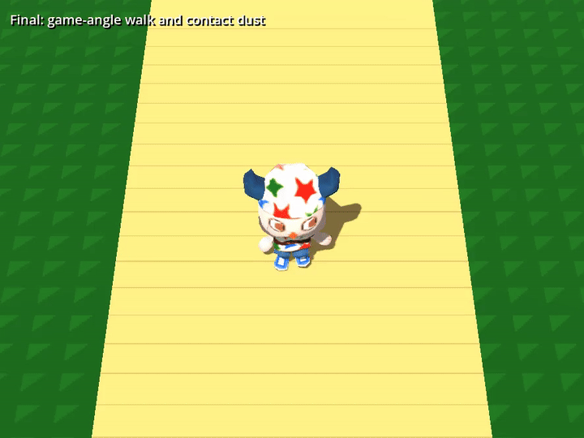
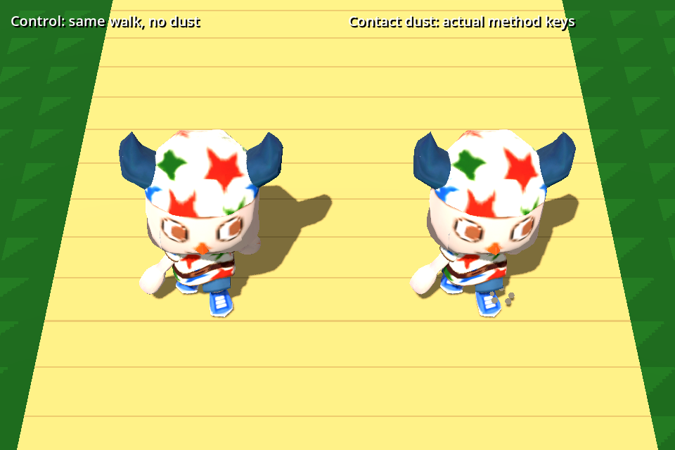
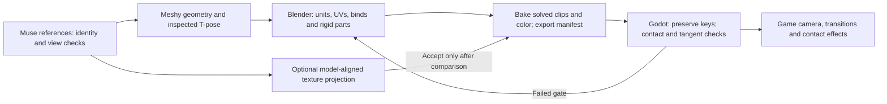

# Character iteration results: pose, rig, animation and effects

September 30, 2026 · [Prototype #231](https://github.com/Reid-Surmeier/risd-godot/issues/231) · [Map #226](https://github.com/Reid-Surmeier/risd-godot/issues/226).

The supplied Meshy character now has a corrected head, grounded idle, a planted walking cycle and contact effects in the native prototype. The trials reused the mesh; additional generation spend was **$0**. Existing aggregate liability remains **$1.54 of the approved $4**. No runtime replacement or specification was made.

[Full 30 FPS movie](../../image-work/character-pilot/iterations/gameview-final-45/loop.mp4) · [Before/after loop](../../image-work/character-pilot/iterations/walk-comparison-45/loop.gif) · [Idle](../../image-work/character-pilot/iterations/idle-comparison-45/loop.mp4).

## What the loop changed

| Trial | Evidence and decision |
| --- | --- |
| Head weights vs scale repair | Shoulder/arm influences warped the head. Scale-only changes failed. Rigid Head weights above the inspected 1.05 m rest-height cutoff reduced native shape-fit error from about 4.46 cm to 7.4 µm. A 1.0 m cutoff did not improve the remaining jaw crease. Keep 1.05 for this character. |
| Root lift vs planted legs | A lift hides penetration but leaves sliding. A two-joint solve from actual joint heads, rigid shoes and controller-compensated stance passes the planar check. Imported display tails were about 100× too long for direct tail-based IK. |
| Held source frame vs matched loop tangents | Removed the walk's initial hold and matched local pose tangents. Idle's endpoint-only repair left a small velocity hitch; the same tangent correction removed it. Both periods remain unchanged. |
| Cubic vs quintic swing | Quintic position/lift with matching stance velocity and zero endpoint acceleration reduced measured contact velocity changes by about 65%, with the same reach/contact gates. Keep quintic. |
| Default vs precise Godot import | Default animation optimization dropped small compensation keys. Disable the AnimationPlayer subresource optimizer for this tested asset. Bake at 60 FPS, import at the tested 30 FPS. |

The selected GLB is `536fb839572228d485fc27027a58506944f8285fcfef72f2f8a421e9d73214d9`. It retains **24 bone names/parents/rest matrices, 7,719 triangles and the atlas**; it exports corrected idle/walk only. Original base/run and provider outputs stay preserved.

| Native check, 257 poses including between keys | Idle | Walk |
| --- | --- | --- |
| Duration | 4.0333333 s | 1.0666667 s |
| Largest stance sole-plane error | 0.060 mm | 0.494 mm |
| Largest stance X/Z drift | 0.129 mm | 0.311 mm |
| Maximum endpoint vertex difference | 0.359 µm | 0.100 µm |

Walk contact is measured with **+Z controller travel at 0.52 m/s**. The walk's velocity residual decreases as the derivative interval shrinks; repaired idle differences are near the native float precision floor. See the [motion research](character-motion-contact-2026-09-30.md), [rig diagnosis](character-rig-deformation-2026-09-30.md), and the [native contact manifest](../../image-work/character-pilot/iterations/motion-diagnosis/contact-manifest.json).

## Camera, blending and effects

The former inspection camera was only about 5.6° above the character. New 35°/45°/55° comparisons select **45° depression with 20° vertical FOV**, a source-supported Animal Crossing default. The final 886×664 preview uses a wider view at gameplay-like character size; this is not an exact calibration of the screenshot. [Camera source and inference](character-motion-contact-2026-09-30.md#camera-a-source-supported-default-not-screenshot-calibration).

Actual Godot Animation method keys emit **six alternating contacts over three loops**, followed by **zero emitted events in idle**. Outgoing walk keys still fired twice during the crossfade; an explicit state gate suppresses them. The visible dust is a deterministic native mesh payload driven by those callbacks, not a particle timer. The separate earlier fixture demonstrates a native CPU particle emitter.

The 0.2 s idle↔walk blend penetrated the plane by about **1.6 cm** before correction. A small visual-root lift during the six blend frames prevents penetration. Both the [failed blend](../../image-work/character-pilot/iterations/transition-unclamped-45/evidence.json) and [corrected transition](../../image-work/character-pilot/iterations/transition-grounded-45/loop.mp4) remain visible. This does not establish planted feet during a blend; world-anchor IK after blending is the production extension.

## Muse texture transfer

Blender projected masked Muse face pixels into the existing UV atlas at 512 and 1024 resolution. The helper preserves original geometry/UV/skin/animation binary data exactly and replaces color only. Neither candidate clearly improved the face: Muse's existing eyes are blurred, and the larger atlas cannot recover that missing detail. **Both were rejected as defaults; the original texture stays selected.** Whole-body projection was rejected because Muse's arms slope while the mesh is in T-pose.

[Texture research](character-texture-projection-2026-09-30.md) · [Before face](../../image-work/character-pilot/iterations/texture-projection/before-face.png) · [Projected face](../../image-work/character-pilot/iterations/texture-projection/after-face.png) · [1024 comparison and preservation checks](../../image-work/character-pilot/iterations/texture-projection/atlas1024/report.json).

## Route to carry into to-spec

Keep geometry, rig, clips and texture as separately inspected inputs. Use MCP to run saved native Blender procedures, then judge actual engine output. Head/shoe masks and gait speed here are target-specific; a reusable system needs an explicit rig/part definition. Turning, terrain, variable-speed foot locks, blend stance, facial animation, secondary motion and other clips remain outside this proof. The lower-jaw crease, inferred back design and likeness still require visual choice.

Reproduction commands and evidence are in [the iteration README](../../image-work/character-pilot/iterations/README.md). Actual MCP reproduced the selected GLB byte-for-byte. Required repository checks, native assertions and secret scans passed; existing Godot exit warnings remain.
