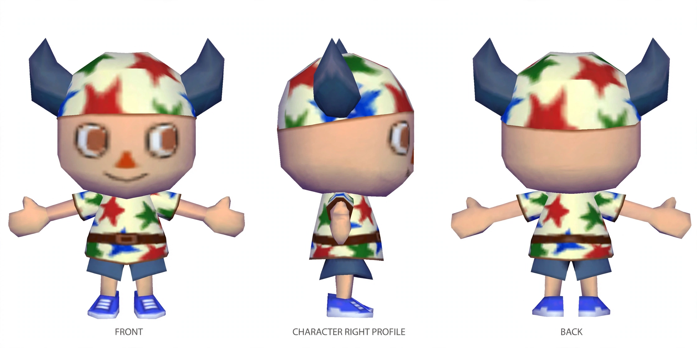
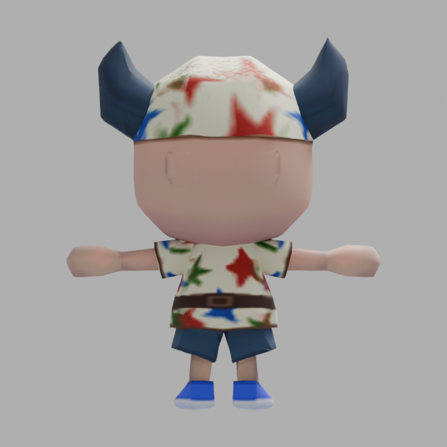
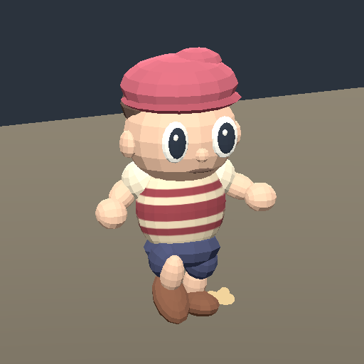

# What the character pilot proved

[Wayfinder map](https://github.com/Reid-Surmeier/risd-godot/issues/226) · September 30, 2026. Research and prototypes are for owner review; no specification or runtime character replacement was made.

## Recommended route

Use the saved Muse **edit** workflow to prepare recognizable references, then **Meshy 7.1** for the first textured T-pose mesh. Inspect geometry before paying for rigging. Normalize incoming clips onto one measured skeleton, bake flat color in Blender, then test the exported asset in Godot. Matching views help establish the unseen design, but do not guarantee good joint topology. This is a route supported by this one pilot, not a universal model ranking.

The [input/model investigation](https://github.com/Reid-Surmeier/risd-godot/issues/227), [rig/motion investigation](https://github.com/Reid-Surmeier/risd-godot/issues/228) and [Blender control investigation](https://github.com/Reid-Surmeier/risd-godot/issues/229) hold primary sources and exact contracts. A creator's [fal-to-Unreal implementation](https://github.com/blendi-remade/fal-3d-unreal/tree/454f56defb0f53f589bd870d6129701651b8f4dc) demonstrates the generation/rig/clip route, including scale corrections. It does not establish production quality for this character. Reusing an authored rig remains the fallback if generated deformation fails.

## Observed results

| Stage | Actual proof | Remaining limit |
| --- | --- | --- |
| Muse | Front and coordinated front/profile/back sheet; held tool removed | Arms still slope; profile approximate; hidden clothing is inferred |
| Meshy | Recognizable horned mesh, 7,719 triangles, UVs, 2K color texture | Back repeats front buckle; joint loops not automatically accepted |
| Rig and clips | 24 bones, idle and included walk/run; clip bone rests match | Raw idle Hips scale is 1.176471 while walk is 1.0 |
| Blender | Actual MCP schedules native Blender 4.3.2 CPU bake; 512² embedded color; mesh/UV/rest skeleton preserved | Flat material is an explicit adaptation; owner must inspect texture detail |
| Godot | Native playback captures and sampled walking film | Raw walk soles penetrate the rest floor by about 3.6–6 cm; grounding is unaccepted |

The raw provider material omitted metallicFactor, which defaults to fully metallic in glTF, and included emissive/specular settings. The derived material explicitly sets metallic/specular/emission to zero and roughness to one. Metallic zero must be set **before** a Diffuse Color bake; the RGB guard exposed a black bake on the original metallic shader. The prototype retains failed local attempts and verifies completion, rather than treating a scheduled job as finished. [glTF metallic default](https://registry.khronos.org/glTF/specs/2.0/glTF-2.0.html#material-pbrmetallicroughness).

### Separate fixture and effects proof

The existing authored red-cap fixture round-tripped with **41 bones, 76 clips and 512² color/AO maps**. Actual stdio MCP queried its Blender scene. Godot imported it, evaluated idle/walk and fired one authored method key that emitted a dust burst near a shoe; idle added no calls. This proves event wiring, not physical contact detection or good weights. Its segmented joints remain visible.

## Cost and subscription comparison

Two Muse edits reported $0.02. Listed fal option rates reserve $1.20 for the textured mesh and $0.32 for rig plus one idle, including basic walk/run. **Total pilot liability is $1.54 of the approved $4.** Final fal billed cost is unverified. Local Blender/MCP/Godot API fees are $0. Provider source files, settings, request IDs, hashes and local Run records were retained; no ambiguous job was blindly resubmitted. [Meshy fal pricing](https://fal.ai/models/meshy/v7.1/image-to-3d), [rig pricing](https://fal.ai/models/fal-ai/meshy/rigging/multi-animation).

Meshy Pro is $20/month, or **$10 for eligible new subscribers' first month**, with 1,000 credits and API access. Textured generation + rig + one animation is 38 API credits, about 26 attempts per allowance; a separate remesh adds five credits. Allocated costs are $0.38/$0.76 if the allowance is used, versus $1.52 through fal. The cash commitment remains $10/$20, and unused monthly credits expire. Direct subscription merits consideration for repeated attempts; fal is cheaper upfront for this small trial. Actual 7.1 task pricing should be checked against the docs' Meshy-7 family table when choosing the direct route. No subscription was purchased. [Plans](https://help.meshy.ai/en/articles/12062933-which-meshy-plan-is-right-for-you-free-vs-pro-vs-premium-vs-ultra), [API task credits](https://help.meshy.ai/en/articles/16815622-how-many-credits-does-each-meshy-api-task-cost), [credit expiry](https://help.meshy.ai/en/articles/9991981-how-do-meshy-credits-work).

### Local repair result

The derived idle Hips scale is now 1, matching walk. The 512-pixel atlas and flat material render in Godot. This removes the raw idle's 17.6% scale inflation; it does **not** repair grounding: idle still floats about 7 cm above its rest sole plane, while walking penetrates the review floor. The saved exporter uses `export_force_sampling=False` to preserve the fractional timestamps of idle/walk/run; the placeholder base clip still changes from 0.3 to about 0.2917 seconds. Exact source/output durations and final hashes are recorded beside the bake.

[Sampled walking film](../../image-work/character-pilot/godot-proof/normalized/walk-sampled.mp4) · [Original generated mesh](../../image-work/character-pilot/mesh-output-model_glb.glb) · [Baked rig and clips](../../image-work/character-pilot/target-baked-normalized-idle.glb) · [Blender source](../../image-work/character-pilot/target-baked.blend).

## Before the owner invokes to-spec

Inspect the character likeness, proposed unseen back, baked texture and walking film. The remaining decisions are the accepted design and skeleton, how motion grounding is repaired, and whether ongoing volume warrants direct Meshy. Baking did not repair the original fixture's geometry or make the new provider clips consistent automatically. The prototype tickets stay open for owner reaction.

Runtime checks passed after preparing the fresh worktree's Godot import cache; existing exit warnings remain. Native proofs include runnable assertions and real captures. The pilot does not demonstrate a production blend tree, physics-driven foot IK, facial animation, secondary spring motion or a whole animation library.
