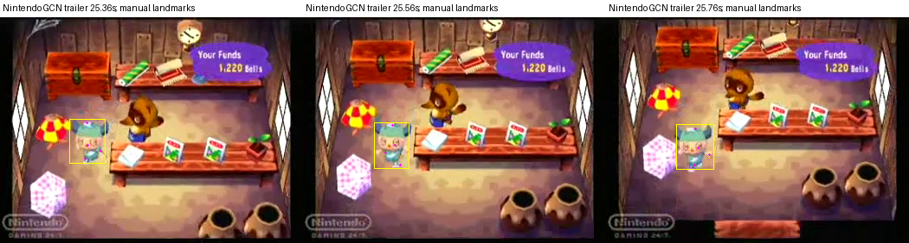

# GameCube character motion: footage and authored reference

Research for character pilot issue 231, 2026-09-30. The strongest next reference is the original authored locomotion curves, checked against Nintendo's actual GameCube trailer. The current generated walk is a contact proof; it is not an accurate reconstruction of the original game's walk. No paid calls, new dependencies, ROMs, or original meshes were used.

## Verified footage and its limits

[Nintendo's Animal Crossing product page](https://www.nintendo.com/en-gb/Games/Nintendo-GameCube/Animal-Crossing-267719.html) identifies Nintendo GameCube and the European release date 24 September 2004, and presents the video. Its current direct [official MP4](https://assets.nintendo.eu/video/private/kg4o3bbt6kagrl1gscnf.mp4) is 33.04 seconds, 350×262, H.264, 25 encoded frames/second. SHA-256: `8cb2a0685a2126b4c0c3cc002b6a0e3ccae7ff0252e990c5519618a4d2d798b4`. This is the exact game family/platform verified by the source. The executable's region, disc revision, simulation frequency, and movement state are unverified; the capture's 25 fps does not establish any of them.

The supplied character's star-pattern hat was **not found in this video**. The indoor boy has a different green/white horned hat. This is a body/motion reference, not an identity match. No exact matching character video was located in this research pass.

Manual native-frame inspection gives these observations, with uncertainty retained:

| Segment | Observation | Conservative interpretation |
|---|---|---|
| 25.16–25.84 s, indoor, front facing | Image-left shoe pose recurs near 25.36 and 25.76 s; opposite shoe is forward near 25.56 s | About 0.40 s per full cycle; 0.32–0.48 s range allowing two frames of phase uncertainty |
| 20.16–21.60 s, outdoor plaza | Newly appearing dust puffs near 20.32, .48, .64, .84, 21.00, .16, .32, .48 s | Alternating events about 0.16–0.20 s apart; full cycle about 0.32–0.40 s; event times uncertain by at least 0.04 s |

These are manual projected-pose/event estimates, not an automated fit or verified foot-ground impacts. The shoes are only a few source pixels wide; ankles, soles, and some wrists are hidden. Dust is a contact-event proxy with compression and persistence ambiguity. The outdoor segment includes a cut at about 20.16 s and subsequent changes of direction. The indoor camera scrolls. Do not describe either segment as `WALK1` solely from these estimates.

The yellow boxes include horns; magenta points mark projected landmarks, not skeletal joints. [The JSON](character-video-reference/footage-measurements.json) retains original pixel coordinates, timestamps, normalized coordinates, and uncertainty. Normalization uses silhouette height and an origin at nose X / silhouette-bottom Y. Occluded points are `null`. Wrist observations are particularly weak (approximately ±3 pixels); crown, nose, and blue-shoe centroids approximately ±2 pixels. These small frames cannot establish exact 3D joint angles or a millimeter footplant gate. Copyright: Nintendo; screenshots are attributed reference evidence, not game assets.

## Verified authored source; reconstruction is separate from observation

All source findings below are pinned to ACReTeam/ac-decomp commit `09ca8e8b5b24e6ab44047ee980cf0088ad7ecb4c`. Its [player animation file](https://github.com/ACreTeam/ac-decomp/blob/09ca8e8b5b24e6ab44047ee980cf0088ad7ecb4c/src/data/model/player_anim.c#L43) contains complete flags, key counts, fixed channels, and frame/value/tangent triples for `walk1`, `run1`, and `dash1`. Each has an authored end frame of 17: phase runs from source frame 1 to 17, giving 16 intervals. This is not 17 evenly spaced samples; individual channels have sparse, differently timed keys.

The [key evaluator](https://github.com/ACreTeam/ac-decomp/blob/09ca8e8b5b24e6ab44047ee980cf0088ad7ecb4c/src/c_keyframe.c#L179) uses cubic Hermite interpolation with tangent multiplier `(next_frame-current_frame)/30`, then truncates `value+0.5` to a signed integer. Rotation values are scaled by 0.1 degrees and converted to binary angles. Fixed channels and out-of-range endpoints are held directly. Negative interpolation values therefore have asymmetric quantization; the decoder retains it instead of replacing it with Python rounding.

[The boy skeleton](https://github.com/ACreTeam/ac-decomp/blob/09ca8e8b5b24e6ab44047ee980cf0088ad7ecb4c/src/data/model/boy_model.c#L396) has 26 joints in depth-first child-count order. [The part table](https://github.com/ACreTeam/ac-decomp/blob/09ca8e8b5b24e6ab44047ee980cf0088ad7ecb4c/src/data/player/BOY_part_data.c#L12) names them and selects the animation layer per joint. The normal state selects layer zero throughout; tool states can select a second layer for the arms. The renderer associates individual display lists with joints, so the source articulation is not equivalent to a modern smoothly weighted 24-bone mesh.

[`Matrix_softcv3_mult`](https://github.com/ACreTeam/ac-decomp/blob/09ca8e8b5b24e6ab44047ee980cf0088ad7ecb4c/src/system/sys_matrix.c#L384) verifies column-vector `local = T * Rz * Ry * Rx`, with `global = parent_global * local`. Source limb offsets run along local X; the root's fixed Z rotation of 90° turns that into world Y. World up is +Y. Movement at yaw zero proceeds along +Z, from the [walk movement code](https://github.com/ACreTeam/ac-decomp/blob/09ca8e8b5b24e6ab44047ee980cf0088ad7ecb4c/src/game/m_player_main_walk.c_inc#L195). Blender bone axes and target rest orientations must be adapted before using these curves.

The [129-sample WALK1 analysis](character-video-reference/walk-transforms-129.json) contains all 26 local/global matrices, positions, authored Euler channels, hierarchy, and a proposed target mapping at source-frame increments of 1/8. JSON matrix rows are row-major storage of column-vector transforms. This is a **source reconstruction**, not exact runtime output: standard mathematical sin/cos replaces the platform lookup, and actor yaw, morphing, rotation-difference tables, and render callbacks are omitted. The reconstructed first/last matrices match exactly; no native game execution was performed.

Representative local channel ranges, rounded to ignore 0.1° quantization, are:

| Channel | WALK1 | RUN1 | DASH1 |
|---|---:|---:|---:|
| Root Y | 1000–1125 | 1000–1175 | 1000–1175 |
| Left thigh Y | −40–30° | −50–25° | −70–50° |
| Left knee Y | 0–70° | 0–60° | 0–100° |
| Left upper-arm Y | −20–30° | 20–40° | −30–60° |
| Left upper-arm Z | −40° | −40–−25° | −25–−20° |
| Left forearm Y | −45–0° | −25–−15° | −100–−45° |
| Head-base X | −5–5° | −5–6° | −15–15° |

[Full channel results](character-video-reference/source-channel-ranges.json) include quarter-cycle values. WALK1 also rotates the shoe locally by roughly −10–15° and the chest by ±15° on X. The head mesh's own rotation is fixed, but the head-base joint moves: rigid head geometry does not mean a head locked in world space. Root bob has two peaks per cycle. These are source axes, not anatomical flexion measurements from the trailer.

## Timing and effects: avoid a false walk label

[Walk playback](https://github.com/ACreTeam/ac-decomp/blob/09ca8e8b5b24e6ab44047ee980cf0088ad7ecb4c/src/game/m_player_main_walk.c_inc#L78) advances phase by approximately `0.6 * sqrt(actor_speed * collision_normalization / 7.5)` per update, with wall adjustments and a lower clamp. [WALK changes to RUN](https://github.com/ACreTeam/ac-decomp/blob/09ca8e8b5b24e6ab44047ee980cf0088ad7ecb4c/src/game/m_player_main_walk.c_inc#L260) at `phase_speed² / 0.048 >= 3.525`; [RUN changes to DASH](https://github.com/ACreTeam/ac-decomp/blob/09ca8e8b5b24e6ab44047ee980cf0088ad7ecb4c/src/game/m_player_main_run.c_inc#L98) at 4.875. These are speed gates, not a direct B-button-only walk/run distinction. RUN delegates playback calculation to WALK.

The source's normal [GAME_FRAME is 1](https://github.com/ACreTeam/ac-decomp/blob/09ca8e8b5b24e6ab44047ee980cf0088ad7ecb4c/include/game.h#L37); [SetGameFrame](https://github.com/ACreTeam/ac-decomp/blob/09ca8e8b5b24e6ab44047ee980cf0088ad7ecb4c/src/game.c#L115) passes it to JFWDisplay. Its [waitForTick](https://github.com/ACreTeam/ac-decomp/blob/09ca8e8b5b24e6ab44047ee980cf0088ad7ecb4c/src/static/JSystem/JFramework/JFWDisplay.cpp#L314) waits according to retrace messages, and [JFWSystem's initial render mode](https://github.com/ACreTeam/ac-decomp/blob/09ca8e8b5b24e6ab44047ee980cf0088ad7ecb4c/src/static/JSystem/JFramework/JFWSystem.cpp#L27) is NTSC. Actor movement is [called once in the normal actor traversal](https://github.com/ACreTeam/ac-decomp/blob/09ca8e8b5b24e6ab44047ee980cf0088ad7ecb4c/src/game/m_actor.c#L410). This supports, but does not independently verify for the trailer, a normal 60-update/second model.

Under that model, the fastest WALK1 cycle is about `16 / (60 * sqrt(.048 * 3.525)) = 0.648 s`; RUN spans approximately 0.551–0.648 s. At 50 updates/second those become about 0.778 s and 0.662–0.778 s. Consequently, the observed ~0.40 s footage recurrence is more plausibly faster locomotion than WALK1, or affected by an unverified capture/runtime difference. A 0.40 s WALK1 trial is a style/timing experiment, not a recovered original walk state. Do not convert the source frame count with the trailer's 25 fps.

[Walk effects](https://github.com/ACreTeam/ac-decomp/blob/09ca8e8b5b24e6ab44047ee980cf0088ad7ecb4c/src/game/m_player_main_walk.c_inc#L108) are triggered for the left/right foot at source frames 1/9, normalized phases 0/0.5, using each foot's position, angle, and ground attribute. RUN shares this schedule; DASH selects a different effect type. Align phase origin to this source before assigning events. Our earlier 0.25/0.75 contacts are a different authored phase origin and cannot simply be mixed into a source-driven clip.

## Proportions and the smallest next comparison

[The measured proportion analysis](character-video-reference/proportion-analysis.json) separates source joint offsets from the target inverse-bind matrices. Source thigh+shin is 850 units; upper arm+forearm-to-end is 1251, giving 1.4718 arm/leg. The existing rigid-head GLB gives 0.39910 leg, 0.40761 arm, ratio 1.0213. Source hip/shoulder width ratio is 700/900 = 0.7778; target is 0.18336/0.44238 = 0.4145. These are skeletal quantities, not guaranteed visible silhouette dimensions. The source `feel` joint is an emotion anchor; its ~3200 world-Y value is not verified head-top geometry and should not establish body height.

The [source camera initializer](https://github.com/ACreTeam/ac-decomp/blob/09ca8e8b5b24e6ab44047ee980cf0088ad7ecb4c/src/game/m_camera2.c#L2616) uses eye `(0,876.81238,876.81238)`, center zero, up +Y, vertical FOV 20°, aspect 4:3: 45° downward. Those are initial settings, not proof of unchanged settings in every scene. They support the existing pilot's 45°/20° comparison camera.

Recommended next bounded comparison:

1. Retarget the source global segment directions through explicitly adapted rest bases to the existing 24-bone rig. Preserve original curves and sparse timing in the analysis; native IK may fit different limb lengths, but label that result as derived. Helpers such as toe, hand, spine, and head-end joints lack a direct source counterpart.
2. Compare WALK1 at approximately 0.65–0.8 s against separate RUN1/DASH1 trials near the observed faster cadence. Use the same 45°/20° camera and align shoe recurrence before judging timing. Do not silently relabel a fast WALK1 sample as verified original walking.
3. Compare arm spread/length, knee lift, shoe rocking, two-peak body bob, and small rigid head-base motion in projected frames. Uniform retargeting cannot repair the measured proportions; changing geometry is a separate asset decision.
4. Keep the previous planar floor/contact and shrinking-time loop checks. Shoe rocking requires a contact-point pivot rather than assuming the complete sole stays flat. Refit event phases to the actual derived stance, retain zero idle dust, and distinguish source scheduling from measured target contact. Terrain, turning, and blended stance remain separate tests.

## Reproduction and attribution

[Our decoder](character-video-reference/decode_walk.py) reads `player_anim.c` and `boy_model.c` from a temporary source directory; it does not fetch or produce geometry. Run `python3 decode_walk.py --source-dir /tmp/acgc-motion-source --animation walk1 --output /tmp/walk-analysis.json`; `run1` and `dash1` are also supported. It asserts complete consumption of all channel/key/fixed tables, 26 joints, and produces 129 transform samples. Source-range summaries sample 1601 phases. This is analysis tooling, not a shipped runtime module.

ACReTeam's pinned [LICENSE](https://github.com/ACreTeam/ac-decomp/blob/09ca8e8b5b24e6ab44047ee980cf0088ad7ecb4c/LICENSE) is CC0 1.0, not MIT. It explicitly does not clear other persons' rights; the repository license alone does not establish permission to redistribute Nintendo's original assets. This note publishes our decoder, numerical research, and attributed reference screenshots; no original mesh or ROM is included.

Validation: all WALK1/RUN1/DASH1 table cursors consumed exactly, 26-joint hierarchy decoded, 129 WALK1 samples generated, reconstructed endpoint matrix difference zero, footage metadata/hash recorded, screenshots visually inspected, and `git diff --check`. No exact video-state, original-game execution, final asset acceptance, or runtime integration claim is made.
