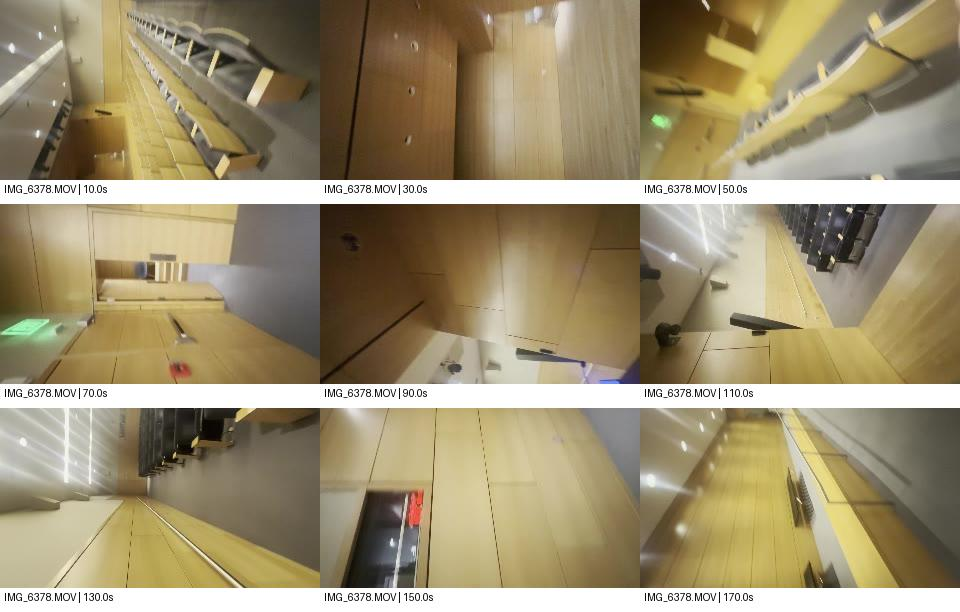
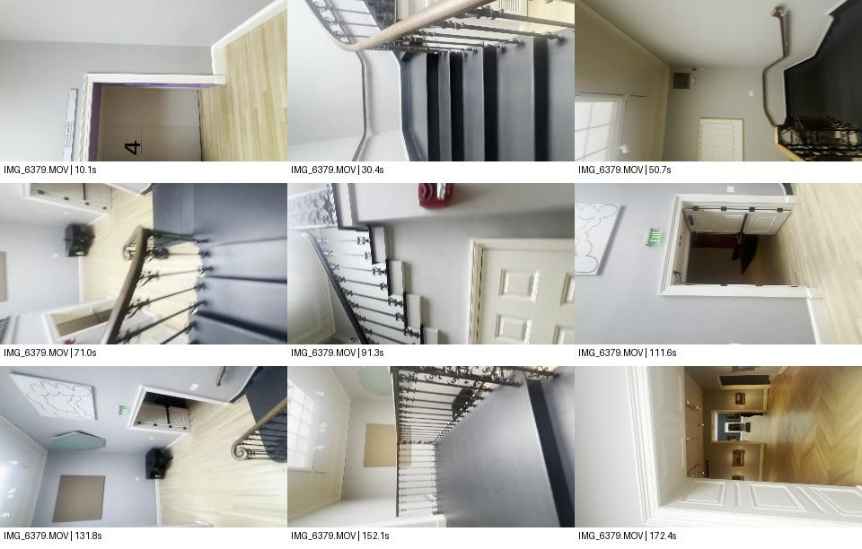
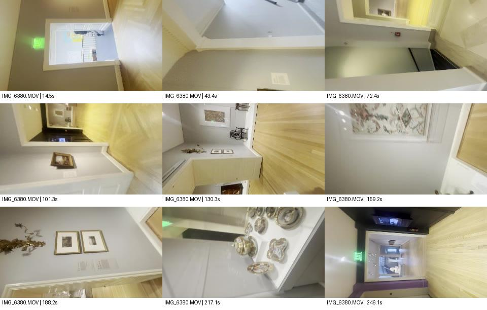
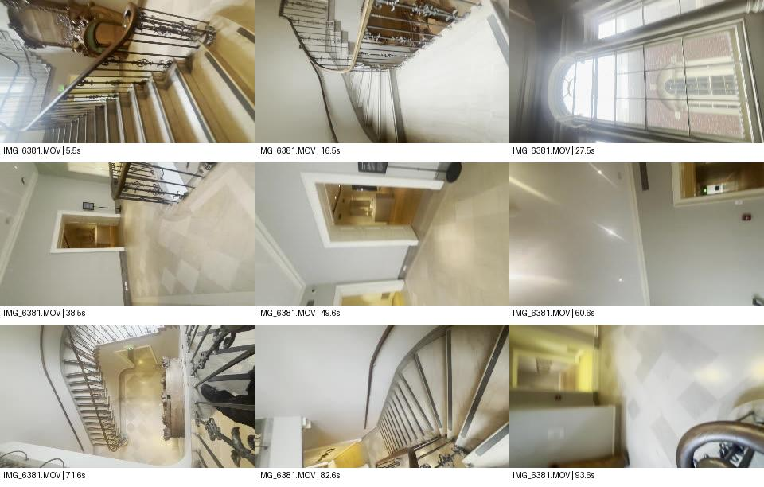
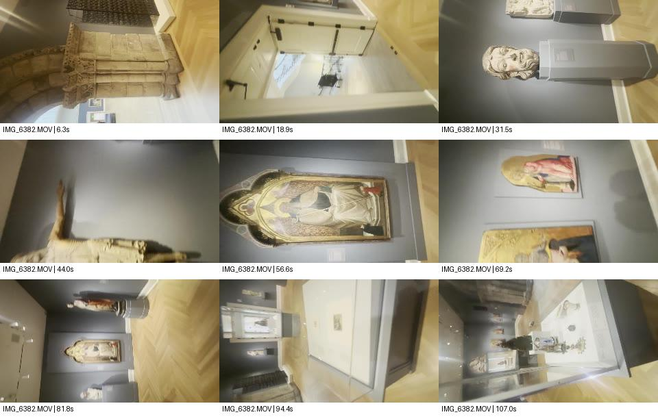
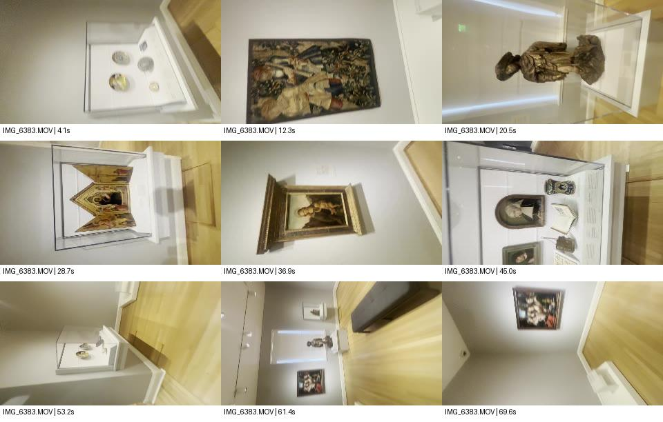
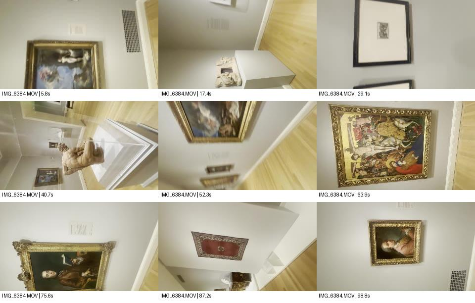
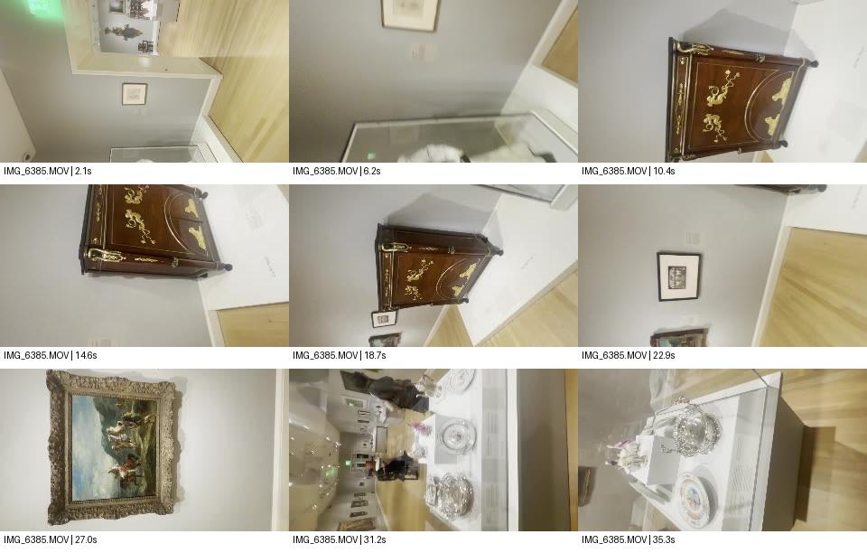
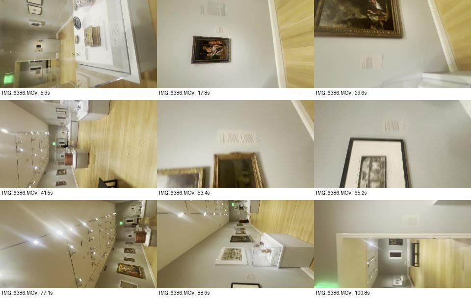
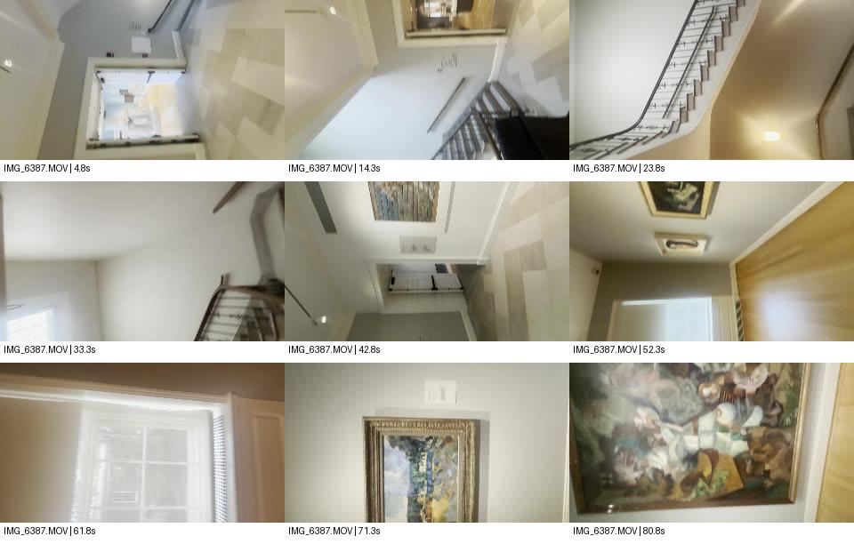

## Intake progress: originals downloaded and GPU sampling verified

The five most recently uploaded video originals are downloaded to `~/risd-godot-ingestion/collection-expansion/verified/`: IMG_6378.MOV (179.97 s), IMG_6379.MOV (182.55 s), IMG_6380.MOV (260.54 s), IMG_6381.MOV (99.12 s), IMG_6382.MOV (113.24 s). Total 1,468,917,880 bytes. Each matches Proton's recorded byte size and SHA-1; SHA-256 values, ffprobe metadata and nine sampling times per clip are in `verified-manifest.json`.

Correction: the originals are in Proton **Photos**, not the empty `/my-files/video refrence.` folder. Ten museum-video candidates were uploaded September 29. Upload order differs from capture order. The remaining five are supplemental candidates, not an automatic increase in room scope.

RTX 4070 SUPER verified (12,282 MiB). Actual extraction succeeded with `ffmpeg -hwaccel cuda -hwaccel_output_format cuda ... -vf 'scale_cuda=320:180:format=yuv420p,hwdownload,format=yuv420p'`. Video decode and resizing ran on GPU; hash verification, JPEG encoding and contact-sheet layout used CPU. No geometry reconstruction or bake has run yet.

Inspected nine timestamped views per video:
- IMG_6378: wood-lined auditorium, raked seating and circulation aisle; doorway at approximately 70 seconds. No proven gallery connection from these samples.
- IMG_6379: stair hall with iron balustrade, elevator marked 4, multiple doors, adjoining room visible at approximately 172 seconds.
- IMG_6380: adjoining pale-walled small galleries, framed art, chair, wall-mounted decorative object and display case of plates; doorway views throughout.
- IMG_6381: curved stairwell, tall arched window, landings with several doorways. Vertical circulation needs explicit topology/collision/camera treatment.
- IMG_6382: dark-walled sculpture gallery, carved architectural surround, stone head on plinth, crucifix, shaped panel paintings and sculpture. Strong candidate for the multi-angle sculpture asset prototype.

These are observations, not confirmed museum room names or reconstructed coordinates. The images contain substantial camera roll; sampling preserves source orientation. Normalize camera roll deliberately during survey rather than mistaking it for building geometry. Denser doorway sequences, cross-clip matches, scale anchors and held-out validation still required. Intake remains open; sparse contact sheets do not establish the full map.

## Supplemental clips

All ten originals now pass byte-size and remote SHA-1 verification; SHA-256 and probe metadata are in the manifest. Nine GPU-decoded/resized frames per video were visually inspected.

IMG_6383 shows cases, tapestry, sculpture and framed art; IMG_6384 shows framed paintings and a sculpted torso; IMG_6385 shows furniture, frames and decorative-art cases; IMG_6386 shows a long gallery and multiple doorway views; IMG_6387 shows a stair landing and adjacent framed paintings. These offer possible cross-clip matches, not established room adjacency. No reconstruction or asset generation has run.

### IMG_6378-contact

### IMG_6379-contact

### IMG_6380-contact

### IMG_6381-contact

### IMG_6382-contact

### IMG_6383-contact

### IMG_6384-contact

### IMG_6385-contact

### IMG_6386-contact

### IMG_6387-contact

