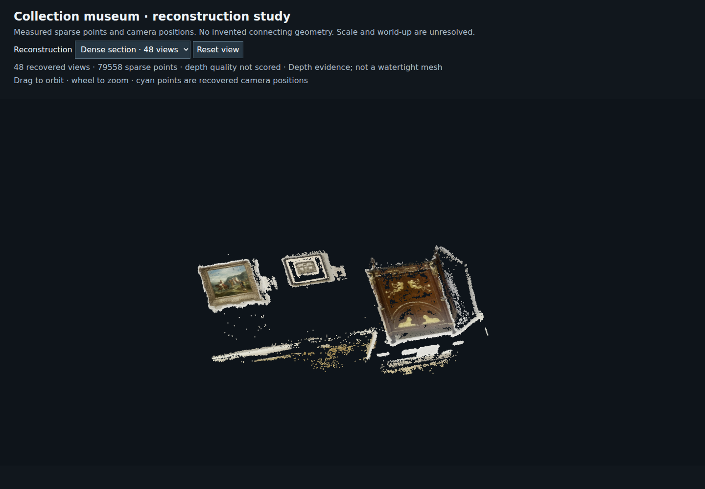
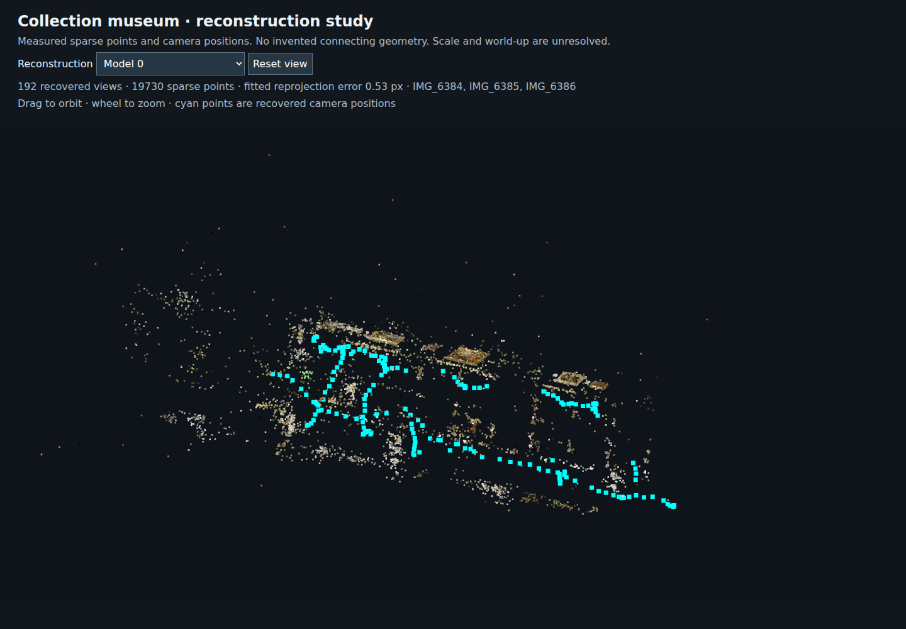
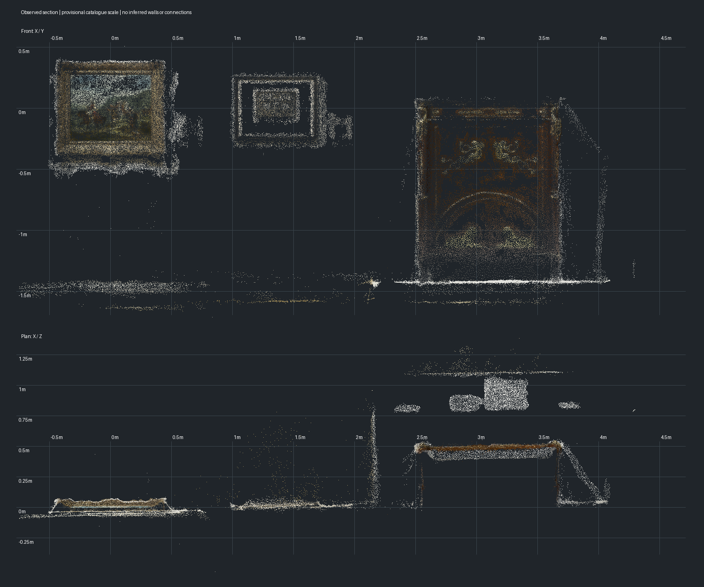

# Collection reconstruction: first measured geometry





This is survey evidence for [the connected-room prototype](https://github.com/Reid-Surmeier/risd-godot/issues/182), not an accepted playable map. Collection is the target; the 3D Viewer and shipped runtime are unchanged.

## What was reconstructed

All ten September 29 videos were sampled at 2 fps using NVIDIA decoding and resizing: **2,485 frames at 1280×720**. Ten percent were reserved before fitting. The first reconstruction uses IMG_6383–IMG_6386: 580 training views after withholding frames. The remaining clips are available for later survey passes; extraction is not equivalent to reconstructing all ten.

Sequential matching initially produced eight small components. Their fitted focal lengths clustered around 590 pixels, whereas the default initialization was 1536 pixels. Updating the starting calibration alone did not connect the pieces. GPU exhaustive matching across all 580 training views was the material improvement: the largest component registers **192 views across IMG_6384, IMG_6385 and IMG_6386**, with **19,730 points** and **0.526 px mean fitted reprojection error**. Nine components remain; do not merge their coordinate systems without measured correspondences. Shared clip coverage does not establish a room count.

A 48-view component linking IMG_6385 and IMG_6386 was undistorted to 640 pixels and processed with CUDA PatchMatch (six source views, three iterations, ten samples, geometric consistency), then fused into **79,558 points**. Inspection shows recognizable frame relief, a cabinet, wall trim and partial surrounding surfaces. There are substantial holes. This is neither a watertight mesh nor collision geometry. No source-video pixels have become game textures.

## Independent checks and revisits

The main component was frozen before evaluation. Thirty-four withheld frames within five seconds of registered training views were matched to it. These are nearby-view tests, not a random whole-museum sample.

- Matching only six temporal neighbors produced 23 pose estimates.
- Matching every registered reference produced 29 pose estimates, but six had only 3–11 inliers and must be rejected.
- The explicit minimum-support check is at least 20 inliers and a 25% inlier fraction: **23/34 supported**. This is a diagnostic threshold, not owner-approved production acceptance. The other eleven remain failures or weak solutions. A small pixel residual alone does not prove a good pose.
- Eleven six-second windows around these failures were revisited at 6 fps: **396 additional samples**, with overlapping source times possible. They are inspection evidence and were not fed back into the frozen model or used to inflate the validation score. Timestamps are nominal sampling times.
- Inspected revisits show featureless wall/text transitions, isolated planar artworks, strong camera turns, glass/reflections and moving visitors. Some failures have sharp artwork views, so blur alone is not an adequate explanation. Missing 3D coverage remains a problem to solve.

See [per-frame evaluation](../evidence/collection-reconstruction/heldout-result.json), [sparse results](../evidence/collection-reconstruction/sparse-result.json), [sampling manifest](../evidence/collection-reconstruction/reference-manifest.json) and [revisit manifest](../evidence/collection-reconstruction/revisit-manifest.json). Local originals remain hash-verified in `~/risd-godot-ingestion/collection-expansion/verified/`.

## Hardware and reproducibility

RTX 4070 SUPER, 12,282 MiB. `pycolmap-cuda12==4.2.1` in the isolated ingestion `.venv`; `has_cuda=True`. Logs explicitly show SIFT GPU extraction and matching on device 0; dense depth logs show CUDA sweeps. FFmpeg uses `-hwaccel cuda -hwaccel_output_format cuda` and `scale_cuda`. CPU handles image encoding, database/geometric verification, sparse camera optimization and depth fusion.

The wheel's Ceres was built without CUDA/cuDSS, so bundle adjustment requests fall back to CPU. Caspar was probed and is not compiled into this wheel either. These are recorded limitations, not claims of GPU optimization. The small browser review renderer reported Mesa llvmpipe; its screenshots are inspection evidence, not a GPU gameplay performance benchmark. No paid generation ran.

Scripts are under `modules/shell/prototype/collection_reconstruction/`. Run with the ingestion virtualenv. `survey.py extract` builds the sample bank; `survey.py reconstruct` builds a new trial. The final trial reused previous features, performed `pycolmap.match_exhaustive(..., device=pycolmap.Device.cuda)`, then ran `survey.py reconstruct --name sfm-galleries-v3 --focal 590`. `dense.py`, `holdout.py --all-references`, `revisit.py`, and `export_view.py <survey-run> <output>` reproduce their named stages; holdout scripts intentionally refuse to overwrite prior trial databases. Outputs remain outside Godot. The viewer aligns each component by its principal axes for inspection, not architectural world-up.

Local artifacts: `sfm-galleries-v3/sparse/`, `dense-connected-v1/fused.ply`, `review/`, logs and the frozen held-out records under `~/risd-godot-ingestion/collection-expansion/`.

## What must happen before game geometry

Establish metric scale from identified objects with documented dimensions; align gravity and wall/floor planes; validate doorway adjacency across clips and the existing Grand Gallery; repair unsupported coverage without pretending separate models are joined. Then build the connected-room blockout and test traversal, collision and camera visibility. Only after those checks should Muse frame/sculpture passes and final texture/lightmap work begin. Current evidence does **not** pass the connected-room acceptance gate.

RISD's [floor-five guide](https://risdmuseum.org/visitor-guide/floor-5) provides a [published schematic](https://risdmuseum.org/sites/default/files/2020-12/Floor5-map-121420.png), downloaded for topology comparison. Its 2020 filename and schematic proportions mean it is not a current measured floor plan or proof of the current hang. The [European galleries page](https://risdmuseum.org/exhibitions-events/exhibitions/european-galleries) provides context, not video-to-room identification.

Primary tool references: [COLMAP CUDA wheels](https://colmap.github.io/pycolmap/index.html), [bundle adjustment guidance](https://github.com/colmap/colmap/blob/main/doc/faq.rst), and [4.2.1 MVS bindings](https://github.com/colmap/colmap/blob/4.2.1/src/pycolmap/pipeline/mvs.cc).

## Repository verification

Python compilation and `git diff --check` passed. `scripts/check.sh` initially failed because the fresh worktree had not imported its Godot assets; after `godot --headless --editor --import --path .`, it passed. Godot reports eight leaked ObjectDB instances at shutdown, which this experiment does not change. The review page rendered without JavaScript errors and both sparse/dense screenshots were inspected. No runtime GDScript or frozen acceptance file changed.

## Expanded survey and metric section — September 29 continuation



The eight-clip exhaustive GPU match trial (`sfm-connected-v4`) used 1,584 training
images. The resumed main component grew from 192 to 194 views. A separate 234-view
component spans IMG_6380, IMG_6384 and IMG_6385; the museum remains disconnected.
The export now explicitly saves every component's camera/track files: COLMAP's
resume path otherwise persisted only the starting model alongside the PLYs.
The mapper was rerun from cached matches to recover those files; component IDs
outside the major stable components changed. `expanded-sfm.json` is the saved rerun.

Shared-track similarity fits reserve every fifth correspondence for evaluation.
Components 7→0 and 11→6 pass the exploratory fit filter (at least 50 shared points,
80% train/held-out inliers within 2% of correspondence radius, non-collinear spread).
The first has 6,844 shared point pairs and 91.5% held-out inliers. These are local
alignment candidates, **not independent proof of room connections**: points share
source images and bundle adjustment. No accepted alignment reaches component 3,
so its metric scale has not been propagated into the main map.

The verified Delacroix canvas is 0.651 × 0.541 m (see
[anchor research](collection-scale-anchors.md)). Ten views of component 3 support
canvas-plane fits with width/height scale disagreement below 5%. Their median
scale is 0.444195 metres per reconstruction unit; the 10–90 percentile interval is
0.442346–0.445263. This is consistency across correlated views, not an absolute
accuracy confidence interval. Level/plumb canvas orientation remains an assumption.
The saved rerun gives 0.444490 m/unit, consistent with the earlier component.

`metric_section.py` exports 79,558 observed dense points in provisional metres and
the front/plan plot above. The cabinet silhouette provides an independent visual
sanity check, but catalogue-height/width/depth validation is still pending. The
plot shows depth and artwork separation; it does not invent wall, floor or doorway
surfaces. No game runtime or 3D Viewer file changed.

Reproduction (using the ingestion virtualenv):

```sh
python modules/shell/prototype/collection_reconstruction/component_links.py /home/reidsurmeier/risd-godot-ingestion/collection-expansion/sfm-connected-v4
python modules/shell/prototype/collection_reconstruction/metric_section.py
```

The alignment script includes a synthetic transform-direction check. The metric
export checks an orthonormal basis, positive scale and finite coordinates. These
checks do not substitute for held-out video, navigation, collision or bake gates.

## First Muse asset pass

The source-preserving Muse pass is now executed: one frame, OpenRouter
`meta/muse-image`, actual recorded cost $0.010000. See the
[application record](../../image-work/collection-expansion-frame/README.md) for
source/result images, recipe, full run archive and remaining checks. No sculpture
pass or batch has been run.

The frame trial uncovered the existing rectangular side strips' mismatch with
this carved outline. An isolated perimeter extrusion fixes the visible fragments
without changing the game builder. The 9 cm depth is still assumed. The authentic
canvas remains separate at its catalogue dimensions; no room bake is claimed.

The earlier software-render limitation has a working GPU path for these native
Godot captures: clear `LIBGL_ALWAYS_SOFTWARE`, use `DISPLAY=:0`,
`GALLIUM_DRIVER=d3d12`, `MESA_D3D12_DEFAULT_ADAPTER_NAME=NVIDIA`, and Godot's
Compatibility renderer. The log identifies **D3D12 (NVIDIA GeForce RTX 4070 SUPER)**.
Direct NVIDIA Vulkan initialization failed on this WSL host. This GPU evidence is
for the native asset trial, not the earlier browser point-cloud preview.

Validation: full `scripts/check.sh` passed with the existing eight ObjectDB leak
warning; `git diff --check` passed. The asset harness verified four meshes and
exported three views, all inspected. No production files or frozen tests changed.
