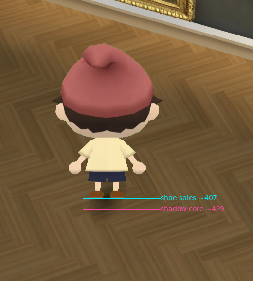
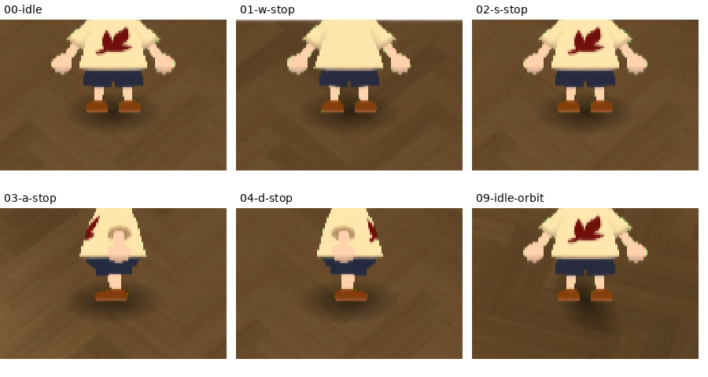
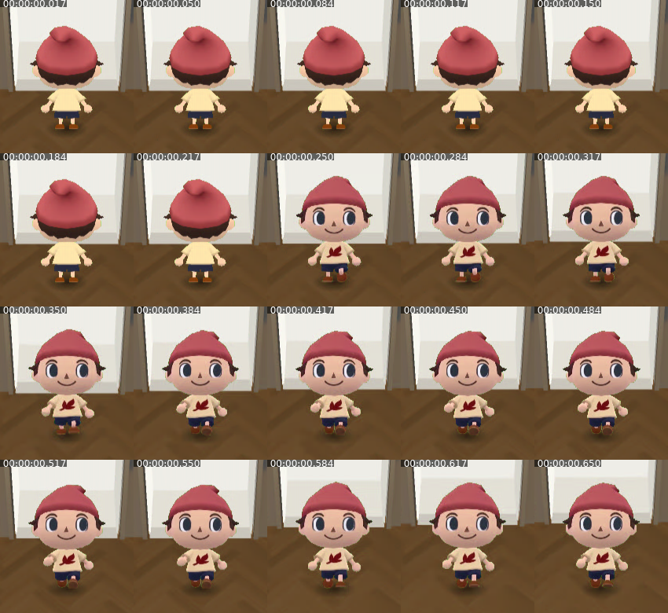

# Independent reference gap review — runtime 670e820

**Verdict: NOT DONE against the corrected character-in-world target.** This fresh review supersedes my earlier scoped DONE verdict. The three verified priorities are foot contact, abrupt facing changes, and the character's lack of visible response to room lighting. No runtime code was changed, no generation was purchased, and no commit was made for this review.

## Fresh evidence and scope

Captured the owner's actual share in a separate Chrome session on 2026-09-26. It resolved to [runtime 670e820](https://windows-wsl.taile06c45.ts.net/gallery-dollhouse-01a0df97/670e820.html?lighting=baked). The [capture script](gallery-blind-reference-gap-review/capture.cjs), [capture log](gallery-blind-reference-gap-review/capture.json), and [recorded WASD/orbit sequence](gallery-blind-reference-gap-review/wasd-orbit.webm) preserve the test. The video contains 298 decoded frames at 30 fps, approximately 9.93 seconds: W/S/A/D starts and stops, W+D, D alone, an orbit, and S after orbit. Still captures were 1600×900, followed by 720×486. Screenshot names containing `080` or `350` describe requested waits, not measured input latency; screenshot overhead adds time.

I inspected extracted frames and consecutive-frame sheets. This is sampled visual analysis, not a claim to have perceived uninterrupted playback or evaluated audio.

The primary reference is [Animal Crossing video To31pQwX1lI at 57:32](https://www.youtube.com/watch?v=To31pQwX1lI&t=3452s), sampled from the saved source clip at 57:30–57:34. **That museum scene is lighting evidence only.** Its layout and smaller character are not the required composition. The supplied house screenshot remains the character scale/placement target. Source provenance is recorded in [the existing evidence manifest](gallery-final-render-overlay/evidence.json). I also inspected the saved 59:00–59:02 segment; its visible combing and brief dialogue transition make it unsuitable for deriving exact gait or turn timing.

## Verified priorities

1. **P1 — the feet read as hovering above the contact shadow.** In the owner's [raw screenshot](gallery-blind-reference-gap-review/owner-original.png), the shoe soles are around y407 and the darkest shadow core around y429: approximately 22 pixels, or 7% of the approximately 318-pixel cap-to-sole height. Fresh browser captures reproduce the separation in front, rear, and side idle poses: soles around y489 and the shadow core around y498–501, approximately 9–12 pixels at this smaller display size. The soft shadow fringe overlaps the shoes; the measured gap is to the darkest core, not an empty transparent band or proof of a particular 3D height. It nevertheless gives the figure a detached, floating appearance. The reference contact reads as a compact disk directly beneath the figure. **Fix/acceptance:** ground the visible sole/contact relationship in every facing, then check planted steps and camera orbit; do not merely move the entire character lower to hide one screenshot.

   

   

2. **P1 — reversing WASD replaces the complete facing in one recorded frame.** The [consecutive reversal sheet](gallery-blind-reference-gap-review/reversal-consecutive.png) shows the rear silhouette at relative 0.217 seconds followed by the full front silhouette at 0.250 seconds. There is no intermediate body orientation in that 33 ms recorded interval. This is a visible whole-body pop, independent of whether the approved walk loop itself is appealing. It does not establish Nintendo's exact turn duration. **Fix/acceptance:** preserve the approved identity and movement character while making reversal and diagonal direction changes visibly coherent. Repeat W→S, A→D, diagonals, and orbit while walking; verify intermediate orientation/pose continuity in consecutive frames rather than approving four isolated facings.

   

3. **P1 — the character is visually detached from local illumination.** A second controlled sequence moved left, returned to center, and moved right, restoring the same front idle pose after each move. Interior hat, cheek, and shirt pixel patches are exactly identical in all four captures: maximum absolute RGB change **0**. Meanwhile, the floor patch immediately left of the feet changes from mean RGB **104.54/74.99/42.43** at center to **148.27/113.87/72.85** at left. The bright floor pool and surrounding wall composition visibly change. The floor comparison includes texture changes, so it is not a calibrated measurement of incident light; the character's pixel invariance is directly measured. This explains the pasted-on appearance despite attractive painted shading. **Fix/acceptance:** compare the same facing under known bright and shaded room locations, and changing orientation at one location. Require visible, coherent light/form response while preserving the approved colors and recognizable face. A global blur or orange tint does not address this defect. [Exact patch coordinates and values](gallery-blind-reference-gap-review/lighting-patch-measurements.json); [center](gallery-blind-reference-gap-review/light-center.png), [left](gallery-blind-reference-gap-review/light-left.png), [returned center](gallery-blind-reference-gap-review/light-center-return.png), [right](gallery-blind-reference-gap-review/light-right.png).

## Scale, room, and display findings

The house screenshot's active picture is approximately x160–3213, y113–1920; the central human is approximately 595 pixels tall, **32.9%** of picture height, with soles approximately **80.4%** down. In the fresh browser view, the active gallery is approximately x540–1128, y174–566; the human is approximately 132 pixels tall, **33.7%**, with soles approximately **80.5%** down. These manual silhouette measurements are approximate, but scale and overall placement are already close. Shrinking the visitor to the 57:32 museum-video size would break the relevant target.

The current room has readable ivory doorway planes and a localized warm floor pool. The reference [57:30–57:34 sheet](gallery-blind-reference-gap-review/reference-5730-5734.png) has stronger separation between broad light floor shapes, dark recesses, and the compact character contact. Current parquet combines repeated herringbone edges and many grain streaks over much of the picture; the lower half consequently carries more fine directional texture than the reference's broad floor shapes. This is a material/composition comparison, not proof that the display shader is faulty, and does not require copying the reference's tile floor or museum layout. It is secondary to the three verified character integration failures.

At the inspected sizes I did not establish a new clipped edge, dominant checker overlay, or display-mask leak that should take precedence over those failures. Nor do these samples justify adding stronger noise, scanlines, or blanket blur. A rendering trial should keep pose, camera, exposure, bake, and output dimensions fixed; compare doorway/painting edges and parquet during a slow pan at native display size. Reject a trial that loses art detail, changes white planes into haze, or increases temporal texture shimmer. The current sampled recording alone does not isolate room crawl from texture frequency, camera movement, or video encoding.

## Required next acceptance evidence

Repeat the captured input sequence at 1600×900 and 720×486 after changes, plus a slower continuous orbit and a controlled bright-to-shade walk. Inspect foot contact and planted-foot drift, consecutive reversal/diagonal frames, and same-pose light response. Review actual motion as well as frame sheets. A successful performance/input suite or a pleasing idle screenshot does not close these visible failures. Exact Nintendo equivalence, audio timing, and an implementation diagnosis are not claimed here.

Evidence files are preserved beside this report with [SHA-256 hashes](gallery-blind-reference-gap-review/sha256.json). The source house screenshot remains `/tmp/orca-paste-1790463217298-144fe770-a4bf-4757-99ae-db558a9480e7.png`; the owner's original source is `/home/reidsurmeier/risd-godot/.orca/drops/Screenshot 2026-09-26 at 9.49.53 PM.png`.
