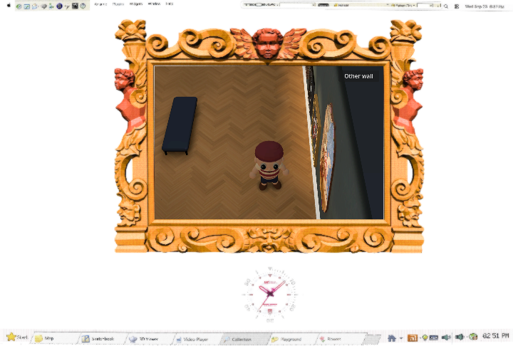
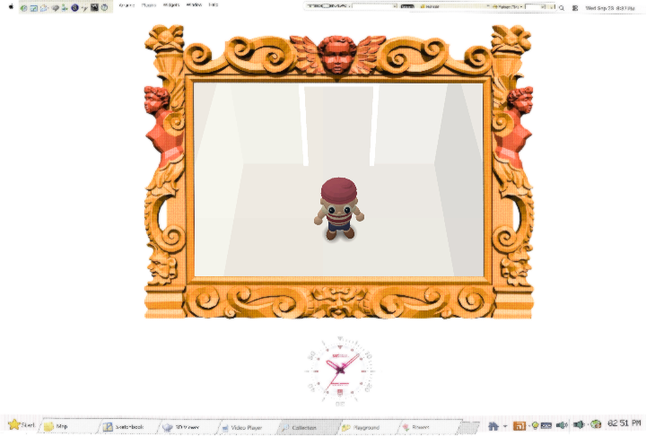

# Visitor baked-light calibration trial

The current visitor lighting remains the default. An isolated trial at `f5b9c93` (based on `1848646`) replaced the identity's boosted material colors with the original GLB colors and scaled the existing baked dynamic-object probe coefficients by 2.5 in the gallery and 1.5 in the white room. It added no runtime Light3D, ambient floor, emission, shadow, or screen effect. The experiment changed only opt-in diagnostic code; no production bake or material was committed.

Native and RTX Chrome checks at 1600 and 720 compared the same camera, position, animation phase and bone-pose hashes across 12 matched recordings. Probe-disabled samples stayed black, four held gallery crops stayed pixel-identical, and the candidate's Godot post-draw p95 did not regress. These checks establish a controlled comparison, not a visual improvement. The full candidate evidence is on `Reid-Surmeier/gallery-light-response` at `f5b9c93`.

The independent high-effort blind review saw anonymous X/Y media before the key. It preferred the candidate Y modestly in warm and cool gallery views because the cap retained form, but preferred the current X clearly in the white room because the candidate dulled skin, arms and cream sleeves. Its verdict was **no winner** under the two-scenes-without-regression gate. Key: X=current, Y=calibrated. The report is retained at `/tmp/gallery-light-blind/report.md` for this session; the source evidence branch contains the full traces. Further global probe rescaling is not justified by these images. A material/UV treatment can be tested separately without changing this default.
