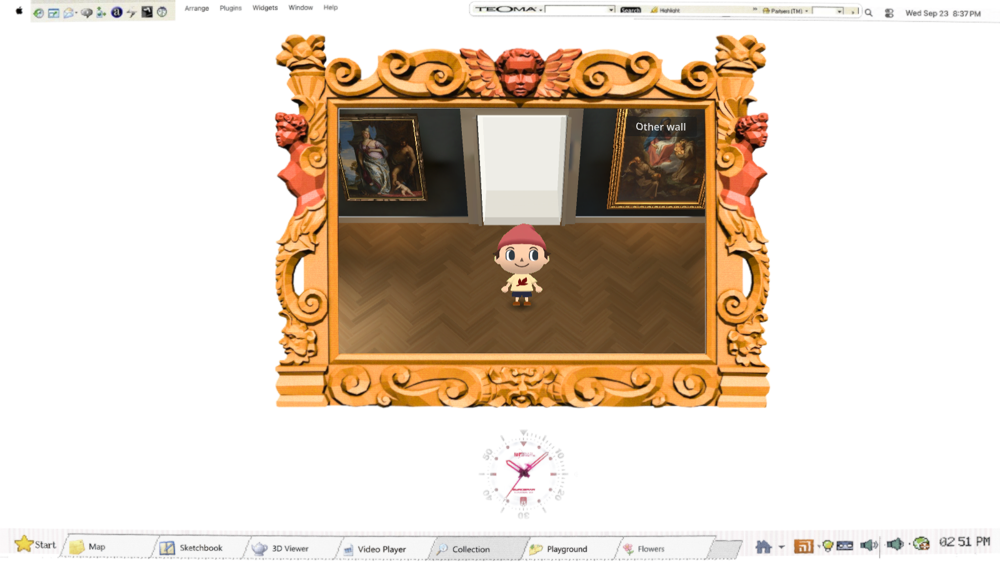

# Gallery load and actual input evidence — #137 / #141

The selected change excludes unused historical gallery prototypes from the Web game pack. All source art stays in the repository; current gallery imported resources remain byte-identical. Tab warmup and visible first-click behavior remain unchanged. The Mac M3 movement report remains unresolved; Linux input success is not owner-device acceptance.

## Before evidence and causal trace

[Fresh live baseline](../evidence/gallery-load-performance/live-cold-baseline.json) used cache-disabled Chrome on Linux/WSL NVIDIA RTX4070SUPER,1600×900,DPR1. It reached game-shown at15.921s: downloads done2.460s, Godot ready3.290s, pack mounted3.298s, game scene loaded3.449s, instanced3.546s, tabs warm14.054s. The loader's final exit consumed1.867s. Main-thread startup frames reached2166.6ms; after show, p9516.8ms and no gaps above50ms in the sampled interval.

The HTML shell starts engine initialization and game-pack download together, streams gzip decompression, preloads the game pack into the virtual filesystem, then starts the small boot scene. The boot scene mounts the pack, requests the demo scene, instantiates it, waits for the initial Collection/gallery page, and shows other tenants sequentially before returning to Collection. The loader remains over this work and then fades out. Pack mounting and scene loading are small relative to warmup in this fast-local-network baseline.

[Per-tab instrumentation](../evidence/gallery-load-performance/stage-baseline.json) separates initial gallery/launch settlement5.17s from Map1.01s, Sketchbook2.03s,3D Viewer1.40s, Video0.40s, Playground0.55s, and return0.23s. These are elapsed intervals including construction, texture uploads, shader compilation and transition/draw waits; they do not identify one GPU instruction or one constructor as the entire cause. A native headless diagnostic put gallery room construction around59ms, painting construction cumulative298ms and visitor loading cumulative541ms; that different host/rendering path is supporting evidence only, not a Web cost measurement.

Hypotheses tested: excess transferred resources; unnecessary hidden transition time; tenant construction/upload/compile costs; input loss versus rendering/pose changes. Skipping warmup was rejected because the existing first-click contract depends on it. A zero-duration hidden-fade trial shortened initial settlement but moved about2s to the final gallery return, with only roughly0.3s net warmup improvement. That mechanism was removed. The retained startup behavior matches the baseline.

## Pack result

The live670e820 baseline transferred143,481,240 bytes for its compressed game pack. The isolated cde21b9 export baseline was139,802,354 compressed bytes; compare the selected change against this same-worktree baseline, not the live build's different artifact.

Export filters exclude only `modules/shell/prototype/gallery_walk/`, `gallery_walk2/`, and `gallery_walk3/`. Production references point to `gallery_walk4`; the removed folders' references are internal historical prototype/test references. No files or generated pixels were deleted or transformed.

The [pack audit](../evidence/gallery-load-performance/pack-audit.json) records369 removed pack entries,48,447,658 uncompressed bytes. The compressed pack shrank to92,176,947 bytes:47,625,407 fewer bytes, **34.1%**. All213 imported current-gallery resources match their before-export length and stored MD5, including painting, lightmap and visitor resources. The native navigation test reports23 paintings and0 failures.

## Diagnostics and test limits

`?qa-perf=1` attaches one diagnostic node to the actual gallery. Without the flag, no diagnostic node or per-frame collection exists. It observes Godot key callbacks before consumption, held directions and position/velocity after the gallery update, actual process wall intervals, and RenderingServer post-draw intervals. It batches records every250ms into bounded browser arrays. The probe clears interval baselines while the tab is frozen so hidden time is not misreported as a simulation stall.

The production input path is DOM → Godot root input → `crt_display.gd` duplication/`Desktop.push_input` → gallery unhandled-key callback → held-direction dictionary → normalized screen-direction vector and acceleration in `_process` → camera/visitor update → render submission. Existing echo filtering, release handling, focus clearing and movement logic are unchanged.

DOM and Godot receipt share the browser performance clock for key-latency comparison. Post-draw indicates rendering submission cadence, **not GPU completion time**. Godot's video-memory monitor and Chrome's observed JS heap are partial counters, not total application/physical memory. A CPU-throttled Chrome run is a stress proxy, not Mac hardware emulation.

The runnable test is `node scripts/gallery-performance-check.cjs URL OUTPUT_JSON [CPU_RATE]`; set `NETWORK_MBIT=40` for20ms-latency/40Mbit/s transfer. It drives real first tab clicks and W→W+D→D→D+S→S, opposing-key cancellation, reversals and release. Assertions compare every non-repeat DOM transition with Godot receipt, exact held sets, actual nonzero velocity, cancellation and stopped velocity. Facing-image replacement is a separate visual defect covered by the independent reference-gap review and rig work.

First-click settled times are upper-bound observations using the existing250ms shell QA publication, plus a350ms post-settle sampling window subtracted from the reported elapsed value; they are not exact UI latency. Maximum frame gaps are reported separately. Flowers is not among the existing six warmed tab indexes and retains its pre-existing larger first-click cost; this change does not expand warmup policy.

## Final validation

Actual retained-export comparison, cache disabled, 40 Mbit/s and20ms emulated latency, Linux NVIDIA/Chrome1600×900:

| Metric | Before | After |
| --- | ---: | ---: |
| Downloads complete |37.711s|25.961s|
| Gallery visible |51.516s|39.603s|
| Warmup after scene instance |10.803s|10.690s|
| Warmed-tab first-click maximum frame gap |50–66.7ms|50ms|
| Observed peak Chrome JS heap |344,628,963B|247,593,850B|

The cold-show improvement is **11.912s /23.1% in this controlled network proxy**. The major reduction is downloading fewer bytes. These are paired controlled samples, not a statistical median or Mac benchmark. Runtime warmup cost and reported graphics memory (about1.364GB in both runs) remain substantially unchanged. First-click tenant checks pass for all seven tabs; the original warmup policy is preserved. [Before measurements](../evidence/gallery-load-performance/network-before.json), [after measurements](../evidence/gallery-load-performance/network-after.json).

The retained candidate receives14/14 key transitions with exact expected held states, opposing-key cancellation, real movement and complete stop after release. DOM→Godot receipt median2.5ms,p955.7ms. A separate4× CPU slowdown run also passes14/14, receipt p956.2ms; process intervals p9519.4ms/max23.8ms and post-draw p9519.9ms/max24.3ms. Its cold-show time is32.524s on the unthrottled local network. This is a stress proxy, not M3 performance. [CPU stress evidence](../evidence/gallery-load-performance/cpu4.json).

**A real late stall was reproduced, with a narrower cause than the owner's report.** After the first-click test visits Flowers and returns to Collection/gallery on the40Mbit/s network, the gallery remains focused and visible (active tab4). The repeated trace records a431.7ms Godot process gap from browser time50,338.4 to50,770.1ms; post-draw maximum447.7ms. Inside that interval, a374.91ms main-thread `FunctionCall` in `flowers/ruffle/core.ruffle.4592c196d36da0816efa.js` starts at50,391.97ms, immediately after `904b38d7fb3b9f71670a.wasm` completes at50,349.3ms. The next Godot `MainLoop_runner` begins at50,769.45ms. Minor GC pauses are at most1.802ms; the13.659ms full-array-buffer sweep is on a background thread. GC is not the dominant blocker in this sample.

Source inspection agrees with that trace: `flowers_embed.gd` starts Ruffle asynchronously and `flowersEmbed(null)` only hides its DOM frame; it does not cancel the pending initialization. Thus this particular stall is hidden Flowers startup consuming the main thread while the gallery is active. All14 key transitions still arrive within7ms in this trace; correctness of receipt does not prevent a visible update stall when no key happens to arrive during the blocked interval.

**This does not establish the cause of an unvisited-Flowers M3 failure.** Flowers index6 is not boot-warmed. No Flowers lifecycle change or speculative movement control was added to this ticket. #137 remains open for the owner-device case. [Aligned correlation](../evidence/gallery-load-performance/late-stall-correlation.json), [Godot/browser evidence](../evidence/gallery-load-performance/late-stall.json), [compressed Chrome trace](../evidence/gallery-load-performance/late-stall-chrome-trace.json.gz). Each measurement summary links its complete compressed raw evidence, including every retained Godot sample. Trace clock alignment pairs the first keydown dispatch and DOM capture, then relates Godot ticks to its published browser timestamp; allow a sub-ms alignment offset.

Timing from the earlier unthrottled before run that overlapped another agent's final scene was excluded from acceptance. The final network pair, CPU stress, and correlation trace ran in coordinated GPU windows.

Repository `scripts/check.sh` passes. Native navigation acceptance passed all routes/input assertions with23 paintings and0 failures. Its headless process logs resource/instance cleanup warnings; these are not a claim of clean rendered teardown. `git diff --check` and JavaScript syntax checks pass. No movement semantics, interfaces, error types, frozen acceptance tests, art, audio, bake or shader were changed.

## Review scope

Standards: changes stay within shell implementation and export/test tooling; no new module dependency or frozen seam. Spec: runtime input diagnostics and pack reduction are implemented; Mac-specific reproduction remains open. Simplicity: the ineffective fade mechanism was deleted; retained code is a single opt-in probe and one actual-export test, with no framework or dependencies added. Independent read-only peer review by the display agent found no verified runtime defect in the bounded pack exclusion or diagnostic probe. Its timing-label finding was addressed: first-click elapsed values are explicitly upper-bound observations, not exact UI latency.
