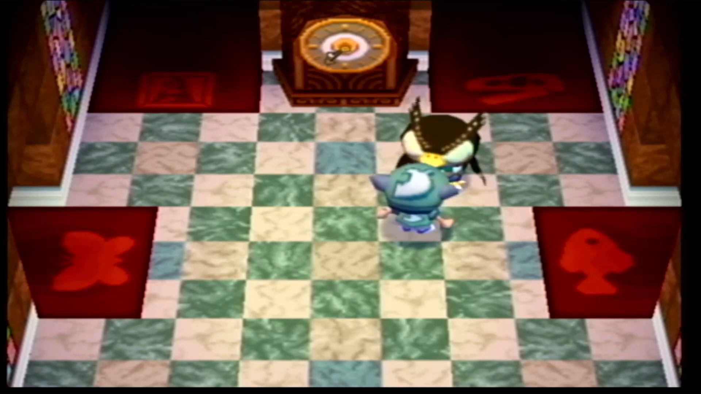

# GameCube reference rendering: evidence and bounded implementation plan

Research prerequisite for [#138](https://github.com/Reid-Surmeier/risd-godot/issues/138), under [map #116](https://github.com/Reid-Surmeier/risd-godot/issues/116), 2026-09-26. Inspected repository `bc3ed53`, exported runtime `670e820`. **The existing RGB6 shader is a useful approximation, not a verified reproduction of Animal Crossing's renderer. Do not increase grain or stack another CRT filter by default.** Establish the actual color/resolution path, then compare a few isolated display treatments in matched live motion. Character volume, contact and light response need their own work; postprocessing cannot supply them.

This investigation changes only this report. No runtime edits, new dependencies, paid generation, commits or fresh performance claims. **Source** means directly inspected code/documentation; **Observation** means inspected image evidence; **Inference** means a proposed interpretation; **Trial** means work still to implement and verify. Decompilation and Dolphin source are primary engineering evidence from those projects, not an original Nintendo renderer specification or a trace of the supplied recording.

## What the owner sees

The exact lighting reference is [To31pQwX1lI at 57:32](https://www.youtube.com/watch?v=To31pQwX1lI&t=3452s). Existing [frame provenance](gallery-final-render-overlay/evidence.json) records the stream-copy extraction, times and SHA256s: the upload is AVC 1920×1080, 30 fps. Those properties do not establish native game resolution, game tick rate, console versus emulator, output cable, deinterlacer or capture sharpening. None of that capture setup was documented in the inspected metadata. The [house video](https://www.youtube.com/watch?v=EwwW4Rk1wMU) and the owner's [house screenshot](animal-crossing-reference-composition/reference-viewport.png) are separate evidence; the screenshot's play button obscures part of the player, and its exact source timestamp is unverified.

| Inspected evidence | Direct observation | Rendering implication — inference, not a hardware finding |
| --- | --- | --- |
| [Museum 57:32](gallery-final-render-overlay/video-3452.png) | Ivory trim stays bright; central tiles are warm; peripheral tiles differ in hue; cloth/wood have broad motifs; character/contact regions have compact dark shapes. High-contrast edges are soft. | Spatial lighting and large painted motifs dominate. A uniform orange tint or full-screen bloom cannot recreate their placement. |
| [House screenshot](animal-crossing-reference-composition/reference-viewport.png) | Rounded toy silhouettes, broad color blocks, bright window patches and muted shaded faces; texture motifs are legible at room scale. | Preserve material hierarchy and lit/shaded face separation. More fine noise does not make dense wood grain into these larger motifs. |
| [Shop 30:00](gallery-final-render-overlay/video-1800.png), [UI 80:00](gallery-final-render-overlay/video-4800.png), [dark scene 110:00](gallery-final-render-overlay/video-6600.png) | Warm floor contrasts with dark undersides; white UI remains bright; black backgrounds remain dark. No dominant phosphor grille or large checker is established by these samples. | Protect whites, blacks and local contrast. The samples support gentle softness, not a mandatory strong scanline mask. |
| [Exterior 59:00](gallery-final-render-overlay/video-3540.png), [61:00](gallery-final-render-overlay/video-3660.png) | Moving figures have comb-like bands; another frame contains a broad horizontal discontinuity. | Consistent with interlace/capture/tearing contamination. The precise cause is unknown. Do not recreate it as walking animation, material noise or camera jitter. |
| [Current exported gallery](../evidence/gallery-final-refinement/browser-1600.png), owner's local `Screenshot 2026-09-26 at 9.49.53 PM.png` | Gallery whites and floor pools remain readable. The close-up shows the red-cap figure with a broad smooth hat gradient, largely flat shirt and limbs, and a contact patch over comparatively dense diagonal wood grain. | Volume, environment response and material frequency are more consequential than a stronger final checker. A still cannot establish motion/contact correctness; use the live gate below. |

The local owner screenshot is at `/home/reidsurmeier/risd-godot/.orca/drops/Screenshot 2026-09-26 at 9.49.53 PM.png`; it was inspected directly, not regenerated. The previous scoped review retained a small lighting change; that verdict does **not** establish owner acceptance of the character or a Nintendo match. Current #138 explicitly prioritizes correct 3D movement/lighting over retaining the sprite design. Hold one character version fixed only while comparing display shaders.

An independent reviewer, before reading this report, captured the live owner share at runtime `670e820` (`/tmp/gallery-blind-current/wasd-orbit.webm`, 298 frames, about 9.93 seconds). They reported a persistent sole/contact-core gap and a single-recorded-frame back/front switch on W→S reversal without an intermediate silhouette. Their material finding was denser parquet grain than the broad reference motifs; the capture does not isolate authored material from display filtering. They found no controlled evidence for more global blur/noise and require later A/B comparisons to preserve small artwork and white edges. These are attributed review findings, not an additional motion certification by this report's author.

## What the original rendering path establishes

### Pixel format and dither

**Source:** `JW_Init` constructs the display with alpha enabled. `JFWDisplay::preGX` selects RGBA6/Z24 with dither for the non-AA alpha path, RGB8/Z24 without dither when alpha is disabled, or RGB565/Z16 for AA. Thus six-bit RGB is supported for the normal traced AC path, not a universal property of every GameCube draw or mode. [AC initialization](https://github.com/ACreTeam/ac-decomp/blob/09ca8e8b5b24e6ab44047ee980cf0088ad7ecb4c/src/static/jsyswrap.cpp), [display format selection](https://github.com/ACreTeam/ac-decomp/blob/09ca8e8b5b24e6ab44047ee980cf0088ad7ecb4c/src/static/JSystem/JFramework/JFWDisplay.cpp).

**Source:** Dolphin's pixel shader generator applies a 2×2 parity dither to integer fragment color before fog, output conversion and blending. Its six-bit color output shifts the result by two bits and normalizes by 63; framebuffer alpha and blending alpha have distinct handling. This is a per-fragment/EFB operation, not merely an overlay applied after a completed modern frame. The same arithmetic on a different stage is not equivalent. [Pinned Dolphin pixel shader implementation](https://github.com/dolphin-emu/dolphin/blob/465c652da1dc0b3048089701a1885084821c9574/Source/Core/VideoCommon/PixelShaderGen.cpp).

**Consequence:** the hardware dither pattern is tied to raster coordinates. A moving surface passes through those threshold phases even without a time uniform. An absolutely surface-attached grain pattern is a different artistic goal. Favor the owner's stable-motion constraint if a more literal hardware approximation creates visible crawl; do not quietly redefine authenticity as world-space noise.

### Display copy, gamma and resolution

**Source:** the inspected AC interlaced mode declares a 640×480 framebuffer and seven coefficients `{8,8,10,12,10,8,8}`; the progressive mode uses `{0,0,21,22,21,0,0}`. Selection depends on the progressive-mode state. Initialization selects gamma enum zero, whose definition is 1.0. Neither an uploaded 1080p frame nor general nostalgia justifies a gamma-2.2 effect. [AC mode declarations and initialization](https://github.com/ACreTeam/ac-decomp/blob/09ca8e8b5b24e6ab44047ee980cf0088ad7ecb4c/src/static/jsyswrap.cpp), [gamma enum](https://github.com/ACreTeam/ac-decomp/blob/09ca8e8b5b24e6ab44047ee980cf0088ad7ecb4c/include/dolphin/gx/GXEnum.h).

**Source:** Dolphin groups coefficients 0–1, 2–4 and 5–6 into previous/current/next rows. These modes yield **¼–½–¼** and **0–1–0**, respectively. [Coefficient grouping](https://github.com/dolphin-emu/dolphin/blob/465c652da1dc0b3048089701a1885084821c9574/Source/Core/VideoCommon/TextureCacheBase.cpp#L1945-L1955).

**Source:** the copy shader expands the EFB format, filters integer RGB rows, divides by 64 with integer truncation, then optionally performs gamma and YUV conversion. Alpha is not vertically filtered. RGB6 expansion replicates bits into an eight-bit code; a normalized float filter is close but not identical. This ordering is stronger evidence than a generic CRT preset. [Dolphin copy implementation](https://github.com/dolphin-emu/dolphin/blob/465c652da1dc0b3048089701a1885084821c9574/Source/Core/VideoCommon/TextureConversionShader.cpp).

**Inference:** softness in the video can combine game texture filtering, EFB copy, analogue transfer, rescaling, deinterlacing and compression. These cannot be uniquely separated from the available upload. Do not infer a strong vertical copy filter merely because the recording is soft; the progressive configuration has no neighboring-row contribution. Do not force the gallery camera to 4:3 merely to make its pixel dimensions match.

### Texture filtering, normals and character light

**Source:** AC's `emu64` texture adapter creates ordinary and indexed textures with mipmapping disabled. Selected render/debug modes override filtering to nearest; other paths retain initialization defaults. The GX initializer sets linear minification/magnification for the non-mipmapped default. This supports filtered low-resolution texture art, with explicit exceptions, rather than blanket nearest sampling or a modern mip chain. [Texture adapter](https://github.com/ACreTeam/ac-decomp/blob/09ca8e8b5b24e6ab44047ee980cf0088ad7ecb4c/src/static/libforest/emu64/emu64.c), [GX texture initialization](https://github.com/ACreTeam/ac-decomp/blob/09ca8e8b5b24e6ab44047ee980cf0088ad7ecb4c/src/static/dolphin/gx/GXTexture.c).

**Source:** the same adapter can submit vertex normals, ambient color and GX lights with clamped diffuse response; its alternative unlit path uses vertex color. Vertex normals are not evidence of normal-map textures. [Lighting setup in the adapter](https://github.com/ACreTeam/ac-decomp/blob/09ca8e8b5b24e6ab44047ee980cf0088ad7ecb4c/src/static/libforest/emu64/emu64.c).

**Source:** the player draw route selects textured lighting, draws a skeleton, rotates the head through callbacks and supplies eye/mouth textures. The environment code selects room-specific base lighting, including museum picture/fossil/fish variants, and includes diffuse/fog/day/weather changes. Therefore “everything is an unlit mesh with shadows baked into its color texture” is not an adequate description. These functions do not prove which individual visible shadow in the reference is baked. [Player rendering](https://github.com/ACreTeam/ac-decomp/blob/09ca8e8b5b24e6ab44047ee980cf0088ad7ecb4c/src/game/m_player_draw.c_inc), [environment lighting](https://github.com/ACreTeam/ac-decomp/blob/09ca8e8b5b24e6ab44047ee980cf0088ad7ecb4c/src/game/m_kankyo.c).

**Translation for this project:** retain offline room lighting because the measured browser constraint excludes real-time Light3D/shadows. A future 3D visitor can use normals plus a small authored or baked spatial light field and contact treatment. That is separate character/material work, not a final-screen tint. A normal-map generator is not a prerequisite demonstrated by these sources.

## Actual baseline pipeline and its limits

The older report describes some pre-implementation behavior; this table supersedes that description for runtime `670e820`.

| Stage | Current source evidence | Consequence |
| --- | --- | --- |
| Room rendering | [`walk4.gd`](../../modules/shell/prototype/gallery_walk4/walk4.gd) builds a separate 3D viewport with 2× MSAA and baked room lighting. [`oak.gdshader`](../../modules/shell/prototype/gallery_walk4/oak.gdshader) uses linear mipmaps, a doubled derivative footprint and 60% grain over ground tone. | Modern raster/lighting plus deliberately quieted wood. Mips are a stability concession, not proof of native AC behavior. Removing them could restore crawl rather than improve the reference match. |
| Visitor rendering | [`visitor.gdshader`](../../modules/shell/prototype/gallery_walk4/visitor.gdshader) is an upright camera-facing, unshaded quad with linearly sampled keyed image frames. | The figure cannot respond to room illumination or expose new side geometry through an overlay. Keep it fixed for a shader experiment; replace through the separate character investigation. |
| Internal resolution | `LOW_RES=(480,320)`, but resize uses only `round(container_width/480)` as the integer `stretch_shrink`. | Actual viewport dimensions vary with window size and divisor thresholds; 320 is not a fixed framebuffer height. Log `_vp.size`, container rect and device pixel ratio in each capture. [Godot container behavior](https://docs.godotengine.org/en/stable/classes/class_subviewportcontainer.html). |
| Gallery finish | [`gamecube.gdshader`](../../modules/shell/prototype/gallery_walk4/gamecube.gdshader) fetches eight native texels, RGB6-quantizes them, blends vertical rows at `copy_filter=.5`, then bilinearly reconstructs. | Order is better than quantizing after enlargement, but input is already shaded, composited and MSAA-resolved. Half strength gives ⅛–¾–⅛, an artistic compromise, not either traced AC mode. Alpha is only reconstructed. Copy integer expansion/truncation and capture conversion are not emulated. |
| Shell finish | [`crt_luminance.gdshader`](../../modules/shell/crt_luminance.gdshader) directly samples the gallery inside its mapped quiet rectangle; [`haze_screen.gdshader`](../../modules/shell/haze_screen.gdshader) also bypasses the region. Shell curvature remains. [`crt_display.gd`](../../modules/shell/crt_display.gd) refreshes the exclusion mapping each frame. | The gallery no longer receives the outer mask, channel split or diffusion. Do not add those again without a specific reference hypothesis. Curvature/input and exclusion-edge regressions still require browser checks. |

**Color-space caveat:** Godot documents Compatibility output as sRGB. Its inspected GLES3 scene source converts material color to linear for shading and back to sRGB for the base-pass framebuffer. This is a modern pipeline, not evidence that the GameCube performs the same transfer operations. The source inspected is Godot 4.5; this project ran 4.7.2, so confirm with a real 3D chart on the installed version before changing transfer functions. A second manual sRGB conversion in the canvas pass could be wrong. [Godot spatial output contract](https://docs.godotengine.org/en/stable/tutorials/shaders/shader_reference/spatial_shader.html), [GLES3 source](https://github.com/godotengine/godot/blob/4.5/drivers/gles3/shaders/scene.glsl).

The existing [GPU check](../../modules/shell/prototype/gallery_walk4/final_render_check.gd) verifies the implemented arithmetic against a CPU version and verifies quiet-region bypass. Its texture test does **not** establish the preceding 3D color path or authenticity. Previous [browser evidence](../evidence/gallery-final-refinement/README.md) establishes that build's navigation and measured speed, not a newly tested candidate. Also, `?final_render=original` selects the older quantizer; it is **not** an effect-free control.

## Reusable Godot options checked first

These were inspected, not installed or performance-certified. A Compatibility canvas shader is viable here; a plugin requiring a compute/compositor or normal-roughness screen buffer is not a drop-in for the web renderer. Godot's renderer feature table documents those differences. [Renderer support](https://docs.godotengine.org/en/stable/tutorials/rendering/renderers.html).

| Primary project / license | Useful capability and Compatibility evidence | Decision |
| --- | --- | --- |
| [Existing Harrison Allen luminance CRT](https://godotshaders.com/shader/crt-with-luminance-preservation-no-scanlines/), CC0 | Canvas texture reconstruction/curve; code already adapted and exercised in this repo. | Keep shell behavior. It models a display, not AC geometry or EFB storage. |
| [Ultimate Retro Shader Collection](https://github.com/Zorochase/ultimate-retro-shader-collection), MIT | Author states all rendering backends; includes a CanvasItem dither shader, but collection chiefly targets PSX/Saturn/N64 traits and introduces globals. | Possible generic test control only. Vertex snapping, affine warping and N64 three-point filtering are not a justified GameCube preset. |
| [Flowerwall CRT](https://github.com/art-oria/Flowerwall-CRT-shader-for-Godot), MIT | Author documents Godot 4.6/all renderers, global canvas overlay and `canvas_items` stretch setup. | Credible standalone CRT option, unnecessary duplicate stack here. Claim not locally benchmarked. |
| [TSUISHI CRTshader](https://github.com/TSUISHI/CRTshader), MIT | Canvas signal/display stages with 17-tap reconstruction and selectable analogue effects. | A capture-chain experiment only after such a target is established; jitter/noise/crawl contradict current acceptance. Not locally tested. |
| [Dither3D-Godot](https://github.com/tufourn/Dither3D-Godot), MIT wrapper, credits MPL-2.0 original technique | Surface-stable fractal dither uses material/light processing and 3D textures; author requires ambient light disabled. No local Compatibility certification. | Different visual technique and lighting contract; not the GX raster Bayer pattern and not a drop-in for baked room lighting. Do not adopt solely for “stable” in its name. |

No inspected package supplies a verified Animal Crossing renderer. Reuse the small current pass unless a measured defect specifically requires another implementation; do not replace it with a large “retro” preset.

## Implementation plan for the overnight run

All items below are **trials**, not results. Keep museum geometry, artwork, room bake, camera, actor version and animation clock identical within every display A/B. Character rebuilding can proceed separately, then repeat the selected display comparison on that integrated result.

1. **Establish controls before another aesthetic edit.** Add a diagnostic bypass that samples native viewport color with the same reconstruction and keeps the same shell exclusion; label it distinct from `original`. Log actual framebuffer dimensions, MSAA, final mode, render backend, browser size and source commit. Use a real 3D neutral/colored card scene with both lit and unlit patches, neutral white-room capture and gallery capture. Confirm no accidental transfer conversion before tuning gamma. Preserve the current runtime as one named baseline.
2. **Test one display question at a time.** At the same fixed internal dimensions, compare current `.5` copy strength against `0` and `1`; keep dither unchanged. If no preference survives moving comparisons, retain the baseline. Next, and only if visible grain/banding remains a documented defect, compare RGB6 with/without raster dither against bypass using that chosen filter. Six-bit no-dither must use an explicitly defined plain quantizer, not the dither's bias correction with the Bayer term merely set to zero. Do not add arbitrary noise amplitude, scanlines, vignette, chromatic split or a LUT.
3. **Separate arithmetic fidelity from visual benefit.** An optional integer EFB-copy expansion/truncation variant is source-justified, but sub-code-value changes may be invisible. Verify it on a chart and accept only if it also improves the actual view. Exact per-fragment EFB behavior would require a deeper renderer/material change; do not claim a final-image pass reproduces it. Do not attempt that rewrite overnight without a separate scope decision.
4. **Change resolution or material sampling only on evidence.** If the dominant remaining defect is edge softness or window-dependent pixel density, compare the current dimensions with a fixed vertical resolution at the same aspect/camera. Record the performance cost. If the defect is wood frequency, compare source sampling in the material with the finish held fixed; never hide it by blurring paintings and the visitor. Keep mips unless a moving comparison proves their removal preferable.
5. **Integrate only a demonstrated gain.** Export the selected candidate; capture the matched live path at 1600px and 720px, then obtain independent blind review. Run the existing native/rendered/browser suites. Record rejected alternatives and reasons. After two consecutive rounds without a clear improvement, stop display tuning and report the unresolved material/character issue instead of producing more filters.

## Falsifiable acceptance, beyond a still and a formula check

These are proposed gates for #138; numerical tolerances are engineering choices, not Nintendo specifications.

| Check | Reproducible procedure | Pass / reject |
| --- | --- | --- |
| Color path and endpoints | Render the 3D card through the actual Compatibility viewport and through final export. Include pure white/black, 25/50/75% neutral, warm ivory and saturated patches. Compare interior pixels against the declared transfer/quantizer reference. | Endpoints within one 8-bit code; monotonic neutral ramp; no unplanned channel separation, double-gamma or clipping. A 2D texture-only test cannot satisfy this gate. |
| Static stability | Freeze camera, simulation and actor frame; capture the same wall/floor/white patches at separated wall-clock times. Exclude cursor/UI. | No change beyond one 8-bit code in these fixed patches. This rejects animated finish, but does not alone certify walking stability. |
| Moving surface stability | Replay a fixed 20-second path: enter, walk across warm/cool floor, stop, turn, approach each wall, enter/exit a white room. Save camera transforms, frame times and inputs. Compare native-size moving video; register planar wall/floor patches using the recorded camera/plane mapping before computing temporal residuals. | No new visible crawling grid, rippling grain or discontinuity versus baseline. Registered residual should not worsen by more than one output code RMS on the selected static surfaces; inspect the video even if this backstop passes. Comparing an unchanged screen rectangle while the world moves is not a valid stability metric. |
| Blind visual preference | Randomly label baseline/candidate. Show uncompressed crops plus matched full-speed motion for doorway whites, warm floor/wall and artwork detail at identical display sizes. Give the reviewer the references and ask for concrete defects before revealing modes. | Candidate improves the named defect in at least two of three scenes, with no new lost art detail, muddy whites or motion crawl. “Both fine” is not evidence to replace the baseline. Still-only review cannot approve this gate. |
| Integrated behavior and cost | Run `scripts/check.sh`, `scripts/check-gallery.sh` on Compatibility, then `scripts/gallery-browser-check.cjs` on the exported candidate against recorded baseline. Include both window sizes and curved quiet-region edges. | Existing navigation/art checks pass; no new runtime errors; no more than 10% median/p95 frame-time regression on the same machine/path. Earlier 16.7ms measurements are baseline evidence, not a promise for new shaders. |

Character evaluation must additionally inspect a real turn, head/hand movement, planted-foot contact, occlusion and changes in illumination along the path. A finish may make edges similar while all of those remain wrong. Assess the final integrated 3D candidate against the owner reference; do not let retained sprite hashes or the previous scoped “DONE” override #138's changed acceptance.

**Decision supported now:** keep the current finish as a control, verify the 3D color/resolution path, and run bounded filter/dither comparisons. The reference supports filtered color, low-frequency texture art, spatial light and a volumetric animated player. It does not establish a need for stronger visible checkerboard, normal-map generation, screen grain or a second CRT overlay.
