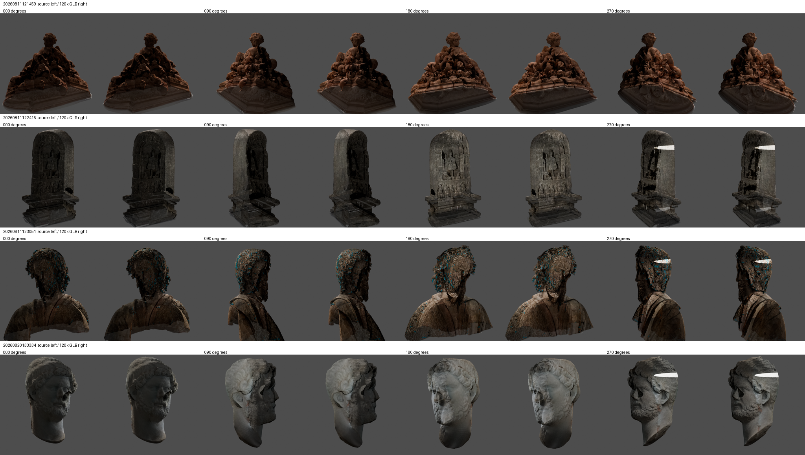
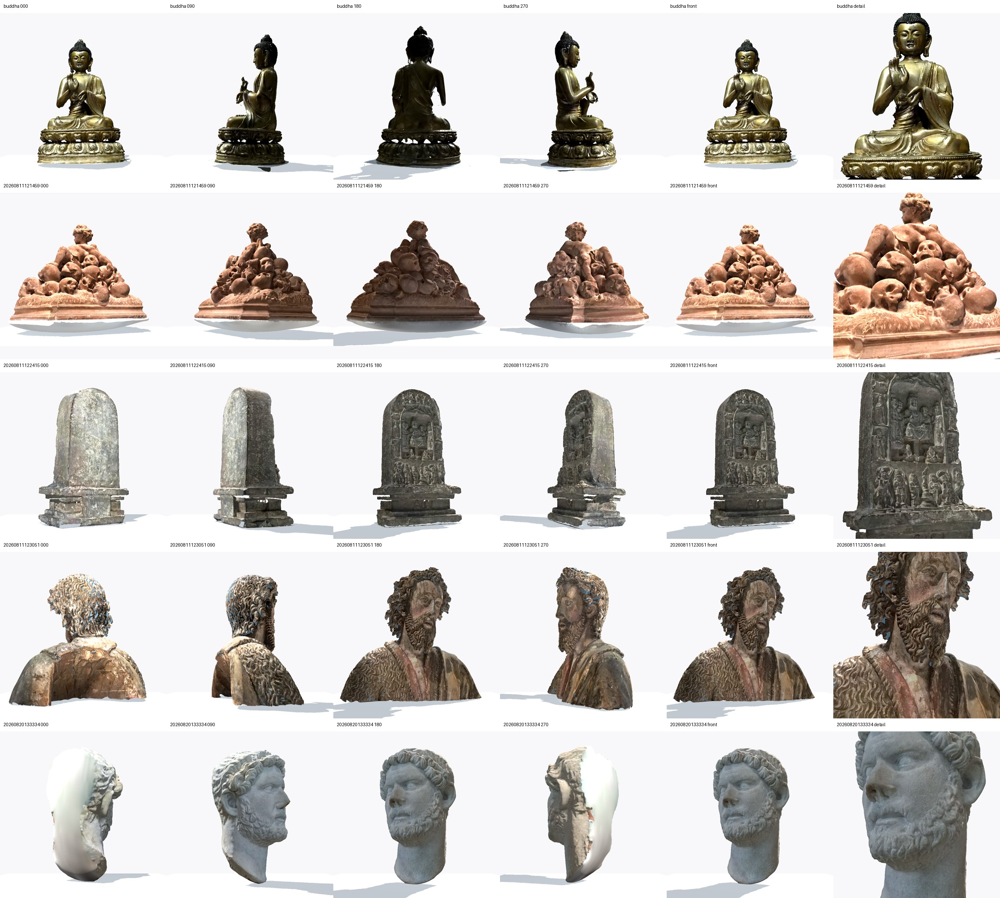
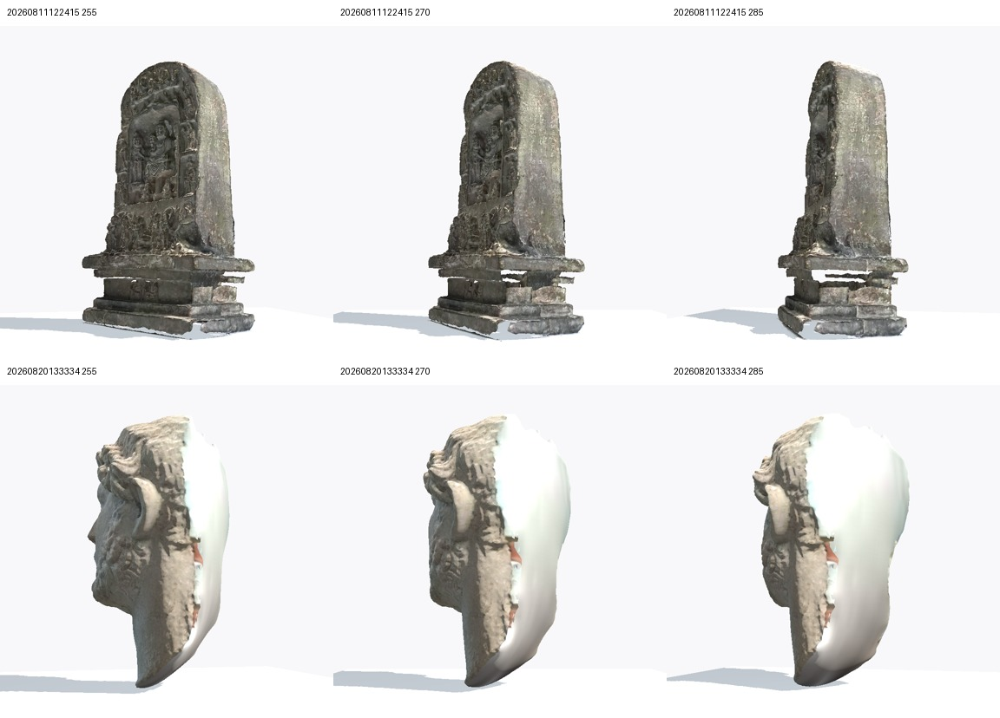
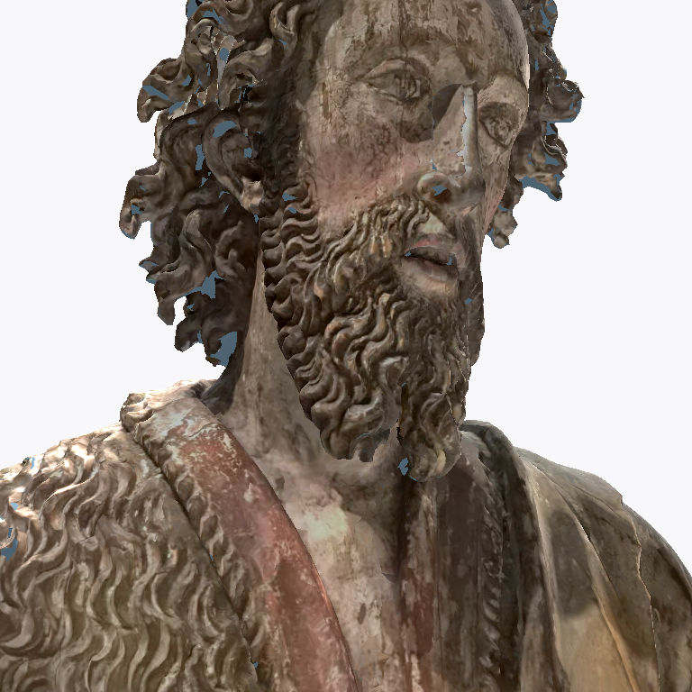
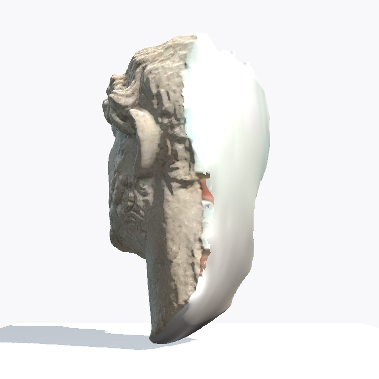
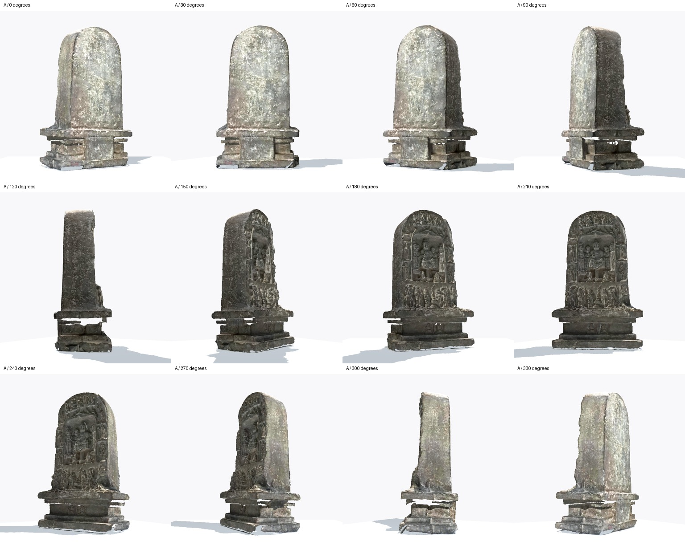

# Proton scan candidate audit — Issue #154

27 September 2026. [Issue #154](https://github.com/Reid-Surmeier/risd-godot/issues/154) asks for verification of four source triplets and their existing GLBs. [Map #149](https://github.com/Reid-Surmeier/risd-godot/issues/149) calls for four live scans and sixteen thumbnail-only entries in a 5×4 catalogue. No candidate was regenerated or moved into the game.

## Result

All four local OBJ/MTL/JPG triplets match their recorded SHA-256 hashes. Their selected GLBs match the manifests, carry 119,999–120,000 triangles and an embedded JPEG Base Color texture, and import through Godot 4.7.2 as one textured mesh. Existing source/reduced captures show no obvious decimation loss at four angles. None needs reconversion for polygon count or material preservation.

The candidates are **not visually accepted in the game**. Matched Godot captures and material diagnostics now exist below. Two remain eligible only for diagnostic Viewer prototypes; the bearded and pale busts have source-present defects that survive an opaque material. Human object identities and departments remain unverified. The final follow-up supersedes the initial orientation and thumbnail proposal below.



The sheet uses 32 existing 512×512 Blender renders in the four manifests. Every render hash was independently recomputed. The [Buddha Godot capture](../evidence/sculpture-viewer/01-viewer.png) is a visual baseline, but its lighting/framing differ; this comparison cannot prove in-game parity.

## Local files and hashes

Sources are at /home/reidsurmeier/risd-godot-ingestion/proton/<ID>/<ID>.obj, .mtl and .jpg. Selected GLBs and manifests are in each ID's candidate-120k directory, except 20260811121459/candidate-120k-rerun and 20260820133334/prototype. The original first 20260811121459 candidate also passes structural checks, but has a different GLB hash (cac3f6f0a7e02d79c7666ad68344331d97bb800a0d80ee31d3c4f4e0f8a73839). The rerun hash is the explicit choice here.

| Source ID | OBJ SHA-256 | MTL SHA-256 | JPG SHA-256 |
| --- | --- | --- | --- |
| 20260811121459 | ccb7bf5347add65d7c152e2675f7565e97d879b6cc0be9414c4ddc1f2766e4ed | 3b86d45f9070e7e90ad0a07b7e7869b956a2212f8fb1737dee73eca8a34ed61b | 08e09af5f7560322ed86d1f6d5c27cad78a49fde19ee11a2254e2ced7e371bf9 |
| 20260811122415 | 9f5fda816915b8e02620f64da22450158f683b05e24014fde9732141416f1d48 | d1bea301850754678ffb2a297411fd6d75c062fc1fcbd1a498d6ed0b12554557 | 61914b89aa686765d9cf92ce994b66193d42e4e3493e3a4e467278887af2b2ea |
| 20260811123051 | bd8b66a479d9f7c6dacbb36cd3b2db4c081f01af0f1fff77685a8196a55a6a71 | 7363cb9574afed80bb8ae95c7f312f11064369544201e0bb2dfa529529c37ea6 | fb25726c8e7c2ceda0c007d6e30e183989c020a0524b8a60ee159a5b7da3162c |
| 20260820133334 | af49afcfecff54f7715b3c15872252e96cfb51c8d8eca48755f8a080db913f1e | 4b1479cd567f2aeb354b06c4c36f3c148d4b920a52a6141f6879b35a733f3265 | 95c778b9c52f8eaa73e89aa3b1f72c34b37026dceb3583b99a436b8bf036e8ab |

Every 104-byte MTL declares _texture and map_Kd <ID>.jpg. [Earlier read-only Proton inventory](https://github.com/Reid-Surmeier/risd-godot/blob/de67e90fd80e7faaa85df2526fa42027cc32cb74/docs/research/painting-and-proton-sources.md) recorded matching cloud sizes; this audit did **not** re-query cloud revisions. This check proves local-byte-to-manifest integrity. All recorded source, GLB and render hashes were recomputed.

| Source ID | Selected GLB SHA-256 | Bytes | Triangles | Godot AABB size X/Y/Z | Embedded JPEG |
| --- | --- | ---: | ---: | --- | --- |
| 20260811121459 | 86c2c80bc05489b12bec1a03216d8765c66baaf3f8f89cf1f018004cba152193 | 4,785,248 | 119,999 | 4.502 / 3.733 / 4.109 | 2048×1960 |
| 20260811122415 | da7480355f1c384ed8588e44cd2f1bf9c666d03c2bd7a9017f958f3d5ee08a41 | 4,822,044 | 119,999 | 2.962 / 4.500 / 2.631 | 2048×1989 |
| 20260811123051 | faaece8dd2b1b25f6d2a7d96671db37ea810ede3bdc5441099f18f96ffc50d74 | 5,596,984 | 119,999 | 4.499 / 4.345 / 2.813 | 2048×1962 |
| 20260820133334 | 94e634a0554b6925fe26be4bbe5b3df2e53a19088883e733f4f9bcffed626d9e | 4,239,608 | 120,000 | 2.574 / 4.500 / 2.536 | 2048×2012 |

Parsing each GLB header and JSON/BIN chunks found one indexed triangle primitive with POSITION and UV attributes. Counts above are index accessor counts divided by three. The one buffer has no external URI; image 0 has bufferView 4, image/jpeg and no URI; material Base Color texture 0 resolves through texture 0 to image 0. These fields prove the GLB embeds its texture. The [glTF specification](https://registry.khronos.org/glTF/specs/2.0/glTF-2.0.html) defines those structures, Y-up coordinates and meter units. The embedded JPEG is resized, so it is not byte-identical to the source JPG.

A separate temporary project used Godot 4.7.2 [GLTFDocument.append_from_file and generate_scene](https://docs.godotengine.org/en/stable/classes/class_gltfdocument.html) on each GLB. All four returned OK and produced one MeshInstance3D, one surface, an active material and a non-null albedo texture at the dimensions above. This does not exercise the actual game viewer, export or network loading. The [current viewer loader](../../modules/sculpture_viewer/viewer.gd) still hardcodes Buddha and its separate JPG. The shipped Buddha GLB hashes 3944df2113c8f642a103e3609d9a6f92671ca5e2ea59d69616521a975ab273e9, matching [module provenance](../../modules/sculpture_viewer/PROVENANCE.md).

## Orientation and visual quality

All candidate node transforms are identity, Y is vertical and the lowest Y is about zero. The converter's 4.5-unit target is the **longest extent**, not always height. At 0°, 20260811121459 shows the back of a sculptural group and 20260811123051 shows the back of a bust; recognizable fronts are near 180°. The relief in 20260811122415 is visible at 0°, and 20260820133334 gives a usable three-quarter front at 0°. A per-model yaw is needed before first-row use. This can be a viewer setting without changing the GLBs.

Source/reduced pairs retain silhouettes and material appearance at all four angles. Normalized RGB RMSE across 0°, 90°, 180° and 270° is 0.00759–0.00837, 0.00490–0.00759, 0.01267–0.01570 and 0.00498–0.00769 in table order. The third scan has conspicuous cyan flecks and missing lower-body areas in **both** source and reduced renders. The second and fourth show bright white wedges at 270° in **both**. These are source-present artifacts, not evidence of decimation failure. All four are darker than the Buddha baseline. Comparable in-game captures, framing, lighting and owner visual acceptance remain open.

## Identity, department and sixteen thumbnails

The four stable technical identities are proton-scan:<ID>. Files and manifests contain no museum accession, human title or department. The [old viewer capture](../evidence/sculpture-viewer/01-viewer.png) includes visually similar labels “Child with Skulls”, “Seated Figure Relief”, “Bearded Figure Bust” and “Seated Marble Figure”; resemblance does **not** establish a file-to-record link. [Prototype #81](https://github.com/Reid-Surmeier/risd-godot/issues/81) also kept 20260820133334 provisional. Use Scan <ID> until an authoritative museum record links each file to a title and department.

The current [panel](../../modules/sculpture_viewer/assets/setup/panel-2x.png) is a single 40-item raster (SHA-256 d6cdb4c2c3ff042ea3380868184d297ea608f733bd377723cc71fd792f5b99d5). The [desktop](../../modules/sculpture_viewer/desktop.gd) overlays hover art on 18 cells, but has no per-item ID, department, separate thumbnail path or 5×4 selection. To identify sixteen specific image-only candidates without inventing museum metadata, use original panel cells **5–17 and 19–21**: bust, bowl, bull, pale bowl, dark curved object, colored bust, standing figure, guardian lion, small dark figure, rider, dancing figure, standing figure, terracotta figure, mask, blue stone and bird. These descriptions identify the pixels, not museum objects. Cell 18 depicts the existing live Buddha, so classifying it “3D unavailable” would be false.

That list is a **provisional selection from the panel**, not an accepted catalogue order or verified metadata inventory. Four truthful scan thumbnails, Buddha placement, the final sixteen picks and any displayed museum names/departments still need a content decision. The raster itself cannot serve as sixteen independently selectable catalogue records.

## Remaining checks before closing #154

1. Capture all four GLBs in the actual Godot 4.7.2 viewer beside Buddha at matched camera/light settings. Inspect front, side and back; record yaw and framing.
2. Link each scan ID and chosen thumbnail to an authoritative collection record if a human title or department is displayed. Otherwise retain provisional names and no department.
3. Resolve the final sixteen thumbnail-only entries and Buddha placement, then verify real 5×4 rows.

No paid action, source modification or candidate regeneration occurred. The large source and GLB files stay outside the repository; this report and sheet are review evidence.

## Verification record

Local audit: Python SHA-256 of all twelve sources, five candidate GLBs, five manifests' listed outputs and forty source/reduced render paths; glTF JSON/BIN inspection; normalized RGB RMSE of the captured pairs; Godot 4.7.2 headless GLTFDocument scene/material probe. The first scripts/check.sh invocation failed because this fresh worktree lacked generated Godot resource imports; godot --headless --editor --import --path . exited 0, then scripts/check.sh exited 0 with “checks passed” and an ObjectDB leak warning. git diff --check exited 0. No runtime assets were changed.

## Matched Godot Compatibility comparison — follow-up

The [scratch Godot harness](proton-scan-validation/capture.gd) loads the four selected GLBs with `GLTFDocument.append_from_file` and `generate_scene`, retaining each candidate's embedded material and JPEG. It loads the Buddha GLB and applies the shipped separate JPG and material settings used by `viewer.gd`. All five use the Viewer's background, ambient/key/fill light, floor, 36° perspective field of view and −8° camera pitch. The harness normalizes each longest AABB extent to 4.5 units, centers it horizontally, places its bottom at Y=0 and targets half its resulting height. Full views use camera distance 8.7; detail views use 5.2. It saves 768×768 images through Godot's Compatibility renderer.



The [individual PNG captures](proton-scan-validation/godot-captures/) include 0°/90°/180°/270°, selected front and close detail for every object (30 images). The selected front is the camera's world yaw with an unrotated GLB. The previous Blender orbit labels cannot be used as Godot front yaw: their apparent front/back differs for 20260811121459 and 20260811122415. The table below comes from inspecting the Godot images. All four selected GLB SHA-256 values remain those in the table above; all twelve OBJ/MTL/JPG source hashes were recomputed and still match the table above. No GLB or source file was changed.

| Object | Godot front camera yaw | AABB scale to 4.5 max | Target Y | Full / detail distance | Viewer's model yaw for its −132.48° default camera |
| --- | ---: | ---: | ---: | ---: | ---: |
| Buddha baseline | 0° | 1.000000 | 2.250 | 8.7 / 5.2 | existing −144° is an 11.52° three-quarter view |
| 20260811121459 group/skulls | 0° | 0.999656 | 1.866 | 8.7 / 5.2 | −132.48° |
| 20260811122415 relief | 180° | 1.000090 | 2.250 | 8.7 / 5.2 | 47.52° |
| 20260811123051 bearded bust | 180° | 1.000178 | 2.173 | 8.7 / 5.2 | 47.52° |
| 20260820133334 pale bust | 180° | 0.999961 | 2.250 | 8.7 / 5.2 | 47.52° |

Those model-yaw values translate the inspected camera direction into the current Viewer's fixed default camera: `model yaw = −132.48° − front camera yaw`, wrapped to ±180°. They are trial starting values, not settings committed to the Viewer. The first scan is broad and therefore shorter in frame despite the same longest-extent scale. Its child is most legible among the skulls at 0°, although the child's face is in profile; a final three-quarter choice remains visual judgment. The relief and both busts face the camera at 180°. Full distance 8.7 keeps all silhouettes in frame; detail distance 5.2 intentionally crops them. A future Viewer needs per-scan camera target Y as well as yaw if it keeps the current fixed 2.25 target.



The pale bust's large smooth white rear fill is present at **255°, 270° and 285°**, so changing the orbit angle near 270° does not hide it. It is on the selected GLB with its embedded texture under Godot lighting; the earlier source/reduced Blender sheet also shows a white 270° wedge in both, so this is not evidence of a reduction-only defect. In the relief's Godot 255°/270°/285° captures, the earlier conspicuous white wedge is not visible at this scale; pale gaps under the ledge and base remain. The source/reduced Blender 270° pair still shows the reported white area. The bearded bust retains cyan flecks and a missing lower-body area, visible in its front and detail captures. The candidates are substantially less evenly lit than the Buddha due to their embedded texture tones and geometry, despite identical lights.

Command used from the repository root:

```bash
env -u WAYLAND_DISPLAY DISPLAY=:99 godot --display-driver x11 --rendering-method gl_compatibility --path . --script docs/research/proton-scan-validation/capture.gd
```

Godot reported version `4.7.2.stable.official.ed1daf0bf` and fell back to OpenGL ES 3.2 Mesa llvmpipe in Compatibility. The harness emitted all 34 PNGs (30 standard views plus 255°/285° for the two wedge candidates); the contact sheets were assembled from those PNGs with Pillow. These captures are a controlled Godot comparison, **not** an integration run of the shipped Viewer: they do not test its GUI, runtime loader, interactions, export, or final 5×4 catalogue. The source scans, selected GLBs, shipped Viewer and game assets remain untouched. Human object titles/departments and the final sixteen catalogue-only records remain unverified; #154 stays open. An independent blind review of these new captures is a separate gate.

## Bounded defect diagnosis and truthful catalogue mapping — 27 September follow-up

The [independent matched-capture review recorded on #154](https://github.com/Reid-Surmeier/risd-godot/issues/154#issuecomment-5859915593) permits only diagnostic prototypes for the group and relief; it accepts none of the four as runtime assets. This follow-up did not reconvert any GLB. It tested the two held busts using the same Godot harness, bounds, camera, lights and angles with two material overrides:

1. `--opaque`: retain the imported Base Color texture, use an opaque rough material, preserve double-sided rendering.
2. `--neutral`: remove the Base Color texture, use uniform gray, opaque rough material, preserve double-sided rendering. This is a geometry diagnostic, not a proposed replacement appearance.

Each mode produced 14 PNGs in [opaque-captures](proton-scan-validation/opaque-captures/) and [neutral-captures](proton-scan-validation/neutral-captures/). Run the earlier capture command with `-- --opaque` or `-- --neutral`. Both completed with Godot 4.7.2 Compatibility. The scratch material code asserts that an embedded source texture exists before applying the opaque override.





The selected GLBs declare `doubleSided: true`, `KHR_materials_transmission.transmissionFactor: 1`, specular factor 0 and IOR 1. Their original MTL declares `Tf 1 1 1` and `Ni 1`. This makes a material override a reasonable bounded diagnostic, but it does **not** prove transmission caused the defects. The opaque override still shows the blue-gray interruptions around hair, beard and face, the open rear/lower bust, and the pale bust's broad white rear mass. The neutral capture retains the [pale rear mass](proton-scan-validation/neutral-captures/20260820133334-270.png) and [open bust rear](proton-scan-validation/neutral-captures/20260811123051-000.png). Neutral front detail is strongly shadowed under these matched lights and is not evidence of improved facial quality.

**No credible source-preserving repair was established.** Default yaw can orient the front but leaves the defect exposed during orbit. Opaque material does not remove it. Uniform gray discards the recorded appearance and does not repair geometry. Removing a broad rear cap would expose a hole; filling the missing bust or inventing rear detail would add unsupported surface information. The evidence does not establish whether the pale rear mass is a reconstruction cap, a scanned support, or the actual object back, so it must not be silently deleted. A complete scan/raw capture or authoritative reference for those surfaces is the exact missing input. Automated hue removal, hole filling, or replacement detail is not justified by these files. No repaired candidate exists to submit to a new acceptance review.

**Safest prototype fallback:** keep the group and relief in an explicitly diagnostic viewer, keep both busts available as truthful scan thumbnails with “3D preview unavailable — scan needs repair,” and retain Buddha as the comparison fixture outside the 20-entry selection. This does not satisfy the map's four-live-scans destination; #154 and that portion of #157 stay open. It lets catalogue selection and unavailable states be exercised without claiming that import success passed the visual gate.

### Concrete provisional 20-entry mapping

The first four thumbnails must come from each actual scan's matched front capture, not visually similar panel art. Use `proton-scan:<ID>` as stable identity, `Scan <ID>` as display name, `department: null`, `museum_record: null`, and `identity_status: provisional`. Descriptions below describe appearance only. All four retain `runtime_accepted: false`.

| Position | ID | Truthful thumbnail | Appearance / diagnostic state |
| --- | --- | --- | --- |
| 1 | 20260811121459 | [front](proton-scan-validation/godot-captures/20260811121459-front.png) | Group with skulls; diagnostic only |
| 2 | 20260811122415 | [front](proton-scan-validation/godot-captures/20260811122415-front.png) | Relief; diagnostic only |
| 3 | 20260811123051 | [front](proton-scan-validation/godot-captures/20260811123051-front.png) | Bearded bust; held for repair |
| 4 | 20260820133334 | [front](proton-scan-validation/godot-captures/20260820133334-front.png) | Pale bust; held for repair |

The prior sixteen-cell proposal included panel cell 5, whose bearded portrait visually duplicates scan 20260811123051. Exclude it conservatively without asserting a museum identity. Also exclude cell 18 because Buddha already has a live model. A non-duplicating provisional selection is **cells 6–17 and 19–22**, in that order. These cells are identified row-major in the 8×5 panel. Use IDs `panel-cell:06` etc., displayed labels “Catalogue image 06” etc., `department: null`, `museum_record: null`, `identity_status: provisional`, and `has_3d_scan: false` meaning no linked scan in this inventory, not a claim about museum holdings.

| Positions | Panel cells | Appearance descriptions, in order |
| --- | --- | --- |
| 5–7 | 6–8 | Decorated bowl; bull; pale animal-shaped vessel |
| 8–12 | 9–13 | Dark curved object; colored bust; standing figure; guardian lion; small dark figure |
| 13–16 | 14–17 | Rider; dancing figure; standing figure; terracotta figure |
| 17–20 | 19–22 | Gold mask; blue carved form; bird; blue turtle-like form |

Pixel provenance is the unchanged [setup panel](../../modules/sculpture_viewer/assets/setup/panel-2x.png), SHA-256 `d6cdb4c2c3ff042ea3380868184d297ea608f733bd377723cc71fd792f5b99d5`. To extract only the image, use 216×200 rectangles in the original 2100×3360 PNG: column X values `[80,330,582,836,1062,1300,1522,1776]`, row Y values `[410,770,1150]` for rows 1–3. These are twice the existing [desktop cell coordinates](../../modules/sculpture_viewer/desktop.gd); do not include the raster's labels as metadata. This is a concrete research selection for #157 to prototype, not a claim that the new 5×4 UI has already been built or visually approved.

No authoritative source in the local OBJ, MTL, GLB or manifests supplies museum identity or department. No reverse-image match was treated as identity evidence. Provisional labels therefore resolve the safe display policy while museum attribution stays unknown. Existing decorative Japanese labels and hover asset filenames are not sufficient attribution.

No source, selected GLB, runtime asset, runtime code or frozen test changed. Paid actions: none; cost USD 0. The `research` workflow was carried out on its existing isolated research branch; its cited evidence and diagnostic harness remain outside runtime assets.

Verification: both material trials exited 0 and saved all 28 expected captures; `scripts/check.sh` passed (existing ObjectDB leak warning), and `git diff --check` passed. [Capture SHA-256 manifest](proton-scan-validation/diagnostic-sha256.txt) pins the new evidence. These checks establish diagnostic execution only, not visual acceptance.

## Independent image-only review of the diagnostic candidates — 27 September

An independent GPT-6 Astra reviewer at medium effort saw only the matched Buddha/candidate [comparison sheet](proton-scan-validation/godot-captures/comparison-sheet.jpg), [wedge sheet](proton-scan-validation/godot-captures/wedge-sheet.jpg), and opaque/neutral captures linked above. It did not see code, this report, or prior verdicts. Its exact live-orbit visual findings were:

| Scan ID | Verdict | Visible defect |
| --- | --- | --- |
| 20260811121459 | Fail as supplied | Coherent sculpture, but a broad smooth white/gray bowl protrudes beneath the terracotta plinth; the jagged join and floating base are conspicuous, especially at 270°. |
| 20260811122415 | Fail | Readable relief, but the pedestal has large see-through horizontal slots, thin projecting fragments, and an open lower-corner wedge at 255–285°. |
| 20260811123051 | Fail | Bearded front, but blue-gray gaps fragment hair and beard, the nose breaks angularly, and the rear exposes a hollow torso with abrupt shell edges. Alternate materials retain the defects. |
| 20260820133334 | Fail | Coherent front, but a large smooth pale side/rear bulge, ragged vertical join, and exposed interior dominate the silhouette at 255–285°. Neutral material retains it. |

This is an image-only verdict across sampled angles, not a test of runtime controls. It supersedes the earlier allowance for two *diagnostic* Viewer trials as a claim of live visual acceptance: **none of the four passes the World Asset Gate**. The next falsifiable repair is a source-backed mesh treatment of one specific defect (start with the group's base join), followed by matched front/side/back Godot captures and a new blind review. Do not silently erase source-present geometry. The four provisional scan thumbnails and sixteen image-only panel cells remain usable as catalogue data, but all four scans remain unaccepted as interactive assets.

The [RISD Museum collection API documentation](https://risdmuseum.org/art-design/projects-publications/articles/risd-museum-collection-api) describes title, object number, type and images, but no department field. It also distinguishes its web ID from other identifiers. The four timestamp-like Proton file IDs have no verified link to any museum web ID or object number. A direct query from this host returned HTTP 403, so this tick did not infer a museum title or department from an unsuccessful lookup. Keep the provisional IDs and null attribution until a primary record can be matched to the scan source.

## Separable group-underside trial — 27 September 23:55 UTC

The blind review's visible group-base bowl prompted a bounded topology test, not a new accepted asset. The [read-only Blender component probe](proton-scan-validation/component_probe.py) found 2,612 disconnected components in the selected 120k group GLB. Exactly one broad, low component has 894 vertices and spans X −2.2208…2.2360, Blender Y −2.0480…2.0517, Z −0.0002…0.4275. The [trial script](proton-scan-validation/group_base_trial.py) asserts those measurements, removes only that disconnected component, and writes a disposable GLB under `/tmp/risd-scan-154/`; it does not touch the source or selected candidate. Its SHA-256 was `49d682cbb6df1c5d279caffd6bbcddd4d44907fc8f670c571b37b4d4ff0c0ae9` in this run.

The same Godot Compatibility harness then captured the trial at [0°](proton-scan-validation/group-base-trial-captures/20260811121459-000.png), [90°](proton-scan-validation/group-base-trial-captures/20260811121459-090.png), [180°](proton-scan-validation/group-base-trial-captures/20260811121459-180.png) and [270°](proton-scan-validation/group-base-trial-captures/20260811121459-270.png), plus [front](proton-scan-validation/group-base-trial-captures/20260811121459-front.png) and [detail](proton-scan-validation/group-base-trial-captures/20260811121459-detail.png). The broad smooth bowl is materially reduced, but a jagged gray strip persists under the carved plinth in the 270° and front views. A fixed 590×80-pixel lower-base ROI at 270° contains 21,480 medium-gray low-saturation pixels in the original versus 13,205 in the trial (45.5% versus 28.0%); this is a diagnostic backstop, not a visual-quality score. The trial also raises the minimum mesh height from 0 to 0.1944 because it removes the lowest component. It does **not** pass the live-orbit gate; the remaining gray strip and altered lower silhouette need source-backed interpretation before another deletion. No trial GLB entered runtime.

The other three candidates remain unchanged. Their selected GLBs contain 2,170, 7,207 and 809 disconnected index components respectively. **Correction from the relief follow-up below:** these counts include coincident vertices split for UV/material attributes; they do not establish geometric fragmentation. The source scan triplets and selected GLB hashes above are unchanged. There is still no authoritative museum metadata. All four `runtime_accepted` values remain false; the 5×4 Viewer can use the four truthful thumbnails with unavailable-live state while repair research continues.

## Relief pedestal: source topology and seam-weld trial — 28 September UTC

The new research branch starts at `82cf74e9`; earlier trials are preserved. This trial targets only scan `20260811122415`'s pedestal slots. [The reversible Blender probe](proton-scan-validation/relief_seam_trial.py) reads the unchanged OBJ/MTL/JPG and selected GLB, then writes disposable derived files under `/tmp/risd-scan-154-relief-seams/`. [Its machine-readable record](proton-scan-validation/relief-seam-trial.json) pins all four inputs, output hashes and topology counts. The MTL binds the actual JPG atlas as `_texture`; that JPG contains stone, inscription and pedestal patches. It supplies no missing 3D positions or authoritative museum identity. The Buddha comparison still uses its shipped GLB with separate JPG and the Viewer's metallic/rough material, rather than the scans' embedded material.

The narrowly reversible repair merges only vertices within **0.000001 normalized units** (longest object extent 4.5). It adds no faces, deletes no faces, fills no holes and retains per-face UVs and material. An assertion requires unchanged face count. The unreduced source is independently exported with all **2,240,589 faces**, its real JPG resized to the comparison's 2048-edge size, rigid yaw 180° to match the candidate, and the same longest-extent/floor normalization. Source geometry is not welded in that export. It is diagnostic evidence, not a new runtime candidate.

| Mesh | Vertices | Connected components | Open edges | Total open-edge length |
| --- | ---: | ---: | ---: | ---: |
| Selected GLB, imported | 81,387 | 2,170 | 38,797 | 895.1161 |
| Selected GLB, coincident seams welded | 61,674 | 2 | 3,485 | 60.1762 |
| Original OBJ, normalized | 1,125,731 | 2 | 11,009 | 60.2017 |
| Original OBJ, same weld diagnostic | 1,125,731 | 2 | 11,009 | 60.2017 |

The GLB's post-weld vertex count exactly matches the converter's pre-export count in its original manifest. Its thousands of apparent components were therefore chiefly split export indices, not thousands of disconnected pieces of stone. This invalidates using the earlier raw GLB component counts as evidence of fragmentation, and cautions against deleting components in the other scans without the same source check. The normalized source and welded candidate have nearly equal total open-edge lengths despite their very different polygon counts. **8,357 source open edges lie wholly below height 1.0**, locating most source openings around the pedestal. Edge counts alone do not establish appearance; the Godot captures below test that.




Each variant has 16 unretouched 768×768 Godot captures: every 30° around the complete orbit, including the reverse, plus front, detail, 255° and 285°. They reuse the matched lighting/camera harness and retain the embedded texture. The [capture hashes](proton-scan-validation/relief-capture-sha256.txt) pin the 32 PNGs and two sheets. Both variants visibly retain the large horizontal pedestal slots, thin disconnected-looking ledges, and open lower-corner surfaces. Coincident seam welding does not restore those surfaces; the unreduced source does not contain a complete pedestal hidden by the reduction. These are source-present geometry openings, not an alpha/transmission setting that can be repaired by swapping material.

**Stop this repair variant; do not accept or integrate it.** A larger weld threshold would move/join distinct measured surfaces. Automatic hole filling would invent pedestal geometry and UV coverage without establishing whether the real object has damage, gaps or recessed surfaces there. The exact missing input is a more complete raw scan/photogrammetry capture of the pedestal's side, underside and rear, or calibrated reference photographs that justify a separately scoped reconstruction. Neither OBJ topology nor the JPG atlas alone supplies it. The trial leaves all four `runtime_accepted: false` and adds no title, accession or department.

Reproduction, after normal Godot resource import:

```bash
blender -b -P docs/research/proton-scan-validation/relief_seam_trial.py
# Supply a working X11 display. This host used a private Xvfb with Mesa EGL.
godot --display-driver x11 --rendering-method gl_compatibility --path . --script docs/research/proton-scan-validation/capture.gd -- --relief-seam-trial
godot --display-driver x11 --rendering-method gl_compatibility --path . --script docs/research/proton-scan-validation/capture.gd -- --relief-source
python3 docs/research/proton-scan-validation/relief_evidence.py
```

Blender 4.0.2 exited 0; its unused Draco extension warning did not prevent uncompressed GLB export. Godot 4.7.2 Compatibility/Mesa llvmpipe saved all captures and exited 0. Initial Xvfb attempts failed because this host's NVIDIA EGL initialization crashed; a private TCP Xvfb with `__EGL_VENDOR_LIBRARY_FILENAMES=/usr/share/glvnd/egl_vendor.d/50_mesa.json` produced the recorded captures. `scripts/check.sh` passed (existing ObjectDB leak warning); `git diff --check` passed. No runtime file, selected GLB, original source or frozen acceptance test changed. Paid actions: none, USD 0.

Independent GPT-6 Astra, medium-effort image-only review received candidate/source/Buddha images and no code, report, prior verdict or implementation account. Exact findings:

> FAIL — candidate is not credible for unrestricted orbit. Pedestal has large see-through horizontal gaps, floating thin strips, broken corners, and missing lower-edge sections. Most obvious at candidate 120°, 285°, and 300°; clearly visible at game size. A narrow bright vertical opening remains near the rear/side junction at 330° and 000°. Upper silhouette and carved face read well, but pedestal continuity falls visibly below the reference’s overall coherence. No meaningful continuity improvement is visible versus original corresponding views. Candidate angles are offset approximately 180° from original filenames; comparing matching physical views shows the same major gaps. All expected source images exist.

The reviewer inspected the source orbit before the final rigid 180° yaw alignment; it explicitly compared corresponding physical views. The committed source orbit is aligned to the candidate and was visually inspected again by the author; that orientation correction does not alter geometry or the unchanged candidate verdict. **Weld variant rejected.** No accepted repair or runtime integration results from this research.
